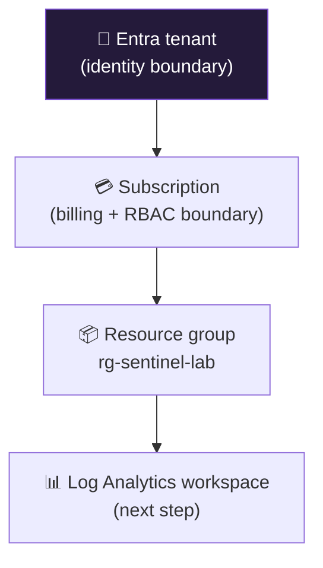

<div align="center">

# 🧱 Step 00 · Azure subscription & tenant

### *Stand up the isolated lab you will build the SOC in*

[](../README.md)
[](#)
[](#)

</div>

---

## 🎯 Goal

You have a dedicated Azure subscription, an Entra tenant you control, a resource group for the lab,
and the CLI signed in — with **nothing real** anywhere near it.

## 🧠 Why this step

Every later step misconfigures something on purpose or generates attack-looking telemetry. That is
only safe in a subscription that has no production resources, no real users, and no internet-exposed
services. Getting the boundary right now is the cheapest it will ever be.

## ✅ Prerequisites

- A Microsoft account (personal or work) that can create an Azure subscription
- A payment method for the subscription (the path stays inside free allowances, but Azure requires one)

## 🧭 Concepts in 60 seconds



- **Tenant** = the directory. Users, groups, app registrations live here.
- **Subscription** = the billing and top-level RBAC container. Sentinel, the workspace and every
  resource live in one.
- **Resource group** = a folder inside the subscription. Deleting it deletes everything in it —
  your teardown button.

You can use an existing tenant (a dev/test Microsoft 365 tenant is ideal) but the **subscription
must be dedicated to this lab**.

## 🖱️ Do it — portal

1. **Create or pick a tenant.** If you have a Microsoft 365 Developer tenant or a spare Entra
   tenant, use it. Otherwise: [entra.microsoft.com](https://entra.microsoft.com) → **Manage tenants**
   → **Create** → *Microsoft Entra ID* → name it `sentinel-lab`.
2. **Create the subscription.** [portal.azure.com](https://portal.azure.com) → **Subscriptions** →
   **Add** → *Pay-As-You-Go* (or use a *Free Trial* / *Azure for Students* if eligible). Name it
   `sub-sentinel-lab`.
3. **Create the resource group.** **Resource groups** → **Create** → Subscription `sub-sentinel-lab`,
   name `rg-sentinel-lab`, region `East US` (pick one region and use it everywhere — cross-region
   data has egress cost).
4. **Tag it** so cost reports are readable: `env=lab`, `purpose=sentinel-live-learning`.

## 💻 Do it — CLI / IaC

```bash
az login
az account list -o table                       # find the lab subscription
az account set --subscription "sub-sentinel-lab"

# one region, reused everywhere
LOCATION=eastus
az group create -n rg-sentinel-lab -l $LOCATION \
  --tags env=lab purpose=sentinel-live-learning

# extensions used across this path
az extension add --name sentinel
az extension add --name monitor-control-service   # DCRs, later
az extension add --name log-analytics             # az monitor log-analytics query
```

## 🧪 Validate

```bash
az group show -n rg-sentinel-lab --query "{name:name, state:properties.provisioningState, region:location}" -o table
az account show --query "{sub:name, tenant:tenantId, user:user.name}" -o table
```

**You should see** the resource group `Succeeded` in your chosen region, and `az account show`
pointing at the lab subscription — **not** a production one. If `az account show` shows the wrong
subscription, re-run `az account set` before doing anything else.

## 🚩 Common mistakes

| 🚩 Mistake | Why it bites |
|---|---|
| Reusing a subscription that has real resources | Step-by-step misconfigurations and attack simulations can touch them |
| Spreading resources across regions | Cross-region data transfer bills, and some Sentinel features assume co-location |
| Skipping tags | Cost analysis later can't separate the lab from anything else |
| Using your daily-driver admin account as the only identity | You'll want a separate break-glass and separate analyst accounts in step 05 |

## 🗒️ Log your run

Copy [`_templates/STEP-LOG-TEMPLATE.md`](../_templates/STEP-LOG-TEMPLATE.md) into this folder as
`LOG.md`. Record the region you chose — every later step assumes it.

## 📚 Microsoft Learn

- [Associate or add an Azure subscription to your Microsoft Entra tenant](https://learn.microsoft.com/en-us/entra/fundamentals/how-subscriptions-associated-directory)
- [Organize your Azure resources with management groups, subscriptions, resource groups](https://learn.microsoft.com/en-us/azure/cloud-adoption-framework/ready/azure-setup-guide/organize-resources)
- [Get started with the Azure CLI](https://learn.microsoft.com/en-us/cli/azure/get-started-with-azure-cli)

---

<div align="center">
<sub>

[🦅 All steps](../README.md) &nbsp;·&nbsp; [Next: 01 · Log Analytics workspace ➡](../01-log-analytics-workspace/README.md)

</sub>
</div>
