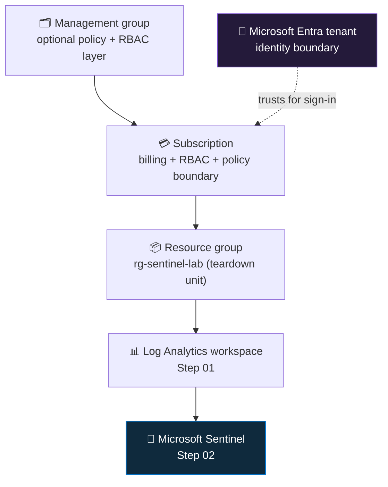

<div align="center">

# 🧱 Step 00 · Azure subscription & tenant

### *Fence off an isolated blast radius before you deliberately break anything*

[](../README.md)
[](#)
[](#)

</div>

---

## 🎯 Goal

At the end of this step you have: a **Microsoft Entra tenant** you administer, an Azure
**subscription dedicated to this lab** (nothing production in it), one **resource group**
(`rg-sentinel-lab`) in a single region you have written down, the **resource providers** this path
needs registered on that subscription, and the **Azure CLI signed in and pointed at that
subscription**. Nothing bills yet — every resource that meters money arrives in later steps.

## 🧠 Why this step

Every later step in this path does something a real environment would page someone for. You will
open NSG rules, create deliberately over-permissioned identities, run brute-force-shaped sign-in
traffic, ingest logs that look like an intrusion, and wire automation that can disable an account.
That is safe practice **only** if the whole thing is fenced off from anything real. The fence has
two parts, and Azure draws them at two different objects.

The **subscription** is the resource, RBAC, and billing boundary. A role assignment, an Azure
Policy, a budget, a deployment — all of it is scoped at or under a subscription. Put the lab in its
own subscription and the broadest possible mistake (`Owner` granted to the wrong principal, a Policy
that denies public IPs, a playbook's managed identity given `Contributor`) still cannot reach a
production resource, because there are none in scope. The **tenant** is the identity boundary.
Break-glass accounts, Conditional Access experiments, tenant-wide admin grants, app registrations
with broad Graph permissions — those live in the directory, not the subscription. A dedicated (or at
least non-production) tenant keeps directory-level experiments contained too.

Skip this and the failures are quiet, not loud. Cost analysis can no longer separate "the lab" from
everything else on the bill. A parent management group's Azure Policy silently blocks your
deployments — or worse, your lab resources inherit compliance obligations they were never meant to
carry. A colleague's cleanup automation deletes your resource group because it did not match the
naming convention. Your simulated attacks trip the **real** SOC's detections and generate real
incidents against your name. None of that throws an error at creation time; it shows up days later.

Teams get the relationship wrong constantly — people believe a subscription *is* a tenant, deploy
into the wrong one because the portal remembered a filter, or cannot work out why `az login` keeps
picking a directory they do not want. Microsoft separated the two on purpose: *who you are* (one
directory) and *what you deploy and who pays* (many subscriptions, reorganized often) have different
lifecycles — an acquisition can move a subscription to a new tenant without touching a resource, and
one enterprise tenant can bill hundreds of subscriptions across business units.

> [!IMPORTANT]
> Use an **isolated subscription with nothing real in it**. If your only Azure access is your
> employer's tenant and you cannot create a separate subscription there, create a personal one with
> a personal Microsoft account instead. Do not run this path in a production subscription, and do
> not point real user data, production hostnames, or real secrets at anything you build here.

## ✅ Prerequisites

- **A Microsoft account that is allowed to create an Azure subscription** — a personal account
  (`outlook.com`, `hotmail.com`, a Gmail address registered as a Microsoft account) always works; a
  work account only works if its tenant has not disabled self-service sign-up. *Why it matters:*
  many corporate tenants block subscription creation by policy, and you hit that wall silently in
  the portal with a vague "you don't have permission" message rather than a clear explanation.
- **A payment method (card)** — Azure requires one for identity verification even on the free tier
  and free trial, and it is **not** charged while you stay inside free allowances. *Why it matters:*
  the only genuinely cardless routes are Azure for Students (needs an academic email) or a
  sponsored/CSP subscription; assume you need a card.
- **An identity you are willing to treat as the lab admin** — ideally not the same account you use
  for daily production work. *Why it matters:* [step 05](../05-rbac-and-roles/README.md) has you
  create separate break-glass and analyst accounts in this directory; starting from a clean admin
  identity makes that exercise honest instead of theoretical.
- **(Optional) an existing spare or dev tenant** — a Microsoft 365 Developer tenant or any throwaway
  Entra tenant is ideal and can be reused across many subscriptions. *Why it matters:* only the
  *subscription* must be dedicated to the lab; reusing a tenant is fine and saves setup.

## 🧭 Concepts

Three nested containers, plus the CLI that talks to all of them. The **tenant** is your directory
(identity). A **subscription** trusts exactly one tenant for sign-in and is the top of the
resource/RBAC/billing tree. A **resource group** is a folder inside the subscription that you can
grant, tag, budget, and — crucially — delete as one unit. Everything Sentinel touches will live
under the one resource group you create here.



**Reading the diagram:** authentication flows along the dotted line — the subscription accepts
tokens only from the tenant named in its `tenantId` property, so who can sign in and be granted
access is decided entirely by that one directory. Everything else flows top-down as *containment and
inheritance*: a management group (optional; the root is the "Tenant Root Group") can push Azure
Policy and role assignments onto every subscription beneath it; the subscription contains resource
groups; a resource group contains resources. In this path the chain is literal — the resource group
you make now holds the workspace you make in [step 01](../01-log-analytics-workspace/README.md),
which is where the Sentinel solution installs in [step 02](../02-enable-sentinel/README.md). Delete
the resource group and the entire branch below it goes with it, which is exactly the property that
makes a per-session teardown safe.

### How it works under the hood

`az login` runs an OAuth 2.0 authorization-code flow against
`https://login.microsoftonline.com/<tenant>` (a browser popup, or a device code for headless
shells). Entra authenticates you and returns access + refresh tokens, which the CLI caches under
`~/.azure`. The first token is scoped to **Azure Resource Manager** (`https://management.azure.com`)
— the single control-plane API that every portal click, `az` command, and ARM/Bicep template goes
through — and the CLI silently fetches additional tokens for other audiences (Microsoft Graph, Key
Vault, Log Analytics query) from the same refresh token when a command needs them.

On each ARM call two things are checked: **(1)** was the token issued by the tenant this subscription
trusts, and **(2)** does the calling identity hold a role assignment — on the resource, its resource
group, the subscription, or a parent management group — that permits the action. Role assignments
are themselves ARM resources (`Microsoft.Authorization/roleAssignments`) stored at a scope and
inherited downward, so an `Owner` grant at the subscription is an `Owner` grant on every resource
group and resource inside it.

A resource group is an ARM record under the `Microsoft.Resources` provider; creating one is a
`PUT /subscriptions/{sub}/resourcegroups/{name}`. The group's own `location` stores only its
metadata and deployment history — the resources inside each carry their own `location`, so a group
in `eastus` can legally hold a workspace in `westeurope` — the group's region is free metadata, but
once resources sit in different regions you pay inter-region egress and lose the "one region
everywhere" simplicity this path depends on. Deleting the group tells
ARM to delete every contained resource, in dependency order, through each resource provider — that
is why "delete the resource group" is the whole-lab off switch.

Two more control-plane facts that bite in the next two steps. **Resource providers** (like
`Microsoft.OperationalInsights` for Log Analytics or `Microsoft.SecurityInsights` for Sentinel) must
be *registered* on a subscription before their resource types can be created; a brand-new
subscription often has only a handful registered, and Azure auto-registers the rest lazily on first
use — but the CLI and templates can race that, so this step registers them explicitly.
**Cross-tenant token caching** means that if you `az login` before a subscription exists, the CLI's
cached account list will not contain it until you refresh.

Where does data physically land in this step? Nowhere. A tenant, a subscription, a resource group,
registered providers, and cached tokens are all control-plane metadata. The first byte that costs
money lands in the [step 01](../01-log-analytics-workspace/README.md) workspace.

### Vocabulary

| Term | Meaning |
|---|---|
| **Microsoft Entra tenant** | A dedicated instance of Entra ID (formerly Azure AD): the directory holding users, groups, service principals, app registrations, Conditional Access. The identity boundary. |
| **Tenant ID** | GUID for the directory. Shows up in token issuer URLs, agent onboarding, workspace properties, Lighthouse delegations. |
| **Default directory** | The tenant Azure auto-creates the first time a personal Microsoft account signs up for Azure — named `<alias>.onmicrosoft.com`. Many readers already have one and can skip creating a tenant. |
| **Primary / initial domain** | `<name>.onmicrosoft.com`, created with the tenant and permanent. Custom verified domains (e.g. `contoso-lab.com`) can be added later. |
| **Subscription** | The unit of billing and the top scope for Azure RBAC and Azure Policy. Every resource lives in exactly one; it trusts exactly one tenant at a time. |
| **Subscription ID** | GUID for the subscription. Appears in every ARM resource ID: `/subscriptions/<id>/resourceGroups/...`. |
| **Offer type** | The commercial arrangement behind a subscription: Pay-As-You-Go (PAYG), Azure free account, Azure for Students, Visual Studio credit, EA, MCA, CSP. Determines credit, expiry, and who the billing owner is. |
| **Management group** | Optional container above subscriptions for applying policy/roles to many at once. Root = "Tenant Root Group", provisioned automatically the first time management groups are used in the tenant. |
| **Resource group (RG)** | Named container inside a subscription. Every resource belongs to exactly one. Has a metadata-only `location`. Deleting it cascade-deletes its contents. |
| **Region / location** | The Azure datacenter geography a resource physically runs in. Cross-region data movement incurs egress cost and latency. |
| **RBAC scope** | The level a role assignment binds at — management group, subscription, RG, or resource. Inherits downward. |
| **Azure Resource Manager (ARM)** | The control-plane API (`management.azure.com`) behind every create/read/update/delete of a resource. |
| **Owner / Contributor** | Built-in roles. Owner = full control including granting access; Contributor = full control *except* access management. |
| **Break-glass account** | A cloud-only, highly privileged emergency admin, excluded from Conditional Access, used only when normal admin access fails. Created in [step 05](../05-rbac-and-roles/README.md). |
| **Resource provider** | A service namespace (`Microsoft.OperationalInsights`, `Microsoft.SecurityInsights`, …) that must be *registered* on a subscription before its resource types can be created. |

### Where this fits

This is the base of the stack the whole path builds on. [Step 01](../01-log-analytics-workspace/README.md)
puts a Log Analytics workspace in `rg-sentinel-lab`; [step 02](../02-enable-sentinel/README.md)
installs the Microsoft Sentinel solution onto that workspace; [step 05](../05-rbac-and-roles/README.md)
assigns the Sentinel RBAC roles at this subscription/RG; [step 06](../06-cost-model-and-budget/README.md)
attaches a budget alert to this subscription *before* anything meters money. The **region you pick
here is inherited** by the workspace and, through it, by every connector, data collection rule, and
VM for the rest of the path — there is no clean "change region later", so choose one close to you
and use it everywhere. [Step 53](../53-workspace-architecture/README.md) revisits the
subscription/workspace layout once you have felt the tradeoffs; [step 54](../54-multi-tenant-and-lighthouse/README.md)
covers the multi-tenant case where one SOC watches subscriptions across many directories.

### Design rationale

Identity and resources-plus-billing are separated because their lifecycles differ: a directory is
singular and slow-changing, while subscriptions are many and get reorganized constantly. The
resource group exists as a *lifecycle unit* so that "everything for project X" can be granted,
tagged, budgeted, and destroyed as one atomic thing — which is exactly the property a disposable lab
needs. Provider registration is opt-in rather than "everything on" so that a subscription's
control-plane surface area, and the audit noise from it, stays proportional to what you actually
use.

## 🖱️ Do it — portal

Do this as the identity you intend to be the lab admin — ideally not your daily production account.

**1. Pick or create a tenant.**
If you sign up for a brand-new Azure account with a personal Microsoft account, Azure creates a
**default directory** for you automatically — you do not need to create a tenant at all, and can
skip to step 2. If you already have a Microsoft 365 Developer tenant or a spare Entra tenant, use
it. Only if you have neither: [entra.microsoft.com](https://entra.microsoft.com) → **Identity** →
**Overview** → **Manage tenants** → **Create** → *Microsoft Entra ID* → organization name
`sentinel-lab`, initial domain `contoso-lab` (yours will differ), pick a country → **Review +
create**.
- *What the options mean:* the initial domain becomes `<domain>.onmicrosoft.com` and is permanent;
  the country sets the directory's datacenter geography and data residency and **cannot be changed
  later**.
- *Lab vs production:* in a lab a throwaway directory is fine. In production you would almost never
  "create a tenant" casually — tenant sprawl (each one needing its own break-glass accounts,
  licensing, and Conditional Access) is a real governance problem.
- *You should see:* after a minute, the new tenant listed under **Manage tenants** with its tenant
  ID (a GUID) and default domain.
- *Note:* any user can create a tenant unless an admin has turned that off in Entra → **User
  settings** → *Restrict non-admin users from creating tenants*. As of writing, obtaining a *new*
  Microsoft 365 Developer tenant requires an eligible Visual Studio subscription — verify current
  eligibility, as Microsoft has changed these terms more than once.

**2. Create the subscription.**
[portal.azure.com](https://portal.azure.com) → search **Subscriptions** → **+ Add**. Choose an
offer (figures below are *as of writing* — confirm current terms on the offer page):
- **Pay-As-You-Go** — metered at list price, no expiry, no upfront credit. The safe default.
- **Azure free account** — roughly US$200 of credit for 30 days, plus 12 months of selected free
  services, plus always-free service tiers. A default $0 spending limit means that when the credit
  or the 30 days runs out, chargeable services are **disabled until you explicitly upgrade to
  Pay-As-You-Go** — it does not auto-convert and does not charge your card on its own. After you
  upgrade, everything outside the always-free tiers bills at list price, so "free" still does not
  mean "cannot be charged later".
- **Azure for Students** — roughly US$100 of credit, no card, needs a verified academic email; no
  auto-conversion to paid.
- **Monthly Azure credit for Visual Studio subscribers** — if you have VS Enterprise (~US$150/mo) or
  VS Professional (~US$50/mo) benefits, the best lab option: recurring credit, hard spending limit
  on by default.
Name it `sub-sentinel-lab`. Confirm the **Directory** shown is your lab tenant from step 1.
- *You should see:* the subscription appear in the **Subscriptions** list with status **Active** and
  a subscription ID GUID. This can take a few minutes; a brand-new subscription is sometimes
  "Active" before every region and provider is available to it.

**3. Confirm the directory and default filter.**
Top bar → **Settings** (gear) → **Directories + subscriptions**. Make sure your lab tenant is the
one you are switched to, and set the **Default subscription filter** to include only
`sub-sentinel-lab` (or "All", but then double-check the header on every deploy). This is the single
most common place people get lost — the portal quietly scopes everything to a directory + filter you
set once and forget, and it is **independent of the Azure CLI's context**.

**4. Create the resource group.**
Search **Resource groups** → **Create** → Subscription `sub-sentinel-lab`, name `rg-sentinel-lab`,
region **East US** (or the region nearest you — but pick **one** and reuse it everywhere).
- *What the region choice means here:* the RG's region is metadata only, but treat it as the
  canonical "lab region" and put every later resource in the same one.
- *Lab vs production:* in production the region is a data-residency, latency, and feature-
  availability decision made with the business; check
  [products available by region](https://azure.microsoft.com/en-us/explore/global-infrastructure/products-by-region/)
  and Sentinel feature availability first. Here, just be consistent.
- *You should see:* **Review + create** → **Create**, then the group listed with
  `provisioningState: Succeeded`.

**5. Tag it.**
On the resource group → **Tags** → add `env=lab`, `purpose=sentinel-live-learning`,
`owner=<your-alias>`, `expiry=<date>`.
- *Lab vs production:* production tag schemas are *enforced* by Azure Policy (`deny` or `modify`
  effects); here it is manual discipline, but [step 06](../06-cost-model-and-budget/README.md)'s
  cost analysis groups spend by these tags.

**6. Register the resource providers.**
Subscription `sub-sentinel-lab` → **Settings → Resource providers**. Search for and **Register**:
`Microsoft.OperationalInsights`, `Microsoft.SecurityInsights`, `Microsoft.Insights`,
`Microsoft.OperationsManagement`, `Microsoft.ManagedIdentity`, `Microsoft.Logic`. Registration is
per-subscription and takes a minute or two each; without it, [steps 01–02](../01-log-analytics-workspace/README.md)
fail with a `MissingSubscriptionRegistration` error that names the missing namespace but not which resource triggered it.

**7. (Forward pointer.)** [Step 06](../06-cost-model-and-budget/README.md) sets a subscription budget
alert *before* anything that bills exists. Do not skip it.

## 💻 Do it — CLI / IaC

```bash
az login                                        # OAuth flow; caches tokens under ~/.azure
                                                #   --tenant <id|domain>  forces a specific directory
                                                #   --use-device-code     for headless / SSH shells
az account list --all --refresh -o table        # every subscription your identity can see, across
                                                #   tenants; --refresh re-reads from ARM so a
                                                #   just-created subscription actually shows up
az account set --subscription "sub-sentinel-lab" # sets CLI context (name or GUID); idempotent
az account show -o table                         # confirm the active context BEFORE deploying anything

# one region, reused everywhere in this path
LOCATION=eastus                                 # PowerShell:  $LOCATION = "eastus"   (reference as $LOCATION)

# register the resource providers this path needs (a fresh subscription may not have them);
# Microsoft.OperationsManagement is only needed for legacy Content hub solution packaging
for ns in Microsoft.OperationalInsights Microsoft.SecurityInsights Microsoft.Insights \
          Microsoft.OperationsManagement Microsoft.ManagedIdentity Microsoft.Logic; do
  az provider register --namespace "$ns"        # async; a no-op if already Registered
done
az provider list --query "[?registrationState=='Registered'].namespace" -o tsv | sort  # spot-check

# the lab resource group — a PUT to Microsoft.Resources; re-running with the same args is a no-op,
# but changing --tags overwrites the whole tag set (it is a replace, not a merge)
az group create -n rg-sentinel-lab -l "$LOCATION" \
  --tags env=lab purpose=sentinel-live-learning owner="$USER"   # bash: $USER  ·  PowerShell: $env:USERNAME
                                                                # add expiry=<date> to match the portal tags

# save typing for the rest of the path: default the group so you can omit -g on later commands
az configure --defaults group=rg-sentinel-lab

# CLI extensions used across this path (installed as wheels under ~/.azure/cliextensions)
az extension add --name sentinel                      # Sentinel data connectors, analytics rules, incidents
az extension add --name monitor-control-service       # data collection rules / endpoints (step 11+)
az extension add --name log-analytics                 # adds: az monitor log-analytics query
az extension list --query "[].name" -o tsv            # confirm all three are present
```

<details><summary>Bicep — resource group as a subscription-scoped deployment</summary>

```bicep
// rg.bicep — api-version current as of writing; verify against the latest in current docs
targetScope = 'subscription'

param location string = 'eastus'

resource rg 'Microsoft.Resources/resourceGroups@2024-03-01' = {
  name: 'rg-sentinel-lab'
  location: location            // metadata location only; resources inside choose their own
  tags: {
    env: 'lab'
    purpose: 'sentinel-live-learning'
  }
}

output resourceGroupId string = rg.id
```

```bash
# deploy at subscription scope; --confirm-with-what-if shows the delta before it runs
az deployment sub create \
  --name rg-sentinel-lab-deploy \
  --location eastus \
  --template-file rg.bicep \
  --parameters location=eastus \
  --confirm-with-what-if
```

Re-deploying is idempotent — ARM compares desired vs actual state and changes only the drift.
</details>

> [!NOTE]
> On **Git Bash for Windows**, a scope like `/subscriptions/<id>/...` passed to `az` can be mangled
> into a Windows path. Prefix the command with `MSYS_NO_PATHCONV=1` (or use PowerShell) — the error
> otherwise looks like a permissions problem when it is not.

## 🧪 Validate

```bash
# 1) the resource group provisioned in the region you intend
az group show -n rg-sentinel-lab \
  --query "{name:name, state:properties.provisioningState, region:location, tags:tags}" -o jsonc

# 2) the CLI is pointed at the LAB subscription, in the LAB tenant, as the LAB identity
az account show --query "{sub:name, subId:id, tenant:tenantId, user:user.name}" -o table

# 3) nothing is deployed yet -> nothing is billing
az resource list -g rg-sentinel-lab -o table          # expect: empty
az group list -o table                                # expect: rg-sentinel-lab (plus cloud-shell-storage-<region> if you run this from Cloud Shell)

# 4) you actually hold the access you think you do, and nothing odd is pre-assigned
MSYS_NO_PATHCONV=1 az role assignment list \
  --scope "/subscriptions/$(az account show --query id -o tsv)" \
  --query "[].{principal:principalName, role:roleDefinitionName, scope:scope}" -o table

# 5) the providers this path needs are Registered (not Registering / NotRegistered)
az provider show -n Microsoft.SecurityInsights --query registrationState -o tsv
az provider show -n Microsoft.OperationalInsights --query registrationState -o tsv
```

**What each field means and what healthy looks like:**

| Check | Field | Healthy | Unhealthy → do this |
|---|---|---|---|
| 1 | `state` | `Succeeded` | `Accepted` / `Running` → wait; `Failed` → read the `az group show` error, recreate |
| 1 | `region` | your chosen region, same everywhere | any other region → delete and recreate; do not mix regions |
| 2 | `sub` / `subId` | `sub-sentinel-lab` and its GUID | a subscription name you do not recognise → **stop**, run `az account set` before anything else |
| 2 | `tenant` | your lab tenant's GUID | your employer's tenant GUID → `az login --tenant <lab-tenant>` |
| 2 | `user` | your lab admin identity | your corporate UPN → sign in with the lab account |
| 3 | rows returned | zero | any rows → a previous experiment left resources running; check the bill |
| 4 | your principal | `Owner` (or `Contributor`) at subscription scope | no assignment → get `Owner` from whoever created the subscription |
| 5 | `registrationState` | `Registered` | `NotRegistered` → `az provider register --namespace <ns>` and wait a few minutes |

> [!NOTE]
> In check 4, `principalName` sometimes renders as a bare GUID (the object ID) rather than a UPN or
> display name when the CLI cannot resolve it against Graph — that is cosmetic. What matters is that
> a row with **your** object ID carries `Owner` or `Contributor` at the subscription scope.

**More verification angles:** `az account list --query "[?isDefault]" -o table` confirms which
subscription is the CLI default; `az account tenant list -o table` shows every directory your token
can reach (useful for spotting guest memberships that could surface the wrong subscription); in the
portal, **Subscriptions → sub-sentinel-lab → Resource providers** should show every namespace from
portal step 6 as *Registered*.

> [!NOTE]
> Do not fake this. If `az account show` points at the wrong subscription, or a provider is stuck
> `Registering`, record that in your log and fix it — an honest "blocked here" is worth more than a
> green checkbox that is not true.

## 🚩 Common mistakes

| 🚩 Mistake | Why it bites |
|---|---|
| Reusing a subscription that has real resources | Later steps' deliberate misconfigurations and attack simulations can touch them; cost cannot be separated |
| Spreading resources across regions | Cross-region data-transfer bills, added latency, and some Sentinel/connector features assume co-location |
| Skipping tags | [Step 06](../06-cost-model-and-budget/README.md) cost analysis cannot tell the lab apart from anything else on the bill |
| Using your daily-driver admin account as the only identity | [Step 05](../05-rbac-and-roles/README.md) needs a separate break-glass and separate analyst accounts; retrofitting is painful |
| CLI context left on the wrong subscription | `az group create` / every later deploy silently lands in production |
| Creating the RG in the wrong directory because the portal remembered a filter | You build the whole lab in the wrong place and only notice at the bill |
| Treating "Azure free account" as "cannot be charged" | After you upgrade it to PAYG (required to keep chargeable services running past the credit / 30 days), usage beyond the always-free tiers bills normally |
| One new tenant per experiment | Tenant sprawl — each needs its own break-glass, licensing, and Conditional Access baseline |
| Not writing down the region | Every later step assumes it; guessing wrong later means cross-region cost or a rebuild |
| Assuming a fresh subscription has all providers registered | `Microsoft.SecurityInsights` / `Microsoft.OperationalInsights` may be `NotRegistered`, and [steps 01–02](../01-log-analytics-workspace/README.md) fail with a cryptic error |
| Tearing down at *subscription* scope instead of deleting the resource group | Cancelling a subscription is slower to reverse, drops the whole RBAC/budget setup, and anything left running keeps billing until the cancellation actually completes |
| Running `az login` before the subscription exists, then not refreshing | The cached account list never shows it — `az account list --refresh` or `az account clear` then log in again |

## 🩺 Troubleshooting

| Symptom | Likely cause | Fix |
|---|---|---|
| `az login` lands in the wrong directory, or "No subscriptions found" | Your identity is a member/guest of several tenants and defaulted to the wrong one | `az login --tenant <lab-tenant-id-or-domain>`, then `az account set --subscription sub-sentinel-lab` |
| New subscription is missing from `az account list` | The CLI cached your account before the subscription existed | `az account list --all --refresh -o table`; if still absent, `az account clear` then `az login` again |
| `az account set` → *subscription not found* | Name typo, or the subscription is in another tenant not in your current token | `az account list --all -o table`, copy the exact **GUID**, set by ID |
| Portal: *"You don't have permission to create subscriptions"* | Work tenant disables self-service sign-up, or you lack a billing role on the MCA/EA account | Use a personal Microsoft account, or ask a billing account owner; Azure for Students if eligible |
| `az group create` → `AuthorizationFailed` | Your identity has no `Owner`/`Contributor` at subscription scope | `MSYS_NO_PATHCONV=1 az role assignment list --assignee <you> --scope /subscriptions/<id>`; get `Owner` from the subscription creator |
| `az group create` or step 01 → `MissingSubscriptionRegistration` (or `MissingRegistrationForLocation` for a region) | Required resource provider not registered on this subscription | `az provider register --namespace Microsoft.OperationalInsights` (also `Microsoft.SecurityInsights`, `Microsoft.Insights`, `Microsoft.OperationsManagement`); wait, re-check with `az provider show` |
| Portal "Create resource group" greyed out, or a very short region list | Subscription still provisioning right after creation, or the region is not enabled for your offer | Wait 2–10 minutes and refresh; if the region never appears, pick the nearest supported one and use it everywhere |
| `az extension add --name sentinel` fails | Old Azure CLI, or a corporate proxy blocking PyPI | `az upgrade`; behind a proxy, install from a downloaded `.whl` with `az extension add --source <path>` |
| `az account show` correct, but deploys still go to prod in the portal | Portal directory + subscription **filter** is independent of the CLI context | Settings → Directories + subscriptions → switch directory, fix the default filter |
| Tags do not appear in Cost analysis | Tags added after resources exist, cost-data lag (can be 24–48 h), or tag inheritance not enabled in Cost Management | Tag at creation; enable tag inheritance in Cost Management (verify the current setting name) |
| Unexpected charges on a "free" setup | A free account was upgraded to PAYG, or a resource from an earlier experiment still running | Cost analysis by resource; `az resource list` across every RG; delete or stop the offender |

## 🎓 Deepen your understanding

1. **Map your identity's reach.** Run `az account list --all -o table` and `az account tenant list
   -o table`. How many directories can a single `az login` surface subscriptions from, and why?
   For `sub-sentinel-lab`, which tenant's tokens does it accept — and what would happen to your
   access, and to every role assignment on it, if that subscription were transferred to a different
   tenant?
2. **Find the deployment history.** After [step 01](../01-log-analytics-workspace/README.md), open
   `rg-sentinel-lab` → **Deployments**. The resource group keeps a record of every ARM deployment
   even though it "contains" only live resources. Why is that history attached to the resource group
   rather than the subscription, and how does it help you when a deployment half-fails?
3. **Rehearse teardown now, while it is safe.** Delete the empty `rg-sentinel-lab` (note the
   confirmation makes you type its name), then recreate it. This is the muscle every session ends
   with. What is different — and genuinely dangerous — about deleting or cancelling at *subscription*
   scope instead?
4. **Trace policy inheritance.** Run `az account management-group list` (you will likely see only
   "Tenant Root Group"). If your employer added an Azure Policy at that root denying public IP
   addresses, your lab would inherit it. Explain why a dedicated subscription under a *separate*
   tenant sidesteps inherited policy entirely, and name one case where you would actually *want*
   that inheritance.
5. **Follow the tenant ID.** Compare `tenantId` from `az account show` with the domain you signed in
   with, then find the same GUID in the Entra portal **Overview**. Name three later places in this
   path where that exact tenant ID reappears (hint: VM agent onboarding in
   [step 11](../11-windows-vm-ama-dcr/README.md), workspace properties in
   [step 01](../01-log-analytics-workspace/README.md), cross-tenant delegation in
   [step 54](../54-multi-tenant-and-lighthouse/README.md)).

## 🗒️ Log your run

Copy [`_templates/STEP-LOG-TEMPLATE.md`](../_templates/STEP-LOG-TEMPLATE.md) into this folder as
`LOG.md`. Record, specifically:

- **The region** you chose — every later step assumes it; getting it wrong later means a rebuild.
- **The offer type** of the subscription, and if it carries a credit (free account / student / VS
  subscriber), the **credit amount, the expiry date, and whether you have upgraded it to
  Pay-As-You-Go**.
- **Which tenant** you used, and whether it is dedicated to the lab or shared with something else.
- **Any resource providers** you had to register manually ([steps 01–02](../01-log-analytics-workspace/README.md)
  depend on them) and how long each took to reach `Registered`.
- **What blocked you first** and how you fixed it — the most useful line in the log.

Attach as evidence the `az account show` table output and the `az group show` output, both with the
tenant ID and subscription ID redacted. Do **not** paste the tenant ID or subscription ID
unredacted — use `<redacted>` or an `00000000-0000-0000-0000-000000000000` placeholder.

## 📚 Microsoft Learn

- [Associate or add an Azure subscription to your Microsoft Entra tenant](https://learn.microsoft.com/en-us/entra/fundamentals/how-subscriptions-associated-directory)
- [Create a new tenant in Microsoft Entra ID](https://learn.microsoft.com/en-us/entra/fundamentals/create-new-tenant)
- [Subscriptions, licenses, accounts, and tenants for Microsoft's cloud offerings](https://learn.microsoft.com/en-us/microsoft-365/enterprise/subscriptions-licenses-accounts-and-tenants-for-microsoft-cloud-offerings)
- [What is Microsoft Entra ID?](https://learn.microsoft.com/en-us/entra/fundamentals/whatis)
- [Create an additional Azure subscription](https://learn.microsoft.com/en-us/azure/cost-management-billing/manage/create-subscription)
- [Organize your Azure resources with management groups, subscriptions, resource groups](https://learn.microsoft.com/en-us/azure/cloud-adoption-framework/ready/azure-setup-guide/organize-resources)
- [Azure Resource Manager overview](https://learn.microsoft.com/en-us/azure/azure-resource-manager/management/overview)
- [Azure RBAC overview](https://learn.microsoft.com/en-us/azure/role-based-access-control/overview)
- [Azure resource providers and types (registration)](https://learn.microsoft.com/en-us/azure/azure-resource-manager/management/resource-providers-and-types)
- [Azure regions and availability zones](https://learn.microsoft.com/en-us/azure/reliability/availability-zones-overview)
- [Get started with the Azure CLI](https://learn.microsoft.com/en-us/cli/azure/get-started-with-azure-cli)
- [Manage Azure subscriptions with the Azure CLI](https://learn.microsoft.com/en-us/cli/azure/manage-azure-subscriptions-azure-cli)
- [`az group` CLI reference](https://learn.microsoft.com/en-us/cli/azure/group)
- [Transfer an Azure subscription to a different Microsoft Entra directory](https://learn.microsoft.com/en-us/azure/role-based-access-control/transfer-subscription)
- [Microsoft Sentinel prerequisites](https://learn.microsoft.com/en-us/azure/sentinel/prerequisites)
- [Training: Control and organize Azure resources with Azure Resource Manager](https://learn.microsoft.com/en-us/training/modules/control-and-organize-with-azure-resource-manager/)
- [Training path: SC-200 — Mitigate threats using Microsoft Sentinel](https://learn.microsoft.com/en-us/training/paths/sc-200-mitigate-threats-using-microsoft-sentinel/)

---

<div align="center">
<sub>

[🦅 All steps](../README.md) &nbsp;·&nbsp; [Next: 01 · Log Analytics workspace ➡](../01-log-analytics-workspace/README.md)

</sub>
</div>
