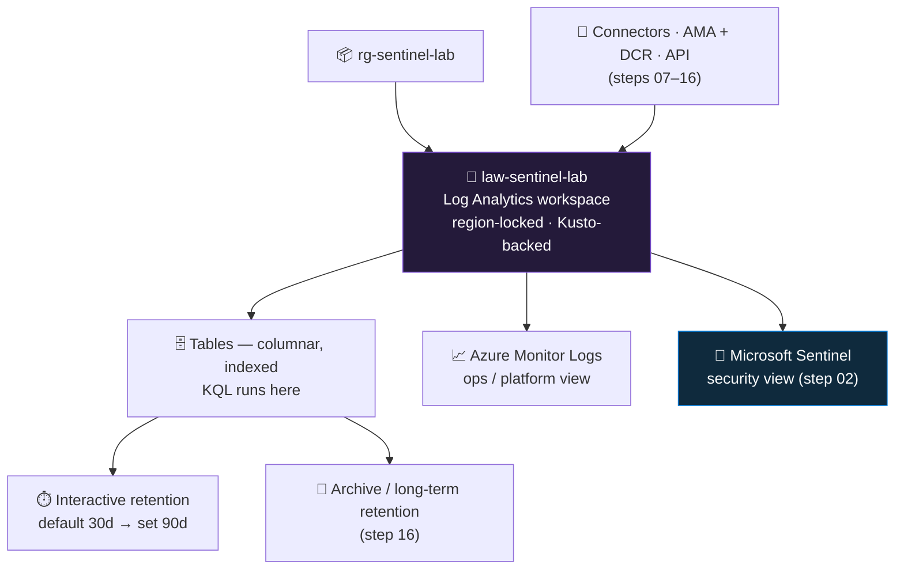

<div align="center">

# 🧱 Step 01 · Log Analytics workspace

### *Stand up the one data store the entire SOC will read from and write to*

[](../README.md)
[](#)
[](#)

</div>

---

## 🎯 Goal

One Log Analytics workspace — `law-sentinel-lab`, in `rg-sentinel-lab`, in your step-00 region, on
the pay-as-you-go (`PerGB2018`) tier, with interactive retention deliberately raised to **90 days** —
and you can say which of these choices you are locked into (the **name** and the **region**) and
which you can still revisit later (retention, pricing tier, and — with more effort — the resource
group and subscription it lives in).

## 🧠 Why this step

Microsoft Sentinel is **not a separate product with its own database**. It is a set of features and
tables that Microsoft installs *onto* a Log Analytics workspace. The workspace is where every log
table physically lives, where every KQL query runs, what retention applies to, and what the
ingestion bill is calculated from. Enable Sentinel in the next step and you are enabling it *on this
workspace*. Get the workspace wrong and you have got Sentinel wrong.

Two of the workspace's properties are genuinely set in stone at creation: its **name** (there is no
rename operation) and its **region** (the data sits in regional storage and Microsoft offers no
cross-region move — you rebuild). A third is immovable in practice rather than in the API:
**what else shares the workspace**. You *can* relocate a workspace to another resource group or
subscription, but you cannot un-mix telemetry once several teams' data is flowing into one place.
And once Sentinel is enabled, *every* billable gigabyte in that workspace — plain VM performance
counters, application traces, anything that happens to land there — is priced at the Sentinel
analysis rate on top of ingestion. None of these mistakes throws an error. They surface months later
as a surprise bill, a compliance finding, or an investigation that cannot look back far enough.

In the attack-versus-defense picture, the workspace is the **evidence locker**. Retention length
decides how far back you can reconstruct an intrusion — a threat actor who was resident for 45 days
is invisible to a 30-day retention window. Region and data-residency rules decide whether that
evidence is even compliant to hold. And the **access-control mode** decides whether log visibility
follows resource ownership — anyone with rights over a monitored VM can read that VM's log rows — or
is confined to the people you explicitly grant on the workspace. For a store whose entire job is
recording what every identity did, that is a security-posture decision, and this step is where you
make it.

What teams get wrong in the real world: they enable Sentinel on a pre-existing "catch-all" Log
Analytics workspace that already collects VM guest logs, platform metrics and App Insights data,
then get a bill five to ten times what they projected because Sentinel re-prices the whole
workspace. The opposite mistake is spinning up a workspace per team or per environment, which
fragments detection content, RBAC and incident history across places that are painful to
reconcile. Microsoft's own guidance has converged on "as few workspaces as possible" for exactly
these reasons — [step 53](../53-workspace-architecture/README.md) walks through when a second
workspace is genuinely justified.

## ✅ Prerequisites

- [Step 00](../00-azure-subscription-and-tenant/README.md) — the lab subscription, the
  `rg-sentinel-lab` resource group, and the CLI signed in and pointed at the lab subscription. The
  workspace must be created *inside* that resource group so the whole lab tears down with one
  `az group delete`, and *inside* that subscription so its cost is isolated from anything real.
- **Contributor** (or Owner) on `rg-sentinel-lab` — creating a workspace is a write to
  `Microsoft.OperationalInsights/workspaces`, which a Reader or a data-plane role cannot do. RBAC is
  tightened to least-privilege in [step 05](../05-rbac-and-roles/README.md); for now the step-00
  account is enough.
- The `Microsoft.OperationalInsights` resource provider registered on the subscription — a fresh
  subscription may not have it, and the create then fails with a `MissingSubscriptionRegistration`
  error rather than a clear message. Azure usually auto-registers it on first use; the CLI will tell
  you if it is not.

## 🧭 Concepts

A Log Analytics workspace is a **regional container for log tables**. It is the unit of four
different things at once: **ingestion billing** (you pay per GB landed in it), **retention** (how
long data stays queryable), **RBAC** (who can read it), and **query scope** (a KQL query runs
against one workspace unless you cross-reference another explicitly). Sentinel adds a control plane
and some tables on top; it does not change any of those four roles.



**Walking through the diagram:** the resource group from step 00 holds the workspace. The workspace
is pinned to one region and is backed by a Kusto (Azure Data Explorer) engine that Microsoft
operates. Later steps (07–16) point connectors, agents and APIs at it, and their records land in
**tables** — columnar, indexed, and queried with KQL. Fresh data sits in **interactive retention**
where KQL is fast and free-form; past that window it can roll to cheaper **archive** (long-term)
storage that you query with search jobs or a restore
([step 16](../16-retention-archive-and-data-lake/README.md)). The same workspace is surfaced two
ways: **Azure Monitor Logs** is the operations/platform lens, and **Microsoft Sentinel** is the
security lens that [step 02](../02-enable-sentinel/README.md) switches on. Nothing in this diagram
bills a cent until ingestion starts — an empty workspace is free.

### How it works under the hood

The workspace is a logical object, but it maps to a **database on a Microsoft-managed, multi-tenant
cluster built on Azure Data Explorer** technology, pinned to the workspace's region. When you create
the workspace, Azure Resource Manager provisions that database and assigns it two identifiers: an
ARM **resource ID** (`/subscriptions/…/providers/Microsoft.OperationalInsights/workspaces/law-sentinel-lab`)
and a **workspace ID** — a GUID exposed as the `customerId` property.

- **Ingestion** flows through a regional endpoint. Modern collection (the Azure Monitor Agent, from
  [step 11](../11-windows-vm-ama-dcr/README.md)) authenticates with an Entra identity and is routed
  by a **Data Collection Rule** (and, for custom-log or network-isolated setups, a **Data Collection
  Endpoint**) to a regional ingestion endpoint under `*.ingest.monitor.azure.com`; the legacy agent
  posted directly to `<workspace-id>.ods.opinsights.azure.com` using a shared key. Either way the
  records are validated, split into tables, indexed, and written to in-region storage.
- **Query** goes the other direction: the Logs blade and the `api.loganalytics.io` REST API hand
  your KQL to the workspace's regional Kusto engine, which reads the indexed hot data (interactive
  retention) and, if the query reaches further back, the archive tier.
- **Enabling Sentinel** (step 02) creates a `Microsoft.SecurityInsights/onboardingStates` resource
  *scoped to this workspace*. It does not copy or move any data. It registers Sentinel's own tables
  (`SecurityIncident`, `SecurityAlert`, …), unlocks the Sentinel blades, and lets analytics rules
  run as scheduled Kusto queries against the very same tables everything else uses.
- **Billing** is metered per GB ingested (rated by the table's plan) and per GB stored beyond the
  free retention period, emitted to Azure Cost Management as meters you will budget against in
  [step 06](../06-cost-model-and-budget/README.md).

### Vocabulary

| Term | What it means |
|---|---|
| **Log Analytics workspace** | The regional container for log tables; the unit of ingestion billing, retention, RBAC and query scope |
| **Azure Monitor Logs** | The platform service that ingests, stores and queries the data; "Log Analytics" is its query UI and tooling |
| **Workspace ID** (`customerId`) | GUID that identifies the workspace to agents and the query API; not itself a secret, but redact it from anything public by convention |
| **Resource ID** | ARM path `/subscriptions/…/workspaces/<name>`; what RBAC assignments, DCR associations and diagnostic settings target |
| **Shared keys** | Primary/secondary keys that authenticate the legacy MMA / HTTP Data Collector API — these **are** credentials; the modern agent does not use them |
| **SKU / pricing tier** | `PerGB2018` = pay-as-you-go analytics tier; `CapacityReservation` = commitment tiers (step 56); legacy tiers (`Free`, `Standalone`, `PerNode`) can't be selected on new workspaces |
| **Interactive retention** | Days data stays hot and fully KQL-queryable; workspace default 30. The first 31 days are free even without Sentinel; enabling Sentinel extends the free window to 90. Configurable up to 730 |
| **Archive / long-term retention** | Low-cost cold storage past the interactive window; searched with search jobs or a restore ([step 16](../16-retention-archive-and-data-lake/README.md)) |
| **Table plan** | Analytics / Basic / Auxiliary — a per-table cost-and-capability tier; covered in [step 16](../16-retention-archive-and-data-lake/README.md) |
| **Access control mode** | The `enableLogAccessUsingOnlyResourcePermissions` feature flag — whether resource-context RBAC can read a resource's logs without an explicit workspace role |
| **Daily cap** | `workspaceCapping.dailyQuotaGb` — a hard ceiling on daily ingestion; risky on a Sentinel workspace because it can drop security data mid-day |
| **Soft delete** | A deleted workspace is recoverable for 14 days with its name and region reserved; recreating with the same name/RG/subscription in that window restores the *old* workspace and its data instead of making a fresh one |
| **Dedicated cluster** | `Microsoft.OperationalInsights/clusters` — customer-isolated Kusto capacity for very high volume plus customer-managed keys; far beyond a lab |

### Where this fits

Step 00 created the resource group; this step puts the single durable thing inside it.
[Step 02](../02-enable-sentinel/README.md) enables Sentinel on this workspace.
[Steps 07–16](../07-connectors-and-content-hub/README.md) fill it with telemetry.
[Steps 17 onward](../17-analytics-rule-types/README.md) run detections against its tables.
[Step 05](../05-rbac-and-roles/README.md) governs who can read it,
[step 06](../06-cost-model-and-budget/README.md) budgets its ingestion,
[step 16](../16-retention-archive-and-data-lake/README.md) revisits retention and table plans in
depth, and [step 53](../53-workspace-architecture/README.md) revisits the one-workspace-versus-many
decision once you have felt the tradeoffs. Almost everything else in this path is, ultimately,
reading from or writing to this one resource.

### Design rationale

Sentinel is deliberately decoupled from its storage so that the **same telemetry serves both
operations and security**, so that **KQL is the one query language** for metrics, logs and
detections, and so that retention, RBAC, networking (Private Link), customer-managed keys and data
export are **Azure platform features Sentinel inherits** rather than things a SIEM vendor has to
reimplement. The price of that design is that Sentinel pricing applies to the *whole* workspace's
ingestion — which is precisely why a workspace dedicated to security is worth the small amount of
extra setup. Region immutability follows from the same physical reality: the data lives in regional
storage, and a move would mean copying potentially enormous volumes across regions while breaking
residency guarantees, so Microsoft simply does not offer it.

## 🖱️ Do it — portal

1. **[portal.azure.com](https://portal.azure.com)** → search **Log Analytics workspaces** →
   **Create**.
2. **Basics** tab:
   - **Subscription** — `sub-sentinel-lab` (the lab subscription; double-check this, not a
     production one).
   - **Resource group** — `rg-sentinel-lab`. Keep it here so the whole lab is one teardown unit and
     one cost-tag group.
   - **Name** — `law-sentinel-lab`. Must be 4–63 characters, letters/digits/hyphens, and unique
     within the resource group. This string becomes the last segment of the resource ID and cannot
     be changed later, so keep it generic — don't bake in a region or team name you might outgrow.
   - **Region** — the exact region you chose in step 00. In a lab, match your resource group and
     your future VM. In production, choose for data residency and for co-location with the bulk of
     your sources (some cross-region ingestion carries egress cost, and a few Sentinel features
     assume the workspace and its data sources share a region).
3. **Tags** tab: add `env=lab` and `purpose=sentinel-live-learning` so Cost Management can separate
   this from anything else later.
4. **Review + Create** → **Create**. Deployment takes roughly 30–60 seconds. You should see
   *"Your deployment is complete"* and a **Go to resource** button.

> [!NOTE]
> The create wizard does not make you choose a pricing tier or a retention period. New workspaces
> default to **pay-as-you-go** (`PerGB2018`) and **30-day** interactive retention. You set both
> after creation.

5. Open the workspace → **Usage and estimated costs** (workspace left menu). Confirm the pricing
   tier shows **Pay-as-you-go** and the estimated cost is essentially zero (there is no data yet).
   Leave the tier alone — commitment tiers only pay off above roughly 100 GB/day and are covered in
   [step 56](../56-cost-engineering/README.md).
6. On that same blade, click **Data Retention** at the top → set the slider to **90** days →
   **OK**. Setting 90 now, before Sentinel is enabled, costs nothing: the workspace holds 0 GB, and
   retention is billed on GB stored, not on the number you set. In a lab, 90 days is the sweet spot —
   it becomes **free once Sentinel is enabled** (next step) and it is enough incident history to
   investigate a slow intrusion. In production you set this per business/compliance requirement,
   often 90 interactive days plus archive to years.
7. Open **Overview** → **JSON View** (top-right). Note the fields you will use later: `id` (the ARM
   resource ID) and `customerId` (the workspace ID GUID). If it is shown,
   `features.enableLogAccessUsingOnlyResourcePermissions` is the access-control mode — leave it at
   its default `true` for the lab; [step 05](../05-rbac-and-roles/README.md) discusses when a
   stricter mode matters.

## 💻 Do it — CLI / IaC

```bash
LOCATION=eastus   # MUST equal your step-00 region — the workspace can never be moved regions

az monitor log-analytics workspace create \
  --resource-group rg-sentinel-lab \
  --workspace-name law-sentinel-lab \
  --location "$LOCATION" \
  --retention-time 90 \
  --sku PerGB2018 \
  --tags env=lab purpose=sentinel-live-learning
```

Flag by flag:

| Flag | What it does / creates under the hood |
|---|---|
| `--resource-group` | Places the workspace in the step-00 RG so it tears down with the group |
| `--workspace-name` | Becomes the last segment of the ARM resource ID; unique within the RG; no rename later |
| `--location` | The workspace's region — **immutable** after creation; a re-run with a different value errors rather than moves it |
| `--retention-time 90` | Interactive retention in days; workspace default is 30; 90 becomes free the moment Sentinel is enabled in step 02 (billable in principle until then, but $0 in practice at 0 GB stored) |
| `--sku PerGB2018` | The modern pay-as-you-go analytics tier — the only sensible choice below ~100 GB/day; commitment tiers use `--sku CapacityReservation` with `--capacity-reservation-level` |
| `--tags` | Cost-report grouping; matches the tags on the resource group |

> [!NOTE]
> This command is a create-*or-update* (an ARM `PUT`). Re-running it with the same name and resource
> group is **idempotent** — Azure reconciles the properties instead of erroring or making a
> duplicate. That is what makes it safe to run from a pipeline. The one thing you cannot change on a
> re-run is `--location`; to change retention later use
> `az monitor log-analytics workspace update ... --retention-time <days>`.

Deliberately **not** setting a `--quota` (daily ingestion cap): on a Sentinel workspace a hard cap
can silently drop security events partway through a day and blind your detections. The safeguard you
want is the *cost budget alert* from [step 06](../06-cost-model-and-budget/README.md), not a data
ceiling.

<details><summary>Bicep</summary>

```bicep
// api-version current as of writing — verify against the latest in current docs
resource law 'Microsoft.OperationalInsights/workspaces@2023-09-01' = {
  name: 'law-sentinel-lab'
  location: resourceGroup().location   // one region, reused from the RG
  properties: {
    retentionInDays: 90
    sku: { name: 'PerGB2018' }
    features: {
      // resource-context RBAC allowed — leave true unless step 05 says otherwise
      enableLogAccessUsingOnlyResourcePermissions: true
    }
    // no daily cap on a Sentinel workspace; -1 = unlimited
    workspaceCapping: { dailyQuotaGb: -1 }
    publicNetworkAccessForIngestion: 'Enabled'
    publicNetworkAccessForQuery: 'Enabled'
  }
  tags: {
    env: 'lab'
    purpose: 'sentinel-live-learning'
  }
}

output workspaceResourceId string = law.id          // for RBAC, DCR associations, diagnostic settings
output workspaceId string = law.properties.customerId // the GUID agents use
```

Deploy it idempotently into the existing resource group:

```bash
az deployment group create \
  --resource-group rg-sentinel-lab \
  --template-file workspace.bicep
# default deployment mode is Incremental — it will not touch other resources in the RG
```
</details>

## 🧪 Validate

```bash
az monitor log-analytics workspace show \
  -g rg-sentinel-lab -n law-sentinel-lab \
  --query "{name:name, region:location, retention:retentionInDays, sku:sku.name, \
            state:provisioningState, resourceRbac:features.enableLogAccessUsingOnlyResourcePermissions, \
            wsId:customerId}" -o table
```

**You should see** something like:

| Field | Healthy value | What it means / how to read it |
|---|---|---|
| `name` | `law-sentinel-lab` | The resource name |
| `region` | your step-00 region | Must match the RG and your future VM — if it does not, delete and recreate now |
| `retention` | `90` | Interactive retention. If it still reads `30`, your change did not apply (see Troubleshooting) |
| `sku` | `PerGB2018` | Pay-as-you-go. Anything else means you picked a commitment tier by accident |
| `state` | `Succeeded` | Provisioning finished. `Creating`/`Updating` means wait; `Failed` means read the deployment error |
| `resourceRbac` | `true` | Resource-context RBAC is allowed — the default for new workspaces and what later connectors expect. A blank cell means the property was never set explicitly; that is not a failure, and [step 05](../05-rbac-and-roles/README.md) covers setting it deliberately |
| `wsId` | a GUID | The workspace ID. Assigned at creation; use `state: Succeeded` as the completion signal. Treat as sensitive by convention; do not paste it unredacted |

Two more angles:

```bash
# exactly one workspace in the lab RG — no stray "test" workspaces
az monitor log-analytics workspace list -g rg-sentinel-lab \
  --query "[].{name:name, region:location}" -o table

# the shared keys exist (these ARE credentials — do not print or commit them)
az monitor log-analytics workspace get-shared-keys \
  -g rg-sentinel-lab -n law-sentinel-lab --query "keys(@)" -o tsv
```

Then in the portal, open the workspace → **Logs** and run:

```kusto
print engine_reachable = "yes", utc_now = now()
```

**You should see** one row with the current UTC time — that proves the Kusto query engine is
reachable for this workspace. Now run:

```kusto
union withsource=TableName *
| summarize Rows = count() by TableName
| sort by Rows desc
```

**You should see** no rows, or at most a couple of system tables (`Usage`, `Operation`) at `0`
rows. On a completely bare workspace this may instead return an empty grid or a *"no tables"*
message — both are the correct result for a workspace with nothing in it yet, not a failure. Every
ingestion step in phase 📥 will visibly add rows to this list, which makes it a good before/after
check.

## 🚩 Common mistakes

| 🚩 Mistake | Why it bites |
|---|---|
| Workspace in a different region from your resources | Cross-region ingestion egress cost, and some Sentinel features (and connectors) assume co-location; the fix is a full rebuild |
| Leaving retention at the 30-day default | You silently lose incident history exactly a month back — the window an investigation of a slow intrusion needs most; 90 days is free with Sentinel |
| Creating several "test" workspaces | Sentinel content, cost, RBAC and incident history fragment across them and are painful to merge |
| Putting the workspace in a resource group other than `rg-sentinel-lab` | The lab no longer tears down with one `az group delete`, and cost/tag grouping splits across two groups |
| Baking a region or team name into the workspace name (`law-eastus-soc`) | There is no rename — if that label ever changes, the name is misleading for the life of the workspace; keep it generic |
| Picking a commitment tier now | You have no idea of your volume yet — pay-as-you-go until [step 56](../56-cost-engineering/README.md) |
| Enabling Sentinel later on a workspace that also carries VM/app/platform logs | Sentinel re-prices *all* ingestion on that workspace at the analysis rate — bills often land 5–10× over projection. Keep this workspace security-only |
| Setting a daily ingestion cap on a Sentinel workspace | The cap can drop security events mid-day and blind detections with no alert; use the cost budget from [step 06](../06-cost-model-and-budget/README.md) instead |
| Flipping access control to "Require workspace permissions" by reflex | Breaks the resource-context RBAC that [step 05](../05-rbac-and-roles/README.md) and several connectors rely on; leave it at "resource or workspace permissions" for the lab |
| Assuming a workspace name is free to reuse immediately | A deleted workspace is **soft-deleted for 14 days** and its name is reserved; recreating with that name in the window recovers the *old* workspace, region and data |
| Choosing a region purely for latency | Check Sentinel feature availability and data-residency obligations for that region first |

## 🩺 Troubleshooting

| Symptom | Likely cause | Fix |
|---|---|---|
| `az ... create` fails with *"workspace already exists"* / conflict | The name is reserved by a soft-deleted workspace, or is in use in another resource group | Use a different name; or recover the soft-deleted one by re-running `az monitor log-analytics workspace create` with the identical name, resource group, subscription and region inside the 14-day window — that restores the original workspace and its data; or permanently remove it (`az monitor log-analytics workspace delete --force --yes ...`) then recreate |
| Retention still shows `30` after the portal change | Change was made on the wrong blade, or a per-table retention override is masking the workspace default | Set it on **Usage and estimated costs → Data Retention**; check **Settings → Tables** for per-table overrides |
| `show` reports `retentionInDays: 30` after a `create` with `--retention-time 90` | Older Azure CLI, or the value was rejected silently | `az upgrade`, then re-run the create (idempotent) or `az monitor log-analytics workspace update -g rg-sentinel-lab -n law-sentinel-lab --retention-time 90`, then re-query |
| **Logs** blade shows *"We didn't find any data"* / no tables in the schema pane | Expected — the workspace is empty | Not an error. Sentinel tables appear after [step 02](../02-enable-sentinel/README.md); connector data after [steps 07+](../07-connectors-and-content-hub/README.md) |
| `union withsource=TableName *` errors with a "no tables" / resolve failure | The workspace genuinely has no tables yet | Expected on a bare workspace. Use the `print` reachability check instead; real tables arrive with [step 02](../02-enable-sentinel/README.md) and [steps 07+](../07-connectors-and-content-hub/README.md) |
| KQL error *"'SecurityIncident' … could not be resolved"* | Sentinel is not enabled on this workspace yet | That is [step 02](../02-enable-sentinel/README.md), not this step |
| Cannot create the workspace — *"authorization failed"* / `AuthorizationFailed` | The signed-in account lacks Contributor on `rg-sentinel-lab` | Assign **Contributor** (or Owner) on the resource group; least-privilege comes in [step 05](../05-rbac-and-roles/README.md) |
| Your step-00 region is missing from the region dropdown | The subscription is not registered for `Microsoft.OperationalInsights`, or that region does not offer Log Analytics | `az provider register --namespace Microsoft.OperationalInsights` and wait for `Registered`; otherwise pick the nearest supported region and use it everywhere |
| `customerId` is empty in `show` output | A transient `show` response — `customerId` is assigned at creation, not at completion | Rely on `provisioningState: Succeeded` for completion; `customerId` normally appears at creation, so a persistently empty value alongside `Succeeded` warrants re-running `show` |
| Workspace created, but in the wrong subscription | `az account set` was pointed elsewhere when you ran `create` | Delete it, re-run `az account set --subscription sub-sentinel-lab`, recreate |
| **Usage and estimated costs** shows a non-zero projection immediately | Another resource in the RG, or a diagnostic setting somewhere, is already sending data here | Open **Usage and estimated costs → data volume by table** to find the source; decide whether it belongs on a security workspace |

## 🎓 Deepen your understanding

1. **Keys vs identity.** Run `az monitor log-analytics workspace get-shared-keys …` and look at the
   two keys. Anyone holding a key plus the workspace ID can write data into your workspace. Which
   agent still uses this model, and why does the Azure Monitor Agent in
   [step 11](../11-windows-vm-ama-dcr/README.md) deliberately use an Entra identity and a Data
   Collection Rule instead? What attack does key-based ingestion enable that identity-based does not?
2. **Retention cost is storage, not time.** In the portal, drag the retention slider to 31, then
   back to 90, and watch the estimated-cost line. It does not move — retention is billed as
   GB-stored × months, and you are storing 0 GB. Predict what that line does after
   [step 11](../11-windows-vm-ama-dcr/README.md) adds a Windows VM at, say, 1 GB/day.
3. **Read the workspace's JSON.** Open **Overview → JSON View** and locate `id`, `customerId` and
   `features`. Write one sentence each on what consumes that value: which one does an RBAC role
   assignment reference, which one does a legacy agent config carry, and which one controls whether
   a resource owner can read their resource's logs without a workspace role?
4. **Idempotency in practice.** Run the `az monitor log-analytics workspace create` command a second
   time, unchanged. It succeeds and changes nothing. Now change `--retention-time` to `120` and run
   it again. What happened, and what does that tell you about managing this workspace from a Git
   pipeline ([step 28](../28-analytics-rules-as-code/README.md), [step 55](../55-repositories-cicd/README.md))?
5. **One workspace or three?** Read the workspace-design doc linked below. For a company with three
   regional offices and one central SOC, would you deploy one workspace or one per region? List the
   two strongest arguments each way, then check your reasoning against
   [step 53](../53-workspace-architecture/README.md).

## 🗒️ Log your run

`LOG.md` — record: the **workspace name**, the **region** (every later step assumes it), the
**retention value** you set, the **SKU**, and the **date** you created it. Attach as evidence the
`az monitor log-analytics workspace show` table output with `customerId` redacted, and a screenshot
of **Usage and estimated costs** showing *Pay-as-you-go* and a ~$0 projection. Do **not** paste the
workspace ID unredacted, and never commit a shared key. Only tick this step once `show` returns your
workspace with `provisioningState: Succeeded` and `retentionInDays: 90`.

## 📚 Microsoft Learn

- [Log Analytics workspace overview](https://learn.microsoft.com/en-us/azure/azure-monitor/logs/log-analytics-workspace-overview)
- [Azure Monitor Logs overview](https://learn.microsoft.com/en-us/azure/azure-monitor/logs/data-platform-logs)
- [Create a Log Analytics workspace (portal / CLI / PowerShell)](https://learn.microsoft.com/en-us/azure/azure-monitor/logs/quick-create-workspace)
- [Design a Log Analytics workspace architecture](https://learn.microsoft.com/en-us/azure/azure-monitor/logs/workspace-design)
- [Best practices for Microsoft Sentinel workspace architecture](https://learn.microsoft.com/en-us/azure/sentinel/best-practices-workspace-architecture)
- [Configure data retention and archive in a Log Analytics workspace](https://learn.microsoft.com/en-us/azure/azure-monitor/logs/data-retention-configure)
- [Manage access to Log Analytics workspaces](https://learn.microsoft.com/en-us/azure/azure-monitor/logs/manage-access)
- [Relocate a Log Analytics workspace to another region](https://learn.microsoft.com/en-us/azure/azure-resource-manager/management/relocation/relocation-log-analytics)
- [Azure Monitor Logs cost calculations and options](https://learn.microsoft.com/en-us/azure/azure-monitor/logs/cost-logs)
- [Microsoft Sentinel pricing and billing](https://learn.microsoft.com/en-us/azure/sentinel/billing)
- [Microsoft Sentinel prerequisites](https://learn.microsoft.com/en-us/azure/sentinel/prerequisites)
- [`az monitor log-analytics workspace` CLI reference](https://learn.microsoft.com/en-us/cli/azure/monitor/log-analytics/workspace)
- [Bicep/ARM reference — `Microsoft.OperationalInsights/workspaces`](https://learn.microsoft.com/en-us/azure/templates/microsoft.operationalinsights/workspaces)
- [Training — Create and configure a Log Analytics workspace](https://learn.microsoft.com/en-us/training/modules/create-configure-log-analytics-workspace/)
- [Training path — SC-200: Configure your Microsoft Sentinel environment](https://learn.microsoft.com/en-us/training/paths/sc-200-configure-microsoft-sentinel-environment/)

---

<div align="center">
<sub>

[⬅ Prev: 00 · Azure subscription & tenant](../00-azure-subscription-and-tenant/README.md) &nbsp;·&nbsp; [🦅 All steps](../README.md) &nbsp;·&nbsp; [Next: 02 · Enable Sentinel ➡](../02-enable-sentinel/README.md)

</sub>
</div>
