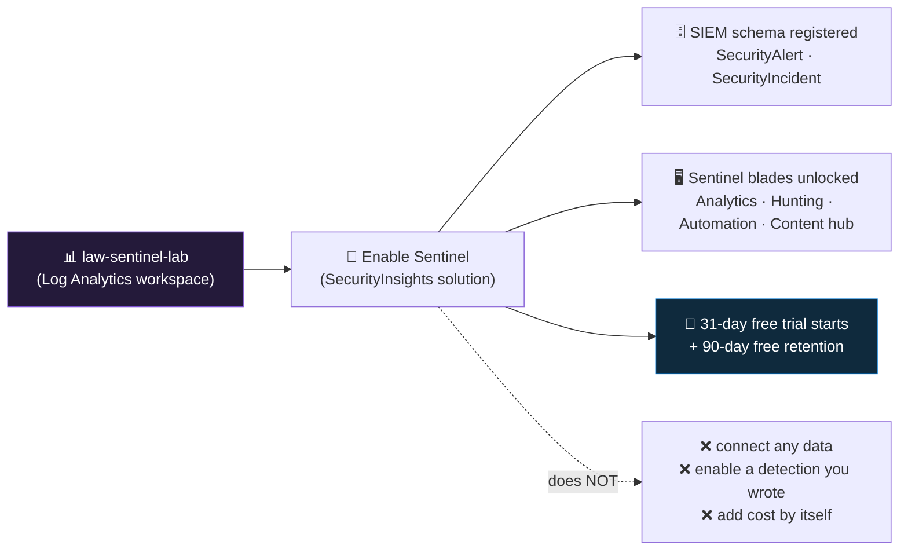

<div align="center">

# 🧱 Step 02 · Enable Microsoft Sentinel

### *Install the SIEM onto the workspace — on purpose, knowing exactly what it did and didn't turn on*

[](../README.md)
[](#)
[](#)

</div>

---

## 🎯 Goal

Microsoft Sentinel is enabled on `law-sentinel-lab`, the core SIEM tables resolve in KQL, the
Sentinel blades are unlocked — and you can state precisely what that click did (installed the SIEM
solution, created one small ARM resource, armed two billing meters) and what it did **not** do
(connect data, enable a rule, cost anything on its own).

## 🧠 Why this step

"Enable Sentinel" is one button, and that hides how much it changes about the workspace. Sentinel is
not a separate product with its own database — it is the **SecurityInsights solution installed onto
the Log Analytics workspace you built in [step 01](../01-log-analytics-workspace/README.md)**.
Enabling it registers the SIEM table schema (`SecurityAlert`, `SecurityIncident`, and friends),
switches on the Sentinel control plane (the analytics engine, the incident service, and the Fusion
correlation engine — not UEBA, which stays off until you enable it separately), and surfaces roughly
twenty new blades in the portal. From this moment the workspace is doing double duty: operations data
store *and* security data store, priced and governed as one unit.

What silently breaks if you skip it: none of the later steps have anywhere to land — no connector
wizard, no Analytics blade, no Hunting page, no incident queue. What silently breaks if you get it
*wrong* — enable it on a workspace that already carries application, platform or infrastructure logs
— is the bill. From that moment every *billable* gigabyte in the workspace, not just the security
tables, is charged the Sentinel analysis fee on top of the Log Analytics ingestion fee. The charge
is not retroactive, but it also does not un-apply until you offboard, and offboarding a workspace
that already has rules, incidents and installed content is not a five-minute job
([step 61](../61-ir-purge-and-audit/README.md)). Enable it on three workspaces "to compare" and you
have tripled that analysis charge and fragmented your content, incidents and RBAC across stores that
do not query each other cleanly.

In the attack-vs-defense picture, this step builds nothing defensive yet. It lays the slab.
"Sentinel enabled" and "Sentinel detecting" are two different milestones separated by
[step 07](../07-connectors-and-content-hub/README.md) (get telemetry in) and
[step 18](../18-enable-a-rule-from-template/README.md) (turn on a detection). The most common
onboarding mistake in real teams is treating them as one: a project connects a handful of sources,
installs the matching Content hub solutions, and everyone moves on — while every bundled analytics
rule sits disabled and the first real incident it was meant to catch generates nothing. Installing a
solution makes rule *templates* present; someone still has to open each one and switch it on.

Microsoft designed it this way — a solution on top of Log Analytics rather than a standalone SIEM —
so Sentinel reuses mature plumbing: one ingestion pipeline, one query language (KQL), one retention
model, one RBAC model, shared between ops and security. The tradeoff you inherit is that the
workspace boundary now decides both your security data scope and your bill, which is why the
"one dedicated workspace" discipline from step 01 matters so much here.

## ✅ Prerequisites

- [Step 01](../01-log-analytics-workspace/README.md) — the workspace exists. Sentinel has nothing to
  install onto without it, and the **region and interactive retention you chose in step 01 are now
  locked in as Sentinel's own** — the workspace cannot be moved regions and there is no rename.
- [Step 00](../00-azure-subscription-and-tenant/README.md) — the `az sentinel` CLI extension was
  added there (`az extension add --name sentinel`). Only needed for the CLI/IaC path.
- Your account has **Owner** or **Contributor** on the resource group — and, in many tenants,
  **Contributor at the subscription scope**. Onboarding writes a new resource type to the workspace
  *and* registers a resource provider on the subscription; a Reader or a Sentinel-scoped role cannot
  do either. Microsoft's onboarding prerequisites list subscription Contributor as the requirement.
  RBAC is tightened to least-privilege in [step 05](../05-rbac-and-roles/README.md).
- A decision that this is the right workspace. Offboarding is possible
  ([step 61](../61-ir-purge-and-audit/README.md)) but the free-trial clock and installed content do
  not fully reset, and [step 53](../53-workspace-architecture/README.md) is the proper place to make
  the one-vs-many call before you ever click enable.

## 🧭 Concepts

Enabling Sentinel = creating exactly one small ARM resource — the **onboarding state** — against the
workspace. Everything else (the tables, the blades, the engine) is a downstream effect of that
resource existing. The action is cheap and reversible; the *consequences* (pricing scope, content
sprawl, RBAC surface) are the part worth being deliberate about.



**Reading the diagram:** you start (left) with the workspace from step 01 — a data store with KQL,
retention and RBAC but no security features. Enabling Sentinel installs the *SecurityInsights*
solution against it, and three things become true within a few minutes (the solid branches): the
SIEM table schema is registered so `SecurityAlert` and `SecurityIncident` resolve in KQL even at
zero rows; the Sentinel navigation area appears with the Analytics, Hunting, Automation and Content
hub blades; and two clocks start — a 31-day free trial and the upgrade of the free retention
allowance from 31 days to 90. The dashed branch is what onboarding runs skip over: enabling changed
*capability*, not *coverage*. There is still no data flowing, and the only enabled rule is the
built-in Fusion rule, which correlates nothing until data arrives.

### How it works under the hood

- **The resource.** Enabling Sentinel creates a `Microsoft.SecurityInsights/onboardingStates`
  resource named `default`, as an *extension resource* scoped to the workspace's ARM ID. There is
  exactly one per workspace and it is always named `default`. Its existence **is** the definition of
  "Sentinel is on" for that workspace — `az sentinel onboarding-state show` returning it (not a 404)
  is the authoritative check.
- **Provider registration.** The platform registers the `Microsoft.SecurityInsights` resource
  provider on the subscription if it is not already registered. The portal does this for you
  silently; scripted deployments into a fresh subscription must do it explicitly or the deploy fails
  with `MissingSubscriptionRegistration`.
- **Schema provisioning.** Sentinel's tables are added to the workspace's schema. `SecurityAlert`
  and `SecurityIncident` resolve immediately, even at zero rows, so a `| count` against them is the
  cleanest "is it on?" check from KQL. Others only materialize once their first row lands — the
  `Watchlist` audit table after you create a watchlist (its *contents* are read via the
  `_GetWatchlist()` function, not from that table; [step 24](../24-watchlists/README.md)), the
  threat-intelligence tables after the TI connector or upload API sends data
  ([step 58](../58-threat-intelligence/README.md), which also covers the current TI table names —
  they changed in 2024–25), the `Anomalies` table after an anomaly rule emits output
  ([step 59](../59-anomaly-and-ml-rules/README.md)). `SecurityAlert` may already carry rows if
  Microsoft Defender for Cloud was ever pointed at this workspace.
- **Where the data physically lives.** Nowhere new. Sentinel data lands in the *same* Log Analytics
  workspace, in the same platform-managed storage, queried by the same regional Kusto engine.
  `SecurityIncident` and `SecurityAlert` are ordinary Log Analytics tables that Sentinel's services
  write to — the incident service writes `SecurityIncident`, the analytics engine writes
  `SecurityAlert`.
- **The engine.** Once you create rules ([steps 17–19](../17-analytics-rule-types/README.md)), the
  analytics engine runs each scheduled rule's KQL against the workspace on its timer; a match writes
  an alert row; the incident service groups alerts into incidents. None of that runs today: no
  scheduled rule exists yet, and the one rule Sentinel auto-enables — the Fusion rule **Advanced
  Multistage Attack Detection** — stays dormant until connected data gives it alerts to correlate.
- **Billing.** Two meters now apply to this workspace's billable data: Log Analytics *Analytics
  Logs* ingestion (per GB) and the Microsoft Sentinel per-GB analysis charge. Workspaces created
  under the newer *simplified pricing experience* show a single merged per-GB line item instead of
  two; either way, enabling Sentinel is what switches on the security portion. A set of Microsoft
  first-party sources — Azure Activity, Microsoft 365 audit logs, alerts from Microsoft Defender
  products — are exempt from these charges. [Step 06](../06-cost-model-and-budget/README.md) covers
  the model and the current free-source list.

### Vocabulary

| Term | What it means here |
|---|---|
| **SIEM** | Security Information and Event Management — the tool category that centralizes logs, runs detections against them, and raises incidents. Sentinel is Microsoft's cloud-native SIEM. |
| **Log Analytics workspace** | The Azure Monitor data store (step 01) where every table lives and KQL runs. Sentinel installs *onto* one; it is not a separate store. |
| **SecurityInsights solution** | The bundle of table schema, control-plane wiring and blades that "enabling Sentinel" installs. `Microsoft.SecurityInsights` is its ARM resource provider. |
| **Onboarding state** | The single ARM resource (`onboardingStates/default`) whose existence *is* "Sentinel enabled" on that workspace. One per workspace, always named `default`. |
| **Extension resource** | An ARM resource that has no standalone existence — it attaches to a parent (here, the workspace) and shares its lifecycle. That is why the Bicep uses `scope:` rather than a child declaration. |
| **Offboarding** | Deleting the onboarding state — disables Sentinel. The workspace and its data survive; SIEM features and the Sentinel-only tables go away. Step 61. |
| **Data connector** | Configuration that starts a specific source flowing into the workspace. None exist yet — step 07. |
| **Analytics rule** | A saved KQL detection that the Sentinel engine runs on a schedule (or near-real-time) to produce alerts and incidents. Steps 17–19. |
| **Content hub** | The in-product catalog of installable solutions (connectors + rules + workbooks + playbooks), populated only *after* Sentinel is enabled. Step 07. |
| **Free trial** | A time-boxed waiver of Sentinel + Log Analytics ingestion charges up to a daily GB cap, per new Sentinel workspace. As of writing: 31 days, 10 GB/day — verify current terms on the pricing page. |
| **Pay-As-You-Go (`PerGB2018`)** | The default per-GB pricing tier. Commitment tiers (fixed daily spend for a discount) only pay off at high volume — step 56. |

### Where this fits

This is the hinge between "Azure workspace" and "SOC". Everything downstream depends on the
onboarding state existing: [step 03](../03-navigating-sentinel/README.md) tours the blades this
unlocked, [step 04](../04-kql-survival-kit/README.md) drills KQL in the Sentinel Logs view,
[step 07](../07-connectors-and-content-hub/README.md) uses the Content hub that just appeared,
[steps 17–28](../17-analytics-rule-types/README.md) live in the Analytics blade,
[steps 29–39](../29-automation-rules-vs-playbooks/README.md) in Automation, and
[steps 40–51](../40-hunting-mindset-and-hypotheses/README.md) in Hunting. Nothing *detects* until
step 07 brings data and [step 18](../18-enable-a-rule-from-template/README.md) turns on a rule.
[Step 06](../06-cost-model-and-budget/README.md) is where you put a tripwire on the bill this step
just made possible, and [step 52](../52-unified-secops-defender-portal/README.md) is where you run
this same Sentinel from the Microsoft Defender portal.

### Design rationale

The flip side of installing onto Log Analytics rather than standing up a separate store: anything
that has to span workspaces gets harder. A query across two Sentinel workspaces must name each one
with the `workspace()` function and runs slower than a single-workspace query; RBAC assignments and
installed Content hub solutions are not shared, so every extra workspace is another copy of the role
assignments to maintain and another set of solutions to install and keep updated.

> [!IMPORTANT]
> Do **not** enable Sentinel on a workspace that already ingests application, platform or
> infrastructure logs. The Sentinel analysis charge applies to *every* billable GB in the workspace,
> not just the security tables. In a lab you avoid this by having built a dedicated
> `law-sentinel-lab` in step 01; in production this is the first architecture decision, not an
> afterthought.

> [!NOTE]
> Microsoft has consolidated Sentinel management into the **Microsoft Defender portal**
> (`security.microsoft.com`). Since 1 July 2026 `portal.azure.com` automatically redirects Sentinel
> users to the Defender portal, and the Azure-portal Sentinel experience is scheduled to retire fully
> on 31 March 2027. Starting from `security.microsoft.com` is now the default path. The onboarding
> action, the `onboardingStates/default` resource it creates, and every validation below are
> identical in either portal; only the surrounding chrome differs.
> [Step 52](../52-unified-secops-defender-portal/README.md) covers the Defender-portal experience in
> full.

## 🖱️ Do it — portal

1. **[security.microsoft.com](https://security.microsoft.com) → Microsoft Sentinel** (`portal.azure.com`
   now redirects here). The page opens on a list of workspaces that *already* have Sentinel — empty
   for you. That list is itself a check: if you think Sentinel is on somewhere and the workspace is
   not listed here, it is not on.
2. **Click `+ Create`.** The "Add Microsoft Sentinel to a workspace" pane lists eligible Log
   Analytics workspaces in the currently selected directory + subscription. Select `law-sentinel-lab`.
   *If it is missing or greyed:* wrong subscription/tenant in the portal's directory filter, you
   lack Contributor on it, or Sentinel is already enabled there (an enabled workspace is not offered
   again).
3. **Click `Add`** (bottom of the pane). Provisioning takes roughly one to two minutes.
4. **You should land on the Sentinel `Overview` dashboard for that workspace** — not the Create
   page. All four tiles (incidents, events, data, automation) read zero. That empty Overview *is*
   the success signal: you moved from "Create" to "Overview".
5. **Read the free-trial / pricing banner** at the top of Overview once, and follow its link to the
   pricing page. Note the trial end date — you will log it.
6. **Spot-check what got unlocked:** the left nav now shows **Analytics**, **Hunting**,
   **Automation**, **Content hub**, **Data connectors**. Open **Content hub** — it now lists a large
   catalog of solutions. Open **Analytics → Rule templates** — it shows only the built-in Microsoft
   templates; the large catalog appears after you install Content hub solutions in step 07. Then
   check **Active rules**: exactly one rule is enabled — the Fusion rule **Advanced Multistage Attack
   Detection**, which Sentinel turns on automatically. No detection *you* built exists yet — that is
   the point of the diagram's dashed branch. Before this step, none of these blades existed.

**Lab vs production:** in the lab you enable on the dedicated `law-sentinel-lab` and move straight
on. In production the order is reversed — decide *which* workspace first
([step 53](../53-workspace-architecture/README.md)), confirm it carries only security-relevant data,
assign the Sentinel RBAC roles from day one ([step 05](../05-rbac-and-roles/README.md)) so the gap
between "enabled" and "locked down" is measured in minutes not weeks, and stage the connector
rollout rather than enabling everything at once so the initial alert volume stays tunable
([step 26](../26-tuning-a-noisy-rule/README.md)).

## 💻 Do it — CLI / IaC

```bash
# The az sentinel extension was installed in step 00 (az extension add --name sentinel).
# Confirm you are pointed at the lab subscription BEFORE anything else:
az account show --query name -o tsv        # must print your lab subscription name

# Enabling Sentinel = creating the singleton "onboarding state" on the workspace.
# This provisions the SecurityInsights solution: the SIEM table schema plus the
# Sentinel control-plane flag on law-sentinel-lab. Nothing ingests, nothing detects.
az sentinel onboarding-state create \
  --resource-group rg-sentinel-lab \
  --workspace-name law-sentinel-lab \
  --name default            # MUST be "default" — there is exactly one per workspace
```

`onboarding-state create` is effectively a **PUT on a named singleton**: re-running it against an
already-onboarded workspace returns the existing state, does not double-charge, and does not reset
the free-trial clock. Safe to leave in a deployment script.

```bash
# One-time per subscription (the portal does this silently). Harmless if already registered;
# a fresh subscription needs it or ARM/Bicep deploys fail with MissingSubscriptionRegistration.
az provider register --namespace Microsoft.SecurityInsights
az provider show --namespace Microsoft.SecurityInsights --query registrationState -o tsv
```

> [!NOTE]
> The `az sentinel` extension is still published as **preview** — verb and parameter names have
> shifted between releases, so run `az sentinel onboarding-state create --help` against your
> installed version if a flag is rejected. The underlying operation is a single ARM `PUT` on
> `.../providers/Microsoft.SecurityInsights/onboardingStates/default` (api-version `2024-03-01` or
> newer), which is exactly what the Bicep below and the portal do underneath; the `Az.SecurityInsights`
> PowerShell module exposes the same operation.

<details><summary>Bicep</summary>

```bicep
// Sentinel onboarding is an *extension resource* on the workspace, so reference the
// existing workspace and use `scope:` rather than declaring a child resource.
resource law 'Microsoft.OperationalInsights/workspaces@2023-09-01' existing = {
  name: 'law-sentinel-lab'
}

// api-version current-stable as of writing — check for a newer one in current docs
resource sentinel 'Microsoft.SecurityInsights/onboardingStates@2024-03-01' = {
  scope: law
  name: 'default'          // the only valid name
  properties: {}           // customerManagedKey and similar options go here; empty is normal
}
```

Deploy this at the resource-group scope where `law-sentinel-lab` lives:

```bash
az deployment group create \
  --resource-group rg-sentinel-lab \
  --template-file sentinel.bicep
# default mode is Incremental — it will not touch other resources in the RG
```

It is idempotent — a second deployment is a no-op. Older templates enabled Sentinel via a
`Microsoft.OperationsManagement/solutions` resource named `SecurityInsights(law-sentinel-lab)`; that
path still works but `onboardingStates` is the current one — do not deploy both.
</details>

## 🧪 Validate

```bash
az sentinel onboarding-state show \
  -g rg-sentinel-lab --workspace-name law-sentinel-lab -n default \
  --query "{name:name, type:type}" -o table
```

**You should see** `name: default` and a `type` ending in `.../onboardingStates` (namespace
`Microsoft.SecurityInsights`). A `ResourceNotFound` / 404 means Sentinel is not enabled on *this*
workspace — or `az` is pointed at the wrong subscription (`az account show`).

Then open **Microsoft Sentinel → Logs** (or the workspace's Logs blade) and run each of:

```kusto
SecurityAlert
| count
```

```kusto
SecurityIncident
| count
```

**You should see** each query return a single row with `Count = 0`. The `Count` column is just the
row tally; the load-bearing part is that the query **runs without a "Failed to resolve table"
error**. That empty-but-present result is the signal Sentinel provisioned the schema:

| Result | Reading |
|---|---|
| Query runs, `Count` = 0 | Healthy. Table exists, Sentinel is enabled, no data yet (expected). |
| `Failed to resolve table or column expression named 'SecurityAlert'` | Schema not provisioned yet (wait 5–15 min, refresh the Logs schema pane) — or you are querying the wrong workspace. |
| `Count` > 0 on `SecurityAlert` | Not necessarily wrong — Defender for Cloud may have written here before. `SecurityIncident` should still be 0. |

**Second angle — the resource directly:**

```bash
az rest --method get \
  --url "https://management.azure.com/subscriptions/$(az account show --query id -o tsv)/resourceGroups/rg-sentinel-lab/providers/Microsoft.OperationalInsights/workspaces/law-sentinel-lab/providers/Microsoft.SecurityInsights/onboardingStates?api-version=2024-03-01" \
  --query "value[].name" -o tsv
```

Prints `default` = enabled. (`az resource list` does not return this proxy resource — do not use it here.)

**Third angle — the schema tree:** in **Logs**, run `SecurityIncident | getschema` — a healthy
result lists the incident columns (`IncidentNumber`, `Severity`, `Status`, `Title`, …) even with
zero rows, confirming the table definition landed, not just an alias.

**Fourth angle — the portal:** the **Content hub** blade shows a full solution catalog, **Analytics
→ Rule templates** shows the built-in templates, and **Data connectors** shows a gallery where every
source reads "Not connected". None of these blades render for a workspace without Sentinel.

## 🚩 Common mistakes

| 🚩 Mistake | Why it bites |
|---|---|
| Assuming "enabled" means "protecting" | No connector, no rule, no coverage — that is steps 07+ and 17+. An honest empty checkbox beats a false sense of coverage. |
| Enabling on a workspace shared with app / infra logs | Sentinel prices *all* billable ingestion on that workspace at the analysis rate, not just the security tables. |
| Enabling on several workspaces "to compare" | Multiplies the analysis charge, splits content and incidents, and cross-workspace queries get slower and clunkier. |
| Expecting the 31-day trial to reset on offboard / re-onboard | The trial is tracked per workspace; re-onboarding within the window does not grant a fresh 31 days. |
| Not assigning Sentinel RBAC roles at enable time (production) | Everyone who held workspace Contributor now also has broad Sentinel reach; step 05 tightens it, but the window between enable and lockdown is real exposure. |
| Scripting a deploy into a fresh subscription without registering `Microsoft.SecurityInsights` | ARM/Bicep fails with `MissingSubscriptionRegistration`; the portal hides this because it registers for you. |
| Enabling in the Azure portal and never checking the Defender portal | Management has consolidated into `security.microsoft.com`; you can miss unified settings and incidents (step 52). |
| Ignoring the pricing page | The free tier has both a time limit and a daily GB cap — you need both numbers, plus the crossover to commitment tiers (step 56). |

## 🩺 Troubleshooting

| Symptom | Likely cause | Fix |
|---|---|---|
| `law-sentinel-lab` missing from the "Add Sentinel" list | Wrong directory/subscription in the portal filter; missing Contributor; Sentinel already enabled on it | Switch directory + subscription (top-right); check your role assignment; if already enabled it simply is not offered again |
| `Create` / `Add` returns an authorization error | Account lacks Contributor/Owner at the RG (some tenants require it at subscription scope) | Get the role assignment, or have an Owner run `az sentinel onboarding-state create` |
| `SecurityAlert` / `SecurityIncident` → "Failed to resolve table" right after enabling | Schema propagation lag | Wait 5–15 min, refresh the Logs schema tree, retry. Still failing after ~1h → confirm the onboarding state exists |
| `az sentinel onboarding-state show` → `ResourceNotFound` | Not onboarded, or `az` on the wrong subscription | `az account set --subscription "<lab>"`, then re-run `create` |
| Portal still shows **Create** after `onboarding-state create` reported success | Stale browser tab, or the CLI hit a different workspace/subscription | Hard-refresh the blade; confirm `az sentinel onboarding-state show` returns `default` for *this* workspace |
| `az sentinel ...` → "command not found" / extension error | `az sentinel` extension not installed or too old | `az extension add --name sentinel` / `az extension update --name sentinel` (step 00) |
| Bicep/ARM deploy → `MissingSubscriptionRegistration` for `Microsoft.SecurityInsights` | Provider not registered on the subscription | `az provider register --namespace Microsoft.SecurityInsights`, wait for `Registered`, redeploy |
| Overview loads but every tile is 0 and stays 0 | Expected — no connectors, no rules | Continue to steps 07 (data) and 18 (a rule); nothing is wrong |
| Azure portal Sentinel area redirects to `security.microsoft.com` | Portal consolidation into the Defender portal | Expected — use the Defender portal (step 52); the onboarding state is unchanged |
| Defender portal shows the workspace as "not onboarded" although Sentinel is enabled in Azure | The workspace is Sentinel-enabled but not yet connected to the unified Defender portal | Connect it from the Defender portal (step 52); the `onboardingStates/default` resource is not affected |
| A Sentinel charge appears within days of enabling | The workspace was already ingesting billable data before you enabled | Check the `Usage` table; move to a dedicated workspace (step 53); set the budget in step 06 |
| Cannot offboard Sentinel | Active rules, incidents or installed content still present | Remove content and rules first; offboarding and its constraints are covered in step 61 |

## 🎓 Deepen your understanding

1. **Project the cost you avoided.** In Logs, run
   `Usage | where TimeGenerated > ago(24h) | summarize GB=sum(Quantity)/1000 by DataType | sort by GB desc`.
   It should be near-zero now (`Quantity` is in MB; `/1000` gives GB). Estimate your daily GB if
   Sentinel were enabled on a workspace already carrying your organization's VM security events,
   then use the pricing page to multiply out the monthly delta. That number is why "dedicated
   workspace" is a rule, not a preference.
2. **Find the commitment-tier crossover.** From the pricing page, work out the volume at which the
   first commitment tier beats Pay-As-You-Go. Why does Microsoft not just auto-select the cheapest
   tier for your usage? (Step 56 goes deep on this.)
3. **Offboard and observe.** On a *throwaway* workspace — not `law-sentinel-lab` — run
   `az sentinel onboarding-state delete`. Re-query `SecurityIncident`. Does the table still resolve?
   What happened to the blades? What does that tell you about where the data actually lives versus
   what the solution controls?
4. **Name the inheritance.** Sentinel is a solution on Log Analytics rather than a standalone SIEM.
   List three concrete capabilities Sentinel gets "for free" from that design decision (think:
   retention tiers, Private Link, KQL, RBAC, data export) and one thing it makes harder.
5. **Interrogate the free list.** Check which sources Microsoft currently lists as free to ingest
   into a Sentinel workspace. Why are Azure Activity and Defender alerts free, but Entra ID sign-in
   logs are not? (Hint: think about what Microsoft already pays to generate versus what it costs to
   store and analyze.)
6. **Read the resource.** Run `az sentinel onboarding-state show -g rg-sentinel-lab
   --workspace-name law-sentinel-lab -n default` with no `--query`. What is in `properties`? What
   would `customerManagedKey: true` change about where your security data is encrypted, and why is
   that decision effectively permanent for the workspace?

## 🗒️ Log your run

`LOG.md` — record:

- The **date and time** you enabled Sentinel — the 31-day free-trial clock starts now. Set a
  calendar reminder for **day 28**.
- The **trial end date** shown on the Overview banner.
- The **workspace name** (`law-sentinel-lab`) and the **method** used (portal / CLI / Bicep). Do
  **not** paste the workspace ID, subscription ID, or tenant ID.
- The output of `az sentinel onboarding-state show ... --query "{name:name, type:type}"`.
- The `SecurityIncident | count` result (should be `0`) and whether `SecurityAlert | count` ran
  without a table error.

Per the repo honesty rule: only tick this step once `onboarding-state show` returns `default` **and**
`SecurityAlert | count` runs without a table error. Do not record an enabled date you have not
reached.

## 📚 Microsoft Learn

- [Quickstart: Onboard Microsoft Sentinel](https://learn.microsoft.com/en-us/azure/sentinel/quickstart-onboard)
- [Deploy Microsoft Sentinel — overview](https://learn.microsoft.com/en-us/azure/sentinel/deploy-overview)
- [Prerequisites for deploying Microsoft Sentinel](https://learn.microsoft.com/en-us/azure/sentinel/prerequisites)
- [Roles and permissions in Microsoft Sentinel](https://learn.microsoft.com/en-us/azure/sentinel/roles)
- [Microsoft Sentinel pricing and billing](https://learn.microsoft.com/en-us/azure/sentinel/billing)
- [Plan costs and reduce Microsoft Sentinel costs](https://learn.microsoft.com/en-us/azure/sentinel/billing-reduce-costs)
- [Microsoft Sentinel in the Microsoft Defender portal](https://learn.microsoft.com/en-us/azure/sentinel/microsoft-sentinel-defender-portal)
- [Bicep/ARM reference — `Microsoft.SecurityInsights/onboardingStates`](https://learn.microsoft.com/en-us/azure/templates/microsoft.securityinsights/onboardingstates)
- [`az sentinel` CLI reference](https://learn.microsoft.com/en-us/cli/azure/sentinel)
- [Training: Introduction to Microsoft Sentinel](https://learn.microsoft.com/en-us/training/modules/intro-to-azure-sentinel/)
- [Training: Configure your Microsoft Sentinel environment](https://learn.microsoft.com/en-us/training/modules/configure-your-microsoft-sentinel-environment/)
- [Training path — SC-200: Configure your Microsoft Sentinel environment](https://learn.microsoft.com/en-us/training/paths/sc-200-configure-microsoft-sentinel-environment/)

---

<div align="center">
<sub>

[⬅ Prev: 01 · Log Analytics workspace](../01-log-analytics-workspace/README.md) &nbsp;·&nbsp; [🦅 All steps](../README.md) &nbsp;·&nbsp; [Next: 03 · Navigating Sentinel ➡](../03-navigating-sentinel/README.md)

</sub>
</div>
