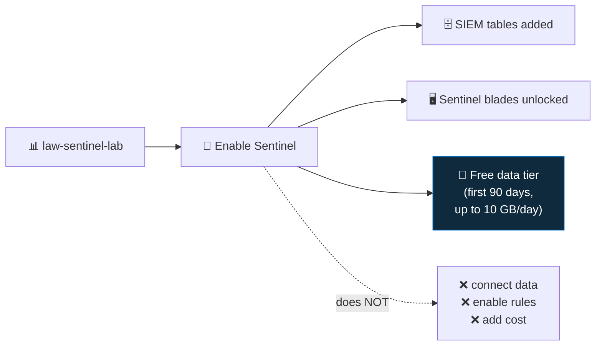

<div align="center">

# 🧱 Step 02 · Enable Microsoft Sentinel

### *Install the SIEM onto the workspace — deliberately*

[](../README.md)
[](#)
[](#)

</div>

---

## 🎯 Goal

Microsoft Sentinel is enabled on `law-sentinel-lab`, and you understand what that did and did not
turn on.

## 🧠 Why this step

Enabling Sentinel is one click, but it changes the workspace: it adds the SIEM tables
(`SecurityIncident`, `SecurityAlert`, `ThreatIntelligenceIndicator`…), unlocks the Sentinel blades,
and starts the **free-data-tier clock**. It does **not** connect any data, enable any rule, or cost
anything on its own. Treat "Sentinel enabled" and "Sentinel detecting" as two different milestones.

## ✅ Prerequisites

- [Step 01](../01-log-analytics-workspace/README.md) — the workspace exists
- Your account has **Owner** or **Contributor** on the resource group (to enable) — RBAC is tightened in step 05

## 🧭 Concepts in 60 seconds



The **free trial**: for the first 31 days after enabling Sentinel on a new workspace you get up to
10 GB/day of Sentinel analysis free (on top of the Log Analytics 90-day free retention). Check the
current offer on the pricing page — Microsoft adjusts it.

## 🖱️ Do it — portal

1. [portal.azure.com](https://portal.azure.com) → search **Microsoft Sentinel** → **Create**.
2. Select `law-sentinel-lab` from the list → **Add**.
3. Wait for the overview page to load. You are now on the Sentinel **Overview** dashboard —
   empty, because nothing is connected yet.
4. Note the banner about the free trial / pricing. Read the linked pricing page once.

## 💻 Do it — CLI / IaC

```bash
# enabling Sentinel = creating the SecurityInsights solution on the workspace
az sentinel onboarding-state create \
  --resource-group rg-sentinel-lab \
  --workspace-name law-sentinel-lab \
  --name default
```

<details><summary>Bicep</summary>

```bicep
resource sentinel 'Microsoft.SecurityInsights/onboardingStates@2024-03-01' = {
  scope: law                      // the workspace resource
  name: 'default'
  properties: {}
}
```
</details>

## 🧪 Validate

```bash
az sentinel onboarding-state show \
  -g rg-sentinel-lab --workspace-name law-sentinel-lab -n default \
  --query "{name:name, type:type}" -o table
```

Then in the portal open **Microsoft Sentinel → Logs** and run:

```kusto
SecurityIncident
| count
```

**You should see** the onboarding state returned (not a 404), and the `SecurityIncident` query
returns `0` rows **without a "table not found" error** — the table exists, it is just empty. That
empty-but-present result is the signal Sentinel is enabled.

## 🚩 Common mistakes

| 🚩 Mistake | Why it bites |
|---|---|
| Assuming "enabled" means "protecting" | No connector, no rule, no coverage — that's steps 07+ and 17+ |
| Enabling on a workspace shared with app/infra logs | Sentinel prices *all* ingestion on that workspace at the Sentinel rate |
| Enabling on several workspaces "to compare" | Doubles cost and splits content; pick one |
| Ignoring the pricing page | The free tier has a time limit and a daily cap — know both |

## 🗒️ Log your run

`LOG.md` — record the date you enabled Sentinel (the free-trial clock starts now) and set a calendar
reminder for day 28.

## 📚 Microsoft Learn

- [Quickstart: Onboard Microsoft Sentinel](https://learn.microsoft.com/en-us/azure/sentinel/quickstart-onboard)
- [Microsoft Sentinel pricing and billing](https://learn.microsoft.com/en-us/azure/sentinel/billing)
- [Plan costs and understand pricing](https://learn.microsoft.com/en-us/azure/sentinel/billing-reduce-costs)

---

<div align="center">
<sub>

[⬅ Prev: 01 · Log Analytics workspace](../01-log-analytics-workspace/README.md) &nbsp;·&nbsp; [🦅 All steps](../README.md) &nbsp;·&nbsp; [Next: 03 · Navigating Sentinel ➡](../03-navigating-sentinel/README.md)

</sub>
</div>
