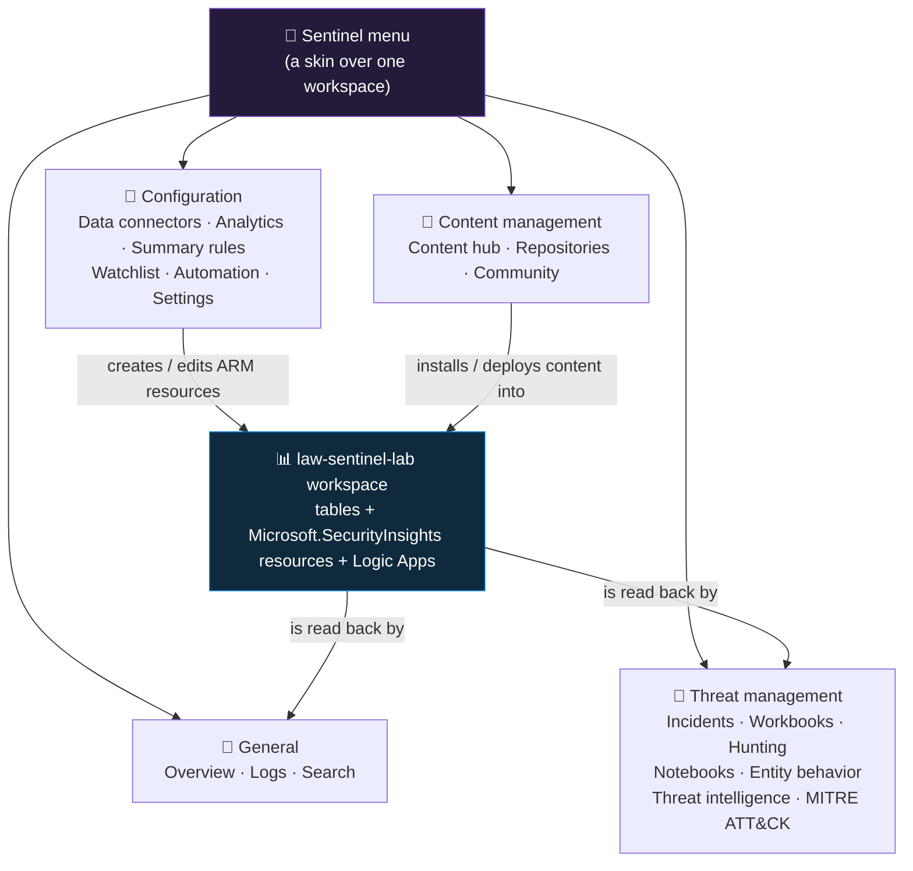

<div align="center">

# 🧱 Step 03 · Navigating Sentinel

### *Every blade in the menu — what it does, which table it touches, and where it comes back*

[](../README.md)
[](#)
[](#)

</div>

---

## 🎯 Goal

You can open any Microsoft Sentinel blade and say, in one sentence: what it does, which later step
drives it, and which workspace table or ARM resource it reads or writes. You have walked the whole
menu once against your own empty workspace, produced a one-page "blade map" you can fill from memory,
and you know that the same Sentinel can be run from two different portals.

## 🧠 Why this step

The Sentinel left-hand menu is the SOC's entire control surface. Every later step in this path —
connecting a log source, writing a detection, building a playbook, running a hunt — happens inside
one of roughly twenty blades grouped into four sections. Spending half an hour now learning where
everything lives means that when you are mid-incident at 3 a.m. you are navigating from memory, not
hunting through menus. Orientation is cheap insurance.

The thing that silently breaks without this step is your mental model of *where health lives*.
Connector health, rule health, and playbook-run health each have their own blade, and the Overview
dashboard does **not** aggregate all of them. A team that lives only in Overview and Incidents can
run for months with a connector that stopped delivering data or a scheduled rule that has been
failing every run — both invisible unless you know to open **Data connectors**, **Analytics**, or the
health tables directly. The other predictable failure is conflating two blades that look similar:
**Content hub** installs detection content, **Data connectors** wires up the source that feeds it;
**Hunting** runs exploratory queries that raise nothing, **Analytics** runs detections that raise
incidents; **Workbooks** are curated dashboards, **Logs** is the raw KQL editor. Confusing any of
those pairs sends you to the wrong place and wastes a shift.

In the attack-versus-defense picture this step builds nothing defensive — it is pure map-reading. But
it is the map you navigate under pressure. An analyst who knows that the investigation graph is one
click from an incident, that the entity page pivots to every log touching a user, and that a
suspicious result can be bookmarked without rerunning the query, investigates faster than one who is
still learning the UI while the clock runs.

Real-world context: most SOC staff use maybe five blades — Overview, Incidents, Logs, Hunting,
Workbooks — and never open **MITRE ATT&CK**, **SOC optimization**, **Repositories**, or half of
**Settings**, which is exactly where coverage gaps, cost controls, and version discipline live.
Microsoft also keeps reorganizing this menu: blades move between sections, get renamed, and — most
significantly — Sentinel management is being consolidated into the **Microsoft Defender portal**
(`security.microsoft.com`), where the layout differs from the Azure portal. Knowing the menu *by what
each item does*, not by its pixel position, is what survives those changes.

## ✅ Prerequisites

- [Step 02](../02-enable-sentinel/README.md) — Sentinel enabled on `law-sentinel-lab`. Without the
  onboarding state, the Microsoft Sentinel area shows only an empty "select a workspace" list — none
  of the blades in this walk render, because they are features of the `Microsoft.SecurityInsights`
  solution that step 02 installed.
- **Reader** on the workspace (or better) plus **Microsoft Sentinel Reader** — enough to open every
  blade and run queries in Logs read-only. The step-00/02 account already has Contributor, which
  covers it. Least-privilege role design is [step 05](../05-rbac-and-roles/README.md); you do not
  need it yet, but note that a plain Azure **Reader** on the workspace can already open **Logs** and
  run read-only queries — the role's `*/read` covers the
  `Microsoft.OperationalInsights/workspaces/query/*/read` permission. **Log Analytics Reader** is
  just another way to grant that; resource-context RBAC is what lets someone who has Reader only on a
  monitored *resource* (not the workspace) see that resource's logs alone.
- Optional: the `az sentinel` CLI extension from [step 00](../00-azure-subscription-and-tenant/README.md)
  (`az extension add --name sentinel`) for the read-only CLI exploration in the IaC section.

## 🧭 Concepts

The Sentinel menu is a **presentation layer over one Log Analytics workspace**. Nothing in it has its
own database. Some blades are read-only views that run a KQL query for you (Overview, Logs, most of
Incidents, Entity behavior, MITRE ATT&CK). Some are resource managers that create, edit, and delete
child resources under `Microsoft.SecurityInsights/*` or `Microsoft.Logic/workflows` (Analytics,
Data connectors, Automation, Watchlist, Settings). And two are content/deployment tools that install
or push packaged ARM into the workspace (Content hub, Repositories). Learn which of those three kinds
a blade is and its behaviour stops being mysterious.



**Reading the diagram:** the menu (top) fans out into four sections. The **Configuration** section is
where you *write* — every click in Analytics, Data connectors, Automation, Watchlist, or Settings
lands as an Azure resource attached to the workspace. **Content management** also writes, but in
bulk: installing a Content hub solution or syncing a repository deploys a whole bundle of rules,
workbooks, and playbooks at once. Everything then flows into the single workspace in the centre —
the same `law-sentinel-lab` from [step 01](../01-log-analytics-workspace/README.md), holding both
ordinary Log Analytics tables and Sentinel's own resources. The **General** and **Threat management**
sections mostly *read* that workspace back: Overview tiles, incident lists, hunt results, and entity
timelines are all queries against tables you could run yourself in Logs. The menu is a convenience,
not a boundary.

### The menu, section by section

#### 📂 General

| Blade | What it does | Reads / writes | Later step |
|---|---|---|---|
| **Overview** | Landing dashboard: incident counts by severity and status, event- and data-ingestion charts, automation health, connector summary. Scoped by the time picker at the top-right. Every tile is a canned KQL query you could rebuild in Logs — it is read-only. | reads `SecurityIncident`, `SecurityAlert`, `Usage`, connector state | — |
| **Logs** | The full KQL editor (Azure Monitor Logs) scoped to this workspace. Left pane is the schema tree with **Tables / Queries / Functions** tabs. This is where you test every rule query and run every hunt. | reads every table; writes nothing | [`04`](../04-kql-survival-kit/README.md) |
| **Search** | Builds a **search job** — an asynchronous KQL scan across Analytics-tier and Archive-tier data over a long window (up to a table's total retention), with results written to a new `*_SRCH` table. For investigations that reach past interactive query limits. | reads Analytics + Archive tiers; writes a `_SRCH` results table | [`16`](../16-retention-archive-and-data-lake/README.md) |
| **News & guides** | Getting-started checklists and a shortcut into the data-connector wizard. Cosmetic; its menu position drifts between portal versions. | none | [`07`](../07-connectors-and-content-hub/README.md) |

#### 📂 Threat management

| Blade | What it does | Reads / writes | Later step |
|---|---|---|---|
| **Incidents** | The analyst work queue. Each incident groups one or more correlated `SecurityAlert` rows plus their entities, with Severity / Status / Owner / Tactics columns, a full-screen investigation graph, and bulk actions. Where triage actually happens. | reads `SecurityAlert`; reads/writes `SecurityIncident` | [`18`](../18-enable-a-rule-from-template/README.md), [`20`](../20-entity-mapping-and-custom-details/README.md), [`21`](../21-alert-and-event-grouping/README.md), [`35`](../35-automation-rules-triage/README.md) |
| **Workbooks** | Interactive dashboards on the Azure Monitor workbook engine — parameterised KQL plus visualisations. **Templates** tab (arrives with Content hub solutions) versus **My workbooks** (saved instances). | reads any table; saves workbook JSON as an Azure resource | [`15`](../15-ingestion-health-and-validation/README.md), [`57`](../57-soc-optimization-and-coverage/README.md) |
| **Hunting** | Library of saved proactive queries that do **not** raise alerts. Tabs: Queries, MITRE ATT&CK (technique-tagged), Bookmarks, Livestream. "Run all queries" executes the visible set and shows a result count per query. | reads any table; writes bookmark resources | [`41`](../41-the-hunting-blade/README.md) |
| **Notebooks** | Launches Jupyter notebooks (the MSTICPy library) backed by an Azure Machine Learning compute instance, querying the workspace over its API for graph-heavy or ML-assisted investigation. | reads via API; no workspace writes | [`50`](../50-notebooks-and-msticpy/README.md) |
| **Entity behavior** | The UEBA front end — per-user and per-host activity timelines, peer-group baselines, and anomaly scores. Blank and prompts you to enable UEBA until you turn it on. | reads `BehaviorAnalytics`, `UserPeerAnalytics`, `IdentityInfo` | [`51`](../51-ueba-and-entity-behavior/README.md) |
| **Threat intelligence** | Indicator (IOC) management — browse, tag, add, or bulk-import indicators and the relationships between them. Fed by TAXII feeds, the upload-indicators API, or manual entry. | reads/writes `ThreatIntelligenceIndicator` (and the newer `ThreatIntelIndicators`) | [`58`](../58-threat-intelligence/README.md) |
| **MITRE ATT&CK** | Coverage matrix — every technique as a cell, shaded by how many **active** (and optionally **simulated**) analytics and hunting queries are tagged to it. A gap-analysis view, not a protection guarantee. | reads rule and hunting-query metadata | [`25`](../25-mitre-attack-coverage/README.md) |

#### 📂 Content management

| Blade | What it does | Reads / writes | Later step |
|---|---|---|---|
| **Content hub** | In-product catalogue of **solutions** — each bundles some mix of data connector, analytics-rule templates, hunting queries, workbooks, playbooks, parsers, and watchlists. Installing brings the content *in*; it does not switch any rule *on*. | writes `Microsoft.SecurityInsights` content resources and workspace `savedSearches` | [`07`](../07-connectors-and-content-hub/README.md) |
| **Repositories** | Connects a GitHub or Azure DevOps repo and deploys Sentinel content (rules, playbooks, workbooks as ARM/JSON) through a pipeline on every commit — GitOps for the SOC. | deploys `Microsoft.SecurityInsights/*` resources | [`55`](../55-repositories-cicd/README.md) |
| **Community** | Static links to the Sentinel GitHub repo, the product blog, and feature requests. | none | — |

#### 📂 Configuration

| Blade | What it does | Reads / writes | Later step |
|---|---|---|---|
| **Data connectors** | Gallery of sources, each with **Instructions** and **Next steps** tabs, a "Data received" sparkline, and a Connected / Not connected status. Status means "configuration exists", **not** "rows are arriving". | writes `Microsoft.SecurityInsights/dataConnectors`; several also create Data Collection Rules | [`07`](../07-connectors-and-content-hub/README.md)–[`14`](../14-api-and-codeless-connectors/README.md), [`15`](../15-ingestion-health-and-validation/README.md) |
| **Analytics** | Create and manage detections. **Active rules** (what is running) versus **Rule templates** (the catalogue) versus **Anomalies**. The rule wizard sets query, schedule, entity mapping, grouping, and automated response. | writes `Microsoft.SecurityInsights/alertRules`; rules write `SecurityAlert` | [`17`](../17-analytics-rule-types/README.md)–[`27`](../27-rule-health-monitoring/README.md) |
| **Summary rules** | Scheduled aggregation jobs that roll verbose raw logs into a compact custom table on a fixed cadence, to cut query cost and speed dashboards. Newer blade; its position and availability vary by portal version. | reads a source table; writes a custom `_CL` summary table | [`56`](../56-cost-engineering/README.md) |
| **Watchlist** | Small CSV-backed reference datasets — VIP users, asset inventory, known-bad IPs — joinable in rules and queries with `_GetWatchlist()`. | writes `Microsoft.SecurityInsights/watchlists`; surfaces the `Watchlist` table | [`24`](../24-watchlists/README.md) |
| **Automation** | **Automation rules** (lightweight, code-free triage — assign, tag, re-severity, close, or call a playbook, evaluated on incident and alert events) and **Playbooks** (Logic Apps that take real action). | writes `Microsoft.SecurityInsights/automationRules`; playbooks are `Microsoft.Logic/workflows` | [`29`](../29-automation-rules-vs-playbooks/README.md)–[`39`](../39-monitoring-playbook-runs-and-cost/README.md) |
| **Settings** | Workspace-level toggles: UEBA, Auditing and health monitoring, entity-behavior sources, anomalies, playbook permissions, pricing / commitment tier, and "Remove Microsoft Sentinel". | writes `Microsoft.SecurityInsights/settings` | [`06`](../06-cost-model-and-budget/README.md), [`27`](../27-rule-health-monitoring/README.md), [`51`](../51-ueba-and-entity-behavior/README.md), [`61`](../61-ir-purge-and-audit/README.md) |

### How it works under the hood

- **The menu is a skin, not a service.** Two hosts render nearly the same Sentinel: the Azure portal
  (`portal.azure.com` → Microsoft Sentinel, an ARM-native blade set) and the Microsoft Defender
  portal (`security.microsoft.com`, once the workspace is connected there). Both call the same
  backend — the Log Analytics query service plus the `Microsoft.SecurityInsights` resource provider —
  so an alert rule you create in one appears in the other within seconds.
- **Read blades are queries.** Overview's tiles, the incident list, entity timelines, and the MITRE
  matrix each issue a KQL query or a metadata call and format the result. There is no hidden state:
  `SecurityIncident | summarize count() by Severity, Status` reproduces most of the Overview incident
  tile.
- **Configuration blades are ARM CRUD.** "Create rule" is a `PUT` on
  `.../providers/Microsoft.SecurityInsights/alertRules/<guid>`. Connecting a source is a `PUT` on
  `dataConnectors/<guid>`. An automation rule is `automationRules/<guid>`. A playbook is a
  `Microsoft.Logic/workflows` resource in *your* subscription that Sentinel calls through the
  Sentinel connector's managed identity ([step 32](../32-playbook-managed-identity-and-permissions/README.md)).
- **The analytics engine.** Once rules exist, Sentinel's analytics engine runs each scheduled rule's
  KQL on its interval against the workspace; a match writes `SecurityAlert` rows; the incident
  service groups related alerts into `SecurityIncident`; automation rules then fire on those incident
  events. None of that runs in your lab yet because no rule and no data exist.
- **Where the data physically lands.** Nowhere new. Bookmarks, watchlists, and TI indicators all
  materialise both as ARM resources *and* as rows in workspace tables (`HuntingBookmark`,
  `Watchlist`, `ThreatIntelligenceIndicator`). Every blade reads from and writes to the one
  workspace you already built.
- **What is deliberately *not* in this menu.** Diagnostic settings live on each source resource.
  Data Collection Rules and the Azure Monitor Agent live in Azure Monitor and on the VM. The
  workspace's own retention, table plans, network isolation, and linked services are on the
  Log Analytics workspace blade, not here. You will bounce out to those in
  [steps 01](../01-log-analytics-workspace/README.md), [11](../11-windows-vm-ama-dcr/README.md),
  [12](../12-linux-syslog-cef-ama/README.md), and [16](../16-retention-archive-and-data-lake/README.md).

### Vocabulary

| Term | What it means here |
|---|---|
| **Blade** | One pane in the Azure portal — a single item in the Sentinel left-hand menu. |
| **Alert** | One firing of an analytics rule; a row in `SecurityAlert`. |
| **Incident** | A container grouping one or more related alerts and their entities; the unit an analyst works. A row in `SecurityIncident`. |
| **Entity** | A typed object extracted from an alert — account, host, IP, URL, file hash, mailbox. Entity mapping ([step 20](../20-entity-mapping-and-custom-details/README.md)) is what lets Sentinel correlate and pivot. |
| **Workbook** | An Azure Monitor interactive report — parameterised KQL plus charts, tables, and grids — saved as a JSON resource. |
| **Hunting query** | A saved KQL query that runs on demand and produces results only, never an alert or incident. |
| **Bookmark** | A saved row (or rows) from a Logs or Hunting result, with notes and entities, that can be attached to an incident later without rerunning the query. |
| **Livestream** | A hunting query pinned to run continuously against incoming data, with a live-updating result count. |
| **UEBA** | User and Entity Behavior Analytics — Sentinel's behavioural baselining engine; off by default, produces the `BehaviorAnalytics` table. |
| **Indicator / IOC** | A threat-intelligence artefact (IP, domain, hash, URL) with a confidence and validity window, stored in `ThreatIntelligenceIndicator`. |
| **MITRE ATT&CK matrix** | The tactics-by-techniques grid; Sentinel shades each technique by how many tagged rules and hunts touch it. |
| **Solution** | A Content hub package bundling connector + rules + workbooks + hunts + playbooks + parsers for one product or scenario. |
| **Content hub** | The in-product catalogue that installs solutions into the workspace. |
| **Repository (Sentinel)** | A connected Git repo whose Sentinel content is auto-deployed to the workspace on commit. |
| **Data connector** | The configuration object that starts one specific source flowing into the workspace. |
| **Analytics rule** | A saved detection the engine runs on a schedule or near-real-time to produce alerts and incidents. Types: scheduled, NRT, Microsoft Security, Fusion, anomaly ([step 17](../17-analytics-rule-types/README.md)). |
| **Summary rule** | A scheduled job that aggregates a verbose table into a smaller custom table to reduce cost. |
| **Watchlist** | A named reference list, uploaded as CSV, usable in KQL via `_GetWatchlist('<alias>')`. |
| **Automation rule** | Code-free incident/alert triage logic evaluated by Sentinel — conditions plus actions (tag, assign, close, run playbook). |
| **Playbook** | A Logic App triggered by Sentinel that performs an action (notify, enrich, contain). |
| **Defender portal** | `security.microsoft.com` — the unified SecOps console where Sentinel and Defender XDR share one incident queue ([step 52](../52-unified-secops-defender-portal/README.md)). |

### Where this fits

[Step 02](../02-enable-sentinel/README.md) unlocked every blade in this walk. From here the path
moves blade by blade: [step 04](../04-kql-survival-kit/README.md) drills KQL in **Logs**;
[steps 07–16](../07-connectors-and-content-hub/README.md) live in **Content hub** and
**Data connectors**; [steps 17–27](../17-analytics-rule-types/README.md) in **Analytics**;
[steps 29–39](../29-automation-rules-vs-playbooks/README.md) in **Automation**;
[steps 40–51](../40-hunting-mindset-and-hypotheses/README.md) across **Hunting**, **Notebooks**,
and **Entity behavior**; [step 25](../25-mitre-attack-coverage/README.md) in **MITRE ATT&CK**;
[step 58](../58-threat-intelligence/README.md) in **Threat intelligence**;
[step 55](../55-repositories-cicd/README.md) in **Repositories**. [Step 52](../52-unified-secops-defender-portal/README.md)
moves the whole operation into the Defender portal, and [step 53](../53-workspace-architecture/README.md)
revisits how many workspaces — and therefore how many copies of this menu — you should have.

### Design rationale

The four-section grouping mirrors two different jobs. **Threat management** is what an analyst opens
every shift — incidents, hunts, entity pages, TI. **Configuration** is what a detection engineer
changes occasionally — connectors, rules, automation, settings. **Content management** is the supply
chain: install and deploy packaged content. **General** is cross-cutting — query, search, the
at-a-glance view. Splitting **Content hub** (install the content once, centrally versioned by
Microsoft) from **Data connectors** (wire up the source per environment, with its own auth and
lifecycle) lets those two evolve independently. Keeping **Hunting** separate from **Analytics** is
deliberate too: a hunt is a hypothesis and must be runnable without the blast radius of creating
alerts and paging people. And the ongoing move into the Defender portal exists so that Sentinel
incidents and Defender XDR incidents land in one queue instead of two — the price being that the menu
you learn in the Azure portal is not laid out identically there.

> [!NOTE]
> If the Azure portal redirects you to `security.microsoft.com` when you open Microsoft Sentinel,
> that is expected — Microsoft is consolidating SecOps management there. The underlying resources are
> identical; only the navigation differs. [Step 52](../52-unified-secops-defender-portal/README.md)
> covers the Defender portal layout in full. This step describes the Azure portal menu because it
> maps most directly to the ARM resources every later IaC step deploys.

## 🖱️ Do it — portal

A guided walk. Open each blade, read what is there, and note the one-line purpose against your map.
You are exploring a read-only, empty workspace — you will not change anything. Where a blade offers a
"Create" or an "Enable" button, **do not click it**; the step that owns that action is listed.

1. **[portal.azure.com](https://portal.azure.com) → search "Microsoft Sentinel" → click
   `law-sentinel-lab`.** You land on **Overview**. Note the four regions of the page: incidents (by
   severity), events and alerts over time, data (records ingested), and automation health. Every
   number is zero. Set the time picker (top-right) to **Last 24 hours**, then **Last 7 days** — the
   tiles are time-scoped. **Screenshot this as your baseline**; every later phase will change it.
   *Lab vs production:* in production this is the shift-handover screen — the first thing you check is
   the open-incident count and whether the data tile dipped.

2. **General → Logs.** The KQL editor opens. Left pane: the schema tree with **Tables**, **Queries**,
   and **Functions** tabs, and a **scope** selector at the top (confirm it reads `law-sentinel-lab`).
   Run each of these:

   ```kusto
   Usage | take 5
   ```

   ```kusto
   search "*" | summarize Rows = count() by $table | sort by Rows desc
   ```

   You should see a handful of housekeeping tables (`Usage`, `Operation`, possibly `Heartbeat` or
   `AzureActivity` at zero rows) and nothing else — the workspace is essentially empty. If
   `search "*"` warns that it scanned no tables, that is fine; the point is that the editor works.

3. **Threat management → Incidents.** An empty queue. Note the column set (Severity, Status, Owner,
   Created time, Tactics, Alerts) and the filter bar. There is nothing to open, but this is where
   [step 18](../18-enable-a-rule-from-template/README.md) onward sends its output. *Production:* the
   default view filters to New + Active — widen it to catch incidents someone silently closed.

4. **Threat management → Workbooks.** Two tabs: **Templates** (empty until Content hub solutions are
   installed in [step 07](../07-connectors-and-content-hub/README.md)) and **My workbooks** (empty).
   If any template is present, open it read-only and close without saving — editing a template does
   nothing persistent unless you "Save as". These are dashboards; **Logs** is where you write ad-hoc
   KQL.

5. **Threat management → Hunting.** Four tabs: **Queries** (may already list built-in hunts),
   **Bookmarks** (empty), **Livestream** (empty), and the **MITRE ATT&CK** view. If queries are
   listed, note the **Results** column shows `-` — nothing has been run. Do not click "Run all
   queries" yet; that is [step 41](../41-the-hunting-blade/README.md), and with no data it returns
   nothing anyway.

6. **Threat management → MITRE ATT&CK.** The tactics-by-techniques matrix. Every cell is un-shaded
   because you have no **active** or **simulated** rules. Toggle the **Active** / **Simulated**
   filters to see they change nothing yet. Revisit after [step 25](../25-mitre-attack-coverage/README.md).

7. **Threat management → Entity behavior.** Blank, with a prompt to enable UEBA. **Do not enable it** —
   UEBA starts a billing-relevant compute baseline and adds tables you are not ready for.
   [Step 51](../51-ueba-and-entity-behavior/README.md) turns it on deliberately.

8. **Threat management → Threat intelligence.** An empty indicator list with **Add** and **Import**
   options. Note the filter bar (by source, type, confidence). [Step 58](../58-threat-intelligence/README.md)
   fills it.

9. **Threat management → Notebooks.** It asks for an Azure Machine Learning workspace. Do not create
   one — that is [step 50](../50-notebooks-and-msticpy/README.md), and the compute costs money while
   it runs.

10. **Content management → Content hub.** The solution catalogue. Use the filters — **Content type**,
    **Provider**, **Category**, **Support** — and search **"Azure Activity"**. Open its solution page
    and read the **What's inside** list: a data connector, analytics-rule templates, workbooks,
    hunting queries. **Do not click Install.** Note the "Installed" count at the top of the catalogue
    reads 0 (or a small number if step 02's onboarding auto-installed the core solution).

11. **Content management → Repositories.** A "Connect a repository" screen for GitHub / Azure DevOps.
    Do not connect anything — [step 55](../55-repositories-cicd/README.md) does this properly with a
    dedicated repo.

12. **Configuration → Data connectors.** The gallery. The **Status** column reads "Not connected" for
    every source. Open one (say **Azure Activity**) and read its detail pane: **Instructions**
    (prerequisites, the connect button), **Next steps** (the workbooks and rules that pair with it),
    and a "Data received" graph that is flat. Close without connecting. *Production reminder:*
    "Connected" here means configuration exists, not that data is flowing —
    [step 15](../15-ingestion-health-and-validation/README.md) is where you prove flow.

13. **Configuration → Analytics.** Three tabs: **Active rules** (empty), **Rule templates**
    (hundreds — scroll, note the **Rule type**, **Data sources**, and **Tactics** columns), and
    **Anomalies**. Click **+ Create** to see the rule wizard's five stages (General, Set rule logic,
    Incident settings, Automated response, Review), then **Cancel** — [step 18](../18-enable-a-rule-from-template/README.md)
    and [step 19](../19-write-a-scheduled-rule/README.md) build real rules here.

14. **Configuration → Watchlist.** Empty, with **+ New** and **+ New from template**. Open "New from
    template" to see the built-in schemas (VIP Users, Network Mapping, and similar), then cancel.
    [Step 24](../24-watchlists/README.md) builds one.

15. **Configuration → Automation.** **Automation rules** tab (empty) and **Playbooks** tab (an
    embedded Logic Apps list, empty). Note the **Active playbooks** filter. Everything here is
    [steps 29–39](../29-automation-rules-vs-playbooks/README.md).

16. **Configuration → Settings.** Three tabs. **Settings**: find the **UEBA** section, the **Auditing
    and health monitoring** toggle, **Anomalies**, **Entity behavior** sources, and **Playbook
    permissions** — leave every one as it is. **Pricing**: confirm the tier (Pay-As-You-Go / the
    simplified per-GB experience), read the free-trial banner and its end date, and note the
    commitment-tier options without selecting one ([step 06](../06-cost-model-and-budget/README.md),
    [step 56](../56-cost-engineering/README.md)). **Workspace settings**: the link out to the
    Log Analytics workspace's own blade — a reminder that retention and table plans live there, not
    here.

17. **Optional — open the same workspace at [security.microsoft.com](https://security.microsoft.com).**
    If Sentinel is connected to the Defender portal for your tenant, compare the two menus: Incidents
    and Hunting are shared with Defender XDR, some Azure-portal blades are absent, and a few settings
    appear only in one place. Note the differences on your map. [Step 52](../52-unified-secops-defender-portal/README.md)
    is the full treatment.

**After the walk you should have:** a filled one-page map (blade → one-line purpose → owning step →
table/resource), a baseline Overview screenshot, and no changes to the workspace.

## 💻 Do it — CLI / IaC

There is nothing to deploy in this step — it is orientation. But you can *see the menu as ARM*:
every Configuration blade is CRUD over a `Microsoft.SecurityInsights` child resource, and reading
them from the CLI confirms what the portal showed. **Every command below is a GET. Nothing here
creates, edits, or deletes** — safe to run repeatedly, and safe to schedule as a config snapshot.

```bash
RG=rg-sentinel-lab
WS=law-sentinel-lab

# --- Configuration blades, as resources (all empty today) ---

# Analytics ▸ Active rules
az sentinel alert-rule list -g "$RG" --workspace-name "$WS" -o table          # → [] until step 18

# Analytics ▸ Rule templates — count only; the full list is thousands of lines
az sentinel alert-rule template list -g "$RG" --workspace-name "$WS" \
  --query "length(@)"                                                          # grows after Content hub installs

# Data connectors ▸ gallery status
az sentinel data-connector list -g "$RG" --workspace-name "$WS" -o table       # → [] ("Not connected" for all)

# Automation ▸ Automation rules
az sentinel automation-rule list -g "$RG" --workspace-name "$WS" -o table      # → []

# Watchlists
az sentinel watchlist list -g "$RG" --workspace-name "$WS" -o table            # → []

# Threat management ▸ Incidents
az sentinel incident list -g "$RG" --workspace-name "$WS" -o table             # → []

# Hunting ▸ Bookmarks
az sentinel bookmark list -g "$RG" --workspace-name "$WS" -o table             # → []
```

> [!NOTE]
> `az sentinel` is a **preview** extension and its command tree shifts between versions. If a
> subcommand 404s or is renamed, run `az sentinel --help` and `az version` to see what your
> extension supports, and fall back to `az rest` (below). Verb names, not concepts, are what change.

```bash
# The menu, seen as ARM: every Configuration blade is CRUD over one of these resource types.
az provider show --namespace Microsoft.SecurityInsights \
  --query "resourceTypes[].resourceType" -o tsv | sort
```

```bash
# Blades the extension doesn't cover cleanly — reach them with az rest.
# api-version is current as of writing; check the REST reference if a call 400s.
SUB=$(az account show --query id -o tsv)
BASE="https://management.azure.com/subscriptions/$SUB/resourceGroups/$RG/providers/Microsoft.OperationalInsights/workspaces/$WS"

# Content hub ▸ installed solutions
az rest --method get \
  --url "$BASE/providers/Microsoft.SecurityInsights/contentPackages?api-version=2024-03-01" \
  --query "value[].properties.displayName" -o tsv

# Hunting ▸ saved queries (savedSearches tagged as 'Hunting Queries')
az rest --method get \
  --url "$BASE/savedSearches?api-version=2020-08-01" \
  --query "value[?properties.category=='Hunting Queries'] | length(@)"

# Sentinel ▸ Settings (UEBA, EntityAnalytics, Anomalies, EyesOn, ...)
az rest --method get \
  --url "$BASE/providers/Microsoft.SecurityInsights/settings?api-version=2024-03-01" \
  --query "value[].{name:name, kind:kind}" -o table
```

<details><summary>The menu as ARM resource types (reference — nothing to deploy here)</summary>

Every later IaC step targets one of these. Knowing the mapping makes
[step 28](../28-analytics-rules-as-code/README.md) and [step 55](../55-repositories-cicd/README.md)
read easily.

| Blade | ARM type | Deployed in |
|---|---|---|
| Enable Sentinel | `Microsoft.SecurityInsights/onboardingStates` | [`02`](../02-enable-sentinel/README.md) |
| Data connectors | `Microsoft.SecurityInsights/dataConnectors` | [`07`](../07-connectors-and-content-hub/README.md)–[`14`](../14-api-and-codeless-connectors/README.md) |
| Analytics rules | `Microsoft.SecurityInsights/alertRules` (+ `alertRuleTemplates`) | [`17`](../17-analytics-rule-types/README.md)–[`28`](../28-analytics-rules-as-code/README.md) |
| Watchlists | `Microsoft.SecurityInsights/watchlists` (+ `/watchlistItems`) | [`24`](../24-watchlists/README.md) |
| Automation rules | `Microsoft.SecurityInsights/automationRules` | [`35`](../35-automation-rules-triage/README.md) |
| Playbooks | `Microsoft.Logic/workflows` | [`30`](../30-first-playbook-notify/README.md), [`38`](../38-playbooks-as-code/README.md) |
| Threat intelligence | `Microsoft.SecurityInsights/threatIntelligence/indicators` | [`58`](../58-threat-intelligence/README.md) |
| Settings (UEBA, health, anomalies) | `Microsoft.SecurityInsights/settings` | [`27`](../27-rule-health-monitoring/README.md), [`51`](../51-ueba-and-entity-behavior/README.md) |
| Content hub solutions | `Microsoft.SecurityInsights/contentPackages` / `contentTemplates` | [`07`](../07-connectors-and-content-hub/README.md) |
| Repositories | `Microsoft.SecurityInsights/sourceControls` | [`55`](../55-repositories-cicd/README.md) |

</details>

## 🧪 Validate

Open **Logs** and run:

```kusto
union withsource=TableName *
| where TimeGenerated > ago(7d)
| summarize Rows = count() by TableName
| sort by Rows desc
```

**You should see** only a handful of tables — `Usage`, `Operation`, and possibly `Heartbeat` or
`AzureActivity` — with low or zero row counts. Reading the columns:

| Column | Meaning | Healthy in an empty lab | Unhealthy |
|---|---|---|---|
| `TableName` | the source table each row came from (added by `withsource=`) | 3–6 housekeeping tables | dozens of tables → Sentinel was enabled on a shared workspace ([step 02](../02-enable-sentinel/README.md) mistake) |
| `Rows` | row count in that table over the window | small numbers, many zeros | a large `Rows` on an app/infra table you did not connect → not a security-only workspace |

Now confirm the Sentinel schema resolves even at zero rows:

```kusto
union isfuzzy=true withsource=Table
  SecurityIncident, SecurityAlert, ThreatIntelligenceIndicator, Watchlist, Anomalies
| summarize Rows = count() by Table
```

**You should see** an empty result or a few rows reading `0`. Either is fine — `isfuzzy=true` skips
any table that is not provisioned yet (for example `Watchlist` and `Anomalies`, which do not exist
until their first use) instead of erroring, so this query alone cannot prove the schema is complete.
To positively confirm the core Sentinel tables resolved, run `SecurityIncident | count` and
`SecurityAlert | count` on their own: a *"Failed to resolve table or column expression"* error there
means step 02's schema provisioning has not finished (wait 5–15 minutes and refresh the schema tree)
or the Logs **scope** selector is pointed at the wrong workspace.

**Second angle — the resources match the portal:**

```bash
az sentinel alert-rule list   -g rg-sentinel-lab --workspace-name law-sentinel-lab -o tsv   # empty
az sentinel data-connector list -g rg-sentinel-lab --workspace-name law-sentinel-lab -o tsv # empty
```

Both return nothing — the same "zero active rules, zero connectors" the Analytics and Data connectors
blades showed. Portal and ARM agree; your mental model is correct.

**Third angle — the real check for a conceptual step:** cover the "Later step" column of your map and
fill in, from memory, the purpose and owning step for each blade. If you can do **Content hub vs
Data connectors**, **Hunting vs Analytics**, and **Workbooks vs Logs** without hesitating, the step
worked. If not, walk the menu once more tomorrow.

## 🚩 Common mistakes

| 🚩 Mistake | Why it bites |
|---|---|
| Living only in the Overview dashboard | It does not aggregate connector health or rule health — those have their own blades ([step 15](../15-ingestion-health-and-validation/README.md), [step 27](../27-rule-health-monitoring/README.md)). A source can stop delivering for weeks and Overview looks fine. |
| Confusing **Hunting** with **Analytics** | Hunting queries never raise an alert or incident; analytics rules do. Saving a good hunt does not give you a detection — you must promote it ([step 49](../49-hunt-to-detection/README.md)). |
| Confusing **Content hub** with **Data connectors** | Content hub *installs* the connector definition and its bundled rules; **Data connectors** *configures* the source and starts data flowing. Installing a solution alone detects nothing. |
| Confusing **Workbooks** with **Logs** | Workbooks are curated, parameterised dashboards; Logs is the ad-hoc KQL editor. Editing a template workbook without "Save as" persists nothing. |
| Reading "Rule templates" as coverage | A populated templates list is a catalogue, not active detection. Only **Active rules** runs against your data ([step 18](../18-enable-a-rule-from-template/README.md)). |
| Reading a connector's "Connected" status as "healthy" | Connected means configuration exists, not that rows are arriving. Prove flow with a KQL count and the ingestion-health workbook ([step 15](../15-ingestion-health-and-validation/README.md)). |
| Reading a green MITRE cell as "protected" | The shade means a rule or hunt is *tagged* to that technique — it says nothing about whether the underlying data source is connected or the logic tuned ([step 25](../25-mitre-attack-coverage/README.md)). |
| Flipping Settings toggles "just to see" | Enabling **UEBA** starts a billing-relevant baseline; enabling **Auditing and health monitoring** adds `SentinelHealth` / `SentinelAudit` tables. Leave both for [step 51](../51-ueba-and-entity-behavior/README.md) and [step 27](../27-rule-health-monitoring/README.md). |
| Assuming the Azure portal menu is the only one | The Defender portal (`security.microsoft.com`) lays Sentinel out differently and some settings live in only one place ([step 52](../52-unified-secops-defender-portal/README.md)). |
| Looking for DCRs, diagnostic settings, or retention in the Sentinel menu | They are not here — DCRs and the agent are in Azure Monitor, retention and table plans are on the Log Analytics workspace blade ([steps 01](../01-log-analytics-workspace/README.md), [11](../11-windows-vm-ama-dcr/README.md), [16](../16-retention-archive-and-data-lake/README.md)). |

## 🩺 Troubleshooting

| Symptom | Likely cause | Fix |
|---|---|---|
| Sentinel menu is short — no Analytics, Hunting, Automation | You opened the Log Analytics workspace's own menu, not Microsoft Sentinel; or Sentinel is not enabled on this workspace | Navigate via **Microsoft Sentinel** and pick `law-sentinel-lab`; confirm [step 02](../02-enable-sentinel/README.md) with `az sentinel onboarding-state show` |
| Azure portal redirects you to `security.microsoft.com` | Portal consolidation into the Defender portal | Expected — use the Defender portal ([step 52](../52-unified-secops-defender-portal/README.md)); the resources are identical |
| **Logs**: "Failed to resolve table or column expression named 'SecurityIncident'" | Schema still provisioning after step 02, or the Logs **scope** selector is on the wrong workspace | Wait 5–15 min and refresh the schema tree; check the scope reads `law-sentinel-lab`; still failing after ~1h → re-verify the onboarding state |
| **Logs** schema tree shows almost no tables | Expected — the workspace is empty | Not a bug; every ingestion step in phase 📥 adds tables |
| "You don't have access" opening Analytics / Automation / Hunting | Missing RBAC — you are a plain Reader without a Sentinel role or Log Analytics Reader | Get **Microsoft Sentinel Reader** + **Reader** on the workspace ([step 05](../05-rbac-and-roles/README.md)); ask an Owner |
| **Content hub** spins forever or shows no solutions | Transient load issue, or missing Reader at the subscription scope | Refresh; confirm Reader on both the workspace and its subscription |
| **Workbooks → Templates** is empty | No Content hub solutions installed yet | Expected — workbook templates arrive with their solutions in [step 07](../07-connectors-and-content-hub/README.md) |
| **MITRE ATT&CK** matrix is entirely un-shaded | No active or simulated analytics/hunting rules | Expected pre-detection; revisit after [step 18](../18-enable-a-rule-from-template/README.md) and [step 25](../25-mitre-attack-coverage/README.md) |
| **Entity behavior** shows only an "Enable UEBA" prompt | UEBA is off by default | Expected — do not enable it here; [step 51](../51-ueba-and-entity-behavior/README.md) |
| **Notebooks** asks for an Azure ML workspace and will not proceed | No linked ML workspace | Expected — [step 50](../50-notebooks-and-msticpy/README.md); do not create one now (compute cost) |
| `az sentinel ...` → "not in the 'az' family" / extension error | The `sentinel` CLI extension is not installed | `az extension add --name sentinel` ([step 00](../00-azure-subscription-and-tenant/README.md)) |
| `az sentinel alert-rule list` → authorization or "resource group not found" | Wrong subscription, or a typo in `-g` / `--workspace-name` | `az account set --subscription "<lab>"`, then re-check the RG and workspace names |
| `az rest ... contentPackages` → 400 / "unsupported api-version" | The api-version moved | Check the [Sentinel REST reference](https://learn.microsoft.com/en-us/rest/api/securityinsights/) and use the current version |
| Overview tiles all read zero and never change | No connectors, no rules, no data | Expected — continue to [step 07](../07-connectors-and-content-hub/README.md) (data) and [step 18](../18-enable-a-rule-from-template/README.md) (a rule) |

## 🎓 Deepen your understanding

1. **Blade → resource, from memory.** Without looking, write the ARM resource type or workspace table
   behind each of: Analytics, Data connectors, Watchlists, Automation rules, Playbooks, Hunting
   bookmarks, Threat intelligence. Then check against
   `az provider show --namespace Microsoft.SecurityInsights --query "resourceTypes[].resourceType"`.
   Which blades have **no** ARM resource because they are pure read views?
2. **Two portals, one Sentinel.** Open `law-sentinel-lab` in both `portal.azure.com` and
   `security.microsoft.com`. List three menu items that moved, merged, or vanished, and one setting
   that appears in only one portal. Which incident queue is shared with Defender XDR?
3. **Predict the table list.** In Logs, run `union withsource=T * | distinct T`. Now read the titles
   of steps 07–15 and predict which tables each will add. Re-run the query after
   [step 15](../15-ingestion-health-and-validation/README.md) and score yourself.
4. **Where does each failure surface?** For (a) a connector that stopped delivering, (b) a scheduled
   rule failing every run, and (c) a playbook erroring on every trigger — name the blade that shows
   each, and say whether the Overview dashboard would reveal it. This is the argument for not living
   in Overview.
5. **Anatomy of a solution.** Open the Content hub page for one solution (for example "Azure
   Activity" or "Microsoft Entra ID"). List everything it bundles — connector, analytics-rule
   templates, hunting queries, workbooks, playbooks, parsers. For each, decide: does *installing*
   the solution make it active, or merely available? (Answer for rules: available, disabled — you
   still enable each one in [step 18](../18-enable-a-rule-from-template/README.md).)

## 🗒️ Log your run

`LOG.md` — record:

- The **date**, **time spent**, and **which portal** you used (Azure portal / Defender portal).
- Your **blade map**: the one-page table (blade → one-line purpose → owning step → table/resource).
  Attach it under `evidence/`.
- The **baseline Overview screenshot** — redact the workspace name, subscription ID, and tenant ID.
- The output of the `union withsource=TableName *` query — the **table-name list only**. If any table
  you did not expect is present (for example `SecurityAlert` rows from a past Defender for Cloud
  deployment, or an app/infra table), note it; that is a signal the workspace is not clean.
- Confirmation that `az sentinel alert-rule list` and `az sentinel data-connector list` both returned
  empty — proof the workspace is unconfigured, matching the portal.

Per the repo honesty rule: only tick this step once you have actually walked every blade and produced
the map. A map you can fill from memory is the deliverable — not a screenshot of the menu.

## 📚 Microsoft Learn

- [What is Microsoft Sentinel?](https://learn.microsoft.com/en-us/azure/sentinel/overview)
- [Microsoft Sentinel documentation](https://learn.microsoft.com/en-us/azure/sentinel/)
- [Navigate and investigate incidents in Microsoft Sentinel](https://learn.microsoft.com/en-us/azure/sentinel/investigate-incidents)
- [Visualize and monitor your data by using workbooks](https://learn.microsoft.com/en-us/azure/sentinel/monitor-your-data)
- [Hunt for threats with Microsoft Sentinel](https://learn.microsoft.com/en-us/azure/sentinel/hunting)
- [Understand security coverage by the MITRE ATT&CK framework](https://learn.microsoft.com/en-us/azure/sentinel/mitre-coverage)
- [Discover and manage Microsoft Sentinel out-of-the-box content (Content hub)](https://learn.microsoft.com/en-us/azure/sentinel/sentinel-solutions-deploy)
- [Microsoft Sentinel in the Microsoft Defender portal](https://learn.microsoft.com/en-us/azure/sentinel/microsoft-sentinel-defender-portal)
- [Roles and permissions in Microsoft Sentinel](https://learn.microsoft.com/en-us/azure/sentinel/roles)
- [Microsoft Sentinel REST API reference](https://learn.microsoft.com/en-us/rest/api/securityinsights/)
- [Training: Introduction to Microsoft Sentinel](https://learn.microsoft.com/en-us/training/modules/intro-to-azure-sentinel/)
- [Training path: SC-200 — Configure your Microsoft Sentinel environment](https://learn.microsoft.com/en-us/training/paths/sc-200-configure-microsoft-sentinel-environment/)

---

<div align="center">
<sub>

[⬅ Prev: 02 · Enable Sentinel](../02-enable-sentinel/README.md) &nbsp;·&nbsp; [🦅 All steps](../README.md) &nbsp;·&nbsp; [Next: 04 · KQL survival kit ➡](../04-kql-survival-kit/README.md)

</sub>
</div>
