<div align="center">

# 🧱 Step 04 · KQL survival kit

### *The dozen operators every Sentinel detection, hunt, and workbook is built from — fluently, from a blank editor*

[](../README.md)
[](#)
[](#)

</div>

---

## 🎯 Goal

You can read any Sentinel detection or hunting query and say what each pipe stage does, and you can
write a *filter → compute → aggregate → order* query from a blank editor without looking up syntax.
You have drilled this on the `Usage` and `Operation` tables that already exist in your workspace, and
on synthetic `datatable` inputs, so no data connectors are required to practise.

## 🧠 Why this step

Everything you build for the rest of this path is KQL. An analytics rule is a saved KQL query the
engine runs on a timer ([steps 17–19](../17-analytics-rule-types/README.md)). A hunting query is KQL
([steps 40–48](../40-hunting-mindset-and-hypotheses/README.md)). A workbook tile is KQL. A DCR
ingest-time transformation is a KQL subset ([step 13](../13-custom-logs-and-dcr-transformations/README.md)).
An ingestion-health check is a `Usage` query ([step 15](../15-ingestion-health-and-validation/README.md)).
Even a playbook can gate on the result of a KQL query. If KQL is a language you translate word by
word, every one of those tasks is slow and every rule you write is a guess. If it is fluent, they are
all the same small set of moves.

You do **not** need the whole language. Kusto has hundreds of operators and functions; a working SOC
analyst uses roughly a dozen operators and a handful of functions for the overwhelming majority of
real work. This step isolates that dozen and drills them until they are muscle memory. The rest you
look up when you need it — and you will know what to look up because you understand the shape of the
language.

Where this sits in the attack-vs-defense picture: KQL is how the defender asks questions of the
evidence. An attacker leaves traces across sign-in logs, process events, network flows and
control-plane operations; those traces are only as visible as your ability to query for them. A
detection that never fires and a query you cannot write are the same blind spot. The difference
between an analyst who closes an incident in ten minutes and one who takes two hours is very often
just KQL speed — knowing that "failed sign-ins per IP over the last hour, where the count crosses a
threshold" is `where` → `summarize count() by` → `where`, typed without hesitation.

What teams get wrong: they lean on the template gallery and the Logs "Simple mode" point-and-click
builder and never learn to write a `summarize` by hand, so the moment a detection needs tuning
([step 26](../26-tuning-a-noisy-rule/README.md)) or a hunt needs a join they are stuck. Or they copy
queries from blogs without understanding the `join` kind or the time window, ship them as rules, and
get either silent misses or alert storms. Microsoft designed KQL to be *read-only* and
*pipe-structured* precisely so that queries are safe to hand around and easy to reason about one
stage at a time — lean into that. Read every query stage by stage; never run one you cannot explain.

## ✅ Prerequisites

- [Step 02](../02-enable-sentinel/README.md) — Sentinel enabled on `law-sentinel-lab`, so the
  **Logs** blade opens and the workspace-internal tables (`Usage`, `Operation`) are queryable (they
  fill in within a few hours of any workspace activity; the `print`/`datatable` drills work
  immediately regardless). KQL itself works on any Log Analytics workspace, but the rest of the path
  assumes the Sentinel Logs view.
- [Step 03](../03-navigating-sentinel/README.md) — you know where **Logs** lives in the left nav and
  what the schema pane, time-range picker and results grid are.
- Any Azure role that can open **Logs** and read the workspace — the step-00 Owner/Contributor
  account is fine. Least-privilege query access (`Microsoft Sentinel Reader`, `Log Analytics Reader`)
  is [step 05](../05-rbac-and-roles/README.md); you do not need it yet.
- **No data connectors and no ingested telemetry are required.** Every drill here runs against
  `Usage`, `Operation`, `print`, or a `datatable` you type inline. Real detection tables
  (`SigninLogs`, `SecurityEvent`, `DeviceProcessEvents`, …) arrive in
  [steps 08–14](../08-azure-activity/README.md) and you will drill KQL again on real data then.

## 🧭 Concepts

KQL (Kusto Query Language) is a **read-only, pipe-structured query language**. A query is a sequence
of optional `let` statements (each ending in `;`) followed by exactly one *tabular expression*: a
data source, then a chain of transformations joined by the pipe character `|`. Each `|` takes a
**table in and emits a table out** — so you can read a query top-to-bottom, one stage at a time, and
at every `|` you know exactly what rows and columns you are holding. Nothing in a query can create,
change or delete workspace data; the worst a bad query can do is cost time and be slow.

### The dozen operators

| Operator | Does | Example | Why it matters in Sentinel |
|---|---|---|---|
| `where` | keep rows that match a predicate | `where TimeGenerated > ago(1h) and ResultType != "0"` | The first stage of every rule and hunt; cuts cost and latency by pruning early |
| `project` / `project-away` | choose / drop columns | `project TimeGenerated, Account, IpAddress` | Controls what an alert or export carries; `project-keep`, `project-rename`, `project-reorder` are cousins |
| `extend` | add a computed column | `extend Hour = bin(TimeGenerated, 1h)` | Where you derive severity, normalise a field, or build a key to group/join on |
| `summarize` | collapse many rows to aggregates, grouped `by` keys | `summarize Failures = count() by IpAddress, bin(TimeGenerated, 1h)` | The heart of threshold and anomaly detections; only the `by` keys and the aggregates survive |
| `count` | quick row tally (shorthand for `summarize count()`) | `SecurityIncident \| count` | Sanity check that a table exists and has data |
| `sort` (`order`) / `top` | order rows / order + limit | `top 10 by Quantity desc` | `top N by` is deterministic; use it, not `take`, when order matters |
| `take` / `limit` | grab N rows, **no order guarantee** | `take 20` | Fast peek at shape only; never in a rule — nondeterministic sampling makes alerts flap |
| `distinct` | unique combinations of the listed columns | `distinct DataType` | "which values exist", cheap cardinality checks |
| `join` | combine two tables on a key | `join kind=leftanti (mfaAccounts) on Account` | Correlation: "sign-in **and** process", "account **without** MFA"; the `kind=` is load-bearing |
| `union` | stack rows from several tables/results | `union withsource=T Usage, Operation` | Query across sources that share a shape; `withsource=` records which table each row came from |
| `parse` / `extract()` | pull fields out of a string | `extract(@"user=([^ ]+)", 1, RawData)` | Constant with syslog/CEF ([step 12](../12-linux-syslog-cef-ama/README.md)) and any unstructured log |
| `let` | name a scalar or a subquery | `let window = 1h;` | Readability, reuse, and thresholds you can change in one place |

Three time helpers you will type on almost every line: **`ago(1d)`** (now minus a timespan),
**`bin(TimeGenerated, 1h)`** (round a datetime down to a bucket — the backbone of every time series),
and **`now()`** (current UTC). `TimeGenerated` is always UTC; the portal renders it in your local
zone but the value stored and compared is UTC.

A few functions round out the kit: `count()`, `countif(pred)`, `dcount(col)` (approximate distinct
count — HyperLogLog, ~1–2% error, *not* exact), `sum()`, `avg()`, `min()`/`max()`,
`make_set(col)` / `make_list(col)` (collapse a column into an array), and `arg_max(TimeGenerated, *)`
(the *whole row* where `TimeGenerated` is largest, per group — "latest state per entity").

### The pipe model

```mermaid
flowchart LR
    T["🗄️ Table<br/>Usage · Operation · SigninLogs …"] --> W["🔎 where<br/>cut rows early<br/>(time filter first)"]
    W --> X["➕ extend<br/>computed columns<br/>/ grouping keys"]
    X --> S["📊 summarize<br/>collapse to aggregates<br/>by key(s)"]
    S --> F["🔎 where<br/>filter the aggregates<br/>(threshold)"]
    F --> O["↕️ sort / top<br/>order + limit"]
    O --> P["🎯 project<br/>keep the columns<br/>that matter"]
    P --> R["📈 render / results grid<br/>(UI only — ignored in a rule)"]
    style T fill:#241a3a,stroke:#7b4fd0,color:#fff
    style R fill:#0f2a3d,stroke:#0078D4,color:#fff
```



**Walking through the diagram:** every query starts from a **table** (or a `union`/`let` that
produces one). The first `where` should carry the **time predicate** — `TimeGenerated > ago(...)` —
because that is what lets the engine skip storage it never has to read. `extend` adds any derived
columns you will group or join on. `summarize` is the pivot point: it collapses the row set to one
row per distinct combination of `by` keys, and **only the `by` keys and the aggregate columns exist
after it** — everything else is gone. A second `where` filters those aggregates (this is where a
threshold like "≥ 10 failures" goes — you cannot do it before `summarize` because the count does not
exist yet). `sort`/`top` orders the result, `project` trims it to the columns an analyst or an alert
needs, and `render` is a pure display hint for the Logs UI and workbooks — the analytics engine
ignores it entirely. Not every query uses every stage, but almost every detection is exactly this
skeleton.

### How it works under the hood

- **Who runs the query.** The workspace is backed by a Microsoft-managed **Kusto (Azure Data
  Explorer) engine** pinned to the workspace region ([step 01](../01-log-analytics-workspace/README.md)).
  The Logs blade, the `api.loganalytics.io` REST API, `az monitor log-analytics query`, analytics
  rules, hunting queries and workbooks **all send KQL to that same engine against the same tables**.
  There is one query surface; learning it once covers every one of those.
- **What the engine does with it.** Your query text is parsed, planned, and executed as a columnar
  scan. Tables are stored as compressed, time-partitioned column shards. A **term index** — a
  per-shard inverted index over tokenised string columns — lets `has`, `==`, `in` and `!in` skip
  whole shards that cannot contain a match. `contains` cannot use that index (it is a raw substring
  scan), which is why `has` is dramatically faster on large tables. The time predicate prunes shards
  by partition before anything else runs.
- **Where the data physically is.** Nowhere your query moves it — the engine reads in-region hot
  (interactive-retention) storage, and reaches into archive tier only if the query window crosses
  that boundary ([step 16](../16-retention-archive-and-data-lake/README.md)). Results stream back to
  the caller; nothing is written.
- **Cost of running a query.** Querying **Analytics-plan** tables (everything in this step, and all
  Sentinel security tables) is **free** — you pay for ingestion and retention, not for queries.
  Querying **Basic / Auxiliary-plan** tables ([step 16](../16-retention-archive-and-data-lake/README.md))
  *is* billed per GB scanned, so a sloppy time window there costs real money. Keep that distinction
  in mind once you have mixed table plans.
- **What an analytics rule adds.** When Sentinel runs a scheduled rule
  ([step 19](../19-write-a-scheduled-rule/README.md)) it wraps your KQL: it applies the rule's
  configured lookback as an outer time filter, runs the query on the schedule, reads the columns you
  mapped as **entities** ([step 20](../20-entity-mapping-and-custom-details/README.md)), and writes
  each result set to `SecurityAlert`, which the incident engine groups into `SecurityIncident`. Your
  job is the query in the middle.

### Vocabulary

| Term | Meaning |
|---|---|
| **Tabular expression** | Anything that yields a table of rows and columns — the value on each side of a `\|` |
| **Scalar** | A single value (number, string, `datetime`, `timespan`, `dynamic`); what `let x = 1h;` binds |
| **Operator** | A pipe-stage verb: table in, table out (`where`, `summarize`, `join`, `project`) |
| **Function** | A value-in / value-out callable used *inside* an expression (`ago()`, `bin()`, `extract()`, `count()`) |
| **Aggregation function** | A function valid only inside `summarize` that collapses many rows to one value (`count()`, `sum()`, `dcount()`, `arg_max()`) |
| **`let` statement** | Names a scalar or subquery for reuse; every `let` ends with `;` |
| **Term index** | Per-shard inverted index over tokenised strings; `has` / `==` / `in` use it, `contains` cannot |
| **`has` vs `contains`** | `has` = whole-token match, index-accelerated, case-insensitive; `contains` = substring scan, no index, slower. `has_cs` / `contains_cs` are the case-sensitive forms |
| **`=~` / `!~`** | Case-insensitive string equals / not-equals; plain `==` is case-sensitive |
| **`datetime` / `timespan`** | The time types. `TimeGenerated` is a `datetime` in **UTC**; `ago(1h)` is a `timespan` |
| **`dynamic`** | A JSON-typed column holding an object or array; drill in with `Col.field` or `Col["field"]`, build with `parse_json()` |
| **`bin()`** | Rounds a value down to a bucket; `bin(TimeGenerated, 1h)` underpins every time series and "per-hour" detection |
| **`innerunique`** | KQL's **default** join kind — it de-duplicates the *left* table on the join key before joining, a frequent cause of "rows went missing". Always state `kind=` explicitly |
| **`arg_max(T, *)`** | Returns the whole row where `T` is largest, per group — "latest record per entity" |
| **`render`** | A display hint for the Logs UI and workbooks only; **ignored** inside an analytics rule |
| **`getschema`** | Operator returning a table's column names and types — your first move on an unfamiliar table |
| **`search`** | Free-text scan across columns and tables; convenient, slow, avoid outside quick exploration |
| **Result cap** | The Logs UI returns a bounded set (as of writing, ~30,000 rows / 64 MB / 10 min); refine the query rather than page through it — verify current limits in the docs |

### Where this fits

Step 03 showed you the Logs blade; this step makes you literate in it, and every later step assumes
that literacy. Reading a template rule ([step 18](../18-enable-a-rule-from-template/README.md)) means
reading its KQL. Writing a scheduled rule ([step 19](../19-write-a-scheduled-rule/README.md)) is
writing this exact `where → summarize → where` skeleton. Entity mapping
([step 20](../20-entity-mapping-and-custom-details/README.md)) maps the columns your `project`/`summarize`
produced. Scheduling and lookback ([step 22](../22-scheduling-lookback-and-coverage-gaps/README.md))
is about aligning your `ago()` window with the rule's run frequency. Tuning a noisy rule
([step 26](../26-tuning-a-noisy-rule/README.md)) is KQL surgery. Rules-as-code
([step 28](../28-analytics-rules-as-code/README.md)) versions the query text. Watchlists
([step 24](../24-watchlists/README.md)) are joined in with `_GetWatchlist()`. The Hunting blade
([step 41](../41-the-hunting-blade/README.md)) and every hunt ([steps 44–48](../44-hunt-identity/README.md))
are saved KQL; hunt-to-detection ([step 49](../49-hunt-to-detection/README.md)) promotes a query
verbatim. Notebooks ([step 50](../50-notebooks-and-msticpy/README.md)) run KQL through MSTICPy. DCR
transformations ([step 13](../13-custom-logs-and-dcr-transformations/README.md)) filter with a KQL
subset at ingest.

### Design rationale

KQL is **read-only** so that broad query access can be handed to analysts, auditors and automation
without any risk to the data — a query is incapable of mutation. It is **pipe-structured** so each
stage is independently understandable and so the planner can push filters down to the storage layer
and prune partitions and shards before reading them. It is **one language across metrics, logs,
traces and security signals**, so a `summarize` learned in a workbook transfers unchanged to a
detection. And filtering is **explicit** — nothing runs "all of time" unless you ask — because the
performance and (for Basic-plan tables) cost model rewards a tight time predicate above every other
optimisation.

## 🖱️ Do it — portal

Open **Microsoft Sentinel → Logs**. Set the time-range picker (top of the editor) to **Last 7 days**,
or leave it on a shorter range and let each query's own `where TimeGenerated > ago(...)` govern — if
you do that, the picker shows **"Set in query"**, which is the correct state when your `ago()` window
is wider than the picker. Run each block below in order, read the result before moving on, and after
block 3 keep going without copy-pasting.

**1 — what is being ingested, and how much.** `Usage` is not raw events; it is **hourly billing
rollups**, one row per data type per hour, with `Quantity` in **MB**.

```kusto
// filter → aggregate → order — the shape of almost every report
Usage
| where TimeGenerated > ago(7d)
| summarize TotalGB = sum(Quantity) / 1000 by DataType   // Quantity is MB; /1000 = GB (Microsoft billing convention)
| sort by TotalGB desc
```

*You should see* one row per `DataType` present in the workspace (in a fresh lab: a short list —
`Usage`, `Operation`, and a few Sentinel health types — each a tiny fraction of a GB). Empty result?
Your picker is narrower than `ago(7d)` — set it to "Last 7 days" or "Set in query". **Lab:** you run
this ad hoc. **Production:** the same aggregate belongs in a workbook or a scheduled summary so
nobody re-runs it by hand ([step 15](../15-ingestion-health-and-validation/README.md)).

**2 — control-plane operations on the workspace itself.** `Operation` logs events *about* the
workspace: ingestion latency, data-collection stoppages, agent problems.

```kusto
Operation
| where TimeGenerated > ago(7d)
| summarize Events = count() by OperationCategory, Detail, Level
| sort by Events desc
```

*You should see* a handful of informational rows (`Level` = `Info`). A `Level` of `Warning` or
`Error` here — e.g. *"Data collection stopped due to daily limit"* — is exactly the kind of silent
failure [step 15](../15-ingestion-health-and-validation/README.md) and
[step 27](../27-rule-health-monitoring/README.md) teach you to watch.

**3 — shape of activity over time.** The pattern behind every "spike" or "drop" detection.

```kusto
Usage
| where TimeGenerated > ago(24h)
| summarize GB = sum(Quantity) / 1000 by bin(TimeGenerated, 1h)   // one bucket per hour
| render timechart
```

*You should see* a line chart with one point per hour. `render timechart` needs the first column to
be a `datetime` — that is what `bin(TimeGenerated, 1h)` produces. Remember: `render` is UI-only; put
this exact aggregation in a scheduled rule and the engine just uses the tabular result.

**Now write the rest without copy-paste.**

**4 — `let` + `join`: is any data type suddenly quiet?** A drop detection — compare a recent window
to the prior one.

```kusto
let recent = Usage | where TimeGenerated > ago(1d)                       | summarize r = sum(Quantity) by DataType;
let prior  = Usage | where TimeGenerated between (ago(2d) .. ago(1d))    | summarize p = sum(Quantity) by DataType;
recent
| join kind=leftouter prior on DataType   // keep every recent type even if it had no prior data
| extend DropPct = round(100.0 * (p - r) / p, 1)
| where DropPct > 50
```

Naming the aggregates `r` and `p` (not both `Quantity`) avoids the auto-suffixed `Quantity1` column
you get when both sides share a name. `kind=leftouter` means a brand-new data type (no `prior` row)
gets a null `p` and is filtered out by the `where` — deliberate.

**5 — `parse` a string field.** You will do this constantly with syslog/CEF
([step 12](../12-linux-syslog-cef-ama/README.md)). Two ways: the `parse` *operator* (positional,
readable) and the `extract()` *function* (regex, precise). Example IPs are RFC 5737.

```kusto
print RawData = "src=192.0.2.10 dst=198.51.100.9 action=deny proto=tcp spt=44321 dpt=445"
| parse RawData with "src=" SrcIp " dst=" DstIp " action=" Action " proto=" Proto " spt=" SrcPort:int " dpt=" DstPort:int
| project SrcIp, DstIp, Action, DstPort
```

```kusto
// same string, regex approach — survives fields arriving in a different order
print RawData = "src=192.0.2.10 dst=198.51.100.9 action=deny proto=tcp spt=44321 dpt=445"
| extend SrcIp   = extract(@"src=([0-9\.]+)", 1, RawData),
         DstPort = toint(extract(@"dpt=([0-9]+)", 1, RawData)),
         Action  = extract(@"action=(\w+)", 1, RawData)
```

**6 — drill on synthetic data (`datatable`).** Because the workspace has no real detection tables
yet, build your own fixed input and practise the detection skeleton on it. This one is a miniature
brute-force rule — the real version is [step 19](../19-write-a-scheduled-rule/README.md).

```kusto
let signins = datatable(User:string, Result:string, IpAddress:string, TimeGenerated:datetime)
[
  "alice", "failure", "203.0.113.10", datetime(2026-09-01 08:00:00),
  "alice", "failure", "203.0.113.10", datetime(2026-09-01 08:01:00),
  "alice", "success", "203.0.113.10", datetime(2026-09-01 08:02:00),
  "bob",   "failure", "198.51.100.7", datetime(2026-09-01 09:15:00),
  "bob",   "failure", "198.51.100.7", datetime(2026-09-01 09:16:00),
  "bob",   "failure", "198.51.100.7", datetime(2026-09-01 09:17:00),
  "bob",   "failure", "198.51.100.7", datetime(2026-09-01 09:18:00),
  "bob",   "success", "198.51.100.7", datetime(2026-09-01 09:19:00),
];
signins
| where Result == "failure"
| summarize Failures = count(),
            FirstSeen = min(TimeGenerated),
            LastSeen  = max(TimeGenerated)
          by User, IpAddress
| where Failures >= 4
```

*You should see* exactly one row (`bob`, `198.51.100.7`, `Failures = 4`). Change the threshold, add a
`bin(TimeGenerated, 5m)` group key, or add a `| where LastSeen - FirstSeen < 10m` "fast burst" filter
and watch the result change — that is rule tuning in miniature.

**7 — `join kind=leftanti`: "X without Y".** The single most useful correlation shape in detection —
"accounts that signed in but have **no** MFA record", "hosts that ran a process but sent **no**
network telemetry".

```kusto
let signedIn = datatable(User:string)["alice", "bob", "carol"];
let didMfa   = datatable(User:string)["alice", "carol"];
signedIn
| join kind=leftanti didMfa on User   // rows in the left with NO match on the right
```

*You should see* one row: `bob`.

**8 — inspect an unfamiliar table.** Before you ever query `SigninLogs` or `DeviceProcessEvents` for
real, this is move one:

```kusto
Operation | getschema | project ColumnName, ColumnType
```

## 💻 Do it — CLI / IaC

The same queries run from the CLI against the workspace **GUID** (`customerId`), not its resource ID.
`az monitor log-analytics query` lives in the `log-analytics` extension.

```bash
az extension add --name log-analytics 2>/dev/null   # idempotent; no-op if already present

WS=$(az monitor log-analytics workspace show \
       -g rg-sentinel-lab -n law-sentinel-lab \
       --query customerId -o tsv)                    # the workspace GUID, e.g. from step 01's JSON view

az monitor log-analytics query \
  --workspace "$WS" \
  --analytics-query "Usage | where TimeGenerated > ago(24h) | summarize GB=sum(Quantity)/1000 by DataType | sort by GB desc" \
  --output table
```

Flag by flag:

| Flag | What it does |
|---|---|
| `--workspace` | The workspace **`customerId` GUID** — the CLI expects the GUID; an ARM resource ID fails to resolve |
| `--analytics-query` | The KQL string; identical text to what you would paste in the Logs blade |
| `--timespan` | Optional ISO-8601 window (e.g. `PT1H`, `P1D`) applied *outside* the query — an alternative to an in-query `ago()`. Provide it (or an in-query time filter) rather than relying on a service default |
| `--output table` | Human-readable; use `-o json` when piping into `jq` or a script |

Queries are read-only, so every invocation is inherently **idempotent and side-effect-free** — run
them as often as you like. Against Analytics-plan tables they are also free.

**Where KQL lands in IaC.** You will not deploy a rule now — [step 19](../19-write-a-scheduled-rule/README.md)
writes one and [step 28](../28-analytics-rules-as-code/README.md) versions it — but this is the shape,
and the point is that **the query text is the artifact you version-control**:

```bicep
// api-version current as of writing — verify against the latest in the ARM reference
// `law` = existing reference to Microsoft.OperationalInsights/workspaces 'law-sentinel-lab'
resource rule 'Microsoft.SecurityInsights/alertRules@2024-03-01' = {
  scope: law                 // extension resource on the workspace
  name: guid('failed-signin-burst')
  kind: 'Scheduled'
  properties: {
    displayName: 'Failed sign-in burst from one IP'
    enabled: true
    severity: 'Medium'
    queryFrequency: 'PT1H'   // run every hour…
    queryPeriod: 'PT1H'      // …over the last hour of data — keep aligned (step 22)
    triggerOperator: 'GreaterThan'
    triggerThreshold: 0
    suppressionEnabled: false   // required by the schema even when unused
    suppressionDuration: 'PT1H' // required; has no effect while suppressionEnabled is false
    query: '''
      SigninLogs
      | where ResultType != "0"
      | summarize Failures = count() by IPAddress, bin(TimeGenerated, 1h)
      | where Failures >= 10
    '''                      // the skeleton you drilled — no render, no take
  }
}
```

The KQL subset used by **DCR ingest-time transformations** ([step 13](../13-custom-logs-and-dcr-transformations/README.md))
is narrower still — `where`, `extend`, `project`, `parse` and scalar functions, no `summarize`, no
`join`, no `sort` — because it runs per-record in the ingestion pipeline before the data is stored.

## 🧪 Validate

Write these **from scratch, no copy-paste.** They are deliberately the two shapes you will type most
often for the rest of the path.

**Challenge A — report:** *"For the last 3 days, the top 5 data types by GB ingested, as a bar chart."*

```kusto
Usage
| where TimeGenerated > ago(3d)
| summarize GB = sum(Quantity) / 1000 by DataType
| top 5 by GB desc
| render barchart
```

**Challenge B — detection skeleton:** *"Using the synthetic `signins` datatable from block 6, list
any `User` + `IpAddress` pair with 3 or more failures inside a 5-minute window."*

```kusto
let signins = datatable(User:string, Result:string, IpAddress:string, TimeGenerated:datetime)
[
  "alice", "failure", "203.0.113.10", datetime(2026-09-01 08:00:00),
  "bob",   "failure", "198.51.100.7", datetime(2026-09-01 09:15:00),
  "bob",   "failure", "198.51.100.7", datetime(2026-09-01 09:16:00),
  "bob",   "failure", "198.51.100.7", datetime(2026-09-01 09:18:00),
];
signins
| where Result == "failure"
| summarize Failures = count() by User, IpAddress, Window = bin(TimeGenerated, 5m)
| where Failures >= 3
```

**You should see** — for A, a 5-bar chart (in a fresh workspace it may show only one or two bars, or
be near-empty; the *query* is what is being validated, not the data). For B, one row: `bob`,
`198.51.100.7`, `Failures = 3`.

Reading the output:

| Column | Meaning | Healthy vs not |
|---|---|---|
| `DataType` (A) | The billing category name of the ingested stream | A short list in a lab is correct; a type you did not expect is worth a look |
| `GB` (A) | Summed `Quantity` (MB) ÷ 1000 | Fractions of a GB in a lab; if one type dominates, that is your cost driver ([step 06](../06-cost-model-and-budget/README.md)) |
| `Failures` (B) | `count()` of failure rows per group | Must equal the number of matching rows you can count by eye in the datatable |
| `Window` (B) | The 5-minute bucket start (`bin`) | All three failures (09:15, 09:16, 09:18) land in the one 09:15–09:20 bucket, so `Failures = 3`. Move a failure to 09:21 and you get two sub-threshold rows — predict the bucket edges before you run |

**More verification angles:**

```kusto
// the engine agrees the query is well-formed and cheap: run it, then open
// "Query details" (bottom-right of the results grid) and read the data scanned + duration
Usage | where TimeGenerated > ago(1d) | summarize count() by DataType
```

```kusto
// prove you understand innerunique: run each of the last two lines in turn, compare the counts
let a = datatable(k:string, v:string)["x","a1","x","a2","y","a3"];
let b = datatable(k:string)["x","y"];
a | join            b on k | count    // default innerunique — left side deduped on k → 2
// a | join kind=inner b on k | count // swap this line in — inner, no dedupe → 3
```

If you needed the answers above to write A or B, that is the signal to run the drill again tomorrow.
Do not tick this step until you wrote both unaided.

## 🚩 Common mistakes

| 🚩 Mistake | Why it bites |
|---|---|
| `where` *after* `summarize` expecting to filter raw rows | After `summarize` the raw rows are gone — only `by` keys and aggregates exist. Threshold filters go *after*; row filters go *before* |
| No time filter, or the filter after a heavy `join` | The engine cannot prune partitions; the query scans everything, runs slow, and (on Basic-plan tables) costs money. `where TimeGenerated > ago(...)` is line one |
| `join` without `kind=` | Default is **`innerunique`**, which silently de-duplicates the left table on the key. State `kind=inner` / `leftouter` / `leftanti` every time |
| `contains` where `has` would do | `contains` is a substring scan that cannot use the term index; `has` is whole-token and index-accelerated. On a big table the difference is seconds vs minutes |
| `==` for a string that varies in case | `==` is case-sensitive. Use `=~` for case-insensitive equals, `has`/`in~` for the rest |
| `take` / `limit` expecting the "first" or "latest" rows | Unordered — you get an arbitrary N. Use `top N by <col> desc`. In a rule, `take` makes results (and therefore alerts) nondeterministic |
| Treating `dcount()` as exact | It is an approximation (~1–2% error). For exact distinct counts, `summarize by <col>` then `count`, accepting the cost |
| `summarize max(TimeGenerated) by User` then wondering where the other columns went | `max()` returns only the value. Use `arg_max(TimeGenerated, *)` to keep the whole latest row |
| Left/right column name collisions after a `join` | Same-named columns on both sides come back as `Col` and `Col1`. Rename or `project` before joining |
| `render` in an analytics-rule query | Ignored by the engine — harmless, but a sign the query was copied from an ad-hoc session without being adapted |
| Verbatim strings not used for regex | Write regex as `@"..."` so `\d`, `\.` etc. are not eaten as escape sequences |
| Query returns fewer rows than the picker suggests | The time-range picker and an in-query `ago()` both apply — the *narrower* wins. Set the picker to "Set in query" when you filter in KQL |

## 🩺 Troubleshooting

| Symptom | Likely cause | Fix |
|---|---|---|
| `'SigninLogs' could not be resolved` (or any detection table) | That table has no connector in this workspace yet | Expected this early. Check the schema pane; the table arrives in [steps 08–14](../08-azure-activity/README.md). Drill on `Usage` / `Operation` / `datatable` until then |
| Query runs, zero rows, you expected some | Picker narrower than the in-query `ago()`, a typo in a `where`, or the wrong column name | Widen the picker or set "Set in query"; run `<Table> | getschema`; remove filters one at a time |
| *"query exceeded the limits"* / partial results banner | No time filter, a `union *`, or a `join` over huge unfiltered inputs | Add `where TimeGenerated > ago(...)` first; `summarize` before you `join`; filter both sides of the join |
| Query is very slow / times out | `contains` or `search` instead of `has`; joining high-cardinality columns with no time bound | Rewrite with `has` / `==` / `in`; add time filters to both join inputs; put the most selective `where` first |
| `join` returns fewer rows than expected | Default `innerunique` de-duplicated the left table on the join key | Add `kind=inner` (or the kind you actually want) |
| Aggregated result "lost" columns | Only `by` keys and aggregates survive `summarize` | Use `arg_max(TimeGenerated, *)`, or `summarize` then `join` back to the source for the extra fields |
| GB numbers look off by ~2.4% vs the portal's cost view | `Quantity` is MB; `/1000` is the billing convention, `/1024` is binary — pick one and be consistent | Use `/1000` to match Microsoft's own billing queries |
| Same query, different row count on two runs | `top`/`take` without a full ordering, or data still arriving inside the window (ingestion lag) | Order deterministically (`top N by col, tiebreaker`); for near-now windows, expect a few minutes of lag ([step 22](../22-scheduling-lookback-and-coverage-gaps/README.md)) |
| `render timechart` shows nothing | First column is not a `datetime`, or only one data point exists | Put `bin(TimeGenerated, ...)` first; widen the window so there is more than one bucket |
| CLI: `az monitor log-analytics query` → *"not in the 'az monitor' command group"* | `log-analytics` extension not installed | `az extension add --name log-analytics` |
| CLI: empty result but the portal shows data | `--timespan` too narrow, or a near-now window with ingestion lag | Widen or drop `--timespan`; confirm you passed `--query customerId -o tsv`, not the resource ID |
| `datetime(2026-09-01 08:00:00)` errors | Missing quotes around a string column value, or a stray comma / column-count mismatch in the `datatable` | Count values = columns × rows exactly; every string in double quotes |

## 🎓 Deepen your understanding

1. **Read the term index in action.** Run a `has` query and a `contains` query that return the same
   rows on `Operation` (e.g. `Detail has "collection"` vs `Detail contains "collection"`), open
   **Query details** for each, and compare data scanned and duration. Explain in one sentence what
   the index bought you and why `contains` cannot use it.
2. **`summarize by bin()` vs `make-series`.** Take block 3's hourly aggregation, then deliberately
   pick a window with a quiet hour. Run it once with `summarize GB=... by bin(TimeGenerated, 1h)` and
   once with `make-series GB=sum(Quantity)/1000 on TimeGenerated step 1h`. Which one shows the empty
   hour, and why does that difference matter for a "data source went silent" detection
   ([step 15](../15-ingestion-health-and-validation/README.md), [step 27](../27-rule-health-monitoring/README.md))?
3. **Graduate the drill to a rule, on paper.** Take the block-6 brute-force query and list every
   change it needs to run as a real scheduled analytics rule: no `render`, no `take`, a time window
   aligned to the run frequency, entity columns to map, a threshold that survives a busy Monday.
   Check your list against [step 19](../19-write-a-scheduled-rule/README.md) and
   [step 20](../20-entity-mapping-and-custom-details/README.md).
4. **`arg_max` for "current state".** Build a `datatable` of `(Device, Status, TimeGenerated)` rows
   where a device flips status over time, then write `summarize arg_max(TimeGenerated, *) by Device`.
   Where in real hunting ([steps 44–48](../44-hunt-identity/README.md)) do you need "the latest known
   state per entity" rather than "all events"?
5. **`dynamic` fields.** Run `print d = parse_json('{"user":"alice","ips":["192.0.2.5","192.0.2.6"]}')`
   then `extend Name = d.user, FirstIp = d.ips[0], IpCount = array_length(d.ips)`. Many real tables
   (`SigninLogs`, `AuditLogs`, `DeviceEvents`) put the interesting detail inside a `dynamic` column —
   practise reaching into one now so it is not a surprise in [step 09](../09-microsoft-entra-id/README.md).

## 🗒️ Log your run

`LOG.md` — paste **Challenge A and Challenge B exactly as you wrote them unaided**, plus the result
shape you got (row count and column names — not fabricated numbers; an empty or near-empty lab result
is a real result, record it as such). Note which operators or functions you still had to look up —
if `join` kinds, `summarize` column survival, or `bin()` needed a reference, schedule a second pass
tomorrow. Do not tick this step on a query you copied.

## 📚 Microsoft Learn

- [KQL quick reference](https://learn.microsoft.com/en-us/kusto/query/kql-quick-reference)
- [Kusto Query Language overview](https://learn.microsoft.com/en-us/kusto/query/)
- [Best practices for Kusto queries](https://learn.microsoft.com/en-us/kusto/query/best-practices)
- [`where` operator](https://learn.microsoft.com/en-us/kusto/query/where-operator) · [`summarize` operator](https://learn.microsoft.com/en-us/kusto/query/summarize-operator) · [`join` operator](https://learn.microsoft.com/en-us/kusto/query/join-operator) · [`parse` operator](https://learn.microsoft.com/en-us/kusto/query/parse-operator)
- [String operators — `has` vs `contains`](https://learn.microsoft.com/en-us/kusto/query/datatypes-string-operators)
- [Aggregation function reference](https://learn.microsoft.com/en-us/kusto/query/aggregation-functions)
- [KQL overview for Microsoft Sentinel](https://learn.microsoft.com/en-us/azure/sentinel/kusto-overview)
- [Get started with log queries in Azure Monitor](https://learn.microsoft.com/en-us/azure/azure-monitor/logs/get-started-queries)
- [`az monitor log-analytics query` — CLI reference](https://learn.microsoft.com/en-us/cli/azure/monitor/log-analytics)
- [Training module: Write your first query with Kusto Query Language](https://learn.microsoft.com/en-us/training/modules/write-first-query-kusto-query-language/)
- [Training path: Create queries for Microsoft Sentinel using KQL (SC-200)](https://learn.microsoft.com/en-us/training/paths/sc-200-utilize-kql-for-azure-sentinel/)

---

<div align="center">
<sub>

[⬅ Prev: 03 · Navigating Sentinel](../03-navigating-sentinel/README.md) &nbsp;·&nbsp; [🦅 All steps](../README.md) &nbsp;·&nbsp; [Next: 05 · RBAC and roles ➡](../05-rbac-and-roles/README.md)

</sub>
</div>
