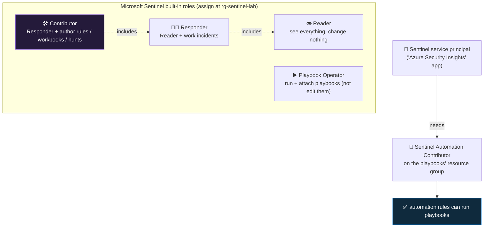

<div align="center">

# 🧱 Step 05 · RBAC and roles

### *Assign the four Sentinel roles the way a real SOC would — and prove the boundary holds*

[](../README.md)
[](#)
[](#)

</div>

---

## 🎯 Goal

Two test identities exist — one "analyst", one "engineer" — each holding the *narrowest* built-in
Sentinel role that lets them do their job, assigned at the **resource-group** scope, and you have
signed in as the analyst and confirmed they **cannot** create or disable a detection. The Sentinel
service principal has the one grant it needs to run playbooks.

## 🧠 Why this step

A SIEM concentrates the most sensitive data in the organisation — every sign-in, every command run
on every server, every privileged role change — into one queryable place. Who can read that, who can
change what fires an alert, and who can trigger an automated response that disables a user or
isolates a machine are three different questions with three different answers. If everyone who
touches Sentinel uses `Owner`, you never see those seams, and the day an analyst account is phished
the attacker inherits the ability to turn your detections off.

The specific failure this step prevents is **silent detection tampering**. `Microsoft Sentinel
Responder` lets an analyst work incidents — assign, triage, comment, close — but not touch the rules
that generate them. `Microsoft Sentinel Contributor` lets a detection engineer write and disable
rules. Collapse those two into one role "to be safe" and any analyst (or anything running as one)
can disable the rule that would have caught the next intrusion, and nothing about that action looks
alarming. Least privilege here is not bureaucracy; it is the control that keeps your detections
trustworthy.

What teams get wrong: they assign Sentinel roles at **subscription** scope because that is where the
IAM blade opens by default, which quietly grants those permissions on every future workspace and
resource in the subscription. They forget the separate **playbook-permissions** grant and then every
playbook attached to a rule fails at run time with an authorization error that is hard to trace.
And they run day-to-day work as `Owner`, so they never learn which specific role a task needs — until
they try to hand the task to someone junior and cannot scope it.

Microsoft designed Sentinel RBAC as a thin layer of function-specific roles *on top of* Azure RBAC
and Log Analytics RBAC, precisely so a SOC can grant "work incidents" without granting "read every
raw log" or "change Azure resources". The cost of that design is that a working setup usually needs
**two or three** role assignments per person plus one service-principal grant, not one — and the
product will let you skip straight past that with a single `Contributor`.

## ✅ Prerequisites

- [Step 02](../02-enable-sentinel/README.md) — Sentinel enabled on `law-sentinel-lab`. The Sentinel
  roles only mean anything once the `Microsoft.SecurityInsights` solution is on the workspace.
- **`Owner` or `User Access Administrator` on `rg-sentinel-lab`** — creating role assignments is
  itself a privileged action (`Microsoft.Authorization/roleAssignments/write`). Plain `Contributor`
  **cannot** grant roles. Your step-00 account, if it is subscription Owner, is fine.
- Ability to **create test users** in your tenant, or invite external guests. Needs at least
  *User Administrator* in Entra, or a tenant that allows guest invites. No licences required — a
  member user with no licence can hold Azure RBAC roles.

## 🧭 Concepts

Three RBAC systems stack here. **Azure RBAC** controls the ARM control plane — creating rules,
connectors, playbooks, and reading workspace *configuration*. **Log Analytics RBAC** (a facet of
Azure RBAC plus the workspace access mode) controls who can run KQL and see *log data*. **Sentinel's
own built-in roles** are curated bundles of the first two, named by SOC function. You assign Azure
role assignments (`Microsoft.Authorization/roleAssignments`) at a scope — resource, resource group,
subscription, or management group — and they inherit downward.



**Reading the diagram:** the three "seeing/working" roles are nested — Contributor contains
Responder contains Reader — so you assign one, not three, for a person in that lane. **Playbook
Operator** is *orthogonal*: it is the permission to trigger response, granted separately to whoever
needs it (often an analyst who otherwise only has Responder). The bottom branch is the piece nothing
tells you about until it breaks: **Sentinel itself** (a first-party service principal named
*Azure Security Insights* in your tenant) needs **Microsoft Sentinel Automation Contributor** on the
resource group that holds your playbooks, or an automation rule cannot invoke them. The portal
prompts you to grant this once, on the **Settings → Playbook permissions** panel.

### The four built-in roles in detail

| Role | Can do | Cannot do | Typical holder |
|---|---|---|---|
| **Microsoft Sentinel Reader** | View incidents, alerts, bookmarks, workbooks, analytics rules, hunting queries, and run Log queries in the workspace | Modify anything; run or attach playbooks | Auditors, managers, on-call leads who only observe |
| **Microsoft Sentinel Responder** | Everything Reader can, **plus** manage incidents — assign owner, change status/severity/classification, add comments and tasks, create bookmarks | Create, edit, enable, or disable analytics rules; change automation | Tier-1 / Tier-2 analysts |
| **Microsoft Sentinel Contributor** | Everything Responder can, **plus** create/edit/delete analytics rules, workbooks, hunting queries, watchlists, and automation rules; install Content hub solutions | Assign roles (workspace RBAC); change workspace pricing/retention; edit the Logic App code of a playbook | Detection engineers, content owners |
| **Microsoft Sentinel Playbook Operator** | List, view, and **run** playbooks; attach a playbook to an analytics or automation rule | Create or edit the playbook (Logic App) itself; that needs `Logic App Contributor` | Analysts who need to trigger enrichment/response on demand |

Vocabulary:

| Term | Meaning |
|---|---|
| **Scope** | The level a role assignment applies at — resource / resource group / subscription / management group. Lower is safer. Everything here is assigned at `rg-sentinel-lab`. |
| **Sentinel service principal** | The first-party app *Azure Security Insights* (well-known app ID `98785600-1bb7-4fb9-b9fa-19afe2c8a360`) that Sentinel's backend runs as. Automation rules invoke playbooks *as* this principal. |
| **Microsoft Sentinel Automation Contributor** | A role assignable **only** to the Sentinel service principal, on a resource group, that lets Sentinel run the playbooks in it. You do not assign this to people. |
| **Resource-context RBAC** | The workspace mode (`enableLogAccessUsingOnlyResourcePermissions` from [step 01](../01-log-analytics-workspace/README.md)) where someone with read access to an Azure *resource* can query that resource's rows without any workspace role. |
| **Table-level RBAC** | A custom role that grants/denies read on specific Log Analytics tables — used to hide a sensitive table (e.g. `SigninLogs`) from a group that otherwise has workspace read. |

### Where this fits

This is the last foundational gate before data starts flowing in [step 07](../07-connectors-and-content-hub/README.md). Getting roles right now means that when you build playbooks in
[steps 30–38](../30-first-playbook-notify/README.md) the permissions model is already in place, and
the analyst-vs-engineer split you set here is the same split the whole path assumes — analysts *work*
incidents (phase 🔄, phase 🏹 triage), engineers *build* detections (phase 🔍). At MSSP / multi-tenant
scale ([step 54](../54-multi-tenant-and-lighthouse/README.md)) these same roles are delegated across
tenants via Azure Lighthouse rather than assigned directly.

### Design rationale

Sentinel roles are function-named (Reader/Responder/Contributor) rather than object-named because a
SOC's access model maps to *what people do* — observe, respond, engineer — not to Azure resource
types. Playbook Operator is split out because "may pull the trigger on an automated response" is a
trust decision independent of seniority, and Automation Contributor is service-principal-only because
the thing that runs a playbook on a schedule is Sentinel's backend, not a person.

## 🖱️ Do it — portal

1. **Create two test users.** Entra admin center → **Identity → Users → All users → New user →
   Create new user**. Make `analyst1@<your-tenant>.onmicrosoft.com` and
   `engineer1@<your-tenant>.onmicrosoft.com`. No roles, no group, no licence. Set a password you
   record. *(Lab: two users is enough. Production: you assign the role to a **group**, never
   individuals, so joiners/leavers are handled by group membership.)*
2. **Assign the analyst's roles.** Portal → **Resource groups → rg-sentinel-lab → Access control
   (IAM) → Add → Add role assignment**:
   - Role tab: search **Microsoft Sentinel Responder** → Next → **Members → Select members** →
     `analyst1` → Select → Review + assign.
   - Repeat: **Microsoft Sentinel Playbook Operator** → `analyst1`.
   - After each assignment you land back on the IAM **Role assignments** tab and see the new row.
3. **Assign the engineer's role.** Same flow: **Microsoft Sentinel Contributor** → `engineer1`.
4. **Grant Sentinel permission to run playbooks.** Open Sentinel (Defender portal
   `security.microsoft.com` → Microsoft Sentinel, or the Azure portal) → **Configuration → Settings
   → Settings tab → Playbook permissions → Configure permissions** → tick `rg-sentinel-lab` →
   **Apply**. This creates the **Microsoft Sentinel Automation Contributor** assignment for the
   Sentinel service principal on that resource group. *(You only have playbooks from
   [step 30](../30-first-playbook-notify/README.md) onward, but granting it now means they work the
   moment you build them.)*
5. **(Optional, production-minded) hide a sensitive table.** IAM → custom role, or **Settings →
   workspace → Table-level RBAC**, to deny `SigninLogs` read to a group. Skip in the lab; know it
   exists.

## 💻 Do it — CLI / IaC

```bash
RG=$(az group show -n rg-sentinel-lab --query id -o tsv)                 # resource-group ARM ID = the scope
ANALYST=$(az ad user show --id analyst1@YOURTENANT.onmicrosoft.com --query id -o tsv)   # object ID, not UPN
ENGINEER=$(az ad user show --id engineer1@YOURTENANT.onmicrosoft.com --query id -o tsv)

# role assignments are idempotent by (assignee, role, scope) — re-running is safe, it warns "already exists"
az role assignment create --assignee "$ANALYST"  --role "Microsoft Sentinel Responder"         --scope "$RG"
az role assignment create --assignee "$ANALYST"  --role "Microsoft Sentinel Playbook Operator" --scope "$RG"
az role assignment create --assignee "$ENGINEER" --role "Microsoft Sentinel Contributor"       --scope "$RG"

# grant the Sentinel service principal Automation Contributor on the playbooks' RG
SENTINEL_SP=$(az ad sp show --id 98785600-1bb7-4fb9-b9fa-19afe2c8a360 --query id -o tsv)  # 'Azure Security Insights' first-party app
az role assignment create --assignee-object-id "$SENTINEL_SP" --assignee-principal-type ServicePrincipal \
  --role "Microsoft Sentinel Automation Contributor" --scope "$RG"
```

> If `az ad sp show` for the well-known ID returns nothing, the service principal is not yet
> provisioned in your tenant — open the Sentinel **Automation** blade once (that triggers creation),
> or use the portal **Playbook permissions** button which handles it for you.

<details><summary>Bicep — assign a Sentinel role to a group</summary>

```bicep
param principalId string          // group (or user) object ID
param roleName string = 'Microsoft Sentinel Responder'

// resolve the role definition by name at deploy time — avoids hardcoding a GUID that may drift
resource roleDef 'Microsoft.Authorization/roleDefinitions@2022-05-01-preview' existing = {
  scope: tenant()
  name: guid('roleDefName', roleName)   // placeholder — see note; prefer the built-in role reference below
}

resource ra 'Microsoft.Authorization/roleAssignments@2022-04-01' = {
  name: guid(resourceGroup().id, principalId, roleName)   // deterministic name → idempotent redeploy
  properties: {
    roleDefinitionId: subscriptionResourceId('Microsoft.Authorization/roleDefinitions', '<role-definition-guid>')
    principalId: principalId
    principalType: 'Group'
  }
}
```

In practice, look up the current role-definition GUIDs with
`az role definition list --name "Microsoft Sentinel Responder" --query "[0].name" -o tsv` and paste
the value into `roleDefinitionId`. Do not trust a GUID copied from a blog — Microsoft adds and
renames Sentinel roles over time. The authoritative list is the
[Sentinel roles doc](https://learn.microsoft.com/en-us/azure/sentinel/roles).
</details>

## 🧪 Validate

```bash
az role assignment list --scope "$RG" --include-inherited \
  --query "[?contains(roleDefinitionName, 'Sentinel')].{who:principalName, type:principalType, role:roleDefinitionName, scope:scope}" -o table
```

Read the output:

| Column | Healthy value |
|---|---|
| `who` | your two test UPNs, plus (for Automation Contributor) a GUID or `Azure Security Insights` |
| `type` | `User` for the two people, `ServicePrincipal` for the Automation Contributor row |
| `role` | exactly `Microsoft Sentinel Responder` + `... Playbook Operator` for analyst1; `... Contributor` for engineer1; `... Automation Contributor` for the SP |
| `scope` | ends in `/resourceGroups/rg-sentinel-lab` — **not** `/subscriptions/<id>` with nothing after |

Then **sign in as `analyst1`** in a private/incognito window and confirm the boundary:

- ✅ Can open **Incidents**, open one, change its **status** and **owner**, add a comment. *(Nothing
  to work yet — that's fine; the point is the buttons are enabled.)*
- ❌ **Analytics → + Create** is disabled, or clicking a rule → **Edit** → **Save** returns
  *"does not have authorization to perform action 'Microsoft.SecurityInsights/alertRules/write'"*.
- ❌ **Analytics →** an existing rule **→ Disable** fails the same way.
- ✅ Once playbooks exist (step 30): the incident **Actions → Run playbook** menu is available.

**You should see** the analyst able to *work* incidents and *trigger* playbooks but unable to
*author or disable* detections. Sign in as `engineer1` and confirm the mirror image — can create a
rule, cannot open **Access control (IAM) → Add role assignment** (that needs Owner/UAA).

A second angle — check what a role *actually* grants:

```bash
az role definition list --name "Microsoft Sentinel Responder" \
  --query "[0].permissions[0].{actions:actions, notActions:notActions}" -o json
```

You will see `Microsoft.SecurityInsights/incidents/*` in `actions` but **no** `alertRules/write` —
that absence is the analyst/engineer boundary, expressed as data.

## 🚩 Common mistakes

| 🚩 Mistake | Why it bites |
|---|---|
| Giving analysts `Contributor` "to be safe" | They can now silently disable the rule that catches the next breach — and it looks like a normal action |
| Assigning roles at **subscription** scope | Grants Sentinel permissions on every current and future resource in the sub, not just the lab |
| Assigning to individuals, not groups | Every joiner/leaver is a manual IAM edit; access drifts and is never reviewed |
| Forgetting the **Playbook permissions** grant | Automation rules that call a playbook fail at run time with an opaque authorization error |
| Assuming `Contributor` can read all log *data* | It can read Sentinel objects and run queries, but table-level RBAC or a locked-down workspace mode can still hide specific tables |
| Using `Owner` for daily work | You never learn which role a task needs, so you can't delegate it safely |
| Granting `Logic App Contributor` to analysts so they can "fix" playbooks | Now an analyst can rewrite an automated-response playbook — that is an engineer/CI concern ([step 38](../38-playbooks-as-code/README.md)) |

## 🩺 Troubleshooting

| Symptom | Likely cause | Fix |
|---|---|---|
| `az role assignment create` → *"does not have authorization to perform action 'Microsoft.Authorization/roleAssignments/write'"* | Your account is `Contributor`, not `Owner`/`User Access Administrator` | Have a subscription Owner run it, or get `User Access Administrator` on `rg-sentinel-lab` |
| Role assignment succeeds but the user still can't do the thing | RBAC propagation delay (usually seconds, up to ~30 min for token refresh) | Have the user sign out and back in; wait; check `az role assignment list` shows the row |
| Analyst **can** create rules despite only having Responder | They also inherit `Contributor`/`Owner` from a higher scope (subscription or management group) | `az role assignment list --assignee <id> --all` — find and remove the broad grant, or move the lab to a clean subscription |
| Playbook attached to a rule fails: *"The client ... does not have authorization ... 'Microsoft.Logic/workflows/triggers/.../run'"* | The Sentinel service principal lacks Automation Contributor on the playbook's RG | **Settings → Playbook permissions → Configure permissions** for that RG, or the `az role assignment` for the SP above |
| `az ad sp show --id 98785600-...` returns nothing | Sentinel service principal not provisioned in the tenant yet | Open the Sentinel **Automation** blade once, or use the portal Playbook permissions button |
| Analyst can't see the **Logs** blade data at all | Workspace is in *resource-permissions-only* mode and the analyst has no workspace data-read role | Add `Microsoft Sentinel Reader` (or `Log Analytics Reader`) at the RG/workspace scope |
| Custom "table-level" role isn't hiding a table | `notActions` on the deny role is overridden by an `actions: ["*"]` grant elsewhere | Azure RBAC has no explicit deny for data actions here — remove the broad grant; table RBAC only works when it is the *only* read grant |

## 🎓 Deepen your understanding

1. Run `az role definition list --custom-role-only false --query "[?contains(roleName,'Sentinel')].roleName" -o tsv`. How many Sentinel roles exist today versus the four here? What does *Microsoft Sentinel Automation Contributor* not let a human do, and why is it SP-only?
2. Assign yourself only `Microsoft Sentinel Reader` at the RG scope in a second test account (remove any inherited Contributor). Try to close an incident. Which exact `notActions` entry blocks you?
3. The analyst has **Playbook Operator** but **not** `Logic App Contributor`. They run a playbook that fails. Can they open its **run history** to see *why*? Try it once you have a playbook — what do they see and not see?
4. Draw the difference between *"can read the SigninLogs table"* and *"can open the Sentinel Incidents blade"*. Which built-in role gives each? Could someone have one without the other?
5. In a real MSSP, analysts sit in a *different tenant* from the customer's Sentinel. Which of these four roles would be delegated via Azure Lighthouse, and would you ever delegate `Owner`? (Full treatment in [step 54](../54-multi-tenant-and-lighthouse/README.md).)

## 🗒️ Log your run

Copy [`_templates/STEP-LOG-TEMPLATE.md`](../_templates/STEP-LOG-TEMPLATE.md) into this folder as
`LOG.md`. Record: the `az role assignment list` output with **UPNs redacted**, a screenshot of the
analyst hitting the blocked **Analytics → Create**, and confirmation the Playbook permissions grant
went through. Note whether you assigned to users (lab) or groups (production pattern).

## 📚 Microsoft Learn

- [Roles and permissions in Microsoft Sentinel](https://learn.microsoft.com/en-us/azure/sentinel/roles)
- [Manage access to Microsoft Sentinel data by resource (resource-context RBAC)](https://learn.microsoft.com/en-us/azure/sentinel/resource-context-rbac)
- [Custom roles and advanced Azure RBAC for Microsoft Sentinel](https://learn.microsoft.com/en-us/azure/sentinel/roles#custom-roles-and-advanced-azure-rbac)
- [Grant Microsoft Sentinel permission to run playbooks](https://learn.microsoft.com/en-us/azure/sentinel/tutorial-respond-threats-playbook#respond-to-incidents)
- [Azure RBAC: assign roles using the portal](https://learn.microsoft.com/en-us/azure/role-based-access-control/role-assignments-portal)

---

<div align="center">
<sub>

[⬅ Prev: 04 · KQL survival kit](../04-kql-survival-kit/README.md) &nbsp;·&nbsp; [🦅 All steps](../README.md) &nbsp;·&nbsp; [Next: 06 · Cost model and budget ➡](../06-cost-model-and-budget/README.md)

</sub>
</div>
