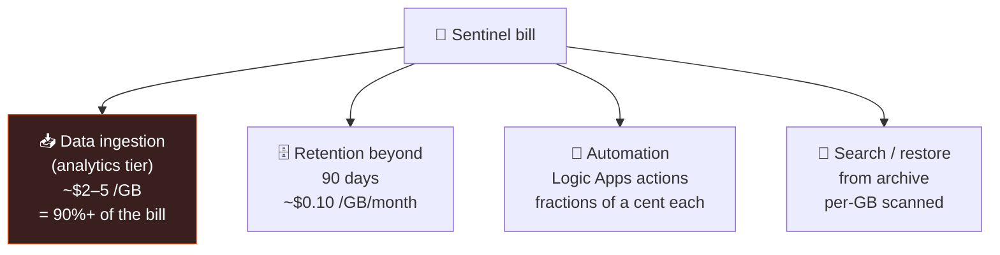

<div align="center">

# 🧱 Step 06 · Cost model & budget

### *Know what drives the Sentinel bill, and put a tripwire on it*

[](../README.md)
[](#)
[](#)

</div>

---

## 🎯 Goal

You can explain every line of a Sentinel bill, and you have a budget alert that emails you at 50%,
80% and 100% of a monthly cap you set.

## 🧠 Why this step

Sentinel has no fixed monthly fee. The bill is **almost entirely data ingestion** — GB/day into
analytics-tier tables — plus a little retention and automation. A single chatty connector or a
verbose VM can quietly 10x your ingest. The free tier hides this for ~31 days, then it doesn't.

## ✅ Prerequisites

- [Step 02](../02-enable-sentinel/README.md) — Sentinel enabled

## 🧭 What actually costs money



Levers you'll pull later:

| Lever | Step | Effect |
|---|---|---|
| Don't enable Sentinel on a shared workspace | `02` | Avoids Sentinel-rate pricing on app logs |
| Basic / Auxiliary logs tier for high-volume, low-value tables | `16`, `56` | ~1/5 the ingest price |
| DCR transformations that drop noise columns/rows at ingest | `13` | You pay for what lands, not what was sent |
| Commitment tiers | `56` | Discount above ~100 GB/day |
| Free data connectors (Activity, Entra audit via some paths, XDR alerts) | `08`–`10` | Some Microsoft sources are ingestion-free |

## 🖱️ Do it — portal

1. **Microsoft Sentinel → Settings → Usage and estimated costs** — read the projection. It's near
   zero now; that's your baseline.
2. **Subscriptions → sub-sentinel-lab → Budgets → Add**:
   - Name `budget-sentinel-lab`, reset monthly, amount **`15` USD** (adjust to your comfort).
   - Alert conditions: **50%**, **80%**, **100%** of budget → your email.
3. **Cost Management → Cost analysis** — set the scope to `rg-sentinel-lab`, group by
   **Meter category**, save the view as `sentinel-lab-daily`.

## 💻 Do it — CLI

```bash
SUB=$(az account show --query id -o tsv)
az consumption budget create \
  --budget-name budget-sentinel-lab \
  --amount 15 --category cost --time-grain Monthly \
  --start-date $(date +%Y-%m-01) --end-date 2027-12-31 \
  --resource-group rg-sentinel-lab \
  --notifications '{
     "act50":{"enabled":true,"operator":"GreaterThanOrEqualTo","threshold":50,"contactEmails":["you@example.com"]},
     "act80":{"enabled":true,"operator":"GreaterThanOrEqualTo","threshold":80,"contactEmails":["you@example.com"]},
     "act100":{"enabled":true,"operator":"GreaterThanOrEqualTo","threshold":100,"contactEmails":["you@example.com"]}
  }'
```

## 🧪 Validate

```bash
az consumption budget show --budget-name budget-sentinel-lab -g rg-sentinel-lab \
  --query "{name:name, amount:amount, grain:timeGrain, alerts:keys(notifications)}" -o table
```

Then in **Logs**, project your ingest cost:

```kusto
Usage
| where TimeGenerated > ago(31d) and IsBillable == true
| summarize BillableGB = sum(Quantity)/1000 by bin(TimeGenerated, 1d)
| extend EstUSD = BillableGB * 2.30   // approx analytics-tier rate; check your region
| render columnchart
```

**You should see** the budget returned with three notification keys, and the ingest chart at or
near zero. Re-run the ingest query after every onboarding step in phase 📥 — it is your early
warning.

## 🚩 Common mistakes

| 🚩 Mistake | Why it bites |
|---|---|
| Trusting the free tier to last | It's time-boxed (~31 days) and capped per day |
| Connecting a Windows VM with "All Events" | Security event volume explodes ingest — step `11` uses a curated set |
| No budget until "later" | The alert that matters is the one set *before* the spend |
| Reading only monthly cost | Daily granularity catches a runaway connector in hours, not weeks |
| Leaving a lab VM running between sessions | Compute + its ingestion bill you around the clock |

## 🗒️ Log your run

`LOG.md` — your chosen cap, the budget confirmation, and today's `BillableGB` baseline.

## 📚 Microsoft Learn

- [Plan costs for Microsoft Sentinel](https://learn.microsoft.com/en-us/azure/sentinel/billing)
- [Reduce costs for Microsoft Sentinel](https://learn.microsoft.com/en-us/azure/sentinel/billing-reduce-costs)
- [Create and manage Azure budgets](https://learn.microsoft.com/en-us/azure/cost-management-billing/costs/tutorial-acm-create-budgets)

---

<div align="center">
<sub>

[⬅ Prev: 05 · RBAC and roles](../05-rbac-and-roles/README.md) &nbsp;·&nbsp; [🦅 All steps](../README.md) &nbsp;·&nbsp; [Next: 07 · Connectors & Content hub ➡](../07-connectors-and-content-hub/README.md)

</sub>
</div>
