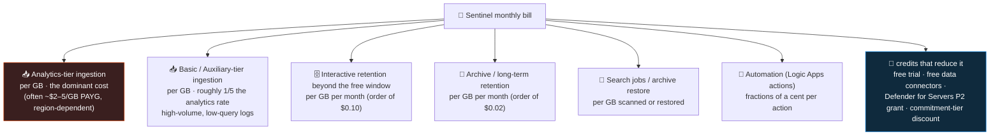

<div align="center">

# 🧱 Step 06 · Cost model & budget

### *Understand every line of a Sentinel bill, then put a tripwire on it before any resource meters*

[](../README.md)
[](#)
[](#)

</div>

---

## 🎯 Goal

You can name what each meter on a Sentinel bill is and roughly what it costs, you have a **budget
with alert thresholds at 50 / 80 / 100%** on the lab subscription that emails you, and you have run
the `Usage` query that will be your daily ingest-volume tripwire for the rest of the path.

## 🧠 Why this step

Sentinel has **no fixed subscription fee**. You pay for what you ingest and keep. That is a good
model — a small lab costs almost nothing — but it has a sharp edge: the cost is driven by data
volume, and data volume is easy to accidentally multiply. Turn on the Windows Security Events
connector with the *All events* profile instead of *Common* and one VM can push several GB/day.
Connect a verbose firewall via CEF with no facility filter and you double your bill overnight. Enable
Sentinel on a workspace that already carries application logs and **every** gigabyte in it — not just
the security data — gets re-priced at the Sentinel rate.

None of that produces an error. It produces an invoice, four weeks later, after the free trial has
ended. The number-one reason self-run Sentinel labs get abandoned is a surprise bill that the person
never saw coming because they were watching *monthly* cost in a portal they checked once a week.

The defensive move is boring and effective: set a **budget with alerts before you create anything
that meters**, and learn to read the `Usage` table so you can see a runaway connector within hours.
This step also front-loads the cost *levers* — which tiers, filters, and free sources exist — so
that when a later step offers you a choice ("All events or Common?", "Analytics or Basic tier?") you
already know which answer keeps the bill flat.

In the attack-vs-defense picture cost is not a side concern: a SOC that cannot afford to ingest a
log source is **blind** to whatever that source would have shown. Cost engineering
([step 56](../56-cost-engineering/README.md)) is how you keep the lights on for the data that
matters. This step is the beginner version of that discipline.

## ✅ Prerequisites

- [Step 02](../02-enable-sentinel/README.md) — Sentinel enabled, so **Settings → Usage and estimated
  costs** exists and the `Usage` table is populated.
- **`Cost Management Contributor`** (or `Owner`) on the lab subscription — creating a budget writes
  `Microsoft.Consumption/budgets`. `Contributor` on the resource group is not enough for a
  subscription-scoped budget.
- An email address you actually read, for the alert action.

## 🧭 Concepts

Sentinel billing has historically been **two meters that add up**: the Log Analytics *data
ingestion* charge (per GB landed in the workspace) **plus** the Microsoft Sentinel *analysis* charge
(per GB of that data that Sentinel analyses). Microsoft has since introduced a **simplified pricing
experience** that merges them into a single per-GB line item. Whichever model your workspace is on,
the practical rule is the same: **~90%+ of the bill is GB ingested into analytics-tier tables**, and
everything else is rounding.



**Reading the diagram:** the red box is where your money goes — GB/day into normal (analytics-tier)
tables. Every other cost branch is small in a lab: retention only starts charging after the free
window, archive and search are pay-per-use and you rarely touch them, and automation actions are so
cheap you can ignore them until you run playbooks at scale ([step 39](../39-monitoring-playbook-runs-and-cost/README.md)). The blue box is the set of discounts you deliberately steer toward in later
steps. Your job in a lab is to keep the red box near zero by connecting sources one at a time and
watching the `Usage` chart.

### How it works under the hood

- **The `Usage` table** is written by the platform roughly hourly. Each row is
  `(TimeGenerated, DataType, Quantity, QuantityUnit, IsBillable, ...)` where `DataType` is the table
  name, `Quantity` is in **MB** (`QuantityUnit == "MBytes"`), and `IsBillable` says whether that
  slice counts toward the bill. `_BilledSize` (bytes) on the raw tables themselves is the
  per-record billed size. Divide `Quantity` by 1000 for GB (Microsoft's billing uses the decimal
  1000, not 1024 — their own sample queries do this).
- **Free data connectors**: some Microsoft first-party sources are **ingestion-free**. Azure Activity
  (`AzureActivity`, from [step 08](../08-azure-activity/README.md)) is the clearest example, along
  with security **alerts** from Microsoft Defender XDR and Microsoft Defender for Cloud. The full,
  current list is on the pricing/billing docs — treat "is this source free?" as something to check
  per connector, not assume.
- **The free trial**: enabling Sentinel on a new workspace starts a time-boxed trial (historically
  **31 days**, up to **10 GB/day** of Sentinel analysis free, stacked on the Log Analytics free
  ingestion grant). After it ends, ingestion bills from the first GB. Verify the current terms on
  the pricing page — Microsoft changes them.
- **Defender for Servers Plan 2** grants a **500 MB/day per protected node** allowance for a defined
  set of security data types — relevant once you have VMs (steps 11–12) with that plan.
- **Commitment (capacity reservation) tiers**: pre-commit to 100 / 200 / 300 / … GB/day and get a
  discount (roughly 15–65%, rising with the tier) versus pay-as-you-go. Below ~100 GB/day there is
  no tier to buy; you stay PAYG. This is a [step 56](../56-cost-engineering/README.md) decision.
- **Budgets** are a Cost Management construct (`Microsoft.Consumption/budgets`). They do **not** cap
  or stop spending — they evaluate actual (and optionally forecasted) cost against your amount on a
  schedule and fire **action** notifications (email, or an action group for webhook/Logic App) when
  a threshold is crossed. The stop-spending lever is you, reacting to the alert.

### Vocabulary

| Term | Meaning |
|---|---|
| **Analytics tier** | The default table plan — full KQL, drives analytics rules, full price. |
| **Basic / Auxiliary tier** | Cheaper table plans (~1/5 the ingest price) with limited query and no scheduled analytics rules. [Step 16](../16-retention-archive-and-data-lake/README.md). |
| **`IsBillable`** | `Usage`-table boolean: `false` slices (free connectors, some system data) don't count toward the bill. |
| **Interactive retention** | The window where data is instantly KQL-queryable. First 90 days free with Sentinel; then per-GB/month. |
| **Archive tier** | Cheap cold storage past interactive retention; queried via a *search job* or *restore*, both pay-per-use. |
| **Commitment tier** | A daily-GB capacity reservation bought for a discount vs pay-as-you-go. |
| **Budget** | A Cost Management alerting rule — notifies at % thresholds; never blocks spend. |

### Where this fits

This is the last foundational step. From [step 07](../07-connectors-and-content-hub/README.md)
onward, every connector you add moves the `Usage` needle, and every hunt/rule step assumes you are
watching it. The levers introduced here get their full treatment in
[step 16](../16-retention-archive-and-data-lake/README.md) (per-table tiering and retention) and
[step 56](../56-cost-engineering/README.md) (commitment tiers, ingest-time filtering, the full
reduction playbook).

### Cost levers, and where you pull them

| Lever | Step | Effect |
|---|---|---|
| Keep Sentinel on a **dedicated** workspace | `02` | Application/infra logs aren't re-priced at the Sentinel rate |
| Use the **Common** (not All) Windows event profile | `11` | An order of magnitude less `SecurityEvent` volume |
| Filter syslog/CEF by **facility and severity** in the DCR | `12` | Drops the chatty, low-value majority before it lands |
| **DCR ingest-time transformations** (drop rows/columns) | `13` | You pay for what lands, not what was sent |
| **Basic / Auxiliary** tier for high-volume, rarely-queried tables | `16`, `56` | ~1/5 the analytics ingest price |
| Short **interactive retention** + long **archive** retention | `16` | Cheap long-term keep for compliance without full-price storage |
| Prefer **free data connectors** where they exist | `08`, `10` | Azure Activity and Defender alert ingestion at no charge |
| **Commitment tier** once volume is stable and ≥ ~100 GB/day | `56` | 15–65% discount vs pay-as-you-go |

## 🖱️ Do it — portal

1. **Read the baseline.** Sentinel → **Configuration → Settings → Usage and estimated costs**
   (in the Defender portal it is under Sentinel's Settings; in the Azure portal, Sentinel → Settings
   → *Usage and estimated costs* tab). It shows current tier, a 31-day ingestion chart, and a
   projected monthly cost. Right now it is at or near **$0** — screenshot it; that is your "before".
2. **Create the budget.** Portal → **Subscriptions → sub-sentinel-lab → Budgets → + Add** (or
   **Cost Management → Budgets → + Add**):
   - **Scope**: the subscription (or scope to `rg-sentinel-lab` if you want lab-only).
   - **Name** `budget-sentinel-lab`, **Reset period** Monthly, **Creation date** this month,
     **Expiration date** a year out.
   - **Amount**: `15` USD (raise if your comfort is higher; the point is a number that is *low
     enough to notice a runaway*).
   - **Alert conditions**: add three — **Actual** cost ≥ **50%**, ≥ **80%**, ≥ **100%** of budget.
     Optionally add a **Forecasted** ≥ 100% alert to get warned before you actually cross it.
   - **Alert recipients**: your email. (Production: point at an **action group** so alerts can page
     or trigger a Logic App.)
3. **Save a daily cost view.** **Cost Management → Cost analysis** → set scope to `rg-sentinel-lab`
   → **Granularity: Daily** → **Group by: Meter category** → **Save** as `sentinel-lab-daily`. This
   is the view you glance at after each onboarding step.

## 💻 Do it — CLI / IaC

```bash
SUB=$(az account show --query id -o tsv)
START=$(date +%Y-%m-01)      # first of the current month; budgets must start on the 1st

# budget is idempotent by name+scope — re-running updates it
az consumption budget create \
  --budget-name budget-sentinel-lab \
  --amount 15 \
  --category cost \
  --time-grain Monthly \
  --start-date "$START" --end-date 2027-12-31 \
  --resource-group rg-sentinel-lab \
  --notifications '{
     "actual50":  {"enabled":true,"operator":"GreaterThanOrEqualTo","threshold":50, "contactEmails":["you@example.com"]},
     "actual80":  {"enabled":true,"operator":"GreaterThanOrEqualTo","threshold":80, "contactEmails":["you@example.com"]},
     "actual100": {"enabled":true,"operator":"GreaterThanOrEqualTo","threshold":100,"contactEmails":["you@example.com"]}
  }'
```

> `--resource-group` scopes the budget to the RG. Drop it and pass a subscription scope for a
> whole-subscription budget. Forecast-based thresholds need the `thresholdType` field
> (`Forecasted`) which the CLI supports on newer versions — check `az consumption budget create -h`.

<details><summary>Bicep — subscription-scoped budget</summary>

```bicep
targetScope = 'subscription'
param contactEmail string

resource budget 'Microsoft.Consumption/budgets@2023-11-01' = {
  name: 'budget-sentinel-lab'
  properties: {
    category: 'Cost'
    amount: 15
    timeGrain: 'Monthly'
    timePeriod: { startDate: '2026-09-01T00:00:00Z' }   // must be first of a month
    notifications: {
      actual80:  { enabled: true, operator: 'GreaterThanOrEqualTo', threshold: 80,  contactEmails: [ contactEmail ], thresholdType: 'Actual' }
      actual100: { enabled: true, operator: 'GreaterThanOrEqualTo', threshold: 100, contactEmails: [ contactEmail ], thresholdType: 'Actual' }
      forecast100:{ enabled: true, operator: 'GreaterThanOrEqualTo', threshold: 100, contactEmails: [ contactEmail ], thresholdType: 'Forecasted' }
    }
  }
}
```
</details>

## 🧪 Validate

```bash
az consumption budget show --budget-name budget-sentinel-lab -g rg-sentinel-lab \
  --query "{name:name, amount:amount, grain:timeGrain, thresholds:keys(notifications)}" -o table
```

| Field | Healthy value |
|---|---|
| `amount` | your cap (`15.0`) |
| `grain` | `Monthly` |
| `thresholds` | three (or four) keys — one per alert condition you added |

Then in **Logs**, run the ingest-volume tripwire — this is the query you re-run after **every**
step in phase 📥:

```kusto
Usage
| where TimeGenerated > ago(31d) and IsBillable == true
| summarize BillableMB = sum(Quantity) by DataType
| extend BillableGB = round(BillableMB / 1000, 3)
| project DataType, BillableGB
| sort by BillableGB desc
```

```kusto
// daily trend — a runaway connector shows up as a rising step here within hours
Usage
| where TimeGenerated > ago(14d) and IsBillable == true
| summarize GB = sum(Quantity) / 1000 by bin(TimeGenerated, 1d)
| extend EstUSD_analytics = round(GB * 2.30, 2)   // rough PAYG analytics rate — confirm your region's price
| render columnchart
```

**You should see** the budget returned with its thresholds, and both `Usage` queries near **zero**
(a fresh workspace has only tiny internal `Usage`/`Operation` volume, often not even billable). If
`Usage` is empty, the workspace has had no activity yet — that is fine; it fills within a few hours.
The moment a connected source appears in the first query with a non-trivial `BillableGB`, you have
your answer about what that source costs.

A third angle — the portal projection:

**Settings → Usage and estimated costs** should show a projected monthly cost near $0 and your
current pricing tier as **Pay-as-you-go**. If it shows a commitment tier, someone selected one —
revert it (there is no reason for a tier in a lab).

## 🚩 Common mistakes

| 🚩 Mistake | Why it bites |
|---|---|
| Trusting the free trial to last | It is time-boxed (~31 days) and daily-capped; ingestion bills from GB 1 after it ends |
| Setting the budget "later" | The alert that matters is the one that exists *before* the spend that trips it |
| Watching only **monthly** cost | A runaway connector adds up in hours; you need **daily** granularity to catch it |
| Connecting a Windows VM with the **All events** profile | `SecurityEvent` volume explodes — [step 11](../11-windows-vm-ama-dcr/README.md) uses the Common set for this reason |
| Leaving a lab VM running between sessions | Compute **and** its log ingestion bill around the clock — use auto-shutdown |
| Assuming a budget blocks spending | It only notifies; nothing stops until you act on the alert |
| Reading `Quantity` as GB | It is **MB** — divide by 1000 |
| Enabling Sentinel on a shared workspace to "save a workspace" | Re-prices all of that workspace's ingestion at the Sentinel rate — far more expensive |

## 🩺 Troubleshooting

| Symptom | Likely cause | Fix |
|---|---|---|
| `az consumption budget create` → *authorization failed* | Account lacks `Cost Management Contributor` at the scope | Get the role at the subscription (for a sub budget) or RG scope; or have an Owner run it |
| Budget created but no alert email ever arrives | Threshold not crossed yet (expected in a $0 lab), or the address is wrong / filtered | Verify with `az consumption budget show`; temporarily set a tiny amount (e.g. `1`) to force an alert, then reset |
| `Usage` query returns nothing | Workspace has had no billable activity yet, or you are inside the ingestion-lag window | Wait a few hours; run any query or connect a source, then re-check |
| `Usage` shows a large `DataType` you didn't expect | A connector or agent is sending more than planned (often `SecurityEvent`, `CommonSecurityLog`, or a `*_CL`) | Open that source's DCR/connector and tighten the filter ([steps 11–13](../11-windows-vm-ama-dcr/README.md)); consider Basic tier ([step 16](../16-retention-archive-and-data-lake/README.md)) |
| Portal "estimated cost" much higher than your `Usage` math | You are on a **commitment tier** (paying for reserved capacity you aren't using), or the estimate includes retention/other meters | Check the pricing tier in **Usage and estimated costs**; revert to Pay-as-you-go for the lab |
| Cost Analysis shows spend under a meter you don't recognise | Meter names differ from table names (e.g. *Analytics Logs Data Ingestion*, *Pay-as-you-go Data Analyzed*) | Group Cost Analysis by **Meter** and cross-reference the pricing page; the big one is always ingestion |

## 🎓 Deepen your understanding

1. Run the `Usage` query with `IsBillable == false` instead of `true`. What data types are free, and why do you think Microsoft doesn't charge for them?
2. Connect **Azure Activity** ([step 08](../08-azure-activity/README.md)) and re-run both `Usage` queries a day later. Does `AzureActivity` appear under billable or non-billable? What does that tell you about ordering your connector rollout?
3. Take the daily-trend chart and imagine one bar suddenly triples. Which two `Usage` columns would you `summarize by` next to find *which source* caused it, and *when* it started?
4. Look up your region's per-GB analytics ingestion price on the Microsoft Sentinel pricing page. At that rate, how many GB/day would it take to hit your $15 monthly budget? Is that a realistic lab volume?
5. A commitment tier of 100 GB/day is cheaper *per GB* but you pay for 100 GB even on a quiet day. Sketch the break-even: at what steady daily volume does a tier beat pay-as-you-go? (Full working in [step 56](../56-cost-engineering/README.md).)

## 🗒️ Log your run

Copy [`_templates/STEP-LOG-TEMPLATE.md`](../_templates/STEP-LOG-TEMPLATE.md) into this folder as
`LOG.md`. Record: your chosen cap and thresholds, the `az consumption budget show` output, a
screenshot of **Usage and estimated costs** showing ~$0, and today's per-`DataType` `BillableGB`
baseline (it should be a near-empty table). This baseline is what every phase-📥 step compares
against.

## 📚 Microsoft Learn

- [Plan costs and understand Microsoft Sentinel pricing](https://learn.microsoft.com/en-us/azure/sentinel/billing)
- [Reduce costs for Microsoft Sentinel](https://learn.microsoft.com/en-us/azure/sentinel/billing-reduce-costs)
- [Monitor costs for Microsoft Sentinel](https://learn.microsoft.com/en-us/azure/sentinel/billing-monitor-costs)
- [Microsoft Sentinel pricing page](https://azure.microsoft.com/en-us/pricing/details/microsoft-sentinel/)
- [Create and manage Azure budgets](https://learn.microsoft.com/en-us/azure/cost-management-billing/costs/tutorial-acm-create-budgets)
- [Azure Monitor Logs cost calculations and options](https://learn.microsoft.com/en-us/azure/azure-monitor/logs/cost-logs)

---

<div align="center">
<sub>

[⬅ Prev: 05 · RBAC and roles](../05-rbac-and-roles/README.md) &nbsp;·&nbsp; [🦅 All steps](../README.md) &nbsp;·&nbsp; [Next: 07 · Connectors & Content hub ➡](../07-connectors-and-content-hub/README.md)

</sub>
</div>
