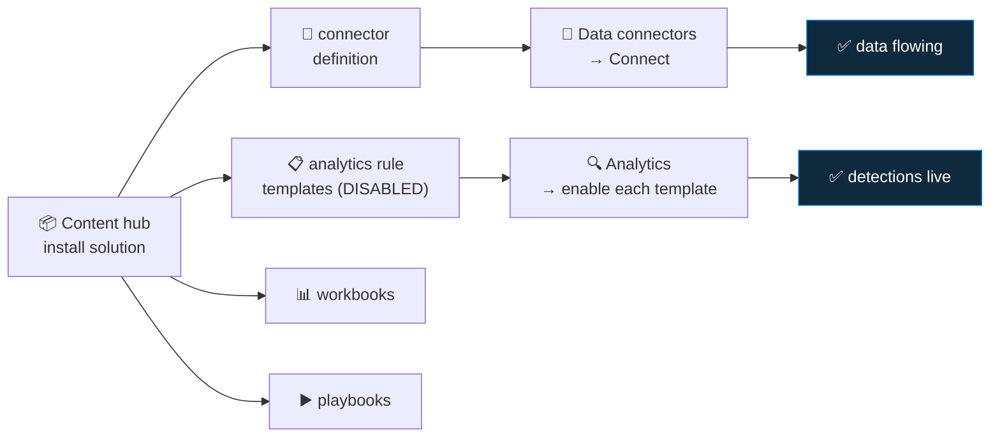

<div align="center">

# 📥 Step 07 · Connectors & Content hub

### *The two separate things a "connector" actually installs*

[](../README.md)
[](#)
[](#)

</div>

---

## 🎯 Goal

You understand the difference between **Content hub → install** and **Data connectors → connect**,
and you have installed (not yet connected) the solutions for the sources phase 📥 uses.

## 🧠 Why this step

People say "I connected the connector" and mean one of two different things. Installing a **solution**
from the Content hub drops connector definitions, analytics rule *templates*, workbooks and playbooks
into your workspace. **Connecting** the connector is a separate action that starts data flowing.
Rule templates land **disabled**. Miss the second and third steps and you have "data but no
detections", which looks complete and isn't.

## ✅ Prerequisites

- [Step 05](../05-rbac-and-roles/README.md) — you have Sentinel Contributor
- [Step 06](../06-cost-model-and-budget/README.md) — budget alert live

## 🧭 Concepts in 60 seconds



Three sequential actions, every time: **install → connect → enable rules.**

## 🖱️ Do it — portal

1. **Microsoft Sentinel → Content hub.** Filter by **Content type: Solution**.
2. Install these (do not connect yet):
   - **Azure Activity**
   - **Microsoft Entra ID**
   - **Microsoft Defender XDR**
   - **Windows Security Events**
   - **Syslog** and **Common Event Format**
   - **Threat Intelligence**
3. For each: open it → **Install** → wait for "Installed".
4. Open **Data connectors** — the connectors from those solutions now appear with status
   **Not connected**. That's expected; connecting is steps 08–14.
5. Open **Analytics → Rule templates** — filter by data source. You now see dozens of templates.
   All **disabled**.

## 💻 Do it — CLI

```bash
# list installed solutions
az sentinel ... # (solution install via CLI is limited; Content hub is portal/ARM)

# what the CLI is good for: seeing connector + rule state
az sentinel data-connector list \
  -g rg-sentinel-lab --workspace-name law-sentinel-lab \
  --query "[].{name:name, kind:kind}" -o table

az sentinel alert-rule template list \
  -g rg-sentinel-lab --workspace-name law-sentinel-lab \
  --query "length(@)"
```

> Content hub solution installs are cleanly done with ARM templates from the
> [Azure Sentinel GitHub repo](https://github.com/Azure/Azure-Sentinel/tree/master/Solutions) —
> step `55` wires that into CI/CD.

## 🧪 Validate

```bash
az sentinel alert-rule template list -g rg-sentinel-lab --workspace-name law-sentinel-lab \
  --query "[?contains(displayName, 'sign-in') || contains(displayName,'Activity')].displayName" -o tsv | head
```

Then in **Analytics → Rule templates**, note the count and that every one shows **Status:
Available** (not "In use").

**You should see** many templates present and none active — the exact "installed ≠ detecting" gap
this step is about. Steps 08–14 connect data; steps 18+ enable rules.

## 🚩 Common mistakes

| 🚩 Mistake | Why it bites |
|---|---|
| Stopping after "Installed" | No data, no detection — you've only staged content |
| Assuming templates auto-enable | They are deliberately disabled; each is a decision |
| Installing every solution in the hub | Clutter, and some pull cost the moment you connect them |
| Not matching solutions to what you'll actually connect | Orphan templates you'll never enable |

## 🗒️ Log your run

`LOG.md` — the list of solutions you installed and the template count before/after.

## 📚 Microsoft Learn

- [Discover and manage Microsoft Sentinel out-of-the-box content](https://learn.microsoft.com/en-us/azure/sentinel/sentinel-solutions-deploy)
- [About Microsoft Sentinel content and solutions](https://learn.microsoft.com/en-us/azure/sentinel/sentinel-solutions)
- [Microsoft Sentinel data connectors](https://learn.microsoft.com/en-us/azure/sentinel/connect-data-sources)

---

<div align="center">
<sub>

[⬅ Prev: 06 · Cost model & budget](../06-cost-model-and-budget/README.md) &nbsp;·&nbsp; [🦅 All steps](../README.md) &nbsp;·&nbsp; [Next: 08 · Azure Activity ➡](../08-azure-activity/README.md)

</sub>
</div>
