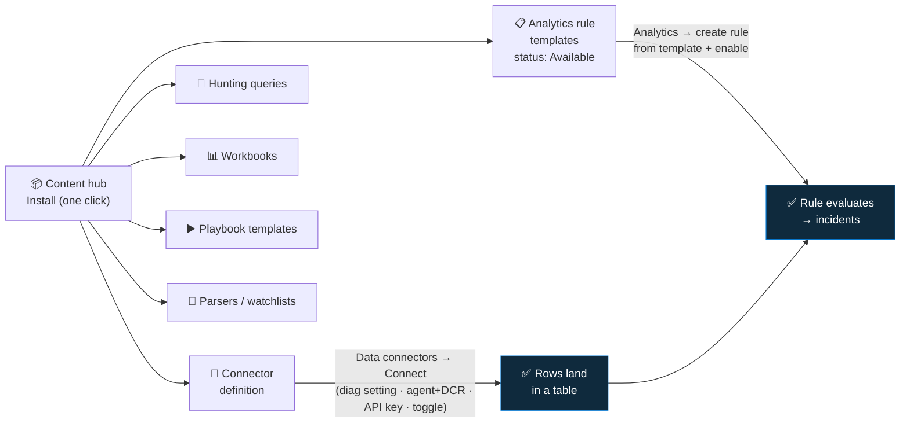

<div align="center">

# 📥 Step 07 · Connectors & Content hub

### *Install, connect, enable — the three separate gates between a solution and a detection*

[](../README.md)
[](#)
[](#)

</div>

---

## 🎯 Goal

You can explain, precisely, the difference between **Content hub → Install** (stage packaged content
into the workspace) and **Data connectors → Connect** (start data flowing), and why analytics rule
templates are a third, independent action. You have **installed — not connected** the Content hub
solutions for every source the data-onboarding phase (steps 08–14) uses, and you have proven with a
query that no source telemetry is flowing yet.

## 🧠 Why this step

"I connected the connector" is one sentence that hides three distinct actions, each with a different
owner, a different failure mode, and a different cost. **Installing a solution** from the Content hub
is an ARM deployment that drops *definitions* into your workspace: connector configuration pages,
analytics rule **templates**, hunting queries, workbooks, playbook templates, and parsers. Nothing in
that deployment moves a single log. **Connecting** the connector is a separate action — a diagnostic
setting, an agent plus a data collection rule, an API key, or a cross-service toggle — and that is
what starts ingestion (and the bill). **Enabling a rule** is a third action: each template has to be
opened, turned into an active rule, and switched on, one deliberate decision at a time.

Skip the second action and you have installed content with nothing to query — a workspace that looks
configured and detects nothing. Skip the third and you have data pouring in with no rules watching it
— the more expensive version of the same blind spot. This is the single most common Sentinel
onboarding mistake: a team spends a session installing solutions that match their connectors, the
Content hub fills with green "Installed" badges, everything *looks* done, and it stays looking done
right up until the day a pattern one of those bundled rules was written to catch actually happens and
generates no incident, because the rule was never turned on.

In the attack-vs-defence picture, this step is pure **preparation** — you are laying out the parts,
not defending anything yet. That is deliberate. Microsoft separated install, connect, and enable so
that content (versioned centrally by Microsoft and the community), data (owned by whoever runs the
source system and paid for by you), and detection logic (owned and tuned by your SOC) can each change
on their own schedule without stepping on each other. The cost of that clean separation is that
"done" is three checkboxes, not one, and the product will happily let you stop after the first.

Real-world context: mature SOCs treat the Content hub as a *catalog to shop from deliberately*, not a
"install everything" button. Installing hundreds of solutions clutters the rule-template list with
detections you will never enable, and some bundled connectors (verbose endpoint or firewall sources)
can 10x your ingest the moment someone connects them. The discipline is: decide your source
inventory first, install only the matching solutions, connect them one at a time watching the ingest
chart from [step 06](../06-cost-model-and-budget/README.md), then enable rules in a staged way once
real data exists to tune against (steps 17–28).

## ✅ Prerequisites

- [Step 02](../02-enable-sentinel/README.md) — **Sentinel enabled on the workspace.** The Content hub
  blade only exists once Sentinel is turned on; on a bare Log Analytics workspace there is nothing to
  install into.
- [Step 05](../05-rbac-and-roles/README.md) — **Microsoft Sentinel Contributor**, *plus* write access
  to the workspace's resource group. Installing a solution is an ARM template deployment into that
  resource group, so `Microsoft Sentinel Contributor` alone is not always enough — you also need
  `Contributor` (or a custom role with `Microsoft.Resources/deployments/*`) on `rg-sentinel-lab`.
- [Step 06](../06-cost-model-and-budget/README.md) — **budget alert live.** Installing costs nothing,
  but every connector you stage here bills the moment it is connected in steps 08–14. The 50/80/100%
  budget alert is the tripwire for the phase you are about to start.

## 🧭 Concepts

A **solution** is a package. The **Content hub** is the catalog of packages. **Installing** a
solution runs a deployment that puts that package's contents — connector pages, rule templates,
workbooks, hunting queries, playbook templates, parsers, watchlists — into your workspace as *inert
definitions*. Two further, independent actions bring those definitions to life: **connecting** a data
connector (starts ingestion) and **creating + enabling** an analytics rule from a template (starts
detection). Install → connect → enable, every source, every time.



**Walking the diagram:** the single **Install** click on the left fans out into every artifact type a
solution can carry. Follow the top branch: a connector *definition* appears in the **Data
connectors** gallery showing **Not connected** — it is a configuration page and a status tile, not a
pipe. You have to open it and perform the connect action (which one depends on the source), and only
then do rows land in a table like `AzureActivity` or `SigninLogs`. Follow the second branch: rule
*templates* appear in **Analytics → Rule templates** with status **Available**. A template is a saved
query plus metadata; it evaluates nothing. You create an active rule *from* it and enable that rule.
The bottom edge — `data → detection` — is the dependency people forget: a rule you enable before its
data source is connected runs successfully forever and finds nothing, which looks identical to a
well-tuned quiet rule.

### How it works under the hood

- **The catalog** is built from the public [Azure/Azure-Sentinel](https://github.com/Azure/Azure-Sentinel/tree/master/Solutions)
  GitHub repo. Each solution folder is packaged into a versioned "plan" and published to an
  Azure-managed catalog that the Content hub blade renders. The solution you see in the portal maps
  1:1 to a folder in that repo.
- **Install** issues an ARM deployment to your **workspace's resource group**. It creates a
  `Microsoft.SecurityInsights/contentPackages/<id>` resource (the "this solution is installed at
  version X" record) and one `Microsoft.SecurityInsights/contentTemplates/<id>` per bundled item,
  plus `Microsoft.SecurityInsights/metadata` resources that link templates back to the package. You
  can watch this happen in the resource group's **Deployments** blade — one Install click typically
  creates dozens of resources.
- **Rule templates** are surfaced through the `alertRuleTemplates` API and the Analytics → Rule
  templates tab. They are read-only definitions. Each carries `requiredDataConnectors` (which
  connector must be connected for the template to be usable) and a `status` of **Available**,
  **In use**, or **Not available**.
- **Connector definitions** land in the Data connectors gallery. Each carries `connectivityCriteria`
  — a small KQL query that checks whether the connector's target table has received rows recently
  (commonly the last 7–14 days) — and `graphQueries` that draw the "data received" chart. The green
  **Connected** state is *computed from that KQL check*, not from a live handshake, and the tile lags
  real data by roughly 90–120 minutes.
- **Connecting** is physically different per source: a **subscription/resource diagnostic setting**
  (Azure Activity, most Azure resources), an **Entra ID diagnostic setting** configured in the Entra
  portal (sign-in / audit logs), **Azure Monitor Agent + a data collection rule** (Windows / Linux),
  an **API polling config or codeless connector** (third-party feeds), or a **cross-service toggle**
  (Defender XDR incident sync). Steps 08–14 each do one of these.
- **Creating a rule from a template** makes a one-time *copy* into `Microsoft.SecurityInsights/alertRules`.
  Your copy is yours: when Microsoft later ships a new template version you get a notification, not an
  overwrite. Editing the installed template in place is not how you tune — you tune your active rule
  copy (step 26).
- **Where the data physically lands:** in the Log Analytics workspace tables — `AzureActivity`,
  `SigninLogs`, `SecurityEvent`, `Syslog`, `CommonSecurityLog`, `SecurityAlert`, and so on. Sentinel
  is a set of features *on top of* that workspace; the connector's job is only to get rows into those
  tables.

### Vocabulary

| Term | What it means |
|---|---|
| **Content hub** | The in-product catalog of installable packaged content, backed by the Azure-Sentinel GitHub repo. |
| **Solution** | A package bundling connectors, rule templates, workbooks, hunting queries, playbook templates, parsers and watchlists for one product or scenario. |
| **Standalone content** | An individual item (a single workbook or rule template) installable without a full solution. |
| **Install** | ARM deployment that stages a solution's contents into the workspace resource group as inert definitions. |
| **Data connector (definition)** | The configuration page + status tile a solution installs. Not a data pipe. |
| **Connect** | The separate action that starts ingestion — diagnostic setting, agent+DCR, API key, or toggle. |
| **Connectivity criteria** | The KQL freshness check that decides whether a connector tile shows *Connected*; lags ~90–120 min. |
| **Rule template** | A read-only detection definition installed by a solution. Status *Available* / *In use* / *Not available*. |
| **Active rule** | A one-time copy of a template into `alertRules` that actually evaluates data once enabled. |
| **`contentPackages` / `contentTemplates`** | The ARM resources that record an installed solution and each of its items. |
| **Support tier** | *Microsoft*, *Partner*, or *Community* — who maintains the solution and fixes a broken query or parser. |
| **Parser (incl. ASIM)** | A saved KQL function a solution installs so its bundled rules can query a normalized schema. |

### Where this fits

This is the **staging** step of the data-onboarding phase (07–16). Steps 08–14 perform the *connect*
action, one source at a time — [08 Azure Activity](../08-azure-activity/README.md),
[09 Entra ID](../09-microsoft-entra-id/README.md), [10 Defender XDR](../10-defender-xdr/README.md),
[11 Windows VM (AMA + DCR)](../11-windows-vm-ama-dcr/README.md),
[12 Linux syslog / CEF](../12-linux-syslog-cef-ama/README.md),
[13 custom logs + DCR transformations](../13-custom-logs-and-dcr-transformations/README.md),
[14 API & codeless connectors](../14-api-and-codeless-connectors/README.md) — each expecting the
matching solution to already be installed here. [Step 15](../15-ingestion-health-and-validation/README.md)
confirms the flow is healthy; [step 16](../16-retention-archive-and-data-lake/README.md) sets
retention tiers per table. Then the SIEM-rules phase (17–28) turns the templates you staged here into
active detections: [18](../18-enable-a-rule-from-template/README.md) enables one from a template,
[19](../19-write-a-scheduled-rule/README.md) writes one from scratch,
[25](../25-mitre-attack-coverage/README.md) reads the MITRE coverage map that solution content feeds,
[26](../26-tuning-a-noisy-rule/README.md) tunes, [27](../27-rule-health-monitoring/README.md)
monitors rule health, and [28](../28-analytics-rules-as-code/README.md) plus
[55](../55-repositories-cicd/README.md) put all of it under version control.

### Design rationale

The three-gate model exists because content, data, and detection have different owners and different
blast radii. Auto-enabling every bundled rule on install would bury a new SOC under hundreds of
untuned alerts before anyone could triage them. Auto-connecting every bundled connector would create
surprise ingestion bills. Keeping templates versioned centrally while your active rule stays a
private copy lets Microsoft improve detections without silently rewriting logic you have tuned to
your environment. The friction is the feature.

## 🖱️ Do it — portal

### 1 · Open the Content hub and read one solution properly

1. **Microsoft Sentinel → Content management → Content hub.**
2. In the filter bar set **Content type → Solution**. Leave **Status → All**. You will see hundreds
   of solutions (250+ as of writing).
3. Search `Azure Activity` and click the card. Before installing anything, read the detail pane:
   - **Support** tile — `Microsoft` for this one. In production this is the field that tells you who
     fixes a broken parser: Microsoft-supported solutions get a support ticket path; Community ones
     do not.
   - **Version** and whether an update is available. Solutions do **not** auto-update.
   - The **"What's inside"** list — for Azure Activity that is 1 data connector, several analytics
     rule templates, a workbook, and some hunting queries. This is exactly what the Install
     deployment will stage.

### 2 · Install the solutions this phase needs — do not connect

Install each of these (**Install** button → wait for the status to flip to **Installed**). Connecting
is a later step, noted alongside each:

| Solution | Feeds step | Connect action later |
|---|---|---|
| **Azure Activity** | [08](../08-azure-activity/README.md) | Subscription diagnostic setting |
| **Microsoft Entra ID** | [09](../09-microsoft-entra-id/README.md) | Diagnostic setting in the Entra portal |
| **Microsoft Defender XDR** | [10](../10-defender-xdr/README.md) | Cross-service connector toggle |
| **Windows Security Events** | [11](../11-windows-vm-ama-dcr/README.md) | Azure Monitor Agent + DCR |
| **Syslog** | [12](../12-linux-syslog-cef-ama/README.md) | Azure Monitor Agent + DCR |
| **Common Event Format** | [12](../12-linux-syslog-cef-ama/README.md) | Azure Monitor Agent + DCR (CEF) |

> [!NOTE]
> **Threat Intelligence** is only needed at [step 58](../58-threat-intelligence/README.md). Skip it
> for now unless you want it staged early — installing it does nothing until you connect a TAXII feed
> or the upload API.

**Lab vs production:**
- *Lab* — install only what the list above needs. Every extra solution is rule-template clutter you
  will scroll past for the rest of the path.
- *Production* — install against a written source inventory / coverage plan, prefer
  Microsoft-supported solutions, and stage Partner or Community solutions in a non-production
  workspace first so you can read their queries and parsers before they touch a real incident queue.

**What you should see after each install:** the card's status changes to **Installed** with a version
number, and a **Manage** button replaces **Install**.

### 3 · Open Manage on one installed solution

Click **Manage** on **Azure Activity**. This view lists every item the solution installed and its
individual state — the data connector (with a **Configure** link that jumps to the connector page),
each analytics rule template, the workbook. Note that every analytics rule template here shows as a
template, not an enabled rule. This is the screen that makes "installed ≠ detecting" concrete: the
solution is fully installed and nothing in it is running.

### 4 · Look at Data connectors

**Configuration → Data connectors.** The connectors from the solutions you just installed now appear,
each with status **Not connected** (or **Disconnected**). That is expected and correct — connecting is
steps 08–14. Open the **Azure Activity** connector page and read the **Instructions** tab so you know
what step 08 will ask you to do; do **not** perform it yet.

### 5 · Look at Analytics → Rule templates

**Configuration → Analytics → Rule templates** tab. Filter by **Data sources** and pick, say,
**Microsoft Entra ID**. You now see a stack of templates. Every one shows **Status: Available** (none
say **In use**), and some may show **Not available** with a note that the required data connector is
not connected. Both states mean the same thing: *nothing here is detecting yet.*

## 💻 Do it — CLI / IaC

Solution *install* has no first-party `az sentinel` verb — it is an ARM deployment or a REST `PUT`.
The CLI is genuinely useful for *inspecting* connector and template state before and after.

```bash
SUB=$(az account show --query id -o tsv)
RG=rg-sentinel-lab
WS=law-sentinel-lab

# --- Baseline BEFORE installing anything ---

# Count rule templates currently in the workspace (out-of-the-box baseline).
az sentinel alert-rule template list -g "$RG" --workspace-name "$WS" \
  --query "length(@)"    # small on a freshly enabled workspace — only the built-in Microsoft templates;
                         # the large catalog (hundreds) arrives as you install Content hub solutions

# List the connector definitions already present and their kind.
az sentinel data-connector list -g "$RG" --workspace-name "$WS" \
  --query "[].{name:name, kind:kind}" -o table          # 'sentinel' extension is experimental — treat as read-only

# List installed solutions via the contentPackages API (nothing SOC-authored yet).
az rest --method GET \
  --url "https://management.azure.com/subscriptions/$SUB/resourceGroups/$RG/providers/Microsoft.OperationalInsights/workspaces/$WS/providers/Microsoft.SecurityInsights/contentPackages?api-version=2024-09-01" \
  --query "value[].{name:properties.displayName, version:properties.installedVersion}" -o table
```

Install a solution as **IaC** — the reliable path is deploying the solution's full `mainTemplate.json`
from the Azure-Sentinel repo, because the `contentProductId` string must be derived exactly and the
template also wires up the `metadata` resources:

```bash
# Deploy the Azure Activity solution's packaged template into the workspace's resource group.
# The template is idempotent: re-running bumps/keeps the version, it does not duplicate content.
az deployment group create \
  -g "$RG" \
  --name "install-solution-azureactivity" \
  --template-uri "https://raw.githubusercontent.com/Azure/Azure-Sentinel/master/Solutions/Azure%20Activity/Package/mainTemplate.json" \
  --parameters workspace="$WS" workspace-location=eastus
```

Or register the package directly with a REST `PUT` (idempotent — same call twice is a no-op /
version update, not a second install):

```bash
# packageId == the solution's contentId. contentProductId is DERIVED from contentId+kind+version —
# copy the exact value from the solution's mainTemplate.json, do not hand-type it.
az rest --method PUT \
  --url "https://management.azure.com/subscriptions/$SUB/resourceGroups/$RG/providers/Microsoft.OperationalInsights/workspaces/$WS/providers/Microsoft.SecurityInsights/contentPackages/azuresentinel.azure-sentinel-solution-azureactivity?api-version=2024-09-01" \
  --body '{
    "properties": {
      "contentId": "azuresentinel.azure-sentinel-solution-azureactivity",
      "contentProductId": "<derived-id-from-mainTemplate>",
      "contentKind": "Solution",
      "version": "3.0.0",
      "displayName": "Azure Activity"
    }
  }'
```

Bicep shape for a repeatable multi-solution install (step 55 wires this into CI/CD):

```bicep
// Existing workspace, Sentinel already enabled.
resource ws 'Microsoft.OperationalInsights/workspaces@2023-09-01' existing = {
  name: 'law-sentinel-lab'
}

// One installed-solution record. api-version is a preview surface at time of writing — verify current.
resource activitySolution 'Microsoft.SecurityInsights/contentPackages@2024-09-01' = {
  scope: ws
  name: 'azuresentinel.azure-sentinel-solution-azureactivity'
  properties: {
    contentId: 'azuresentinel.azure-sentinel-solution-azureactivity'
    contentProductId: '<derived-id-from-mainTemplate>'
    contentKind: 'Solution'
    version: '3.0.0'
    displayName: 'Azure Activity'
  }
}
```

> [!NOTE]
> As of writing, `Microsoft.SecurityInsights/contentPackages` is documented mainly on the
> [Content Package - Install REST reference](https://learn.microsoft.com/en-us/rest/api/securityinsights/content-package/install)
> and is still evolving. For anything beyond a lab, prefer deploying the solution's `mainTemplate.json`
> from the [Azure-Sentinel repo](https://github.com/Azure/Azure-Sentinel/tree/master/Solutions) and
> pin the version — [step 55](../55-repositories-cicd/README.md) does exactly this.

## 🧪 Validate

**1 · Rule-template count jumped, and every new template is inert.**

```bash
az sentinel alert-rule template list -g rg-sentinel-lab --workspace-name law-sentinel-lab \
  --query "length(@)"
```

You should see a **higher** number than your pre-install baseline (each solution adds tens of
templates). Then in **Analytics → Rule templates**, confirm the **Status** column: every template is
**Available** or **Not available**, **none** is **In use**. `Available` = the required connector
exists and you *could* create a rule; `Not available` = the required connector is not connected yet;
`In use` = a rule has been created from it (there should be none). A healthy result here is "lots of
templates, zero in use."

**2 · The connectors are staged but dead.**

```bash
az sentinel data-connector list -g rg-sentinel-lab --workspace-name law-sentinel-lab \
  --query "[].{name:name, kind:kind}" -o table
```

You should see connector entries whose `kind` matches what you installed (for example
`AzureActivityLog`, `AzureActiveDirectory`, `MicrosoftThreatProtection`, `WindowsSecurityEvents`).
In the portal Data connectors blade every one reads **Not connected**. Healthy = present but not
connected. Unhealthy = the connector kind you expect is missing (solution install did not complete)
or already **Connected** (something connected it out of band).

**3 · Prove no source telemetry is flowing — the whole point of this step.**

```kusto
union withsource=SourceTable *
| where TimeGenerated > ago(24h)
| summarize Rows = count() by SourceTable
| sort by Rows desc
```

You should see only workspace-plumbing tables — `Usage`, `Operation`, and (if query auditing is on)
`LAQueryLogs`. You should **not** see `SigninLogs`, `AuditLogs`, `SecurityEvent`, `Syslog`,
`CommonSecurityLog`, `SecurityAlert`, or `AzureActivity`. Their absence is the proof that installing a
solution stages content and moves zero data. `union *` scans every table, which is fine on a tiny lab
workspace; on a large workspace you would name tables explicitly instead.

**4 · The install actually deployed something.**

```bash
az deployment group list -g rg-sentinel-lab \
  --query "[?contains(name, 'Solution') || contains(name, 'solution')].{name:name, state:properties.provisioningState, time:properties.timestamp}" -o table
```

Each solution install should show one deployment in `Succeeded` state. A `Failed` row here is your
first place to look if a solution card is stuck.

## 🚩 Common mistakes

| 🚩 Mistake | Why it bites |
|---|---|
| Stopping after "Installed" | Content staged, no data, no detection — the workspace looks configured and sees nothing |
| Assuming rule templates auto-enable | They ship inert on purpose; each is a separate create-and-enable decision (step 18) |
| Installing every solution in the hub | Rule-template list becomes unusable, and some bundled connectors 10x ingest the moment they connect |
| Not matching solutions to what you'll connect | Orphan templates permanently stuck at "Available" that you will never enable |
| Enabling a rule whose data connector isn't connected yet | Rule runs "Success" with 0 results forever — indistinguishable from a well-tuned quiet rule (step 27) |
| Trusting the connector "Connected" tile immediately | It is a KQL freshness check that lags real data 90–120 min, not a live handshake |
| Editing the installed template in place to "tune" it | Your edit doesn't touch already-created rules and can be lost on a solution update — tune the active rule copy (step 26) |
| Installing a Partner/Community solution straight into production | Its queries and parsers are unvetted for your environment and there's no Microsoft support path |
| Deleting a solution to tidy up | Can remove templates that active rules were spawned from and orphan bundled content |

## 🩺 Troubleshooting

| Symptom | Likely cause | Fix |
|---|---|---|
| Content hub **Install** spins, then the card shows **Failed** | Underlying ARM deployment errored — missing RBAC on the resource group, region mismatch, or a policy blocking the deployment | Open `rg-sentinel-lab` → **Deployments**, find the failed `...Solution...` deployment, read the error. You need `Contributor` (or `Microsoft.Resources/deployments/*`) on the RG in addition to Sentinel Contributor |
| Solution says **Installed** but no new templates appear in Analytics | Looking at the **Active rules** tab instead of **Rule templates**, a filter is applied, or templates are still provisioning | Switch to the **Rule templates** tab, clear all filters, wait 2–3 min and refresh |
| Rule template greyed out / **Not available** | The template's `requiredDataConnectors` are not connected in this workspace | Connect the source (steps 08–14); the template flips to **Available** once its data type is present |
| `az sentinel alert-rule template list` returns an error or empty array | `sentinel` CLI extension outdated, or `--workspace-name` was given the resource group name | `az extension update -n sentinel`; pass the **Log Analytics workspace** name, not the RG |
| Data connector still **Not connected** 30 min after you connected it | Connectivity tile lag (90–120 min), or the target table genuinely has no rows yet | Query the target table directly (`AzureActivity | take 5`). If rows exist, it is just tile lag; if not, the connect action didn't take — recheck the diagnostic setting / agent |
| Connector shows **Connected** but its rule templates still say **Available** | Working as designed — connected data never enables a rule | Go to [step 18](../18-enable-a-rule-from-template/README.md) and create a rule from the template |
| `az deployment group create` for a solution fails with a template-URI 404 | Solution folder name in the URL isn't URL-encoded, or the path changed in the repo | Browse [Solutions/](https://github.com/Azure/Azure-Sentinel/tree/master/Solutions), copy the exact `Package/mainTemplate.json` raw URL, encode spaces as `%20` |
| Content hub still shows **Install** after a successful CLI/ARM deployment | Portal metadata cache / catalog sync delay | Hard-refresh the blade; confirm with `az rest GET .../contentPackages` that the package is registered |
| Solution's playbook isn't in the Playbooks list after install | Playbooks install as **templates**; the Logic App is a separate (billable) resource you create from the template | Content hub → the solution → **Manage** → the playbook template → **Create playbook** ([step 30](../30-first-playbook-notify/README.md)) |
| `union withsource=SourceTable *` validation shows a source table you didn't connect | Another step, a leftover diagnostic setting, or a shared workspace is already feeding it | Check **Data connectors** and the source resource's diagnostic settings; on a lab workspace it should be pristine |

## 🎓 Deepen your understanding

1. **Open one rule template and predict the gap.** In Rule templates, open a Microsoft Entra ID
   template (for example one about sign-ins from anonymized IPs). Note its `requiredDataConnectors`
   and read its KQL. Which table does it hit? Does your workspace have that table yet? You have just
   traced, by hand, the exact "installed ≠ detecting" gap this step is about.
2. **Count what one click created.** After installing a solution, open `rg-sentinel-lab` →
   **Deployments** → the solution deployment → **Deployment details**. How many resources did one
   Install button create? Which are `contentTemplates`? Which single one is the `contentPackages`
   record that makes the Content hub show "Installed"?
3. **Compare support tiers.** Find a Microsoft-supported solution (Azure Activity) and a Community
   one in the hub. Compare the Support tile, the last-updated date, and who you would contact if a
   bundled parser broke at 2 a.m. Would you enable the Community solution's rules unread in
   production? What would you check first?
4. **Watch a template status change — or not.** Note the status of the Azure Activity solution's rule
   templates now. Do [step 08](../08-azure-activity/README.md), then come back. Connecting the data
   does **not** move a template to "In use" — but a template that was **Not available** becomes
   **Available**. Explain the difference in one sentence.
5. **Why ship the parser?** Find a solution that bundles a parser (an ASIM parser, or a
   product-specific one). Why does Microsoft ship the KQL function in the solution instead of
   expecting you to write it? What happens to that solution's bundled rules if the parser isn't
   installed or gets deleted?

## 🗒️ Log your run

`LOG.md` — record:
- The exact list of solutions installed, each with its **version** number.
- Rule-template **count before and after** (`az sentinel alert-rule template list --query "length(@)"`).
- A screenshot of **Data connectors** showing the new connectors as **Not connected** (redact any
  workspace/tenant identifiers).
- The output of the `union withsource=SourceTable *` query proving **no source tables** exist yet.
- The resource-group **deployment name** for at least one solution install, and its `Succeeded`
  state.

## 📚 Microsoft Learn

- [About Microsoft Sentinel content and solutions](https://learn.microsoft.com/en-us/azure/sentinel/sentinel-solutions)
- [Discover and manage Microsoft Sentinel out-of-the-box content](https://learn.microsoft.com/en-us/azure/sentinel/sentinel-solutions-deploy)
- [Microsoft Sentinel content hub catalog](https://learn.microsoft.com/en-us/azure/sentinel/sentinel-solutions-catalog)
- [Connect data sources to Microsoft Sentinel](https://learn.microsoft.com/en-us/azure/sentinel/connect-data-sources)
- [Microsoft Sentinel data connectors reference](https://learn.microsoft.com/en-us/azure/sentinel/data-connectors-reference)
- [Configure a data connector](https://learn.microsoft.com/en-us/azure/sentinel/configure-data-connector)
- [Monitor the health of your data connectors](https://learn.microsoft.com/en-us/azure/sentinel/monitor-data-connector-health)
- [Detect threats with built-in analytics rules](https://learn.microsoft.com/en-us/azure/sentinel/detect-threats-built-in)
- [Deploy Sentinel content from a repository (CI/CD)](https://learn.microsoft.com/en-us/azure/sentinel/ci-cd)
- [Content Package - Install (REST API)](https://learn.microsoft.com/en-us/rest/api/securityinsights/content-package/install)
- [`az sentinel alert-rule template` (CLI reference)](https://learn.microsoft.com/en-us/cli/azure/sentinel/alert-rule/template)
- [Training — SC-200: Connect logs to Microsoft Sentinel](https://learn.microsoft.com/en-us/training/paths/sc-200-connect-logs-to-azure-sentinel/)

---

<div align="center">
<sub>

[⬅ Prev: 06 · Cost model & budget](../06-cost-model-and-budget/README.md) &nbsp;·&nbsp; [🦅 All steps](../README.md) &nbsp;·&nbsp; [Next: 08 · Azure Activity ➡](../08-azure-activity/README.md)

</sub>
</div>
