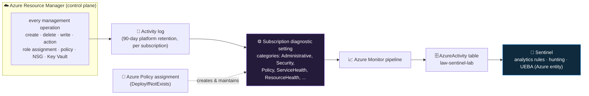

<div align="center">

# 📥 Step 08 · Connect Azure Activity

### *The Azure control-plane audit log — who did what to which resource, and from where*

[](../README.md)
[](#)
[](#)

</div>

---

## 🎯 Goal

The `AzureActivity` table is receiving rows, you can see the operations *you* performed building the
lab (workspace create, role assignments) attributed to your account and IP, and you understand that
this feed is configured as a **subscription-scoped diagnostic setting**, not an agent.

## 🧠 Why this step

Azure Activity is the audit trail of the **Azure Resource Manager (ARM) control plane** — every
management action taken against your subscription. Someone assigns a role, deletes a resource group,
opens an NSG rule to the internet, edits a Key Vault access policy, disables a diagnostic setting,
deallocates a VM, exports a disk: all of it lands here, with *who* (`Caller`), *from where*
(`CallerIpAddress`), *what* (`OperationNameValue`), *on what* (`_ResourceId`), and *did it succeed*
(`ActivityStatusValue`).

For a cloud SOC this is one of the highest value-per-GB sources there is. It is small — a quiet
subscription produces megabytes a day, not gigabytes — it is **free to ingest**, and it catches an
entire class of attack that endpoint and identity logs miss: an adversary who has already obtained
cloud credentials and is now manipulating your infrastructure. Privilege escalation via role
assignment, defense evasion by deleting logging, persistence via a rogue automation account,
collection via a storage account SAS — the control-plane hunt in
[step 48](../48-hunt-cloud-control-plane/README.md) runs almost entirely on this table.

It is also the right **first** connector to actually turn on. You have been generating Activity log
events since [step 00](../00-azure-subscription-and-tenant/README.md) — every `az` command and
portal click is one — so within ~15 minutes of connecting it you have real data to query, and you
see your own lab-building footprint, which is a genuinely useful "what does an admin session look
like in the logs?" baseline.

What teams get wrong: they look for an agent or a legacy connector to install (there isn't one any
more), they configure it at the resource-group scope (Activity log is **subscription**-level), or
they configure it once manually and then never notice that new subscriptions added later have no
coverage — which is exactly why the Sentinel connector nudges you toward an **Azure Policy**
assignment that auto-applies the setting to every current and future subscription under a scope.

## ✅ Prerequisites

- [Step 07](../07-connectors-and-content-hub/README.md) — the **Azure Activity** solution installed
  from Content hub. That staged the connector page and the Activity-based rule templates; this step
  performs the *connect*.
- **Owner** or **Contributor** on the subscription (`sub-sentinel-lab`) — creating a
  subscription-level diagnostic setting is a subscription-scope write. The `Log Analytics
  Contributor` role on the workspace side is implied by your existing access.
- If you use the **Azure Policy** route: **Resource Policy Contributor** (or Owner) to create the
  assignment, and the policy's managed identity needs **Log Analytics Contributor** + **Monitoring
  Contributor** on the target scope (the assignment wizard offers to grant this).

## 🧭 Concepts

Azure Activity used to be pulled by a dedicated connector via an API. That legacy connector is
**retired**. The modern mechanism is the same one every Azure resource uses to emit telemetry: a
**diagnostic setting**, except this one is created at the **subscription** scope and its source is
the Activity log rather than a resource's own logs. You choose which Activity log *categories* to
forward and one or more destinations; point one at your Log Analytics workspace and rows appear in
the `AzureActivity` table.



**Walking the diagram:** ARM records every management operation into the per-subscription Activity
log, which Azure keeps for 90 days on its own regardless of what you do. The diagnostic setting is a
**copy-and-route** rule: it duplicates the categories you pick into your workspace, permanently and
queryably. You can create that setting by hand (fine for one lab subscription) or have an **Azure
Policy** with a `DeployIfNotExists` effect create and continually enforce it across a whole
management group — that is the pattern for an org with many subscriptions. Once rows are in
`AzureActivity`, Sentinel treats it like any other table: rules, hunts, and the **Azure resource**
entity in the investigation graph all read it.

### How it works under the hood

- The setting is an ARM resource:
  `/subscriptions/<sub>/providers/Microsoft.Insights/diagnosticSettings/<name>`. It is
  **subscription-scoped** — not inside your resource group, so `az group delete rg-sentinel-lab`
  does **not** remove it. Clean it up separately when you tear down the lab.
- **Categories** map to Activity log event types: `Administrative` (ARM writes/deletes/actions —
  the security-relevant bulk), `Security` (Defender for Cloud alerts surfaced via Activity),
  `Policy` (policy evaluation effects), `Alert` (classic metric alerts), `Recommendation`,
  `ServiceHealth`, `ResourceHealth`, `Autoscale`. For a SOC, `Administrative` + `Security` +
  `Policy` are the ones that matter; the health categories are low-value but cheap.
- **Ingestion is free.** `AzureActivity` rows land with `IsBillable == false` in the `Usage` table.
  Connecting it will **not** move your [step 06](../06-cost-model-and-budget/README.md) budget.
- **The connector "Connected" tile** in Sentinel is computed from a KQL freshness check on the
  `AzureActivity` table (has it had rows in roughly the last 7–14 days), so it can read
  *Not connected* for up to a couple of hours after you genuinely connect it. Query the table
  directly to know the truth.
- **First rows take 10–20 minutes.** The Activity log → diagnostic-setting → Azure Monitor path has
  inherent latency; it is not real-time.

### Vocabulary

| Term | Meaning |
|---|---|
| **Activity log** | The per-subscription record of control-plane operations. Platform-retained 90 days; exported here for permanent, queryable retention. |
| **Control plane vs data plane** | Control plane = managing the resource (create a storage account, set its firewall). Data plane = using it (read a blob). Activity log is **control plane only**; data-plane access needs the *resource's own* diagnostic settings. |
| **Subscription diagnostic setting** | A diagnostic setting whose scope is a subscription and whose source is the Activity log. |
| **`DeployIfNotExists` policy** | An Azure Policy effect that creates a missing resource (here, the diagnostic setting) and re-creates it if removed — how you enforce Activity logging org-wide. |
| **`OperationNameValue`** | The ARM operation string, e.g. `Microsoft.Authorization/roleAssignments/write`. The `...Value` columns are the current schema; the un-suffixed `OperationName` is the deprecated localized display string. |
| **`Caller`** | The identity that performed the action — a UPN for a user, a GUID for a service principal / managed identity. |
| **`Authorization` / `Authorization_d`** | Dynamic column holding the role, scope, and action evaluated for the operation — the field you parse to see *which role* was granted in a `roleAssignments/write`. |

### Where this fits

First live connector of the data-onboarding phase (07–16). It gives you a table to practise the
[step 04](../04-kql-survival-kit/README.md) KQL on with real data, a source for your first
template-based rule in [step 18](../18-enable-a-rule-from-template/README.md), the
["source went quiet"](../15-ingestion-health-and-validation/README.md) health check has something to
watch, and it is the backbone of the cloud-control-plane hunt in
[step 48](../48-hunt-cloud-control-plane/README.md). At org scale the Azure Policy route here is the
same mechanism you would use across a management group.

### Design rationale

Microsoft retired the API-based connector and moved to diagnostic settings so that Activity export
uses one consistent, policy-enforceable mechanism instead of a Sentinel-specific one. Making it
subscription-scoped (not resource-group) reflects what the Activity log actually is — a
subscription-wide ledger. Pushing you toward Azure Policy is deliberate: manual per-subscription
setup is exactly the thing that gets forgotten when subscription #47 is created.

## 🖱️ Do it — portal

1. **Open the connector.** Sentinel → **Configuration → Data connectors** → search **Azure
   Activity** → **Open connector page**. Read the **Instructions** tab: it explains the two routes.
2. **Choose your route.**
   - **Azure Policy (recommended, and what the page pushes):** click **Launch Azure Policy
     Assignment wizard**. Scope: your **management group** or the **subscription** `sub-sentinel-lab`.
     On **Parameters**, set **Primary Log Analytics workspace** to `law-sentinel-lab`. On
     **Remediation**, tick **Create a remediation task** and **Create a managed identity** (the
     wizard grants it the roles it needs). **Review + create.** The remediation task creates the
     diagnostic setting; it can take a few minutes.
   - **Manual diagnostic setting (fine for one lab subscription):** in the portal search
     **Monitor → Activity log → Export Activity Logs → + Add diagnostic setting** (or
     **Subscriptions → sub-sentinel-lab → Activity log → Export**). Name it `activity-to-sentinel`,
     tick categories **Administrative, Security, Policy, ServiceHealth, ResourceHealth, Alert**,
     destination **Send to Log Analytics workspace** → `law-sentinel-lab` → **Save**.
3. **Confirm the setting exists.** Back on the connector page the status stays *Not connected* for a
   bit — that is the tile lag, not a failure. Move on to Validate.

**Lab vs production:**
- *Lab* — the manual route on one subscription is quickest. Categories: take `Administrative`,
  `Security`, `Policy` for signal; the health ones are optional.
- *Production* — always the **Azure Policy** route at management-group scope, so new subscriptions
  are covered automatically. Send to one central SOC workspace. Consider excluding the noisy health
  categories to keep the table lean even though it is free (query performance).

## 💻 Do it — CLI / IaC

```bash
SUB=$(az account show --query id -o tsv)
WS=$(az monitor log-analytics workspace show -g rg-sentinel-lab -n law-sentinel-lab --query id -o tsv)

# subscription-scoped diagnostic setting. Idempotent by name — re-running updates categories in place.
az monitor diagnostic-settings subscription create \
  --name "activity-to-sentinel" \
  --location eastus \
  --workspace "$WS" \
  --logs '[
    {"category":"Administrative","enabled":true},
    {"category":"Security","enabled":true},
    {"category":"Policy","enabled":true},
    {"category":"Alert","enabled":true},
    {"category":"ServiceHealth","enabled":true},
    {"category":"ResourceHealth","enabled":true}
  ]'

# verify it was created
az monitor diagnostic-settings subscription list \
  --query "value[].{name:name, ws:workspaceId, cats:logs[?enabled].category}" -o json
```

<details><summary>Azure Policy route (CLI) — enforce Activity logging across a scope</summary>

```bash
# built-in policy: "Configure Azure Activity logs to stream to specified Log Analytics workspace"
POLICY_ID="/providers/Microsoft.Authorization/policyDefinitions/2465583e-4e78-4c15-b6be-a36cbc7c8b0f"

az policy assignment create \
  --name "activity-to-sentinel" \
  --display-name "Stream Azure Activity to Sentinel workspace" \
  --scope "/subscriptions/$SUB" \
  --policy "$POLICY_ID" \
  --mi-system-assigned --location eastus \
  --params "{\"logAnalytics\":{\"value\":\"$WS\"}}"

# then create a remediation task so it applies to the already-existing subscription
az policy remediation create --name "activity-remediation" \
  --policy-assignment "activity-to-sentinel" --resource-group-mode false \
  --scope "/subscriptions/$SUB"
```
The policy definition ID above is the well-known built-in — verify it with
`az policy definition list --query "[?displayName=='Configure Azure Activity logs to stream to specified Log Analytics workspace'].id" -o tsv`.
</details>

## 🧪 Validate

Wait ~10–20 minutes after connecting, then in **Logs**:

```kusto
// 1. what operations are landing, and are they succeeding
AzureActivity
| where TimeGenerated > ago(2h)
| summarize Events = count() by OperationNameValue, ActivityStatusValue
| sort by Events desc
```

```kusto
// 2. your own admin footprint from building the lab
AzureActivity
| where TimeGenerated > ago(1d)
| where Caller has "@"                      // a user, not a service principal
| project TimeGenerated, Caller, CallerIpAddress, OperationNameValue, ActivityStatusValue, ResourceGroup, _ResourceId
| sort by TimeGenerated desc
| take 25
```

```kusto
// 3. the role assignments you made in step 05 — and how to read who got what
AzureActivity
| where TimeGenerated > ago(2d)
| where OperationNameValue == "Microsoft.Authorization/roleAssignments/write"
| extend authz = parse_json(tostring(Properties)).requestbody
| project TimeGenerated, Caller, CallerIpAddress, TargetScope = tostring(parse_json(tostring(authz)).properties.scope),
          RoleDefId = tostring(parse_json(tostring(authz)).properties.roleDefinitionId)
```

Read the output:

| Column | What it tells you |
|---|---|
| `OperationNameValue` | The ARM action. `.../write` = create/update, `.../delete`, `.../action` = a POST operation (e.g. `listKeys`) |
| `Caller` | UPN for you; a GUID means a service principal or managed identity did it |
| `CallerIpAddress` | Where the request came from — your home/office IP for lab work; an unexpected IP on a privileged op is the hunt in step 48 |
| `ActivityStatusValue` | `Success`, `Failure`, `Start`, `Accepted` — a burst of `Failure` on `roleAssignments/write` can be someone probing what they can grant |
| `_ResourceId` | The exact resource touched |

**You should see** rows for `Microsoft.OperationalInsights/workspaces/write` (step 01),
`Microsoft.Authorization/roleAssignments/write` ×3 (step 05), `Microsoft.SecurityInsights/...`
(step 02), and the diagnostic-setting write you just did — all with your UPN as `Caller`. If the
`AzureActivity` table returns *"Failed to resolve table or column expression"*, the setting didn't
save or you are inside the 20-minute lag — check the setting exists (`az monitor diagnostic-settings
subscription list`) and wait.

Fourth angle — confirm it's free:

```kusto
Usage
| where TimeGenerated > ago(1d) and DataType == "AzureActivity"
| summarize GB = sum(Quantity)/1000, Billable = any(IsBillable)
```

`Billable` should be `false`.

## 🚩 Common mistakes

| 🚩 Mistake | Why it bites |
|---|---|
| Hunting for an agent or the legacy connector to install | There is none — Activity is a subscription diagnostic setting now |
| Creating the setting at **resource-group** scope | The Activity log is subscription-wide; an RG-scoped setting captures a different, narrower thing |
| Manual setup, then forgetting new subscriptions | Coverage silently stops at the subscription boundary — use the Azure Policy route for many subs |
| Expecting rows in seconds | 10–20 minutes for the first batch; it is not real-time |
| Trusting the connector tile's *Not connected* an hour after connecting | It is a lagging KQL check — query `AzureActivity` directly |
| Assuming `Administrative` covers Defender for Cloud alerts | Those come via the `Security` category — enable it too |
| Deleting `rg-sentinel-lab` and thinking Activity export is gone | The setting is subscription-scoped; delete it separately at teardown |

## 🩺 Troubleshooting

| Symptom | Likely cause | Fix |
|---|---|---|
| `AzureActivity` table 404s after 30+ min | Diagnostic setting not actually created (wizard/remediation failed), or pointed at a different workspace | `az monitor diagnostic-settings subscription list` — confirm one row with `workspaceId` = your workspace and enabled categories |
| Azure Policy assignment created but no data | No **remediation task** was run, so the setting was never deployed to the *existing* subscription | Create a remediation task (portal: the assignment → **Remediate**; CLI: `az policy remediation create`) |
| Policy remediation fails with an auth error | The policy's managed identity lacks `Log Analytics Contributor` / `Monitoring Contributor` on the scope | Grant those roles to the assignment's identity, then re-run remediation |
| Data arrives but `Caller` is always a GUID | Those operations were performed by service principals / managed identities (Terraform SP, a deployment script) — expected | Join to a list of known SPNs; investigate GUIDs you can't account for |
| `AzureActivity` volume much larger than expected | The `ServiceHealth` / `ResourceHealth` / `Autoscale` categories are chatty in some subscriptions | Even though it's free, drop those categories from the setting for query performance |
| Rows appear but stop after a while | Someone deleted or disabled the diagnostic setting (itself an `Administrative` event — check the last rows before the gap) | Re-create the setting; consider the Azure Policy route so it self-heals |
| Two `AzureActivity` feeds / duplicate rows | A second diagnostic setting (or a legacy connector on an old workspace) is also forwarding | List all subscription diagnostic settings; keep one destination per workspace |

## 🎓 Deepen your understanding

1. Run query 2 and look at your own `CallerIpAddress`. Now imagine a `roleAssignments/write` granting Owner, from an IP that is *not* yours, at 03:00. Which columns would you pull next, and which later step turns this into a detection? (Hint: [step 48](../48-hunt-cloud-control-plane/README.md), [step 19](../19-write-a-scheduled-rule/README.md).)
2. `parse_json(tostring(Properties))` appears in query 3 because `Properties` is a stringified JSON blob whose shape varies by operation. Pick three different `OperationNameValue`s and inspect their `Properties` — how consistent is the structure? What does that imply for writing a rule across operation types?
3. Delete the diagnostic setting, wait, and watch your own delete event arrive in `AzureActivity` *just before* the feed stops. This is the "attacker disables logging" pattern (MITRE T1562.008). How long is the blind spot between the delete and you noticing?
4. `AzureActivity` is free but `SigninLogs` (next step) is not. Both are "identity-adjacent". What is the actual difference in what they record, and why would Microsoft charge for one and not the other?
5. Compare `AzureActivity` (ARM control plane) with a **Key Vault** resource's own diagnostic logs (`AzureDiagnostics` / `AZKVAuditLogs`). Which one shows "a secret was read"? Which shows "the Key Vault's access policy was changed"? Why do you need both?

## 🗒️ Log your run

Copy [`_templates/STEP-LOG-TEMPLATE.md`](../_templates/STEP-LOG-TEMPLATE.md) into this folder as
`LOG.md`. Record: which route you used (manual / Azure Policy), the diagnostic-setting name and
categories, the first `AzureActivity` query output with **Caller and CallerIpAddress redacted**, and
the `Usage` check confirming `IsBillable == false`.

## 📚 Microsoft Learn

- [Connect Azure Activity logs to Microsoft Sentinel](https://learn.microsoft.com/en-us/azure/sentinel/data-connectors/azure-activity)
- [Azure Activity log overview](https://learn.microsoft.com/en-us/azure/azure-monitor/essentials/activity-log)
- [Send the Activity log to a Log Analytics workspace](https://learn.microsoft.com/en-us/azure/azure-monitor/essentials/activity-log-insights)
- [AzureActivity table schema](https://learn.microsoft.com/en-us/azure/azure-monitor/reference/tables/azureactivity)
- [Diagnostic settings in Azure Monitor](https://learn.microsoft.com/en-us/azure/azure-monitor/essentials/diagnostic-settings)
- [Deploy Azure Monitor at scale with Azure Policy](https://learn.microsoft.com/en-us/azure/azure-monitor/essentials/diagnostic-settings-policy)

---

<div align="center">
<sub>

[⬅ Prev: 07 · Connectors & Content hub](../07-connectors-and-content-hub/README.md) &nbsp;·&nbsp; [🦅 All steps](../README.md) &nbsp;·&nbsp; [Next: 09 · Microsoft Entra ID ➡](../09-microsoft-entra-id/README.md)

</sub>
</div>
