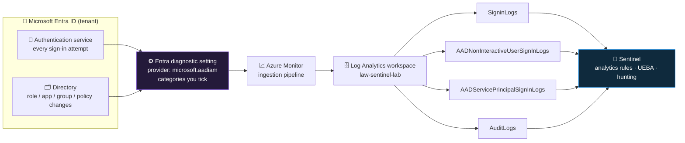

<div align="center">

# 📥 Step 09 · Connect Microsoft Entra ID

### *Sign-in and audit logs — the identity control plane most cloud intrusions run through*

[](../README.md)
[](#)
[](#)

</div>

---

## 🎯 Goal

`SigninLogs` and `AuditLogs` are flowing into `law-sentinel-lab` (plus, if you have the licence and
want them, the non-interactive and service-principal sign-in tables), and you can run a KQL query
that shows your own login, its MFA outcome, and the user/role changes you made back in
[step 05](../05-rbac-and-roles/README.md).

## 🧠 Why this step

Identity is the perimeter now. In a cloud tenant there is no firewall an attacker has to punch
through — there is a login page, and if they have a valid token they are inside. Post-incident
reports for cloud breaches keep landing on the same handful of vectors: password spray, MFA-fatigue
push bombing, adversary-in-the-middle token theft, malicious OAuth app consent, and abuse of an
over-permissioned service principal. **Every one of those leaves its evidence in Entra ID sign-in
and audit logs and almost nowhere else.** If these two data sources are not in your workspace, a
large fraction of the detection templates you will enable in steps 18–19 have no table to run
against, and the identity hunt in [step 44](../44-hunt-identity/README.md) has nothing to hunt.

`SigninLogs` records every interactive authentication: the account, the app being accessed, source
IP and geo, the device, the Conditional Access policies that evaluated, the MFA method used, the
Identity Protection risk score, and — critically — the **result code** that says whether it
succeeded, was blocked, or was challenged. `AuditLogs` records every *change* to the directory: a
user created, a member added to a privileged role, an app granted delegated permissions, a
Conditional Access policy edited, a federation setting changed. Sign-in logs tell you *who tried to
get in*; audit logs tell you *what they did to the tenant once they were in*. Together they answer
"is this account compromised, and what has the attacker touched?" — which is why they are the first
two identity tables Microsoft's own guidance tells you to onboard.

What silently breaks without this step: the workspace looks healthy, connectors show green, but
identity detections produce zero incidents forever because their source table does not exist. That
failure mode is invisible — a rule against a missing table reports "Success" with no results, which
looks identical to a quiet tenant. Teams also routinely get *half* of this wrong: they tick
`SignInLogs` and stop, not realising that token-refresh activity, OAuth token replay, and
workload-identity (service principal) sign-ins live in **separate tables** they never enabled. An
attacker who steals a refresh token and never triggers an interactive sign-in is invisible in
`SigninLogs` alone.

Honest real-world context: the Entra portal keeps sign-in and audit logs for only **7 days** on the
free tier (30 days with a premium licence). That is not long enough to investigate an incident that
was reported late, and it is the main reason you route the logs to Log Analytics — permanent,
queryable, joinable to endpoint and network data. The other thing teams get wrong is cost:
`AADNonInteractiveUserSignInLogs` in a real tenant can be many times the volume of `SigninLogs`, and
unlike `AzureActivity` from [step 08](../08-azure-activity/README.md), Entra logs are **billable
ingestion** at both the Log Analytics and Sentinel tiers. Enable deliberately, measure the volume,
and decide.

## ✅ Prerequisites

| Prerequisite | Why it matters |
|---|---|
| [Step 07](../07-connectors-and-content-hub/README.md) — **Microsoft Entra ID** solution installed from Content hub | Installs the connector definition and the identity rule/workbook templates. Installing it does *not* start data flowing — this step does. |
| [Step 01](../01-log-analytics-workspace/README.md) — workspace `law-sentinel-lab` exists | The diagnostic setting needs a destination; you will paste its resource ID. |
| **Global Administrator** or **Security Administrator** in the tenant | Configuring an Entra ID diagnostic setting is a *tenant-level* directory operation. Owner/Contributor on the subscription or Sentinel Contributor on the workspace is **not** enough — this trips people every time. |
| A read/write path to **Entra admin center → Diagnostic settings** | That is the actual blade the Sentinel connector page sends you to. |
| An Entra ID **P1 or P2** licence (trial is fine) | Required to route **sign-in** logs (interactive, non-interactive, service principal, managed identity) anywhere. `AuditLogs` needs no licence. P2 additionally unlocks the Identity Protection risk tables. A 30-day P2 trial is enough for the lab. |

> [!NOTE]
> If you have no premium licence and do not want the trial, you can still complete a useful version
> of this step: enable **`AuditLogs` only**. You lose sign-in visibility but keep directory-change
> auditing, and the `AuditLogs`-based detections still work.

## 🧭 Concepts

Entra ID is a **tenant** resource, not a subscription resource, so its telemetry is exported the way
every Azure resource exports telemetry to Azure Monitor: through a **diagnostic setting**. You pick
which log *categories* to emit and one or more destinations. Point one at your Log Analytics
workspace and, a few minutes later, rows start appearing in a fixed set of tables. Sentinel does not
"pull" anything — it just runs analytics rules and hunts over tables that Azure Monitor filled.



**Walking the diagram:** the Entra authentication service and the directory each raise events
continuously. The diagnostic setting is a filter-and-route rule you own — nothing leaves Entra until
you create it, and only the categories you enable are emitted. Everything then flows through the
same Azure Monitor pipeline that ingests every other log source, lands in per-category tables in
your workspace, and becomes visible to Sentinel. Note that one logical thing — "a sign-in" — is
split across four tables by *type* of sign-in, because the volumes and the value are wildly
different (see design rationale below). You choose per table whether to pay for it.

### How it works under the hood

- The diagnostic setting is an ARM resource at the special provider path
  `/providers/microsoft.aadiam/diagnosticSettings/<name>`. It is **tenant-global**: it is not inside
  your resource group and it survives deleting the resource group. If you tear down the lab RG later
  without also deleting this setting, it keeps trying to write to a workspace that no longer exists.
- Enabling a category tells the Entra pipeline to serialise those events and hand them to Azure
  Monitor. Azure Monitor maps each category to a fixed table name (`SignInLogs` category →
  `SigninLogs` table — note the different capitalisation) and creates the table on first write. A
  table you have never received data for **does not exist yet** and a query against it 404s; that is
  normal before the first event lands.
- Latency: the Entra portal shows a sign-in within a minute or two, but the Log Analytics copy
  typically lags **15–60 minutes**, and the very first events after you enable the setting can take
  up to roughly **2 hours** while the pipeline warms up. Do not conclude it is broken before then.
- The workspace-side ingestion is billed per GB at the Log Analytics ingestion price *and* the
  Sentinel analytics price. A workspace transformation DCR (covered in
  [step 13](../13-custom-logs-and-dcr-transformations/README.md) and
  [step 16](../16-retention-archive-and-data-lake/README.md)) can drop columns or rows from
  `SigninLogs` at ingest to cut that cost, but you cannot transform the data inside the Entra
  diagnostic setting itself — it only picks categories.
- The Sentinel "Microsoft Entra ID" data-connector page has no independent "on" switch of its own
  for the logs — its **Configuration** section simply deep-links you to the Entra diagnostic
  settings blade. Once the setting exists and points at the Sentinel workspace, the connector page
  flips to **Connected** on its own within a few hours.

### Vocabulary

| Term | What it means |
|---|---|
| **Diagnostic setting** | The Azure Monitor rule that routes a resource's logs/metrics to a destination (workspace, storage, Event Hub). For Entra it lives at the `microsoft.aadiam` provider. |
| **Interactive sign-in** | A sign-in where a human presented a credential (password, passkey, MFA prompt). Lands in `SigninLogs`. |
| **Non-interactive sign-in** | A sign-in performed on a user's behalf by a client using a previously issued token — token refresh, background app calls. Lands in `AADNonInteractiveUserSignInLogs`. Very high volume. |
| **Service principal sign-in** | A workload identity (app registration) authenticating with a client secret or certificate — no user. Lands in `AADServicePrincipalSignInLogs`. Where OAuth-app and CI/CD-credential abuse shows. |
| **Managed identity sign-in** | An Azure-managed workload identity authenticating. Lands in `AADManagedIdentitySignInLogs`. |
| **Audit log** | A record of a *change* to the directory (create user, add to role, consent to app, edit policy). `AuditLogs` table. |
| **Provisioning log** | SCIM user/group provisioning events between Entra and SaaS apps. `AADProvisioningLogs` table. |
| **`ResultType`** | Numeric outcome code on a sign-in. `0` = success; every other value is a failure or a challenge (e.g. `50126` bad password, `50074`/`50076` MFA required, `53003` blocked by Conditional Access). `ResultDescription` is the human-readable version. |
| **Conditional Access (CA)** | Policy engine that allows/blocks/challenges a sign-in based on user, app, device, location, risk. `ConditionalAccessStatus` per sign-in is `success`, `failure`, or `notApplied`. |
| **Security defaults** | A free, all-or-nothing baseline (enforces MFA, blocks legacy auth) for tenants without CA. Mutually exclusive with CA policies. |
| **Sign-in risk vs user risk** | Identity Protection (P2) scores a single sign-in (`RiskLevelDuringSignIn`) and the account overall (`RiskState` / `RiskyUsers`). Exported via the `RiskyUsers` and `UserRiskEvents` categories. |
| **Primary Refresh Token (PRT)** | The long-lived token a joined device holds; token refreshes against it produce non-interactive sign-ins and do **not** re-prompt for MFA — relevant to session-hijack detection. |

### The tables

| Category (in the diagnostic setting) | Table | Contents | Licence |
|---|---|---|---|
| `SignInLogs` | `SigninLogs` | Interactive user sign-ins | P1/P2 |
| `NonInteractiveUserSignInLogs` | `AADNonInteractiveUserSignInLogs` | Token refresh, background client auth — **often several× to 10×+ `SigninLogs` volume** | P1/P2 |
| `ServicePrincipalSignInLogs` | `AADServicePrincipalSignInLogs` | App / workload-identity sign-ins (secret or cert) | P1/P2 |
| `ManagedIdentitySignInLogs` | `AADManagedIdentitySignInLogs` | Managed-identity sign-ins | P1/P2 |
| `AuditLogs` | `AuditLogs` | Directory changes | **Any licence** |
| `ProvisioningLogs` | `AADProvisioningLogs` | SCIM provisioning to SaaS apps | Any licence |
| `RiskyUsers` | `AADRiskyUsers` | Identity Protection — current risk state per user | P2 |
| `UserRiskEvents` | `AADUserRiskEvents` | Identity Protection — individual risk detections | P2 |
| `MicrosoftGraphActivityLogs` | `MicrosoftGraphActivityLogs` | Every Graph API call made in the tenant — powerful for detecting enumeration/exfil, but **very chatty**; newer, verify availability | P1/P2 |
| `ADFSSignInLogs` | `ADFSSignInLogs` | AD FS sign-ins (only if you run federated AD FS) | P1/P2 |

### Where this fits

[Step 08](../08-azure-activity/README.md) brought in the **Azure Resource Manager** control plane
(what happened to *Azure resources*). This step brings in the **identity** control plane (what
happened to *accounts and the directory*). [Step 10](../10-defender-xdr/README.md) adds Defender XDR,
whose Microsoft Defender for Identity component gives you on-prem AD and Kerberos/NTLM visibility
that complements — not duplicates — Entra's cloud sign-in view. Downstream, `SigninLogs` and
`AuditLogs` are consumed by the template rules you enable in
[step 18](../18-enable-a-rule-from-template/README.md), the scheduled brute-force rule you write in
[step 19](../19-write-a-scheduled-rule/README.md), the entity mapping in
[step 20](../20-entity-mapping-and-custom-details/README.md), the MITRE coverage view in
[step 25](../25-mitre-attack-coverage/README.md), the identity hunt in
[step 44](../44-hunt-identity/README.md), and UEBA in
[step 51](../51-ueba-and-entity-behavior/README.md), which reads these tables to build per-user
behavioural baselines. [Step 15](../15-ingestion-health-and-validation/README.md) is where you set
up an alert for the day this feed silently stops.

### Design rationale

Why a tenant diagnostic setting instead of a Sentinel-side connector: Entra ID is not owned by any
subscription, so the only place its export can be configured is Entra/Azure Monitor itself. Sentinel
deliberately stays a *reader* of the resulting tables. Why sign-ins are split into four tables:
in a production tenant the overwhelming majority of sign-in rows are non-interactive token
refreshes that most SOCs do not want to pay to retain, so Microsoft separated them by type and let
you choose per table — keeping `SigninLogs` small and cheap while `AADNonInteractiveUserSignInLogs`
is opt-in. Why sign-in logs are licence-gated: sign-in logs are a paid feature of Entra ID itself
(the same P1 tier that gates Conditional Access and P2 that gates Identity Protection), so routing
them out is gated the same way; audit logs, being basic directory hygiene, are free everywhere.

## 🖱️ Do it — portal

1. **Microsoft Sentinel → Configuration → Data connectors.** Search **Microsoft Entra ID**, select
   it, **Open connector page**. Read the **Instructions** tab — the **Prerequisites** panel shows a
   green tick only if your account holds a tenant admin role *and* the workspace permission. If
   either is red, fix that first (this is the "Contributor is not enough" trap).
2. Under **Configuration → Step 2**, click **Go to Microsoft Entra ID's diagnostic settings** (some
   tenants render it as **Open Entra ID Diagnostic settings**). This takes you to **Entra admin
   center → Monitoring & health → Diagnostic settings**.
3. Click **+ Add diagnostic setting**.
4. **Name:** `entra-to-sentinel`. Use a name you will recognise in an audit — this object is
   tenant-global and long-lived.
5. **Categories** — tick:

   | Category | Lab | Production |
   |---|---|---|
   | `AuditLogs` | ✅ always | ✅ always — cheap, high-signal |
   | `SignInLogs` | ✅ | ✅ |
   | `ServicePrincipalSignInLogs` | ✅ | ✅ — workload-identity compromise hides here |
   | `ManagedIdentitySignInLogs` | ✅ | ✅ — low volume, keep it |
   | `ProvisioningLogs` | ✅ if you use SCIM | ✅ if you use SCIM |
   | `NonInteractiveUserSignInLogs` | ⛔ start off — enable for 24 h later to measure volume | ⚖️ only after you have sized it and decided the cost is worth it, or route it to a cheaper log plan |
   | `RiskyUsers`, `UserRiskEvents` | ✅ if you have P2 | ✅ with P2 — feeds risk-based detections |
   | `MicrosoftGraphActivityLogs` | ⛔ | ⚖️ advanced; very high volume; size before enabling |

6. **Destination details:** tick **Send to Log Analytics workspace**. Subscription =
   `sub-sentinel-lab`, workspace = `law-sentinel-lab`. Leave the **Destination table** as
   **Azure diagnostics** or **Resource specific** if offered — for Entra the tables are fixed
   regardless.
7. **Save.** You should see the new setting listed with the categories you chose. There is no
   "test" button; verification is the Validate section below.
8. Back on the Sentinel connector page, the **Status** stays **Not connected** for a while, then
   flips to **Connected** once rows have landed. Do not keep re-saving the diagnostic setting to try
   to hurry it.

> [!IMPORTANT]
> Entra ID accepts only a limited number of diagnostic settings (as of writing, 5 — the standard
> Azure Monitor limit). Put **all** the categories you want into **one** setting rather than
> spreading them across several; you will run out of slots otherwise, and multiple settings writing
> the same category to the same workspace causes duplicate rows.

## 💻 Do it — CLI / IaC

The `microsoft.aadiam` provider is not a normal ARM resource, so the cleanest scriptable path is a
raw REST `PUT` via `az rest`. It is fully idempotent: the same setting name replaces the setting
in place, so re-running to add or remove a category is safe.

```bash
# --- workspace resource ID (the destination) ---------------------------------
WS=$(az monitor log-analytics workspace show \
      -g rg-sentinel-lab -n law-sentinel-lab \
      --query id -o tsv)                       # /subscriptions/.../workspaces/law-sentinel-lab

# --- the diagnostic-setting body -------------------------------------------
cat > entra-diag.json <<EOF
{
  "properties": {
    "workspaceId": "${WS}",
    "logs": [
      { "category": "SignInLogs",                  "enabled": true  },
      { "category": "AuditLogs",                    "enabled": true  },
      { "category": "ServicePrincipalSignInLogs",   "enabled": true  },
      { "category": "ManagedIdentitySignInLogs",    "enabled": true  },
      { "category": "ProvisioningLogs",             "enabled": true  },
      { "category": "NonInteractiveUserSignInLogs", "enabled": false }
    ]
  }
}
EOF

# --- create or update the setting -----------------------------------------
#  PUT to the aadiam provider; api-version 2017-04-01-preview is the long-standing one.
#  Same name on a later run = in-place update, not a duplicate.
az rest --method put \
  --url "https://management.azure.com/providers/microsoft.aadiam/diagnosticSettings/entra-to-sentinel?api-version=2017-04-01-preview" \
  --body @entra-diag.json
```

Verify the object exists and points where you expect:

```bash
az rest --method get \
  --url "https://management.azure.com/providers/microsoft.aadiam/diagnosticSettings?api-version=2017-04-01-preview" \
  --query "value[].{name:name, workspace:properties.workspaceId, categories:properties.logs[?enabled].category}"
```

> [!NOTE]
> `az monitor diagnostic-settings create --name entra-to-sentinel --resource
> /providers/microsoft.aadiam/diagnosticSettings --workspace "$WS" --logs '[...]'` works in some CLI
> versions and errors with a "resource not found" in others. If it fights you, the `az rest` form
> above is the reliable one — that is exactly the call the portal makes.

Infrastructure-as-code (ARM; the provider is tenant-global so deploy at subscription scope, and the
setting **name must be unique across the whole tenant**):

```json
{
  "$schema": "https://schema.management.azure.com/schemas/2019-04-01/deploymentTemplate.json#",
  "contentVersion": "1.0.0.0",
  "parameters": {
    "workspaceId": { "type": "string" }
  },
  "resources": [
    {
      "type": "microsoft.aadiam/diagnosticSettings",
      "apiVersion": "2017-04-01-preview",
      "name": "entra-to-sentinel",
      "properties": {
        "workspaceId": "[parameters('workspaceId')]",
        "logs": [
          { "category": "SignInLogs",                "enabled": true },
          { "category": "AuditLogs",                  "enabled": true },
          { "category": "ServicePrincipalSignInLogs", "enabled": true },
          { "category": "ManagedIdentitySignInLogs",  "enabled": true },
          { "category": "ProvisioningLogs",           "enabled": true }
        ]
      }
    }
  ]
}
```

```bash
# deploy it (idempotent — redeploying with the same content is a no-op)
az deployment sub create \
  --location eastus \
  --template-file entra-diag.arm.json \
  --parameters workspaceId="$WS"
```

[Step 55](../55-repositories-cicd/README.md) wires templates like this into a Git-driven pipeline
so the whole workspace's connector state is reproducible.

## 🧪 Validate

Generate a fresh event: **sign out of the Azure portal and sign back in once.** Then wait
15–60 minutes (up to ~2 hours on first enablement) and run these in **Sentinel → Logs**.

**1 — your own sign-in, decoded:**

```kusto
SigninLogs
| where TimeGenerated > ago(2h)
| project TimeGenerated, UserPrincipalName, AppDisplayName, IPAddress,
          ResultType, ResultDescription, ConditionalAccessStatus,
          AuthenticationRequirement,
          City = tostring(LocationDetails.city),
          OS   = tostring(DeviceDetail.operatingSystem)
| sort by TimeGenerated desc
```

Column by column: `ResultType == 0` with `ResultDescription` empty is a clean success — that is what
you want to see for your own login. `ConditionalAccessStatus` will likely be `notApplied` in a bare
lab with no CA policies — that is expected, not a problem. `AuthenticationRequirement` shows
`singleFactorAuthentication` or `multiFactorAuthentication` depending on your account.
`LocationDetails` and `DeviceDetail` are dynamic columns — you must `tostring()` a sub-field to
project it.

**2 — directory changes from step 05:**

```kusto
AuditLogs
| where TimeGenerated > ago(7d)
| project TimeGenerated, OperationName, Category, Result,
          Actor      = tostring(InitiatedBy.user.userPrincipalName),
          ActorApp   = tostring(InitiatedBy.app.displayName),
          Target     = tostring(TargetResources[0].displayName),
          TargetType = tostring(TargetResources[0].type)
| sort by TimeGenerated desc
```

`InitiatedBy` is dynamic and populates *either* `.user` *or* `.app`. `TargetResources` is an array;
`[0]` is usually the object that changed. `Result` is `success` or `failure`. **You should see**
`Add user`, `Update user`, and `Add member to role` operations with your UPN as `Actor` — the
account creations and role grants you did in [step 05](../05-rbac-and-roles/README.md).

**3 — is every table actually populated, and how fresh:**

```kusto
union withsource=Table isfuzzy=true
      SigninLogs, AADNonInteractiveUserSignInLogs,
      AADServicePrincipalSignInLogs, AuditLogs, AADProvisioningLogs
| where TimeGenerated > ago(24h)
| summarize Rows = count(), Latest = max(TimeGenerated) by Table
```

A healthy result: `SigninLogs` and `AuditLogs` both have `Rows > 0` and a `Latest` within roughly
the last hour. `withsource=Table` adds a column naming the source table for each row; `isfuzzy=true`
lets the query run even if one of the listed tables has never received data (it is simply absent
from the results rather than erroring the whole query).

**4 — volume, so the bill does not surprise you:**

```kusto
Usage
| where TimeGenerated > ago(24h)
| where IsBillable == true
| where DataType startswith "Signin" or DataType startswith "AAD" or DataType == "AuditLogs"
| summarize GB = round(sum(Quantity) / 1000, 4) by DataType
| sort by GB desc
```

`Quantity` in the `Usage` table is in MB; this path divides by **1000** for GB to match Microsoft's
billing convention and the rest of this course ([step 06](../06-cost-model-and-budget/README.md),
[step 56](../56-cost-engineering/README.md)) — you will see `/1024` in some Microsoft samples, the
difference is ~2.4% and does not change any decision here. If you later enable
`NonInteractiveUserSignInLogs`, re-run this — if `AADNonInteractiveUserSignInLogs` is many times
`SigninLogs`, that is your cue to drop it or move it to a cheaper log plan
([step 16](../16-retention-archive-and-data-lake/README.md)).

**5 — failure-reason breakdown (a first taste of detection):**

```kusto
SigninLogs
| where TimeGenerated > ago(24h)
| where ResultType != 0
| summarize Attempts = count(), Accounts = dcount(UserPrincipalName),
            IPs = dcount(IPAddress) by ResultType, ResultDescription
| sort by Attempts desc
```

In a quiet lab this is mostly empty or a few of your own typos (`50126`). In a real tenant, one
`ResultType` (e.g. `50126`) with a high `Accounts` count from a low `IPs` count is the signature of
**password spray** — the exact pattern the rule in
[step 19](../19-write-a-scheduled-rule/README.md) detects.

## 🚩 Common mistakes

| 🚩 Mistake | Why it bites |
|---|---|
| Configuring this as Subscription Owner / Sentinel Contributor | Neither can touch a tenant-level Entra diagnostic setting. You need Global Admin or Security Administrator. |
| Ticking `SignInLogs` and stopping | Token refresh, OAuth token replay and service-principal auth are in **separate tables**. An attacker using a stolen refresh token never appears in `SigninLogs`. |
| Assuming `AuditLogs` contains sign-ins | It does not. Sign-in success/failure/MFA is only in the sign-in tables. `AuditLogs` is *changes*, not *authentications*. |
| Enabling `NonInteractiveUserSignInLogs` in a busy tenant without sizing it | Commonly several× to 10×+ `SigninLogs` volume — and Entra logs are billable at both LA and Sentinel tiers. |
| Expecting the risk tables (`AADUserRiskEvents`, `AADRiskyUsers`) on free/P1 | They stay empty. Risk detection is a P2 feature. |
| Spreading categories across multiple diagnostic settings | Entra caps you at ~5 settings, and two settings writing the same category to one workspace produce duplicate rows. One setting, all categories. |
| Relying on the Entra portal's 7-day log view for an investigation | That is why you route to Log Analytics. The portal buffer is not an investigation tool. |
| Deleting the lab resource group and thinking Entra logging stopped | The `microsoft.aadiam` setting is tenant-global — it survives RG deletion and keeps writing (or failing to write) to a dead workspace. Delete it explicitly at teardown. |
| Treating every guest/B2B sign-in as an anomaly | Cross-tenant sign-ins (`HomeTenantId != ResourceTenantId`, `CrossTenantAccessType` populated) are normal for collaboration — baseline them before alerting. |
| Two diagnostic settings from two admins, same categories | Silent duplicate ingestion — double cost, inflated counts in every rule. Check for pre-existing settings before adding yours. |

## 🩺 Troubleshooting

| Symptom | Likely cause | Fix |
|---|---|---|
| `SigninLogs` still empty after 60 min, `AuditLogs` fine | No Entra ID P1/P2 licence — sign-in categories cannot route without it | Assign a P1/P2 trial to your account (or tenant), or accept `AuditLogs`-only |
| No rows in *any* table after 2 h, licence is fine | Diagnostic setting saved to a different workspace, or not saved | Entra admin center → Diagnostic settings → open `entra-to-sentinel` → confirm the workspace is `law-sentinel-lab` |
| `SigninLogs` query returns *"'SigninLogs' could not be resolved"* / 404 | Table not created yet — nothing has ever been written to it | Sign in once to generate an event, wait; re-check the setting exists and has `SignInLogs` enabled |
| Categories are greyed out / cannot be ticked in the portal | Missing tenant role, or no premium licence for the sign-in categories | Use an account with Security Administrator or Global Admin; verify the licence |
| `az rest` PUT returns `403 AuthorizationFailed` | Your Azure RBAC identity is not the same as your Entra role, or you lack Security Administrator | Run `az login` as an account that holds the Entra directory role |
| Setting will not save — *"maximum number of diagnostic settings"* | Entra already has ~5 settings | Consolidate categories into one existing setting, or remove an unused one |
| Sentinel connector page stuck on **Not connected** | Rows have not landed yet, or the setting points elsewhere | Confirm with Validate query 3 that `SigninLogs`/`AuditLogs` have rows; the page catches up within a few hours |
| Data flowed for a day, then stopped | Someone edited/deleted the setting, or the workspace **daily cap** was hit | Check the setting; check workspace **Usage and estimated costs → Daily cap** ([step 06](../06-cost-model-and-budget/README.md)) |
| Row counts in every identity rule suddenly doubled | A second diagnostic setting is writing the same categories to the same workspace | List settings (`az rest` GET above); delete the duplicate |
| `AADUserRiskEvents` empty despite P2 | `RiskyUsers` / `UserRiskEvents` categories not enabled, or no risk detection has fired | Add the categories; trigger a risky sign-in (sign in over Tor) or wait for real risk activity |
| `AADNonInteractiveUserSignInLogs` volume spiking the bill | Category enabled in a busy tenant | Disable it, or send it to a Basic/Auxiliary log plan ([step 16](../16-retention-archive-and-data-lake/README.md)) |

## 🎓 Deepen your understanding

1. **Map result codes to intent.** Run Validate query 5 over a real tenant (or your own after a few
   days). For each `ResultType`, decide: does this look like a fat-fingered user, a locked-out
   account, or an attacker? Which single code, seen across many accounts from one IP in a short
   window, *is* password spray? Write your answer — you will build exactly that rule in
   [step 19](../19-write-a-scheduled-rule/README.md).
2. **Interactive vs non-interactive.** Enable `NonInteractiveUserSignInLogs` for 24 hours. Find one
   of your own interactive sign-ins in `SigninLogs`, then find the matching token refreshes in
   `AADNonInteractiveUserSignInLogs`. Why does the refresh not re-evaluate MFA? What does that mean
   for detecting a stolen session that never signs in interactively again?
3. **Size the non-interactive tax.** With that 24 hours of data, run Validate query 4. What multiple
   of `SigninLogs` is the non-interactive table? At the lab's per-GB rates, what would a month cost?
   Decide keep / drop / cheaper-tier and record the number in your `LOG.md`.
4. **Read an audit event fully.** In `AuditLogs`, expand a single `Add member to role` event from
   step 05. What is in `TargetResources`, `InitiatedBy`, and `AdditionalDetails`? Sketch the KQL for
   "someone was added to Global Administrator or Privileged Role Administrator" — this is a real
   detection you will meet again in [step 48](../48-hunt-cloud-control-plane/README.md).
5. **Provoke a Conditional Access decision.** If you have P1, create a CA policy that requires MFA
   for one test app, sign in to it, and find the row. Which fields changed —
   `ConditionalAccessStatus`, `AuthenticationRequirement`, the `ConditionalAccessPolicies` array?
   That array is how you tell *which* policy fired.
6. **Guest vs anomaly.** If you can, invite a guest from another tenant and sign in as them. Compare
   `HomeTenantId`, `ResourceTenantId`, and `CrossTenantAccessType` against your own row. What would
   a naive "sign-in from an unusual tenant" rule get wrong here?

## 🗒️ Log your run

Copy [`_templates/STEP-LOG-TEMPLATE.md`](../_templates/STEP-LOG-TEMPLATE.md) into this folder as
`LOG.md` and fill in as you go. For this step, make the evidence specific:

- The diagnostic-setting **name** and the exact **categories** you enabled.
- Whether you have **P1/P2** and how (existing licence / 30-day trial) — or that you did
  `AuditLogs`-only and why.
- Your **non-interactive decision**: enabled or not, and if you sized it, the volume multiple vs
  `SigninLogs` you measured with Validate query 4.
- First `SigninLogs` row for your own account — **UPN redacted, IP replaced with an RFC 5737
  placeholder** (e.g. `198.51.100.10`), keeping `ResultType`, `ConditionalAccessStatus`,
  `AuthenticationRequirement`.
- The `AuditLogs` output showing your step-05 `Add user` / `Add member to role` operations.
- Validate query 3 output proving both core tables are populated and fresh.

## 📚 Microsoft Learn

- [Connect Microsoft Entra ID data to Microsoft Sentinel](https://learn.microsoft.com/en-us/azure/sentinel/connect-azure-active-directory)
- [Microsoft Sentinel data connectors reference](https://learn.microsoft.com/en-us/azure/sentinel/data-connectors-reference)
- [Microsoft Entra monitoring and health — overview](https://learn.microsoft.com/en-us/entra/identity/monitoring-health/overview-monitoring-health)
- [Sign-in logs in Microsoft Entra ID](https://learn.microsoft.com/en-us/entra/identity/monitoring-health/concept-sign-ins)
- [Audit logs in Microsoft Entra ID](https://learn.microsoft.com/en-us/entra/identity/monitoring-health/concept-audit-logs)
- [`SigninLogs` table schema](https://learn.microsoft.com/en-us/azure/azure-monitor/reference/tables/signinlogs)
- [`AuditLogs` table schema](https://learn.microsoft.com/en-us/azure/azure-monitor/reference/tables/auditlogs)
- [`AADNonInteractiveUserSignInLogs` table schema](https://learn.microsoft.com/en-us/azure/azure-monitor/reference/tables/aadnoninteractiveusersigninlogs)
- [Microsoft Entra authentication and sign-in error codes](https://learn.microsoft.com/en-us/entra/identity-platform/reference-error-codes)
- [Microsoft Learn training — Connect Microsoft services to Microsoft Sentinel](https://learn.microsoft.com/en-us/training/modules/connect-microsoft-services-to-azure-sentinel/)

---

<div align="center">
<sub>

[⬅ Prev: 08 · Azure Activity](../08-azure-activity/README.md) &nbsp;·&nbsp; [🦅 All steps](../README.md) &nbsp;·&nbsp; [Next: 10 · Defender XDR ➡](../10-defender-xdr/README.md)

</sub>
</div>
