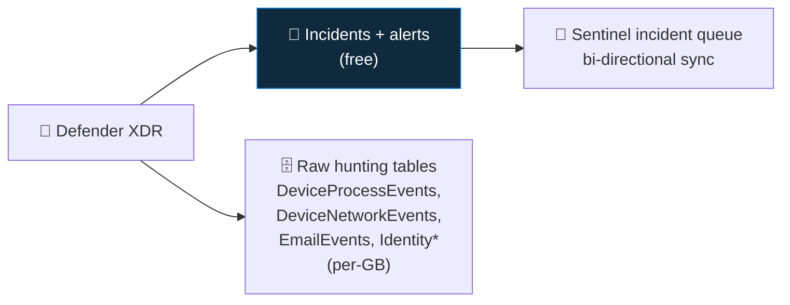

<div align="center">

# 📥 Step 10 · Connect Microsoft Defender XDR

### *XDR incidents and the raw advanced-hunting tables, into Sentinel*

[](../README.md)
[](#)
[](#)

</div>

---

## 🎯 Goal

Defender XDR incidents sync into Sentinel's incident queue, and (optionally) the raw
`Device*` / `Email*` / `Identity*` advanced-hunting tables are streamed in.

## 🧠 Why this step

If your org uses any Defender product (Endpoint, Office, Identity, Cloud Apps), the XDR connector is
the single highest-value connector. **Alert/incident sync is free.** Bringing in the raw hunting
tables (e.g. `DeviceProcessEvents`) costs ingestion but unlocks endpoint hunts (step 45) and
cross-source correlation you can't do in the Defender portal alone.

## ✅ Prerequisites

- [Step 07](../07-connectors-and-content-hub/README.md) — Microsoft Defender XDR solution installed
- **Global Administrator** or **Security Administrator**
- A Defender XDR tenant with at least one workload onboarded (Defender for Endpoint trial on the lab
  VM in step 11 is enough to see data)

## 🧭 Concepts in 60 seconds



**Bi-directional sync**: closing/assigning an incident in Sentinel reflects back to Defender and
vice versa. In step 52 you'll flip to running everything from the Defender portal.

## 🖱️ Do it — portal

1. **Microsoft Sentinel → Data connectors → Microsoft Defender XDR → Open connector page.**
2. **Connect incidents & alerts** → toggle **on**. Optionally turn off the older separate
   Microsoft Defender for Endpoint / Office connectors to avoid duplicate alerts.
3. Under **Connect events**, select the raw tables you want. For the lab, start with
   **DeviceInfo, DeviceProcessEvents, DeviceNetworkEvents, DeviceLogonEvents** only.
4. **Apply Changes.**

## 💻 Do it — CLI / API

```bash
# the XDR connector is managed via the Sentinel connectors API / ARM
az sentinel data-connector list -g rg-sentinel-lab --workspace-name law-sentinel-lab \
  --query "[?kind=='MicrosoftThreatProtection']" -o json
```

> The XDR connector (`MicrosoftThreatProtection` kind) is best deployed by ARM template — see the
> connector's **"Deploy to Azure"** / ARM tab on the connector page, wired into step `55`.

## 🧪 Validate

```kusto
// incident sync
SecurityIncident
| where TimeGenerated > ago(7d)
| where ProviderName == "Microsoft 365 Defender"
| project TimeGenerated, Title, Severity, Status, IncidentNumber
```

```kusto
// raw table streaming (after step 11 gives the VM something to report)
DeviceProcessEvents
| where TimeGenerated > ago(1h)
| summarize count() by DeviceName, InitiatingProcessFileName
| sort by count_ desc
```

**You should see** either XDR incidents appear (if you have prior Defender activity) or an empty but
present `SecurityIncident`/`DeviceProcessEvents` table. Real rows arrive once the VM in step 11 is
generating endpoint telemetry.

## 🚩 Common mistakes

| 🚩 Mistake | Why it bites |
|---|---|
| Enabling XDR *and* the individual MDE/MDO connectors | Duplicate alerts and incidents |
| Streaming every raw table "for completeness" | `DeviceNetworkEvents` + `DeviceFileEvents` can dominate your bill |
| Expecting data with no Defender workload onboarded | The connector is on, but there's nothing upstream producing events |
| Forgetting the sync is bi-directional | A bulk status change in one portal moves incidents in the other |

## 🗒️ Log your run

`LOG.md` — which raw tables you enabled and why, plus the incident-sync query result.

## 📚 Microsoft Learn

- [Connect data from Microsoft Defender XDR to Microsoft Sentinel](https://learn.microsoft.com/en-us/azure/sentinel/connect-microsoft-365-defender)
- [Microsoft Defender XDR integration with Microsoft Sentinel](https://learn.microsoft.com/en-us/azure/sentinel/microsoft-365-defender-sentinel-integration)
- [Advanced hunting tables in Defender XDR](https://learn.microsoft.com/en-us/defender-xdr/advanced-hunting-schema-tables)

---

<div align="center">
<sub>

[⬅ Prev: 09 · Microsoft Entra ID](../09-microsoft-entra-id/README.md) &nbsp;·&nbsp; [🦅 All steps](../README.md) &nbsp;·&nbsp; [Next: 11 · Windows VM (AMA + DCR) ➡](../11-windows-vm-ama-dcr/README.md)

</sub>
</div>
