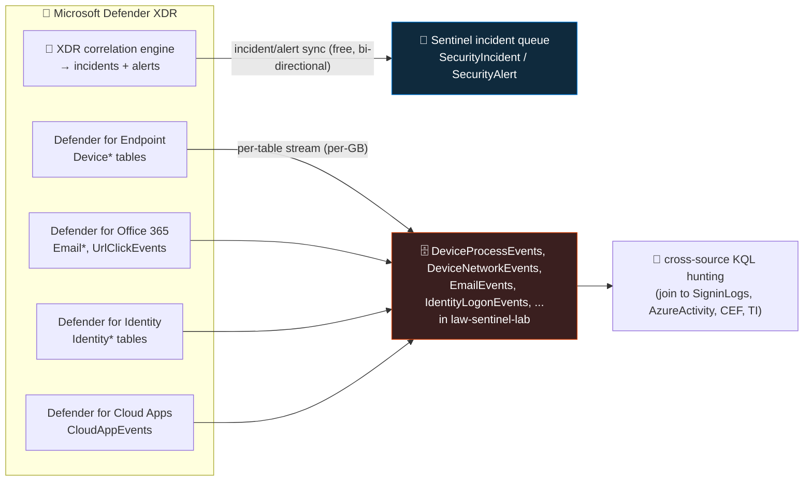

<div align="center">

# 📥 Step 10 · Connect Microsoft Defender XDR

### *XDR incidents into the Sentinel queue, and the raw advanced-hunting tables into KQL*

[](../README.md)
[](#)
[](#)

</div>

---

## 🎯 Goal

Microsoft Defender XDR incidents and alerts sync bi-directionally into Sentinel, you have **chosen
deliberately** which raw `Device*` / `Email*` / `Identity*` / `CloudAppEvents` tables to stream (and
which to leave off for cost), and you can query at least the incident sync in KQL.

## 🧠 Why this step

Microsoft Defender XDR is the umbrella over Defender for Endpoint (devices), Defender for Office 365
(email), Defender for Identity (on-prem AD), and Defender for Cloud Apps (SaaS). If your organisation
runs **any** of those, this is the single highest-value connector you will add, for two separate
reasons.

**One — incident correlation.** XDR already does machine-speed correlation of its own signals into
incidents. Syncing those into Sentinel means your analysts work one queue that contains both
Microsoft's cross-product incidents *and* your custom Sentinel detections, and — because Sentinel can
correlate on shared entities — an XDR endpoint incident and a Sentinel identity incident about the
same user can merge into one story. **Incident and alert sync is free.**

**Two — raw telemetry for hunting.** The Defender portal's advanced-hunting tables
(`DeviceProcessEvents`, `DeviceNetworkEvents`, `EmailEvents`, `IdentityLogonEvents`, …) are the
richest endpoint and email data you can get. Streaming them into your workspace lets you join them
to `SigninLogs`, `AzureActivity`, firewall data, and threat intel in a single query — correlation
you simply cannot do inside the Defender portal alone. This part **costs ingestion per GB**, and
some of those tables are large, so it is a per-table decision, not an on/off switch.

What teams get wrong: they enable the XDR connector *and* leave the older individual "Microsoft
Defender for Endpoint" / "…for Office 365" connectors on, producing **duplicate alerts and
incidents**. They stream every raw table "for completeness" and `DeviceNetworkEvents` +
`DeviceFileEvents` quietly become the biggest line on the bill. Or they turn the connector on in a
tenant with **no Defender workload actually onboarded** and wonder why nothing arrives — the
connector is a pipe, not a source.

## ✅ Prerequisites

- [Step 07](../07-connectors-and-content-hub/README.md) — the **Microsoft Defender XDR** solution
  installed from Content hub. It stages the connector and the XDR-based rule templates.
- **Global Administrator** or **Security Administrator** in the tenant — the connect toggle writes a
  tenant-level integration setting. Workspace-level roles are not enough.
- A **Defender XDR tenant with at least one workload onboarded** and producing data. A Defender for
  Endpoint trial on the lab VM you build in [step 11](../11-windows-vm-ama-dcr/README.md) is enough
  to see `Device*` rows and real endpoint alerts. Without any workload, the connector connects but
  stays empty.
- Appropriate licensing (Microsoft Defender XDR / Microsoft 365 E5 / the relevant individual
  Defender plans). Trials work for the lab.

## 🧭 Concepts

The connector has **two independent halves**, configured on the same page. The **incident/alert
half** subscribes Sentinel to XDR's incident stream — free, bi-directional. The **event half** is a
set of per-table toggles that stream Defender's raw advanced-hunting data into identically-named
tables in your workspace — billable, one decision per table.



**Walking the diagram:** each Defender product produces its own telemetry and alerts. XDR's
correlation engine bundles alerts into incidents; the free sync mirrors those into Sentinel's
`SecurityIncident` / `SecurityAlert` tables and keeps status/assignment in step between the two
portals. Separately, the red box is the raw event data — you opt in per table, you pay per GB, and
the payoff is that you can now `join` `DeviceProcessEvents` to `SigninLogs` in one query, which the
Defender portal's advanced hunting (scoped to Defender data only) cannot do.

### How it works under the hood

- **Connector kind** is `MicrosoftThreatProtection`. Its configuration carries an `incidents`
  toggle plus a `dataTypes` map of table name → `Enabled`/`Disabled`.
- **Incident sync** is a tenant-level subscription, not a per-workspace agent. `SecurityIncident`
  rows from XDR carry a `ProviderName` (historically `Microsoft 365 Defender`; may now read
  `Microsoft Defender XDR` — check your data) and an `AdditionalData` blob linking back to the XDR
  incident. Editing status, owner, or classification on either side propagates to the other, usually
  within a couple of minutes.
- **Event streaming** pushes Defender's advanced-hunting data into your workspace via the Azure
  Monitor pipeline. The tables have the **same names and schemas** as in Defender advanced hunting,
  so a query written in one place mostly runs in the other.
- **The older per-product connectors** (Microsoft Defender for Endpoint, …for Office 365, …for
  Identity, …for Cloud Apps) each synced *their own* alerts. The XDR connector supersedes all of
  them for alert/incident sync. Running both = duplicates. Turn the individual ones **off** once XDR
  is on. (Their *raw event* streaming, where they had it, is also folded into the XDR connector's
  per-table toggles now.)
- **Microsoft Defender for Cloud** is **not** part of XDR — its alerts come through a **separate**
  connector (Tenant-based / Subscription-based Microsoft Defender for Cloud). Don't expect Defender
  for Cloud alerts here.
- **Unified SecOps** ([step 52](../52-unified-secops-defender-portal/README.md)): once you onboard
  the Sentinel workspace into the Defender portal, XDR data is native to that portal and incident
  unification happens automatically — the "connect incidents" relationship is effectively built in.
  You still choose which raw event tables to bring into the Log Analytics workspace for KQL/rules.

### Vocabulary

| Term | Meaning |
|---|---|
| **Defender XDR** | The unified brand (formerly "Microsoft 365 Defender") over Defender for Endpoint / Office 365 / Identity / Cloud Apps, with a shared incident and advanced-hunting layer. |
| **Advanced hunting tables** | Defender's raw event schema — `Device*`, `Email*`, `Identity*`, `CloudAppEvents`, `AlertInfo`, `AlertEvidence`, `UrlClickEvents`. Queried with KQL. |
| **Incident sync** | The free, bi-directional mirroring of XDR incidents/alerts into Sentinel's `SecurityIncident` / `SecurityAlert`. |
| **Event streaming** | The per-table, per-GB opt-in that copies advanced-hunting data into your workspace. |
| **`MicrosoftThreatProtection`** | The Sentinel data-connector `kind` for this integration. |
| **`AlertInfo` / `AlertEvidence`** | XDR alert metadata and the entities/evidence each alert touched — useful to stream even when you skip the bulky `Device*` tables. |
| **Bi-directional sync** | Status/owner/classification changes flow both ways between Sentinel and the Defender portal. |

### Where this fits

This connects the **endpoint and email** control planes, complementing
[step 08](../08-azure-activity/README.md) (Azure resources) and
[step 09](../09-microsoft-entra-id/README.md) (cloud identity). Defender for Identity, part of XDR,
adds on-prem AD / Kerberos / NTLM visibility that Entra's cloud sign-in logs don't have. Downstream,
the raw `Device*` tables are what the endpoint hunt ([step 45](../45-hunt-endpoint/README.md)) and
lateral-movement hunt ([step 46](../46-hunt-lateral-movement/README.md)) run on;
[step 52](../52-unified-secops-defender-portal/README.md) is where you flip to operating all of this
from the Defender portal.

### Design rationale

Splitting the connector into "free incidents" and "paid events" reflects a real cost/value split:
almost every Sentinel customer wants the incident correlation (cheap, high value), while raw event
retention is a deliberate, sometimes expensive choice that depends on your hunting maturity and
budget. Making the streamed tables share names and schemas with Defender advanced hunting means
detection and hunting content is portable between the two products.

## 🖱️ Do it — portal

1. **Open the connector.** Sentinel → **Configuration → Data connectors** → search **Microsoft
   Defender XDR** → **Open connector page**. The **Prerequisites** panel must be all green (tenant
   admin role + the workspace).
2. **Connect incidents & alerts.** In the **Configuration** section, under **Connect incidents &
   alerts**, click **Connect**. This is the free half. If the page warns that individual Defender
   connectors are already enabled, note them — you'll disable them in step 4.
3. **Choose raw event tables** (the paid half). Under **Connect events**, you get a checkbox per
   table. Recommended lab selection — enough for the endpoint and lateral-movement hunts, without
   the biggest cost drivers:
   - ✅ `DeviceInfo`, `DeviceNetworkInfo`
   - ✅ `DeviceProcessEvents`
   - ✅ `DeviceLogonEvents`
   - ✅ `DeviceRegistryEvents`
   - ✅ `AlertInfo`, `AlertEvidence` (small, high value)
   - ⚖️ `DeviceNetworkEvents` — useful for the exfil hunt but can be large; enable and watch the
     `Usage` chart
   - ⛔ `DeviceFileEvents`, `DeviceImageLoadEvents`, `EmailEvents`/`EmailUrlInfo`/`EmailAttachmentInfo`,
     `CloudAppEvents` — leave off for the lab unless you specifically need them; these are the
     volume heavyweights
   Click **Apply changes**.
4. **Disable the superseded connectors.** Go back to Data connectors, open **Microsoft Defender for
   Endpoint** (and …for Office 365, …for Identity, …for Cloud Apps if present) and **disconnect**
   their alert sync so you don't get duplicate alerts/incidents.
5. **Confirm the direction.** Open Sentinel **Settings → Settings → Incident creation** (or the
   connector page) and check that Microsoft incident creation is on, so XDR alerts become Sentinel
   incidents rather than just alerts.

**Lab vs production:**
- *Lab* — the table list above. Watch the `Usage` chart after 24 h and prune.
- *Production* — decide raw-table streaming against your hunting programme and budget. Many mature
  SOCs stream `AlertInfo`/`AlertEvidence` + `DeviceProcessEvents` + `DeviceNetworkEvents` +
  `IdentityLogonEvents` and hunt the rest live in the Defender portal. Always disable the individual
  product connectors.

## 💻 Do it — CLI / IaC

```bash
# inspect the connector's current state (the 'sentinel' CLI extension is preview — read-only use)
az sentinel data-connector list -g rg-sentinel-lab --workspace-name law-sentinel-lab \
  --query "[?kind=='MicrosoftThreatProtection']" -o json
```

The XDR connector is cleanly deployed as ARM — the connector page's **"Connect via ARM template" /
"Deploy to Azure"** option generates it, and [step 55](../55-repositories-cicd/README.md) puts it
under CI/CD. Shape:

```json
{
  "type": "Microsoft.SecurityInsights/dataConnectors",
  "apiVersion": "2024-09-01",
  "name": "<guid>",
  "kind": "MicrosoftThreatProtection",
  "properties": {
    "tenantId": "<tenant-guid>",
    "dataTypes": {
      "incidents": { "state": "Enabled" },
      "alerts":    { "state": "Enabled" },
      "advancedHunting": {
        "DeviceProcessEvents": { "state": "Enabled" },
        "DeviceNetworkEvents": { "state": "Enabled" },
        "DeviceLogonEvents":   { "state": "Enabled" },
        "DeviceRegistryEvents":{ "state": "Enabled" },
        "AlertInfo":           { "state": "Enabled" },
        "AlertEvidence":       { "state": "Enabled" }
      }
    }
  }
}
```

> The exact `dataTypes` shape has evolved across api-versions — generate it from the connector page
> and pin the api-version rather than hand-authoring. Verify against the
> [dataConnectors ARM reference](https://learn.microsoft.com/en-us/azure/templates/microsoft.securityinsights/dataconnectors).

## 🧪 Validate

```kusto
// 1. incident sync — XDR incidents landing in the Sentinel queue
SecurityIncident
| where TimeGenerated > ago(7d)
| where ProviderName has "Defender" or ProviderName has "365"
| summarize Incidents = count(), Latest = max(TimeGenerated) by ProviderName, Status
```

```kusto
// 2. XDR alerts (the building blocks of those incidents)
SecurityAlert
| where TimeGenerated > ago(7d)
| where ProductName has "Defender"
| summarize count() by ProductName, AlertSeverity
```

```kusto
// 3. raw event streaming — only meaningful once the step-11 VM is onboarded to Defender for Endpoint
DeviceProcessEvents
| where TimeGenerated > ago(1h)
| summarize Events = count() by DeviceName, InitiatingProcessFileName
| sort by Events desc
```

```kusto
// 4. cost — what are the streamed tables costing you
Usage
| where TimeGenerated > ago(1d) and IsBillable == true
| where DataType startswith "Device" or DataType startswith "Email" or DataType startswith "Identity" or DataType in ("AlertInfo","AlertEvidence","CloudAppEvents")
| summarize GB = round(sum(Quantity)/1000, 3) by DataType
| sort by GB desc
```

Read it:

| Check | Healthy | Unhealthy |
|---|---|---|
| Query 1 | `ProviderName` shows a Defender provider with `Incidents > 0` (if you have prior Defender activity) or an empty-but-present table | `SecurityIncident` 404s (solution not installed) |
| Query 3 | Rows once the VM is onboarded; empty-but-present before that | Table 404s = you didn't enable that raw table in the connector |
| Query 4 | The `Device*` tables you enabled, at volumes you're comfortable with | `DeviceNetworkEvents` or `DeviceFileEvents` dwarfing everything — prune |

**You should see** the incident-sync path working (even if empty in a fresh tenant) and, after
[step 11](../11-windows-vm-ama-dcr/README.md), real `DeviceProcessEvents` rows for your lab VM.
A quick end-to-end proof: run `calc.exe` on the lab VM, then find it in `DeviceProcessEvents` within
~10 minutes.

## 🚩 Common mistakes

| 🚩 Mistake | Why it bites |
|---|---|
| Enabling XDR **and** the individual MDE / MDO / MDI / MDCA connectors | Duplicate alerts and duplicate incidents in the queue |
| Streaming every raw table "to be safe" | `DeviceNetworkEvents` + `DeviceFileEvents` + `EmailEvents` can become the largest cost on the bill |
| Turning the connector on with no Defender workload onboarded | Connector connects, nothing arrives — it's a pipe, not a source |
| Expecting **Defender for Cloud** alerts here | Those come via a separate connector entirely |
| Forgetting the sync is bi-directional | Bulk-closing incidents in Sentinel bulk-closes them in the Defender portal, and vice versa |
| Streaming `Device*` but not `AlertInfo`/`AlertEvidence` | You have the noise without the alert context that makes it useful |
| Assuming the streamed tables are identical to Defender advanced hunting forever | Schema parity is close but not guaranteed 100%; test critical queries in both |

## 🩺 Troubleshooting

| Symptom | Likely cause | Fix |
|---|---|---|
| Connector shows Connected, `SecurityIncident` has no Defender rows | No XDR incidents generated yet (quiet tenant), or the individual connectors are creating them under a different `ProviderName` | Generate a test alert (EICAR file on the VM); check `SecurityAlert` for `ProductName has "Defender"` |
| `DeviceProcessEvents` 404s | That table wasn't ticked under **Connect events**, or streaming was applied but no device is reporting | Connector page → Connect events → enable it; confirm a device is onboarded in the Defender portal |
| Duplicate incidents, near-identical titles | The old MDE/MDO connector is still enabled alongside XDR | Data connectors → open each individual Defender connector → **Disconnect** |
| Incident status changes in Sentinel don't reach the Defender portal | Sync lag (usually < 5 min), or the incident originated as a pure Sentinel incident (nothing to sync back) | Wait; verify the incident has an XDR provider and a linked XDR incident ID |
| `az sentinel data-connector list` errors | Preview `sentinel` extension out of date, or wrong `--workspace-name` | `az extension update -n sentinel`; pass the workspace name, not the RG |
| Raw-table volume much higher than expected | `DeviceNetworkEvents` in a busy environment, or `EmailEvents` in a large tenant | Disable the offender; hunt that data live in the Defender portal instead of retaining it |
| After onboarding to the Defender portal (step 52), the connector page looks different / "managed" | Expected — unified SecOps changes the integration model; incident unification is now automatic | Manage raw-table streaming from the connector page; don't try to also run the legacy incident-sync toggle |

## 🎓 Deepen your understanding

1. Run query 2 and query 3. One is *free*, one is *billable*. Which is which, and why would Microsoft give away incident sync but charge for raw events? What does that tell you about where the product wants you to hunt?
2. Onboard the [step 11](../11-windows-vm-ama-dcr/README.md) VM to Defender for Endpoint, drop an EICAR test file on it, and trace the result: which `SecurityAlert` row, which `SecurityIncident`, and — if you enabled them — which `DeviceProcessEvents` / `DeviceFileEvents` rows show the file being written?
3. Write a query that `join`s `DeviceLogonEvents` to `SigninLogs` on the account, over the last day. This is the thing the Defender portal's advanced hunting *cannot* do. What question does that join answer that neither table answers alone?
4. Compare `AlertEvidence` for one XDR alert with the `Entities` column of the matching `SecurityAlert` row in Sentinel. How much entity context is preserved across the sync?
5. You have a $15 budget. `DeviceNetworkEvents` for your lab VM is running at 0.2 GB/day. At the analytics rate, how many days until it alone consumes the budget? Would you keep it, move it to a Basic-tier table ([step 16](../16-retention-archive-and-data-lake/README.md)), or hunt it live?

## 🗒️ Log your run

Copy [`_templates/STEP-LOG-TEMPLATE.md`](../_templates/STEP-LOG-TEMPLATE.md) into this folder as
`LOG.md`. Record: the incident-sync connect (and which individual connectors you disabled), the
exact list of raw tables you enabled **and your reasoning for each**, query 1's output, and query
4's per-table GB after 24 hours.

## 📚 Microsoft Learn

- [Connect data from Microsoft Defender XDR to Microsoft Sentinel](https://learn.microsoft.com/en-us/azure/sentinel/connect-microsoft-365-defender)
- [Microsoft Defender XDR integration with Microsoft Sentinel](https://learn.microsoft.com/en-us/azure/sentinel/microsoft-365-defender-sentinel-integration)
- [Advanced hunting in the Microsoft Defender portal](https://learn.microsoft.com/en-us/defender-xdr/advanced-hunting-overview)
- [Advanced hunting schema tables](https://learn.microsoft.com/en-us/defender-xdr/advanced-hunting-schema-tables)
- [Microsoft Sentinel in the Microsoft Defender portal (unified SecOps)](https://learn.microsoft.com/en-us/azure/sentinel/microsoft-sentinel-defender-portal)
- [dataConnectors ARM template reference](https://learn.microsoft.com/en-us/azure/templates/microsoft.securityinsights/dataconnectors)

---

<div align="center">
<sub>

[⬅ Prev: 09 · Microsoft Entra ID](../09-microsoft-entra-id/README.md) &nbsp;·&nbsp; [🦅 All steps](../README.md) &nbsp;·&nbsp; [Next: 11 · Windows VM (AMA + DCR) ➡](../11-windows-vm-ama-dcr/README.md)

</sub>
</div>
