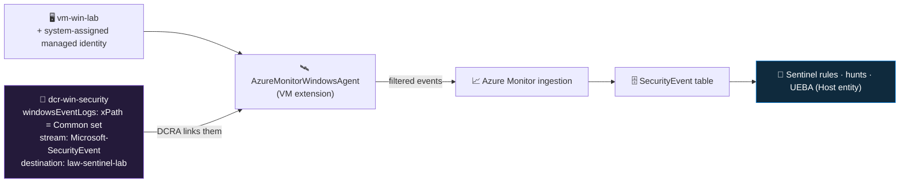

<div align="center">

# 📥 Step 11 · Windows VM — Azure Monitor Agent + DCR

### *Collect a curated set of Windows Security events from a real machine — without blowing the budget*

[](../README.md)
[](#)
[](#)

</div>

---

## 🎯 Goal

A small Windows VM in `rg-sentinel-lab` runs the Azure Monitor Agent, a Data Collection Rule sends
the **Common** Windows Security event set to the `SecurityEvent` table, you can see your own logons
and a deliberate failed logon in KQL, and you have checked what one day of that data costs.

## 🧠 Why this step

Windows Security events are the bedrock of endpoint detection. Logon success and failure (4624 /
4625), process creation (4688), account and group changes (4720 / 4728 / 4732), privilege use
(4672), service installs (7045), scheduled-task creation (4698) — these are the raw material for the
brute-force rule you write in [step 19](../19-write-a-scheduled-rule/README.md), the endpoint hunt
in [step 45](../45-hunt-endpoint/README.md), and the lateral-movement hunt in
[step 46](../46-hunt-lateral-movement/README.md). Without a Windows machine reporting, a large chunk
of the SIEM has nothing to detect on.

This is also **the step most likely to cost you real money**, in two ways. The **VM itself** bills
for compute every hour it runs — leave it on overnight and it meters around the clock. And the
**event volume**: the *All Security Events* profile from a single moderately busy Windows box can be
**gigabytes per day**, which at analytics-tier ingestion rates burns your
[step 06](../06-cost-model-and-budget/README.md) budget in days. The **Common** profile — a curated
list of security-relevant event IDs — is one to two orders of magnitude smaller and covers
essentially everything a lab needs.

The other classic mistake is **networking**. It is tempting to give the VM a public IP and an
inbound RDP rule so you can connect easily. That is building an internet-exposed Windows box with
RDP open — a genuine attack surface, and if you leave it up you have accidentally built a honeypot
that real internet scanners *will* find. Connect via the **serial console** (free) or a
**just-in-time / temporary NSG rule locked to your own IP**, and never leave inbound RDP open to the
world.

> [!IMPORTANT]
> **Do not reach for Azure Bastion as the default.** Bastion Standard runs on the order of
> **$140/month** whether or not you use it — it is a common lab overspend. For a single lab VM the
> **serial console** (no networking at all) or a **time-boxed NSG rule scoped to your public IP** is
> enough. If you want Bastion, use the **Developer/Basic** SKU and delete it between sessions.

## ✅ Prerequisites

- [Step 06](../06-cost-model-and-budget/README.md) — **budget alert live.** You are about to create
  the first resources that meter money. The 50/80/100% alert is your safety net.
- [Step 07](../07-connectors-and-content-hub/README.md) — the **Windows Security Events** solution
  installed from Content hub (stages the *Windows Security Events via AMA* connector and its rule
  templates).
- **Contributor** on `rg-sentinel-lab` — to create the VM, the DCR, and the association.
- A region that matches your workspace ([step 01](../01-log-analytics-workspace/README.md)) —
  cross-region agent data adds egress cost.

## 🧭 Concepts

Three objects work together. The **Azure Monitor Agent (AMA)** is a VM extension that reads local
logs. A **Data Collection Rule (DCR)** is a standalone Azure resource that declares *what* to collect
(which event log, filtered by an **xPath** query) and *where to send it* (a destination workspace).
A **Data Collection Rule Association (DCRA)** links a DCR to one or more machines. One DCR can serve
many VMs; one VM can have several DCRs.



**Walking the diagram:** AMA authenticates as the VM's **managed identity** and pulls its
configuration from every DCR associated with the VM. `dcr-win-security` tells it to read the
**Security** event log, keep only the events matching the Common-set xPath filter, tag them as the
`Microsoft-SecurityEvent` stream, and ship them to your workspace, where they land in the
`SecurityEvent` table. Sentinel then treats `SecurityEvent` like any other table — and the **Host**
entity in the investigation graph is populated from it.

### How it works under the hood

- **AMA replaced the legacy agents.** The Log Analytics agent (MMA / OMS agent) reached
  **end of support on 31 August 2024**. Any workspace still relying on it silently stopped receiving
  that data. AMA is the only supported path now, and it is **DCR-driven** — there is no
  agent-side config, everything is in the DCR.
- **The DCR is a real ARM resource** (`Microsoft.Insights/dataCollectionRules`) in your resource
  group. It is reusable and version-controllable ([step 55](../55-repositories-cicd/README.md)).
- **The xPath filter runs on the VM**, before the data is sent — so filtering in the DCR genuinely
  reduces what you pay to ingest, unlike filtering later in an analytics rule.
- **Event set profiles** in the connector wizard map to xPath:
  - **All Security Events** — the entire Security log. Do not use this in a lab.
  - **Common** — a curated list of ~30 security-relevant event IDs (logon, process, account, group,
    privilege, policy, service, task). This is the right lab choice.
  - **Minimal** — a smaller subset (roughly logon/logoff + a few account events).
  - **Custom** — you write the xPath yourself.
- **Command-line auditing:** event 4688 only includes `ProcessCommandLine` (`CommandLine` in
  `SecurityEvent`) if the Windows audit policy *"Include command line in process creation events"*
  is enabled **and** `Audit Process Creation` is on. The hunts in
  [step 45](../45-hunt-endpoint/README.md) need this — enable it on the VM.
- **Two Windows streams:** `Microsoft-SecurityEvent` → `SecurityEvent` table (the Security log);
  `Microsoft-WindowsEvent` → `Event` table (Application, System, Sysmon, PowerShell operational,
  etc.). This step does the first; you can add the second later for Sysmon/PowerShell logging.

### Vocabulary

| Term | Meaning |
|---|---|
| **Azure Monitor Agent (AMA)** | The current, DCR-driven telemetry agent. Extension name `AzureMonitorWindowsAgent`, publisher `Microsoft.Azure.Monitor`. |
| **Data Collection Rule (DCR)** | Standalone resource declaring what to collect and where to send it. |
| **DCR Association (DCRA)** | The link between a DCR and a target machine (or Arc server, or scale set). |
| **xPath query** | A Windows event-log filter expression, e.g. `Security!*[System[(EventID=4624 or EventID=4625)]]`. Applied on the endpoint. |
| **Event set (All / Common / Minimal / Custom)** | Connector-wizard presets that generate an xPath. |
| **`LogonType`** | On 4624/4625: 2 = interactive, 3 = network, 4 = batch, 5 = service, 7 = unlock, 8 = network-cleartext, 9 = new-credentials (runas /netonly), 10 = RemoteInteractive (RDP), 11 = cached. |
| **Keywords bitmask** | A way to filter audit *success* vs *failure* in xPath: `band(Keywords, …)`. |
| **Azure Arc** | The service that lets AMA + DCRs also collect from non-Azure (on-prem / other cloud) Windows and Linux servers. Same model. |

### Where this fits

First **endpoint** source of the phase. It complements [step 10](../10-defender-xdr/README.md) — if
you have Defender for Endpoint, `DeviceProcessEvents` from XDR and `SecurityEvent` from AMA overlap
partially; many SOCs run both because they carry different fields and Defender may not cover every
server. This table is consumed by [step 18](../18-enable-a-rule-from-template/README.md),
[step 19](../19-write-a-scheduled-rule/README.md), [step 45](../45-hunt-endpoint/README.md),
[step 46](../46-hunt-lateral-movement/README.md), and the health check in
[step 15](../15-ingestion-health-and-validation/README.md). The same AMA + DCR model does Linux
syslog in [step 12](../12-linux-syslog-cef-ama/README.md).

### Design rationale

Microsoft moved from agent-side config to DCRs so that "what we collect" is a declarative,
centrally-managed, version-controllable resource rather than a setting on hundreds of machines. The
event-set presets exist because the *All* option is a cost trap and most customers cannot name the
30 event IDs that actually matter — Common encodes that knowledge.

## 🖱️ Do it — portal

1. **Create the VM.** Portal → **Virtual machines → Create → Azure virtual machine**:
   - Resource group `rg-sentinel-lab`, name `vm-win-lab`, region = your workspace region.
   - Image **Windows Server 2022 Datacenter** (Azure Edition is fine), size **Standard_B2s**
     (2 vCPU / 4 GiB — enough for a lab; B1s is too small for Server 2022).
   - **Administrator account**: a username you record and a strong password.
   - **Inbound port rules**: **None**. Do **not** allow RDP.
   - **Management** tab → **Enable auto-shutdown** → set a time in your evening → **Save**.
   - **Monitoring / Identity**: leave defaults; the DCR wizard will turn on the managed identity and
     install AMA.
   - Review + create.
2. **Connect to it** to prove it works: VM → **Connect → Serial console** (needs boot diagnostics
   on, which is default), or add a **temporary** inbound NSG rule for RDP scoped to **My IP
   address** only, connect, then **delete the rule** when done.
3. **Enable command-line auditing** (for later hunts): on the VM, `gpedit.msc` → Computer
   Configuration → Administrative Templates → System → Audit Process Creation → *Include command
   line in process creation events* → **Enabled**; and Local Security Policy → Advanced Audit Policy
   → Detailed Tracking → **Audit Process Creation: Success**.
4. **Create the DCR.** Sentinel → **Configuration → Data connectors** → **Windows Security Events
   via AMA** → **Open connector page** → **+ Create data collection rule**:
   - Name `dcr-win-security`, resource group `rg-sentinel-lab`.
   - **Resources** tab → **+ Add resource** → `vm-win-lab`. (This assigns the VM a managed identity
     and installs the AMA extension automatically — watch **VM → Extensions** for
     `AzureMonitorWindowsAgent` to go to *Provisioning succeeded*.)
   - **Collect** tab → event set **Common**.
   - Review + create.

**Lab vs production:**
- *Lab* — Common set, one small VM, auto-shutdown on, no public IP.
- *Production* — Common as the baseline; add specific event IDs via Custom xPath for compliance
  (e.g. 4719 audit-policy-change, 1102 log-clear). Deploy the DCR + AMA at scale via **Azure
  Policy** so every new VM gets it. Domain controllers need their own, heavier DCR — and a cost
  conversation.

## 💻 Do it — CLI / IaC

```bash
LOC=eastus
RG=rg-sentinel-lab

# 1. the VM: no public IP, no inbound NSG rule, system-assigned identity for AMA
az vm create -g $RG -n vm-win-lab \
  --image Win2022Datacenter --size Standard_B2s \
  --admin-username azureuser --admin-password '<a-strong-password>' \
  --public-ip-address "" --nsg-rule NONE \
  --assign-identity '[system]'                        # AMA authenticates as this identity

# auto-shutdown at 19:00 local
az vm auto-shutdown -g $RG -n vm-win-lab --time 1900

WS=$(az monitor log-analytics workspace show -g $RG -n law-sentinel-lab --query id -o tsv)
VM=$(az vm show -g $RG -n vm-win-lab --query id -o tsv)

# 2. the DCR. The xPath below is the audit success+failure keyword filter used by the "Common"-style
#    preset; the wizard-generated Common xPath enumerates ~30 specific EventIDs — see the Learn link.
az monitor data-collection rule create -g $RG -n dcr-win-security -l $LOC \
  --data-flows '[{"streams":["Microsoft-SecurityEvent"],"destinations":["la"]}]' \
  --destinations "{\"logAnalytics\":[{\"workspaceResourceId\":\"$WS\",\"name\":\"la\"}]}" \
  --windows-event-logs '[{
     "streams":["Microsoft-SecurityEvent"],
     "xPathQueries":["Security!*[System[(band(Keywords,13510798882111488))]]"],
     "name":"securityCommon"
  }]'

DCR=$(az monitor data-collection rule show -g $RG -n dcr-win-security --query id -o tsv)

# 3. associate the DCR with the VM
az monitor data-collection rule association create \
  -n dcr-win-security-assoc --rule-id "$DCR" --resource "$VM"

# 4. install AMA (the association does this in the portal; explicit here). Idempotent.
az vm extension set -g $RG --vm-name vm-win-lab \
  -n AzureMonitorWindowsAgent --publisher Microsoft.Azure.Monitor \
  --enable-auto-upgrade true
```

> Prefer the **wizard-generated Common xPath** (an explicit EventID list) for production — export it
> from a DCR the portal made, or copy it from
> [Windows security event sets](https://learn.microsoft.com/en-us/azure/sentinel/windows-security-event-id-reference).
> Pin the DCR as Bicep/ARM for [step 55](../55-repositories-cicd/README.md).

## 🧪 Validate

On the VM: lock and unlock the session, then **fail a logon on purpose** (log off and type a wrong
password once, or `runas /user:vm-win-lab\baduser cmd` and enter a wrong password). Wait ~10 min,
then in **Sentinel → Logs**:

```kusto
// 1. what event IDs are arriving
SecurityEvent
| where TimeGenerated > ago(1h) and Computer has "vm-win-lab"
| summarize Events = count() by EventID, Activity
| sort by Events desc
```

```kusto
// 2. your logons and your deliberate failure
SecurityEvent
| where TimeGenerated > ago(1h) and EventID in (4624, 4625)
| project TimeGenerated, EventID, Activity, Computer, TargetUserName,
          IpAddress, LogonType, SubStatus, Status, FailureReason
| sort by TimeGenerated desc
```

```kusto
// 3. is command-line auditing on? (needed for step 45)
SecurityEvent
| where TimeGenerated > ago(1h) and EventID == 4688
| project TimeGenerated, Computer, NewProcessName, CommandLine, ParentProcessName
| take 10
```

```kusto
// 4. cost — one day of this VM's SecurityEvent volume
Usage
| where TimeGenerated > ago(1d) and DataType == "SecurityEvent" and IsBillable == true
| summarize GB = round(sum(Quantity)/1000, 4)
```

Read it:

| Check | Healthy | Unhealthy |
|---|---|---|
| Query 1 | 4624, 4634/4647, 4672, 4688, plus your 4625; a few dozen event IDs total | Hundreds of distinct IDs and thousands of rows = you're on **All**, not Common |
| Query 2 | `LogonType` populated (2 = interactive, 10 = RDP), `SubStatus` on 4625 explains *why* it failed (`0xC000006A` bad password, `0xC0000064` no such user) | table 404 = DCR not associated or AMA not installed |
| Query 3 | `CommandLine` column populated | `CommandLine` empty = enable command-line auditing (step 3 above) |
| Query 4 | tens of MB (a few hundredths of a GB) for a lightly used lab VM | climbing toward 1 GB/day = switch the DCR to **Minimal** or tighten the xPath |

**You should see** your interactive logons, your RDP session if you used one, and your deliberate
4625 with a `SubStatus` explaining the failure. If `SecurityEvent` 404s after 15 minutes: check
**VM → Extensions** shows `AzureMonitorWindowsAgent` succeeded, and the DCR's **Resources** tab
lists the VM.

## 🚩 Common mistakes

| 🚩 Mistake | Why it bites |
|---|---|
| Choosing the **All Security Events** set | Gigabytes/day from one VM — budget alert within days |
| Public IP + inbound RDP rule to `Any` | An internet-exposed RDP box; real scanners will find and brute-force it |
| Defaulting to **Azure Bastion** for access | Standard SKU is ~$140/month idle — a well-known lab overspend; use serial console or a scoped NSG rule |
| Leaving the VM running between sessions | Compute *and* ingestion bill 24/7 — set auto-shutdown |
| Expecting the legacy MMA agent to still work | End of support Aug 2024; that data path is dead — AMA only |
| DCR created but **not associated** with the VM | AMA installs, pulls no config, sends nothing |
| No command-line auditing | `CommandLine` is blank and the step-45 LOLBin hunts can't run |
| VM and workspace in different regions | Cross-region ingestion egress cost, and some features expect co-location |
| Deleting the DCR but not the VM | VM keeps billing compute with nothing being collected |

## 🩺 Troubleshooting

| Symptom | Likely cause | Fix |
|---|---|---|
| `SecurityEvent` 404s 20 min after setup | DCR association missing, or AMA extension failed to install | VM → **Extensions** — is `AzureMonitorWindowsAgent` *succeeded*? DCR → **Resources** — is the VM listed? Re-add if not |
| AMA extension stuck *Transitioning* / *Failed* | VM has no managed identity, or no outbound internet / no route to `*.handler.control.monitor.azure.com` and `*.ingest.monitor.azure.com` | Assign a system identity (`az vm identity assign`); ensure outbound 443 (or a Private Link scope) |
| Data flows but no 4688 / no `CommandLine` | Audit Process Creation off, or the command-line policy not enabled | Enable both on the VM (portal step 3); events appear on the next process start |
| Way more rows than expected | Event set is **All**, or a Custom xPath is too broad | Recreate/edit the DCR with **Common**; check the `xPathQueries` value |
| `Computer` field is the short hostname, breaking a `join` on FQDN | Windows reports NetBIOS name unless domain-joined | Normalise with `tolower(tostring(split(Computer,'.')[0]))` on both sides of the join |
| Events stop after a while | VM auto-shutdown did its job (expected), or AMA lost outbound connectivity, or workspace daily cap hit | Start the VM; check AMA status; check **Usage and estimated costs → Daily cap** |
| Duplicate `SecurityEvent` rows | Two DCRs with overlapping xPath associated to the same VM, or MMA + AMA both installed | Remove the legacy agent; consolidate to one DCR |
| Serial console shows *"console not available"* | Boot diagnostics disabled | VM → **Boot diagnostics → Settings → Enable with managed storage account → Save** |

## 🎓 Deepen your understanding

1. Export the xPath from a DCR the portal created with the **Common** preset. Count the EventIDs. Are there any you'd add (think: audit policy change, log cleared) or remove for your environment?
2. Fail a logon three ways — wrong password, non-existent user, disabled account — and compare the `SubStatus` / `Status` codes on the three 4625 events. Which code would you key a "targeted account" detection on?
3. RDP into the VM. Find the 4624 for that session — what `LogonType` is it, and what other event IDs cluster around it (4672? 4648?)? This cluster is what [step 46](../46-hunt-lateral-movement/README.md) looks for.
4. Compare one process-start as seen in `SecurityEvent` 4688 versus (if you did step 10) the same process in `DeviceProcessEvents`. Which fields does each have that the other lacks? Why might a SOC ingest both?
5. Your DCR sends to one workspace. How would you change it to *also* send a copy to a second workspace or to Event Hub? What does that cost, and when is it worth it (hint: [step 53](../53-workspace-architecture/README.md), SIEM migration in [step 60](../60-siem-migration/README.md))?

## 🗒️ Log your run

Copy [`_templates/STEP-LOG-TEMPLATE.md`](../_templates/STEP-LOG-TEMPLATE.md) into this folder as
`LOG.md`. Record: VM size and region, how you connected (serial console / scoped NSG rule — **not**
Bastion), the event set chosen, whether command-line auditing is on, the query-1 EventID summary,
and the **query-4 daily GB** for `SecurityEvent`. Note your auto-shutdown time.

## 📚 Microsoft Learn

- [Windows Security Events via AMA connector for Microsoft Sentinel](https://learn.microsoft.com/en-us/azure/sentinel/connect-services-windows-based)
- [Windows security event sets that can be sent to Microsoft Sentinel](https://learn.microsoft.com/en-us/azure/sentinel/windows-security-event-id-reference)
- [Azure Monitor Agent overview](https://learn.microsoft.com/en-us/azure/azure-monitor/agents/azure-monitor-agent-overview)
- [Data collection rules in Azure Monitor](https://learn.microsoft.com/en-us/azure/azure-monitor/essentials/data-collection-rule-overview)
- [Collect Windows events with Azure Monitor Agent](https://learn.microsoft.com/en-us/azure/azure-monitor/agents/data-collection-windows-events)
- [Migrate from the Log Analytics agent to Azure Monitor Agent](https://learn.microsoft.com/en-us/azure/azure-monitor/agents/azure-monitor-agent-migration)
- [SecurityEvent table schema](https://learn.microsoft.com/en-us/azure/azure-monitor/reference/tables/securityevent)

---

<div align="center">
<sub>

[⬅ Prev: 10 · Defender XDR](../10-defender-xdr/README.md) &nbsp;·&nbsp; [🦅 All steps](../README.md) &nbsp;·&nbsp; [Next: 12 · Linux syslog / CEF (AMA) ➡](../12-linux-syslog-cef-ama/README.md)

</sub>
</div>
