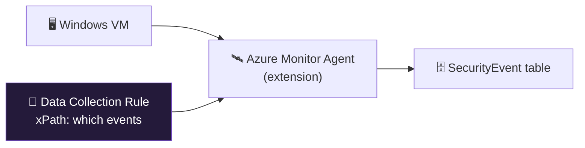

<div align="center">

# 📥 Step 11 · Windows VM — Azure Monitor Agent + DCR

### *Collect Windows Security events from a real machine*

[](../README.md)
[](#)
[-E3B341?style=flat-square)](#)

</div>

---

## 🎯 Goal

A small Windows VM sends a **curated** set of Security events into `SecurityEvent` via the Azure
Monitor Agent and a Data Collection Rule, and you can see logons in KQL.

## 🧠 Why this step

Endpoint security events (logon success/failure, process creation, account changes) are the raw
material for half your detections and every endpoint hunt. This is also the step most likely to
blow your budget — "All events" from one Windows box can be gigabytes a day. You'll use the
**Common** event set, not All.

## ✅ Prerequisites

- [Step 06](../06-cost-model-and-budget/README.md) — budget alert live (you need it now)
- [Step 07](../07-connectors-and-content-hub/README.md) — Windows Security Events solution installed

## 🧭 Concepts in 60 seconds



- **AMA** replaces the legacy MMA/Log Analytics agent (retired Aug 2024).
- A **DCR** says *what* to collect and *where to send it*. Association links a DCR to a VM.
- Event set choices: **All / Common / Minimal / Custom (xPath)**. Use **Common** for the lab.

## 🖱️ Do it — portal

1. **Create the VM.** Virtual machines → Create → `vm-win-lab`, `Windows Server 2022`, size
   **B2s**, resource group `rg-sentinel-lab`. Networking: **no public inbound** — you'll use
   Bastion or serial console, or a temporary NSG rule locked to your IP. Auto-shutdown **on** at a
   fixed evening time.
2. **Data connectors → Windows Security Events via AMA → Open connector page → + Create data
   collection rule.**
3. Name `dcr-win-security`, resource group `rg-sentinel-lab`. **Resources** tab → add `vm-win-lab`
   (this installs AMA automatically). **Collect** tab → **Common**. **Review + Create.**

## 💻 Do it — CLI

```bash
LOC=eastus
az vm create -g rg-sentinel-lab -n vm-win-lab --image Win2022Datacenter \
  --size Standard_B2s --admin-username azureuser --admin-password '<use-a-strong-one>' \
  --public-ip-address "" --nsg-rule NONE

WS=$(az monitor log-analytics workspace show -g rg-sentinel-lab -n law-sentinel-lab --query id -o tsv)
VM=$(az vm show -g rg-sentinel-lab -n vm-win-lab --query id -o tsv)

az monitor data-collection rule create -g rg-sentinel-lab -n dcr-win-security -l $LOC \
  --data-flows '[{"streams":["Microsoft-SecurityEvent"],"destinations":["la"]}]' \
  --destinations "{\"logAnalytics\":[{\"workspaceResourceId\":\"$WS\",\"name\":\"la\"}]}" \
  --windows-event-logs '[{"streams":["Microsoft-SecurityEvent"],"xPathQueries":["Security!*[System[(band(Keywords,13510798882111488))]]"],"name":"common"}]'

DCR=$(az monitor data-collection rule show -g rg-sentinel-lab -n dcr-win-security --query id -o tsv)
az monitor data-collection rule association create -n dcr-win-security-assoc --rule-id "$DCR" --resource "$VM"
az vm extension set -g rg-sentinel-lab --vm-name vm-win-lab -n AzureMonitorWindowsAgent \
  --publisher Microsoft.Azure.Monitor --enable-auto-upgrade true
```

## 🧪 Validate

RDP in (via Bastion) and lock/unlock, or fail a login on purpose. Wait ~10 min:

```kusto
SecurityEvent
| where TimeGenerated > ago(1h)
| summarize count() by EventID, Activity
| sort by count_ desc
```

```kusto
// failed logons — you'll build a detection on exactly this in step 19
SecurityEvent
| where TimeGenerated > ago(1h) and EventID == 4625
| project TimeGenerated, Computer, TargetUserName, IpAddress, LogonType, SubStatus
```

**You should see** `EventID 4624` (logon) and `4634`/`4647` (logoff) at minimum, and your
deliberate `4625` failures. Now check cost:

```kusto
Usage | where DataType == "SecurityEvent" and TimeGenerated > ago(1d)
| summarize GB = sum(Quantity)/1000
```

If that number is climbing fast, switch the DCR to **Minimal**.

## 🚩 Common mistakes

| 🚩 Mistake | Why it bites |
|---|---|
| Choosing the **All** event set | Gigabytes/day from one VM; instant budget alert |
| Public IP with an open RDP rule | You just built a honeypot you didn't mean to |
| Leaving the VM running overnight | Compute + ingestion around the clock — use auto-shutdown |
| Legacy MMA agent instead of AMA | MMA is retired; data silently stops |
| DCR created but not associated | Agent installs, no data flows |

## 🗒️ Log your run

`LOG.md` — event set chosen, `SecurityEvent` daily GB after 24h, auto-shutdown time.

## 📚 Microsoft Learn

- [Windows Security Events via AMA connector](https://learn.microsoft.com/en-us/azure/sentinel/connect-services-windows-based)
- [Azure Monitor Agent overview](https://learn.microsoft.com/en-us/azure/azure-monitor/agents/azure-monitor-agent-overview)
- [Data collection rules in Azure Monitor](https://learn.microsoft.com/en-us/azure/azure-monitor/essentials/data-collection-rule-overview)

---

<div align="center">
<sub>

[⬅ Prev: 10 · Defender XDR](../10-defender-xdr/README.md) &nbsp;·&nbsp; [🦅 All steps](../README.md) &nbsp;·&nbsp; [Next: 12 · Linux syslog / CEF (AMA) ➡](../12-linux-syslog-cef-ama/README.md)

</sub>
</div>
