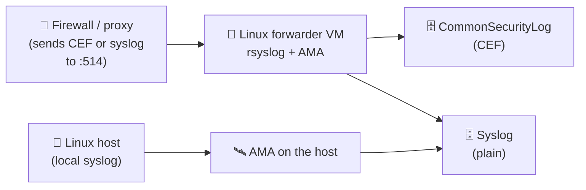

<div align="center">

# 📥 Step 12 · Linux syslog / CEF via AMA

### *Collect syslog from a Linux host and CEF from a network appliance*

[](../README.md)
[](#)
[](#)

</div>

---

## 🎯 Goal

A Linux VM ships `Syslog` to the workspace via AMA, and you understand how a CEF forwarder machine
turns appliance logs into the `CommonSecurityLog` table.

## 🧠 Why this step

Firewalls, proxies, WAFs, VPN concentrators and many EDRs speak **syslog** or **CEF**. Sentinel
ingests both through the Azure Monitor Agent running on a **Linux forwarder** VM: the appliance
sends UDP/TCP 514 to the forwarder, `rsyslog`/`syslog-ng` hands it to AMA, AMA parses CEF into
`CommonSecurityLog` and plain syslog into `Syslog`.

## ✅ Prerequisites

- [Step 06](../06-cost-model-and-budget/README.md) — budget alert live
- [Step 07](../07-connectors-and-content-hub/README.md) — Syslog and Common Event Format solutions installed

## 🧭 Concepts in 60 seconds



- Two DCR stream types: `Microsoft-Syslog` and `Microsoft-CommonSecurityLog`.
- The forwarder needs the Microsoft-provided install script (`Setup_CEF_Forwarder`) which configures
  rsyslog to listen and AMA to read it.
- Filter **by facility and severity in the DCR** — syslog volume is the classic budget killer.

## 🖱️ Do it — portal

1. **Create a Linux forwarder VM.** `vm-linux-fwd`, Ubuntu 22.04 LTS, **B1ms**, `rg-sentinel-lab`,
   no public inbound. Auto-shutdown on.
2. **Data connectors → Syslog via AMA → Open connector page → + Create data collection rule.**
   - Name `dcr-linux-syslog`, add `vm-linux-fwd` as a resource (installs AMA).
   - Facilities: `auth`, `authpriv`, `cron`, `daemon`, `syslog` — severities **Warning and above**
     for the lab.
3. For CEF: **Common Event Format (CEF) via AMA → Open connector page**, create
   `dcr-linux-cef` (stream `Microsoft-CommonSecurityLog`), then on the forwarder run the linked
   installer:

```bash
sudo wget -O Setup_CEF.py https://raw.githubusercontent.com/Azure/Azure-Sentinel/master/DataConnectors/CEF/Sentinel_AMA_troubleshoot.py
# use the exact command shown on the connector page — it embeds your DCR immutable ID
```

## 💻 Do it — CLI

```bash
LOC=eastus
az vm create -g rg-sentinel-lab -n vm-linux-fwd --image Ubuntu2204 --size Standard_B1ms \
  --admin-username azureuser --generate-ssh-keys --public-ip-address "" --nsg-rule NONE

WS=$(az monitor log-analytics workspace show -g rg-sentinel-lab -n law-sentinel-lab --query id -o tsv)
VM=$(az vm show -g rg-sentinel-lab -n vm-linux-fwd --query id -o tsv)

az monitor data-collection rule create -g rg-sentinel-lab -n dcr-linux-syslog -l $LOC \
  --data-flows '[{"streams":["Microsoft-Syslog"],"destinations":["la"]}]' \
  --destinations "{\"logAnalytics\":[{\"workspaceResourceId\":\"$WS\",\"name\":\"la\"}]}" \
  --syslog '[{"streams":["Microsoft-Syslog"],"facilityNames":["auth","authpriv","daemon","syslog"],"logLevels":["Warning","Error","Critical","Alert","Emergency"],"name":"sl"}]'

DCR=$(az monitor data-collection rule show -g rg-sentinel-lab -n dcr-linux-syslog --query id -o tsv)
az monitor data-collection rule association create -n assoc-linux-syslog --rule-id "$DCR" --resource "$VM"
az vm extension set -g rg-sentinel-lab --vm-name vm-linux-fwd -n AzureMonitorLinuxAgent \
  --publisher Microsoft.Azure.Monitor --enable-auto-upgrade true
```

## 🧪 Validate

On the VM: `logger -p auth.warning "sentinel-lab test event from $(hostname)"` and fail an SSH
login. Wait ~10 min:

```kusto
Syslog
| where TimeGenerated > ago(30m)
| project TimeGenerated, Computer, Facility, SeverityLevel, ProcessName, SyslogMessage
| sort by TimeGenerated desc
```

```kusto
// only if you set up a CEF source
CommonSecurityLog
| where TimeGenerated > ago(1h)
| summarize count() by DeviceVendor, DeviceProduct, Activity
```

**You should see** your `logger` test message and the failed SSH auth line in `Syslog`. If the
`Syslog` table 404s: AMA not installed, DCR not associated, or rsyslog not forwarding — check
`systemctl status azuremonitoragent` and `/etc/rsyslog.d/`.

## 🚩 Common mistakes

| 🚩 Mistake | Why it bites |
|---|---|
| No facility/severity filter | `cron`/`info` chatter dwarfs the security-relevant lines |
| Appliance pointed at the workspace directly | There is no direct ingest — it must go via the forwarder |
| Forwarder VM too small | Under load rsyslog drops UDP 514 silently |
| Multiple forwarders writing the same events | De-dupe by pointing each appliance at one forwarder |

## 🗒️ Log your run

`LOG.md` — facilities/severities chosen, `Syslog` daily GB, and the test event output.

## 📚 Microsoft Learn

- [Ingest syslog and CEF messages with the Azure Monitor Agent](https://learn.microsoft.com/en-us/azure/sentinel/connect-cef-syslog-ama)
- [Syslog table schema](https://learn.microsoft.com/en-us/azure/azure-monitor/reference/tables/syslog)
- [CommonSecurityLog schema](https://learn.microsoft.com/en-us/azure/azure-monitor/reference/tables/commonsecuritylog)

---

<div align="center">
<sub>

[⬅ Prev: 11 · Windows VM (AMA + DCR)](../11-windows-vm-ama-dcr/README.md) &nbsp;·&nbsp; [🦅 All steps](../README.md) &nbsp;·&nbsp; [Next: 13 · Custom logs + DCR transformations ➡](../13-custom-logs-and-dcr-transformations/README.md)

</sub>
</div>
