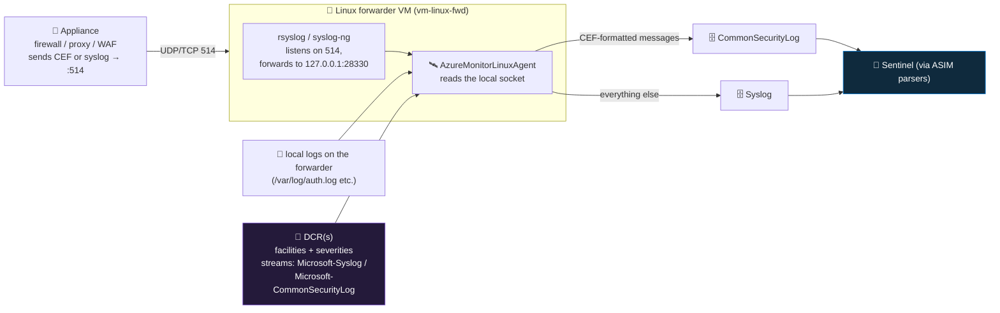

<div align="center">

# 📥 Step 12 · Linux syslog / CEF via AMA

### *Collect syslog from a Linux host, and CEF from a network appliance through a forwarder*

[](../README.md)
[](#)
[](#)

</div>

---

## 🎯 Goal

A Linux VM runs the Azure Monitor Agent and ships filtered `Syslog` to the workspace, you can see a
test message and a failed SSH login in KQL, and you understand exactly how the same VM acts as a
**CEF forwarder** turning appliance logs into the `CommonSecurityLog` table.

## 🧠 Why this step

The security-relevant part of most networks does not run on Windows or in Azure. Firewalls (Palo
Alto, Fortinet, Check Point, Cisco ASA/FTD), proxies and secure web gateways (Zscaler, Squid), WAFs,
VPN concentrators, load balancers, Linux servers, and many EDR/NDR appliances emit their logs as
**syslog** (RFC 3164/5424 plain text) or **CEF** (Common Event Format — a structured syslog
payload). Getting those into Sentinel is what lets you detect a firewall rule change, an outbound
connection to a known-bad IP, a VPN login from an impossible location, or a proxy block that
indicates C2 — none of which any Azure-native or Microsoft connector will show you.

Sentinel does **not** receive syslog or CEF directly. There is no endpoint you point an appliance
at. The supported architecture is a **Linux forwarder VM**: the appliance sends UDP/TCP 514 to the
forwarder, the forwarder's `rsyslog` (or `syslog-ng`) daemon receives it and hands it to a local
socket that the **Azure Monitor Agent** reads, and AMA — driven by a Data Collection Rule — parses
CEF-formatted messages into `CommonSecurityLog` and everything else into `Syslog`, then ships them
to your workspace.

Two things go wrong repeatedly. **Cost**: syslog is a firehose. `cron`, `daemon`, and `info`-level
chatter can be 10–50× the volume of the auth and security events you actually want, and every
gigabyte is billable. You filter **by facility and severity in the DCR**, on the endpoint, before
you pay for it. **Loss**: UDP 514 silently drops packets under load, and an undersized forwarder
drops them too — a forwarder that looks healthy can be quietly losing half the firewall's events.

## ✅ Prerequisites

- [Step 06](../06-cost-model-and-budget/README.md) — **budget alert live.** Syslog volume is the
  classic runaway; you want the tripwire armed.
- [Step 07](../07-connectors-and-content-hub/README.md) — the **Syslog** and **Common Event
  Format** solutions installed from Content hub. (For a real appliance you also install its
  product-specific solution — e.g. *Palo Alto Networks* — which brings the right ASIM parser and
  rules.)
- **Contributor** on `rg-sentinel-lab`; a region matching your workspace.
- For the CEF part: an appliance (or a second VM simulating one with `logger`) that can reach the
  forwarder on 514.

## 🧭 Concepts



**Walking the diagram:** an appliance ships log lines to the forwarder on port 514. The forwarder's
syslog daemon accepts them and re-forwards to a **local** port (`28330` by convention) that AMA
listens on. AMA also reads the forwarder's own local logs. A DCR tells AMA which **facilities**
(`auth`, `authpriv`, `daemon`, …) and **severities** (`warning` and above, say) to keep — this
filter runs here, on the box, so dropped lines cost nothing. AMA inspects each surviving message: if
it starts with `CEF:` it is parsed into the structured `CommonSecurityLog` table; otherwise it goes
to `Syslog` as-is. Sentinel then reads both, usually through **ASIM parsers** that normalise the
many vendor formats into one schema.

### How it works under the hood

- **The install script.** The CEF/Syslog-via-AMA connector page gives you a one-line command that
  downloads and runs a Microsoft Python installer (historically
  `Forwarder_AMA_installer.py` from the [Azure-Sentinel repo](https://github.com/Azure/Azure-Sentinel/tree/master/DataConnectors)).
  It: installs/enables AMA if needed, writes an rsyslog (or syslog-ng) config under
  `/etc/rsyslog.d/` that opens the 514 listener and forwards to `127.0.0.1:28330`, and restarts the
  daemon. **Always copy the exact command from your connector page** — it embeds nothing secret, but
  the script URL and flags change.
- **CEF vs Syslog routing is content-based**, not port-based. The DCR for CEF still uses a `syslog`
  data-source block (facilities/levels); AMA routes anything matching the CEF grammar to
  `CommonSecurityLog` and the rest to `Syslog`. You can have one DCR with both streams.
- **`CommonSecurityLog`** is a fixed schema mirroring CEF fields: `DeviceVendor`, `DeviceProduct`,
  `DeviceAction`, `SourceIP`, `DestinationIP`, `SourcePort`, `DestinationPort`, `Activity`,
  `AdditionalExtensions` (the raw key=value tail). Vendor-specific fields live in
  `AdditionalExtensions` until an ASIM parser extracts them.
- **`Syslog`** keeps `Facility`, `SeverityLevel`, `HostName`/`Computer`, `ProcessName`, `ProcessID`,
  `SyslogMessage`. Unstructured — you `parse` / `extract()` fields yourself
  ([step 04](../04-kql-survival-kit/README.md), [step 13](../13-custom-logs-and-dcr-transformations/README.md)).
- **Transport.** UDP 514 is lossy and has no delivery guarantee — fine for a lab, risky for a
  high-EPS firewall. Production uses **TCP 514** or **TLS-encrypted syslog**, and often a
  load-balanced pair of forwarders.
- **Forwarder sizing.** A lab forwarder at a few events/sec is happy on **B1ms** (1 vCPU / 2 GiB).
  Microsoft's production guidance is roughly **4 vCPU / 8 GiB** per forwarder for sustained high
  volume; past that, scale out to multiple forwarders.
- **SELinux (RHEL/CentOS):** the 514 listener needs `semanage port -a -t syslogd_port_t -p udp 514`
  (and tcp). Ubuntu/Debian (this lab) does not.

### Vocabulary

| Term | Meaning |
|---|---|
| **Syslog** | RFC 3164 / 5424 plain-text log protocol. Message + facility + severity + timestamp + host. |
| **CEF** | Common Event Format — a structured payload carried over syslog: `CEF:Version|Vendor|Product|Version|SignatureID|Name|Severity|key=value ...`. |
| **Facility** | Syslog category: `auth`, `authpriv`, `cron`, `daemon`, `kern`, `mail`, `syslog`, `user`, `local0–7`. |
| **Severity / level** | `emerg`, `alert`, `crit`, `err`, `warning`, `notice`, `info`, `debug`. |
| **Forwarder** | The Linux VM running rsyslog/syslog-ng + AMA that appliances send to. |
| **rsyslog / syslog-ng** | The two common Linux syslog daemons. AMA works with either. |
| **`CommonSecurityLog`** | The table CEF messages land in. |
| **`Syslog`** | The table plain syslog messages land in. |
| **ASIM parser** | A KQL function that normalises a vendor's `CommonSecurityLog` / `Syslog` rows into a common schema (e.g. `_Im_NetworkSession`). Installed by the product solution. |
| **`AzureMonitorLinuxAgent`** | The AMA extension for Linux. Publisher `Microsoft.Azure.Monitor`. |

### Where this fits

This adds the **network and non-Azure** telemetry lane. `CommonSecurityLog` feeds the exfiltration
hunt ([step 47](../47-hunt-exfiltration/README.md)), the lateral-movement hunt
([step 46](../46-hunt-lateral-movement/README.md)), and firewall/proxy detections. It uses the same
AMA + DCR model as [step 11](../11-windows-vm-ama-dcr/README.md). `Syslog` from Linux servers
complements it. [Step 16](../16-retention-archive-and-data-lake/README.md) is where a high-volume
`CommonSecurityLog` gets moved to a cheaper table plan.

### Design rationale

The forwarder architecture exists because appliances speak a decades-old push protocol with no
authentication and no cloud awareness — you cannot put a Microsoft agent on a Fortinet. A Linux box
running the standard syslog daemon is the universal adapter. Filtering in the DCR (on the endpoint)
rather than at ingest reflects the same principle as step 11: you should not pay to transmit and
store data you will immediately discard.

## 🖱️ Do it — portal

1. **Create the forwarder VM.** **Virtual machines → Create**: `vm-linux-fwd`, **Ubuntu Server
   22.04 LTS**, size **Standard_B1ms**, `rg-sentinel-lab`, your workspace region. **SSH public key**
   auth. **Inbound ports: None** (connect via serial console or a temporary My-IP-only SSH rule).
   Enable **auto-shutdown**.
2. **Create the Syslog DCR.** Sentinel → **Data connectors → Syslog via AMA → Open connector page →
   + Create data collection rule**:
   - Name `dcr-linux-syslog`, RG `rg-sentinel-lab`.
   - **Resources** → add `vm-linux-fwd` (installs AMA).
   - **Collect** → **Minimum log level** per facility. For the lab: `auth` and `authpriv` at
     **LOG_WARNING** and above; add `daemon`, `syslog`, `cron` only if you need them.
3. **Create the CEF DCR** (if you have an appliance / simulator). **Common Event Format (CEF) via
   AMA → Open connector page → + Create data collection rule**: `dcr-linux-cef`, same VM, stream
   `Microsoft-CommonSecurityLog`.
4. **Run the forwarder installer** on the VM — copy the exact command from the connector page. It
   looks like:

```bash
sudo wget -O Forwarder_AMA_installer.py \
  https://raw.githubusercontent.com/Azure/Azure-Sentinel/master/DataConnectors/Syslog/Forwarder_AMA_installer.py
sudo python3 Forwarder_AMA_installer.py
```

   It configures rsyslog to listen on 514 and forward to `127.0.0.1:28330`, and restarts rsyslog.
5. **Point your appliance** (or simulator VM) at `vm-linux-fwd` port **514/udp** and set its log
   format to **CEF** (for the CEF path) or leave it as syslog.

**Lab vs production:**
- *Lab* — B1ms, UDP 514, `auth`/`authpriv` only, one appliance/simulator.
- *Production* — 4 vCPU / 8 GiB forwarders behind a load balancer, **TCP or TLS** 514, per-appliance
  facility on `local0–7` so you can filter by source, and the product-specific Content hub solution
  installed for its ASIM parser and rules.

## 💻 Do it — CLI / IaC

```bash
LOC=eastus
RG=rg-sentinel-lab

az vm create -g $RG -n vm-linux-fwd \
  --image Ubuntu2204 --size Standard_B1ms \
  --admin-username azureuser --generate-ssh-keys \
  --public-ip-address "" --nsg-rule NONE \
  --assign-identity '[system]'                  # AMA authenticates as this identity
az vm auto-shutdown -g $RG -n vm-linux-fwd --time 1900

WS=$(az monitor log-analytics workspace show -g $RG -n law-sentinel-lab --query id -o tsv)
VM=$(az vm show -g $RG -n vm-linux-fwd --query id -o tsv)

# Syslog DCR: keep only auth/authpriv/daemon/syslog at warning+ (this filter runs on the box)
az monitor data-collection rule create -g $RG -n dcr-linux-syslog -l $LOC \
  --data-flows '[{"streams":["Microsoft-Syslog"],"destinations":["la"]}]' \
  --destinations "{\"logAnalytics\":[{\"workspaceResourceId\":\"$WS\",\"name\":\"la\"}]}" \
  --syslog '[{
     "streams":["Microsoft-Syslog"],
     "facilityNames":["auth","authpriv","daemon","syslog"],
     "logLevels":["Warning","Error","Critical","Alert","Emergency"],
     "name":"sl"
  }]'

DCR=$(az monitor data-collection rule show -g $RG -n dcr-linux-syslog --query id -o tsv)
az monitor data-collection rule association create \
  -n assoc-linux-syslog --rule-id "$DCR" --resource "$VM"

az vm extension set -g $RG --vm-name vm-linux-fwd \
  -n AzureMonitorLinuxAgent --publisher Microsoft.Azure.Monitor --enable-auto-upgrade true

# then SSH in and run the forwarder installer (see portal step 4) — the DCR alone does not open :514
```

> The DCR configures *what AMA collects*; the **forwarder installer** configures *rsyslog to receive
> from the network*. Both are required for the CEF/appliance path. For local Linux logs only, the
> DCR + AMA is enough.

## 🧪 Validate

On the forwarder: generate a local event and a failed SSH login.

```bash
logger -p auth.warning "sentinel-lab test event from $(hostname) at $(date -u +%FT%TZ)"
ssh baduser@localhost   # type a wrong password once, then Ctrl-C
```

For the CEF path, from the appliance/simulator (or on the forwarder itself, aimed at 514):

```bash
logger -n 127.0.0.1 -P 514 -d \
  "CEF:0|LabVendor|LabFirewall|1.0|100|Traffic denied|5|src=198.51.100.23 dst=203.0.113.10 spt=44321 dpt=445 act=deny proto=TCP"
```

Wait ~10–15 min, then in **Sentinel → Logs**:

```kusto
// 1. plain syslog — your test line and the SSH failure
Syslog
| where TimeGenerated > ago(30m)
| project TimeGenerated, Computer, Facility, SeverityLevel, ProcessName, SyslogMessage
| sort by TimeGenerated desc
```

```kusto
// 2. CEF — parsed into structured columns
CommonSecurityLog
| where TimeGenerated > ago(1h)
| project TimeGenerated, DeviceVendor, DeviceProduct, Activity, DeviceAction,
          SourceIP, DestinationIP, DestinationPort, AdditionalExtensions
| sort by TimeGenerated desc
```

```kusto
// 3. what facilities/severities are actually arriving — tune the DCR from this
Syslog
| where TimeGenerated > ago(6h)
| summarize Events = count() by Facility, SeverityLevel
| sort by Events desc
```

```kusto
// 4. cost
Usage
| where TimeGenerated > ago(1d) and IsBillable == true and DataType in ("Syslog","CommonSecurityLog")
| summarize GB = round(sum(Quantity)/1000, 4) by DataType
```

Read it:

| Check | Healthy | Unhealthy |
|---|---|---|
| Query 1 | your `sentinel-lab test event` line; a `sshd` line for the failed login with `Facility == "auth"` | `Syslog` 404 = AMA not installed / DCR not associated / rsyslog not restarted |
| Query 2 | one row, `DeviceVendor == "LabVendor"`, `SourceIP`/`DestinationPort` populated, `DeviceAction == "deny"` | message landed in `Syslog` instead = it wasn't valid CEF (check the `CEF:0|...` prefix) |
| Query 3 | mostly `auth`/`authpriv`; if you see `cron`/`daemon` at `info` flooding, tighten the DCR | one facility at millions of events = a misconfigured appliance or too-broad filter |
| Query 4 | tens of MB for the lab | `CommonSecurityLog` climbing fast = filter harder or move it to a Basic plan (step 16) |

**You should see** your `logger` test message in `Syslog` and, if you did the CEF line, one parsed
row in `CommonSecurityLog`. On the VM, `systemctl status azuremonitoragent` should be *active
(running)* and `sudo cat /etc/rsyslog.d/*azuremonitor*` should show the `28330` forward and the 514
listener.

## 🚩 Common mistakes

| 🚩 Mistake | Why it bites |
|---|---|
| No facility/severity filter in the DCR | `cron` / `info` chatter dwarfs the auth and security lines and you pay for all of it |
| Pointing the appliance at the workspace / a Sentinel endpoint | There is none — it must go through a Linux forwarder |
| Running the DCR but not the forwarder installer | AMA collects local logs only; port 514 is never opened, so no appliance data arrives |
| Undersized forwarder + UDP 514 | rsyslog silently drops packets under load — you lose events with no error anywhere |
| Several appliances → several forwarders → same workspace, overlapping | Duplicate rows; pick one forwarder (or a load-balanced pair) per appliance |
| Expecting vendor-specific fields as columns in `CommonSecurityLog` | They sit in `AdditionalExtensions` until the vendor's **ASIM parser** (from its solution) extracts them |
| Forgetting SELinux on RHEL | The 514 listener won't bind — `semanage port -a -t syslogd_port_t -p udp 514` |
| Leaving the forwarder on 24/7 | Compute + ingestion around the clock — auto-shutdown |

## 🩺 Troubleshooting

| Symptom | Likely cause | Fix |
|---|---|---|
| `Syslog` table 404 after 20 min | DCR not associated, AMA not installed, or rsyslog not restarted after the installer | `az monitor data-collection rule association list --resource "$VM"`; `systemctl status azuremonitoragent`; `systemctl restart rsyslog` |
| Local logs arrive, appliance CEF does not | Port 514 not listening, NSG blocking it, or appliance can't reach the forwarder | On the forwarder: `sudo ss -lunp | grep 514`; add an **inbound NSG rule** for 514 from the appliance's subnet only; `tcpdump -ni any port 514` while the appliance sends |
| CEF messages land in `Syslog`, not `CommonSecurityLog` | The message isn't valid CEF (wrong prefix, extra leading text from the appliance) | Capture a raw message with `tcpdump`; it must begin `CEF:0|` (a syslog header before it is OK). Fix the appliance's CEF export format |
| Events arrive but `TimeGenerated` is hours off | Appliance clock wrong, or timezone in the syslog header misread | Fix NTP on the appliance; AMA uses receipt time as a fallback — check `Computer` and the message timestamp |
| `CommonSecurityLog` volume far above expectations | Appliance logging *allow* traffic (every permitted flow) not just *deny*/*alert* | Configure the appliance to log security events only, or filter in the DCR / with a DCR transformation (step 13) |
| Half the firewall's events missing under load | UDP loss on a busy or small forwarder | Switch the appliance and forwarder to **TCP 514**; size the forwarder up (4 vCPU / 8 GiB); split across forwarders |
| Duplicate rows in `CommonSecurityLog` | Two DCRs with the CEF stream on the same VM, or two forwarders receiving the same feed | One CEF DCR per forwarder; one forwarder per appliance |
| `azuremonitoragent` running but no data, `Heartbeat` present | DCR facility/severity filter excludes everything the appliance sends | Widen the filter temporarily; check query 3 for what's actually arriving |

## 🎓 Deepen your understanding

1. Run query 3 after a few hours. Which facility/severity combinations are pure noise for a SOC? Rewrite the DCR filter to the minimum that still catches auth failures and firewall denies. What percentage of volume did you cut?
2. Send the same event as raw syslog and as CEF (two `logger` lines). Compare the `Syslog` row with the `CommonSecurityLog` row. Which one can you write a detection against without a `parse` step, and why does that matter at 3 a.m.?
3. `CommonSecurityLog.AdditionalExtensions` holds the vendor's extra `key=value` pairs. Pick one and `extract()` a field from it. Now find the vendor's ASIM parser (install its solution) and run the parser instead. What did the parser normalise that your `extract` missed?
4. UDP vs TCP 514: describe the failure mode of each. If a forwarder reboots for 30 seconds, what happens to the appliance's events under UDP? Under TCP? Under TLS with a queue?
5. You have one forwarder and three firewalls. Sketch how you'd tell, in KQL, *which* firewall a `CommonSecurityLog` row came from — and how putting each firewall on a different syslog `local0–7` facility makes that trivial.

## 🗒️ Log your run

Copy [`_templates/STEP-LOG-TEMPLATE.md`](../_templates/STEP-LOG-TEMPLATE.md) into this folder as
`LOG.md`. Record: forwarder VM size and how you connected, the DCR **facilities and severities**,
whether you did the CEF path and with what simulator, the query-1 output showing your test line,
the query-3 facility/severity breakdown, and the query-4 daily GB for `Syslog` / `CommonSecurityLog`.

## 📚 Microsoft Learn

- [Ingest syslog and CEF messages to Microsoft Sentinel with the Azure Monitor Agent](https://learn.microsoft.com/en-us/azure/sentinel/connect-cef-syslog-ama)
- [Options for streaming logs in CEF and Syslog format to Microsoft Sentinel](https://learn.microsoft.com/en-us/azure/sentinel/connect-cef-syslog-options)
- [Deploy a log forwarder to ingest syslog and CEF](https://learn.microsoft.com/en-us/azure/sentinel/connect-log-forwarder)
- [Collect syslog with Azure Monitor Agent](https://learn.microsoft.com/en-us/azure/azure-monitor/agents/data-collection-syslog)
- [Syslog table schema](https://learn.microsoft.com/en-us/azure/azure-monitor/reference/tables/syslog)
- [CommonSecurityLog table schema](https://learn.microsoft.com/en-us/azure/azure-monitor/reference/tables/commonsecuritylog)
- [Advanced Security Information Model (ASIM) overview](https://learn.microsoft.com/en-us/azure/sentinel/normalization)

---

<div align="center">
<sub>

[⬅ Prev: 11 · Windows VM (AMA + DCR)](../11-windows-vm-ama-dcr/README.md) &nbsp;·&nbsp; [🦅 All steps](../README.md) &nbsp;·&nbsp; [Next: 13 · Custom logs + DCR transformations ➡](../13-custom-logs-and-dcr-transformations/README.md)

</sub>
</div>
