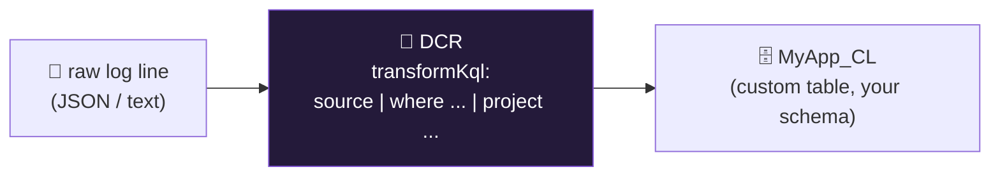

<div align="center">

# 📥 Step 13 · Custom logs + DCR transformations

### *Ingest a log Sentinel has never heard of, and shape it at ingest time*

[](../README.md)
[](#)
[-107C10?style=flat-square)](#)

</div>

---

## 🎯 Goal

A custom JSON log lands in a `*_CL` table you defined, with a **DCR transformation** that drops
noise columns and filters out health-check rows *before* you pay to store them.

## 🧠 Why this step

Real environments always have a log with no connector — an in-house app, an appliance with a weird
format, a SaaS export. Two things make this cheap and useful: a **custom table** with an explicit
schema, and a **KQL transformation in the DCR** that runs on every record at ingest. Transformations
are also how you drop columns from *built-in* tables you don't need.

## ✅ Prerequisites

- [Step 11](../11-windows-vm-ama-dcr/README.md) or [12](../12-linux-syslog-cef-ama/README.md) — you have a VM with AMA, or use the Logs Ingestion API directly
- [Step 04](../04-kql-survival-kit/README.md) — you can write `where` / `project` / `extend`

## 🧭 Concepts in 60 seconds



- Custom table names **must end in `_CL`**. Columns get suffixes by type (`_s`, `_d`, `_b`, `_t`)
  unless you use the DCR-based custom table (v2) which lets you name them cleanly.
- `transformKql` operates on a stream called `source`. It can `where` (drop rows), `project` /
  `project-away` (drop columns), `extend` (add derived fields), and `parse`.
- `TimeGenerated` must survive the transform or ingestion fails.

## 🖱️ Do it — portal

1. **Log Analytics workspace → Tables → Create → New custom log (DCR-based).**
2. Upload a sample file. Example `sample.json`:

```json
{"ts":"2026-09-02T10:15:00Z","app":"checkout","level":"WARN","user":"svc-batch","srcip":"203.0.113.9","msg":"auth token near expiry","trace":"abc123","podHealth":"ok"}
```

3. Name the table `CheckoutApp_CL`. In the **transformation editor**, paste:

```kusto
source
| where level != "DEBUG" and msg !has "health"
| extend TimeGenerated = todatetime(ts)
| project TimeGenerated, App=app, Level=level, User=user, SrcIp=srcip, Message=msg, Trace=trace
```

4. Assign the DCR to the VM / define the collection path (e.g. `/var/log/checkout/*.log`).

## 💻 Do it — Logs Ingestion API (no agent)

```bash
# 1. create a DCE (data collection endpoint) + DCR with a stream Custom-CheckoutApp_CL
# 2. grant your app/SP "Monitoring Metrics Publisher" on the DCR
# 3. POST records:
TOKEN=$(az account get-access-token --resource https://monitor.azure.com --query accessToken -o tsv)
curl -X POST "$DCE_URI/dataCollectionRules/$DCR_IMMUTABLE_ID/streams/Custom-CheckoutApp_CL?api-version=2023-01-01" \
  -H "Authorization: Bearer $TOKEN" -H "Content-Type: application/json" \
  -d '[{"ts":"2026-09-02T10:15:00Z","app":"checkout","level":"WARN","user":"svc-batch","srcip":"203.0.113.9","msg":"auth token near expiry","trace":"abc123","podHealth":"ok"}]'
```

## 🧪 Validate

```kusto
CheckoutApp_CL
| where TimeGenerated > ago(1h)
| project TimeGenerated, App, Level, User, SrcIp, Message
| sort by TimeGenerated desc
```

```kusto
// prove the transform dropped the noise
CheckoutApp_CL
| where TimeGenerated > ago(1d)
| summarize total = count(), health = countif(Message has "health"), debug = countif(Level == "DEBUG")
```

**You should see** rows with your **clean column names** (no `_s` suffixes), `podHealth` and
`trace`-only rows absent, and `health == 0`, `debug == 0` — the transformation ran.

## 🚩 Common mistakes

| 🚩 Mistake | Why it bites |
|---|---|
| Dropping `TimeGenerated` in the transform | Ingestion rejects every record |
| Filtering after ingest with a rule instead of in the DCR | You already paid to store the noise |
| Legacy "Custom logs (MMA)" wizard | Retired; use DCR-based custom tables |
| Over-transforming | If you might need a field for a future hunt, keep it — or send it to a Basic-tier table |

## 🗒️ Log your run

`LOG.md` — the `transformKql` you used and the before/after row counts.

## 📚 Microsoft Learn

- [Data collection transformations in Azure Monitor](https://learn.microsoft.com/en-us/azure/azure-monitor/essentials/data-collection-transformations)
- [Send data to Azure Monitor Logs with the Logs Ingestion API](https://learn.microsoft.com/en-us/azure/azure-monitor/logs/logs-ingestion-api-overview)
- [Create a custom table in a Log Analytics workspace](https://learn.microsoft.com/en-us/azure/azure-monitor/logs/create-custom-table)

---

<div align="center">
<sub>

[⬅ Prev: 12 · Linux syslog / CEF (AMA)](../12-linux-syslog-cef-ama/README.md) &nbsp;·&nbsp; [🦅 All steps](../README.md) &nbsp;·&nbsp; [Next: 14 · API & codeless connectors ➡](../14-api-and-codeless-connectors/README.md)

</sub>
</div>
