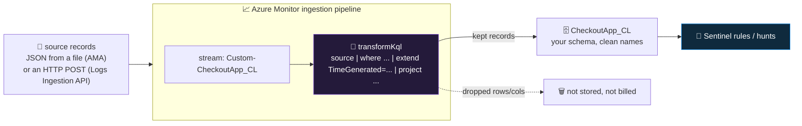

<div align="center">

# 📥 Step 13 · Custom logs + DCR transformations

### *Ingest a log Sentinel has never heard of — and shape every record before you pay to store it*

[](../README.md)
[](#)
[](#)

</div>

---

## 🎯 Goal

A custom JSON log lands in a `*_CL` table **you defined**, with clean column names, and a **DCR
transformation** that drops health-check rows and a noise column *before* they are stored. You can
also state how the same `transformKql` mechanism trims a built-in table like `SigninLogs`.

## 🧠 Why this step

Every real environment has a log with no Microsoft connector: an in-house application, a bespoke
appliance, a SaaS audit export, a Kubernetes controller, a custom auth proxy. If it carries security
signal, you need it in the workspace — and you need it in a shape you can write detections against,
not as an opaque blob.

Two capabilities make this practical. A **DCR-based custom table** lets you define a `*_CL` table
with an explicit schema and clean column names. A **DCR transformation** (`transformKql`) is a small
KQL expression that runs on **every record in the ingestion pipeline** — you use it to drop rows you
do not want (`DEBUG` lines, health checks, allowed-traffic noise), drop or rename columns, derive
new fields, redact PII, and even split one incoming stream into several tables. Because it runs
**before storage**, data a transformation drops is not billed for ingestion — this is one of the few
levers that genuinely *lowers* your bill while *improving* data quality.

The same mechanism applies to **built-in tables**. A "workspace transformation DCR" holds transforms
for tables that don't have their own DCR (like `SigninLogs`): you can strip the columns you never
query, or filter out a category of benign event, and cut the ingestion cost of a table you cannot
otherwise control.

What teams get wrong: they reach for the **retired** MMA "Custom logs" wizard; they filter noise in
an *analytics rule* after ingestion, having already paid to store it; they drop `TimeGenerated` in
the transform and every record is rejected; or they over-transform and discard a field a future hunt
needed.

## ✅ Prerequisites

- [Step 04](../04-kql-survival-kit/README.md) — you can write `where` / `project` / `extend` /
  `parse`. The transform language is a **subset** of KQL.
- [Step 11](../11-windows-vm-ama-dcr/README.md) or [12](../12-linux-syslog-cef-ama/README.md) —
  you have an AMA VM to collect a file from, **or** you will use the **Logs Ingestion API** (no
  agent) which this step also covers.
- **Contributor** on `rg-sentinel-lab` to create the table, DCR, and — for the API path — a **Data
  Collection Endpoint (DCE)**.
- For the API path: rights to create an app registration (or use a managed identity) and grant it
  **Monitoring Metrics Publisher** on the DCR.

## 🧭 Concepts



**Walking the diagram:** records enter the pipeline as a named **stream** — from AMA reading a text
file, or from an HTTPS `POST` to the Logs Ingestion API. Before anything is stored, the DCR's
`transformKql` runs against a virtual table called **`source`** (one pass, per record — no `join`,
no `union`, no cross-record aggregation). Whatever the transform emits is what lands in your `*_CL`
table and what you are billed for; whatever it filters out is gone. The output schema of the
transform **must** match the table's schema, and it **must** include `TimeGenerated`.

### How it works under the hood

- **DCR-based custom table.** Created via **Workspace → Tables → Create → New custom log
  (DCR-based)**. Unlike the legacy HTTP Data Collector path, columns keep the **names you give
  them** — no `_s` / `_d` / `_b` / `_g` / `_t` type suffixes. The table name must end in `_CL`.
- **The transform runs in the cloud pipeline**, not on the agent. So it works identically for
  agent-collected files and API-posted data, and it is the *only* place to transform data from
  sources you don't control.
- **Billing.** Data removed by a transformation is not charged for ingestion. Note Microsoft's
  **filtering guardrail**: if a transformation drops a very large fraction of the incoming data
  (historically discussed at the ~50% mark and up to 100% at times), a portion of the filtered data
  may still be billed to discourage using ingestion as a cheap transport. Verify the current rule on
  the [transformations pricing docs](https://learn.microsoft.com/en-us/azure/azure-monitor/logs/cost-logs).
  For dropping *columns* and modest row filtering, the saving is real and uncomplicated.
- **Supported KQL in `transformKql`:** `where`, `extend`, `project` / `project-away` /
  `project-rename` / `project-keep`, `parse` / `parse_json` / `extract` / `split`, scalar functions,
  `iff` / `case`, string/datetime/math functions, `columnifexists`. **Not supported:** `join`,
  `union`, `summarize`, `sort`, `top`, `mv-expand`, anything referencing another table, and a few
  functions (`bag_unpack`, `pivot`).
- **Multi-destination / split.** A DCR can have several `dataFlows`, each with its own
  `transformKql` and destination — so one incoming stream can fan out: security-relevant rows to an
  analytics-tier `*_CL`, verbose rows to a Basic-tier `*_CL`, nothing lost.
- **Workspace transformation DCR.** Built-in tables that have no dedicated DCR (e.g. `SigninLogs`,
  `AzureActivity`) are transformed by a single special DCR linked to the workspace itself. One per
  workspace; it holds a `dataFlows` entry per table you want to trim.
- **Logs Ingestion API path** needs three things: a **DCE** (the regional HTTPS endpoint you POST
  to), a **DCR** with your custom stream and `streamDeclarations` (the incoming schema), and a
  principal with **Monitoring Metrics Publisher** on the DCR. You POST JSON arrays to
  `{DCE}/dataCollectionRules/{immutableId}/streams/{streamName}?api-version=2023-01-01`.

### Vocabulary

| Term | Meaning |
|---|---|
| **`*_CL` table** | A custom Log Analytics table. Name must end in `_CL` (Custom Log). |
| **DCR-based custom table** | The current way to make one — explicit schema, clean column names, driven by a DCR. |
| **`transformKql`** | A per-record KQL expression in a DCR `dataFlow` that shapes data before storage. Operates on `source`. |
| **`streamDeclarations`** | The schema of the *incoming* data, as the pipeline receives it (before transform). |
| **DCE (Data Collection Endpoint)** | The regional HTTPS endpoint for the Logs Ingestion API and for network-isolated collection. |
| **Immutable ID** | The stable GUID of a DCR, used in the ingestion URL (the ARM name can change; this doesn't). |
| **Monitoring Metrics Publisher** | The RBAC role that lets a principal POST data to a DCR. |
| **Workspace transformation DCR** | The one special DCR that carries transforms for built-in tables lacking their own DCR. |

### Where this fits

This is the **shape and cost-control** step of the phase. It is how you onboard the sources
[step 14](../14-api-and-codeless-connectors/README.md) can't (or shouldn't), it feeds
[step 16](../16-retention-archive-and-data-lake/README.md) (route trimmed high-volume data to a Basic
plan), and the full cost-reduction treatment is [step 56](../56-cost-engineering/README.md). Your
custom `*_CL` becomes a normal detection/hunt source from
[step 19](../19-write-a-scheduled-rule/README.md) onward.

### Design rationale

Transformations run in the pipeline (not the agent) so they can shape data from *any* source, agent
or not, uniformly — and so the shaping logic is a central, version-controllable resource rather than
config scattered across endpoints. Requiring the output to match the table schema (and include
`TimeGenerated`) is what lets the pipeline write straight to columnar storage without a second parse.

## 🖱️ Do it — portal (AMA / file collection)

1. **Create the custom table.** Workspace `law-sentinel-lab` → **Tables → + Create → New custom log
   (DCR-based)**.
2. **Basics:** table name `CheckoutApp_CL`. Create a **new DCR** `dcr-checkoutapp` (RG
   `rg-sentinel-lab`) and, if prompted, a **DCE** `dce-sentinel-lab` in your region.
3. **Schema & transformation:** upload a sample file. Example `sample.json` (one JSON object per
   line):

```json
{"ts":"2026-09-02T10:15:00Z","app":"checkout","level":"WARN","user":"svc-batch","srcip":"203.0.113.9","msg":"auth token near expiry","trace":"abc123","podHealth":"ok"}
{"ts":"2026-09-02T10:15:01Z","app":"checkout","level":"DEBUG","user":"svc-batch","srcip":"203.0.113.9","msg":"cache hit","trace":"abc124","podHealth":"ok"}
{"ts":"2026-09-02T10:15:02Z","app":"checkout","level":"INFO","user":"anon","srcip":"198.51.100.7","msg":"health probe ok","trace":"abc125","podHealth":"ok"}
```

4. In the **transformation editor** paste:

```kusto
source
| where level != "DEBUG" and msg !has "health probe"
| extend TimeGenerated = todatetime(ts)
| project TimeGenerated,
          App     = app,
          Level   = level,
          User    = user,
          SrcIp   = srcip,
          Message = msg,
          Trace   = trace
// podHealth is dropped by not being projected
```

5. **Collection path:** on the **Resources / collection** step, add the AMA VM and set the file glob,
   e.g. `/var/log/checkout/*.log`. Save.
6. On the VM, write matching lines to that path (`echo '{...}' | sudo tee -a /var/log/checkout/app.log`).

## 💻 Do it — Logs Ingestion API (no agent)

```bash
RG=rg-sentinel-lab; LOC=eastus
WS=$(az monitor log-analytics workspace show -g $RG -n law-sentinel-lab --query id -o tsv)

# 1. Data Collection Endpoint
az monitor data-collection endpoint create -g $RG -n dce-sentinel-lab -l $LOC \
  --public-network-access Enabled
DCE=$(az monitor data-collection endpoint show -g $RG -n dce-sentinel-lab --query logsIngestion.endpoint -o tsv)

# 2. Create the custom table first (needs the columns your transform outputs), e.g. via:
#    az monitor log-analytics workspace table create -g $RG --workspace-name law-sentinel-lab \
#      -n CheckoutApp_CL --columns TimeGenerated=datetime App=string Level=string User=string SrcIp=string Message=string Trace=string

# 3. DCR with streamDeclarations (incoming shape) + transformKql + destination
#    (author as JSON; the streamDeclarations schema is the RAW input, the transform maps it to the table)
az monitor data-collection rule create -g $RG -n dcr-checkoutapp-api -l $LOC \
  --endpoint-id "$(az monitor data-collection endpoint show -g $RG -n dce-sentinel-lab --query id -o tsv)" \
  --data-flows '[{
     "streams":["Custom-CheckoutApp_raw"],
     "destinations":["la"],
     "transformKql":"source | where level != \"DEBUG\" and msg !has \"health probe\" | extend TimeGenerated=todatetime(ts) | project TimeGenerated, App=app, Level=level, User=user, SrcIp=srcip, Message=msg, Trace=trace",
     "outputStream":"Custom-CheckoutApp_CL"
  }]' \
  --destinations "{\"logAnalytics\":[{\"workspaceResourceId\":\"$WS\",\"name\":\"la\"}]}" \
  --stream-declarations '{"Custom-CheckoutApp_raw":{"columns":[
     {"name":"ts","type":"string"},{"name":"app","type":"string"},{"name":"level","type":"string"},
     {"name":"user","type":"string"},{"name":"srcip","type":"string"},{"name":"msg","type":"string"},
     {"name":"trace","type":"string"},{"name":"podHealth","type":"string"}]}}'

DCR_ID=$(az monitor data-collection rule show -g $RG -n dcr-checkoutapp-api --query immutableId -o tsv)

# 4. grant your principal Monitoring Metrics Publisher on the DCR
SP=$(az ad signed-in-user show --query id -o tsv)   # or an app registration's SP object id
az role assignment create --assignee "$SP" --role "Monitoring Metrics Publisher" \
  --scope "$(az monitor data-collection rule show -g $RG -n dcr-checkoutapp-api --query id -o tsv)"

# 5. POST records (raw input shape — the transform shapes them)
TOKEN=$(az account get-access-token --resource https://monitor.azure.com --query accessToken -o tsv)
curl -sS -X POST "$DCE/dataCollectionRules/$DCR_ID/streams/Custom-CheckoutApp_raw?api-version=2023-01-01" \
  -H "Authorization: Bearer $TOKEN" -H "Content-Type: application/json" \
  -d '[{"ts":"2026-09-02T10:15:00Z","app":"checkout","level":"WARN","user":"svc-batch","srcip":"203.0.113.9","msg":"auth token near expiry","trace":"abc123","podHealth":"ok"},
       {"ts":"2026-09-02T10:15:01Z","app":"checkout","level":"DEBUG","user":"svc-batch","srcip":"203.0.113.9","msg":"cache hit","trace":"abc124","podHealth":"ok"}]'
```

<details><summary>Trim a built-in table (workspace transformation DCR)</summary>

```kusto
// transformKql on the SigninLogs dataFlow of the workspace transformation DCR:
// drop the columns you never query, and filter out a benign result type
source
| where ResultType !in ("50058", "50140")           // "interrupted" / "keep me signed in" prompts
| project-away AuthenticationProcessingDetails, MfaDetail, DeviceDetail, NetworkLocationDetails
```
This runs on every `SigninLogs` row before storage — cutting the table's ingested size.
</details>

## 🧪 Validate

Wait a few minutes, then in **Sentinel → Logs**:

```kusto
// 1. rows arrived with your clean schema
CheckoutApp_CL
| where TimeGenerated > ago(1h)
| project TimeGenerated, App, Level, User, SrcIp, Message, Trace
| sort by TimeGenerated desc
```

```kusto
// 2. prove the transform dropped what it should
CheckoutApp_CL
| where TimeGenerated > ago(1d)
| summarize total = count(),
            debugRows  = countif(Level == "DEBUG"),
            healthRows = countif(Message has "health probe"),
            hasPodHealthCol = countif(isnotempty(column_ifexists("podHealth_s", "")))
```

```kusto
// 3. cost of the kept data
Usage
| where TimeGenerated > ago(1d) and DataType == "CheckoutApp_CL"
| summarize KeptMB = round(sum(Quantity), 3)
```

Read it:

| Check | Healthy | Unhealthy |
|---|---|---|
| Query 1 | rows with `App`, `Level`, `SrcIp` etc. — **no** `_s` suffixes, **no** `podHealth` column | columns have `_s`/`_d` suffixes = you used the legacy path, not DCR-based |
| Query 2 | `debugRows == 0`, `healthRows == 0`, `hasPodHealthCol == 0` | non-zero = the transform didn't run (syntax error → check DCR **provisioningState** and the transform's own validation) |
| Query 3 | a small MB number matching only the kept rows | large = the transform isn't filtering, or the source is louder than expected |

**You should see** only `WARN`/`INFO`/`ERROR` non-health rows, cleanly named, with `podHealth` gone.
If `CheckoutApp_CL` 404s: the table wasn't created, or (API path) the DCR/DCE/role isn't in place —
a `403` on the POST means the **Monitoring Metrics Publisher** grant hasn't propagated (wait a few
minutes) or you're posting to the wrong stream name.

## 🚩 Common mistakes

| 🚩 Mistake | Why it bites |
|---|---|
| Dropping `TimeGenerated` (or not deriving it) in the transform | Every record is rejected — the pipeline requires it |
| Filtering noise in an **analytics rule** instead of the DCR | You already paid to ingest and store it |
| Using the retired **Custom logs (MMA)** wizard | Dead path — use **New custom log (DCR-based)** |
| Transform output schema ≠ table schema | Records dropped or columns null; validate the transform against the table columns |
| Trying `join` / `summarize` / `union` in `transformKql` | Not supported — it's a per-record transform only |
| Over-filtering to save money | You may hit the filtering-ratio billing guardrail, and you lose data a future hunt needed — route to Basic tier instead of dropping |
| Posting the *transformed* shape to the Logs Ingestion API | You post the **raw** shape (matching `streamDeclarations`); the transform shapes it |
| Hardcoding the DCR ARM name in the ingestion URL | Use the **immutable ID** — the ARM name can change |

## 🩺 Troubleshooting

| Symptom | Likely cause | Fix |
|---|---|---|
| `CheckoutApp_CL` 404 after 10+ min | Table not created, or DCR not associated / DCE not linked | Confirm the table exists (**Workspace → Tables**); check the DCR `provisioningState: Succeeded` and its `dataCollectionEndpointId` |
| Rows arrive but every field is null except `TimeGenerated` | `streamDeclarations` (incoming schema) doesn't match the JSON keys, or the transform projects columns that don't exist | Align `streamDeclarations` names/types exactly to the posted JSON; test the transform in Logs against a `datatable` mimicking `source` |
| Transform "saved" but noise still appears | Transform has a KQL error and the pipeline fell back to pass-through, or you edited the wrong `dataFlow` | Re-open the transformation editor — it validates; check which `dataFlows` entry carries the transform |
| API POST returns `403` | Missing **Monitoring Metrics Publisher** on the DCR, or token audience wrong | Grant the role on the **DCR** scope; token `--resource https://monitor.azure.com` |
| API POST returns `400 InvalidStream` | Stream name in the URL ≠ a key in `streamDeclarations` | Use the exact `Custom-<name>` stream name from the DCR |
| Columns have `_s` / `_d` suffixes | Table was created via the legacy HTTP Data Collector API, not DCR-based | Recreate as a DCR-based custom table |
| `Usage` shows the table larger than the kept rows imply | Filtering-ratio billing (you dropped a very high %), or the transform isn't filtering | Check the transform actually runs (query 2); consider a split to a Basic-tier table instead of a heavy filter |
| Built-in table transform did nothing | Workspace transformation DCR not linked, or wrong table name in `dataFlows` | Link the workspace transformation DCR to the workspace; one `dataFlows` entry per built-in table, `stream` = `Microsoft-<Table>` |

## 🎓 Deepen your understanding

1. Add a `DEBUG` line and a `health probe` line to the source. Confirm with query 2 they never appear. Now estimate: if 60% of the raw stream were `DEBUG`, what would the transform save per month at your ingestion rate — and would you hit the filtering-ratio guardrail?
2. Change the transform to **split**: `ERROR`/`WARN` rows to `CheckoutApp_CL` (analytics), everything else to `CheckoutApp_Verbose_CL` (Basic tier, [step 16](../16-retention-archive-and-data-lake/README.md)). Two `dataFlows`, two destinations. Why is this better than dropping the verbose rows?
3. Add `extend Category = case(Message has "token", "auth", Message has "payment", "billing", "other")` to the transform and store it. You just did enrichment at ingest. What's the trade-off versus computing `Category` in every query later?
4. Redact PII: the `User` field sometimes contains an email. Add `extend User = replace_regex(User, @"@.*$", "@***")` to the transform. Why is doing this at ingest (irreversibly) sometimes exactly what a compliance requirement wants?
5. The Logs Ingestion API posts the **raw** shape. Write the `datatable` you'd use in Logs to simulate `source` and test your `transformKql` before deploying it. Why is testing the transform this way safer than deploying and checking?

## 🗒️ Log your run

Copy [`_templates/STEP-LOG-TEMPLATE.md`](../_templates/STEP-LOG-TEMPLATE.md) into this folder as
`LOG.md`. Record: the collection path (AMA) or DCE URL (API), the exact `transformKql`, the query-2
output proving the drops, the query-3 kept-MB, and — if you tried a built-in-table transform — which
table and what you trimmed. Commit a **synthetic** `sample.json` to `artifacts/`.

## 📚 Microsoft Learn

- [Data collection transformations in Azure Monitor](https://learn.microsoft.com/en-us/azure/azure-monitor/essentials/data-collection-transformations)
- [Structure of a transformation in Azure Monitor](https://learn.microsoft.com/en-us/azure/azure-monitor/essentials/data-collection-transformations-structure)
- [Create a custom table in a Log Analytics workspace](https://learn.microsoft.com/en-us/azure/azure-monitor/logs/create-custom-table)
- [Send data to Azure Monitor Logs with the Logs Ingestion API](https://learn.microsoft.com/en-us/azure/azure-monitor/logs/logs-ingestion-api-overview)
- [Tutorial: Send data to Azure Monitor Logs with Logs Ingestion API (Azure portal)](https://learn.microsoft.com/en-us/azure/azure-monitor/logs/tutorial-logs-ingestion-portal)
- [Add a workspace transformation to Azure Monitor Logs](https://learn.microsoft.com/en-us/azure/azure-monitor/logs/tutorial-workspace-transformations-portal)
- [Data collection endpoints in Azure Monitor](https://learn.microsoft.com/en-us/azure/azure-monitor/essentials/data-collection-endpoint-overview)

---

<div align="center">
<sub>

[⬅ Prev: 12 · Linux syslog / CEF (AMA)](../12-linux-syslog-cef-ama/README.md) &nbsp;·&nbsp; [🦅 All steps](../README.md) &nbsp;·&nbsp; [Next: 14 · API & codeless connectors ➡](../14-api-and-codeless-connectors/README.md)

</sub>
</div>
