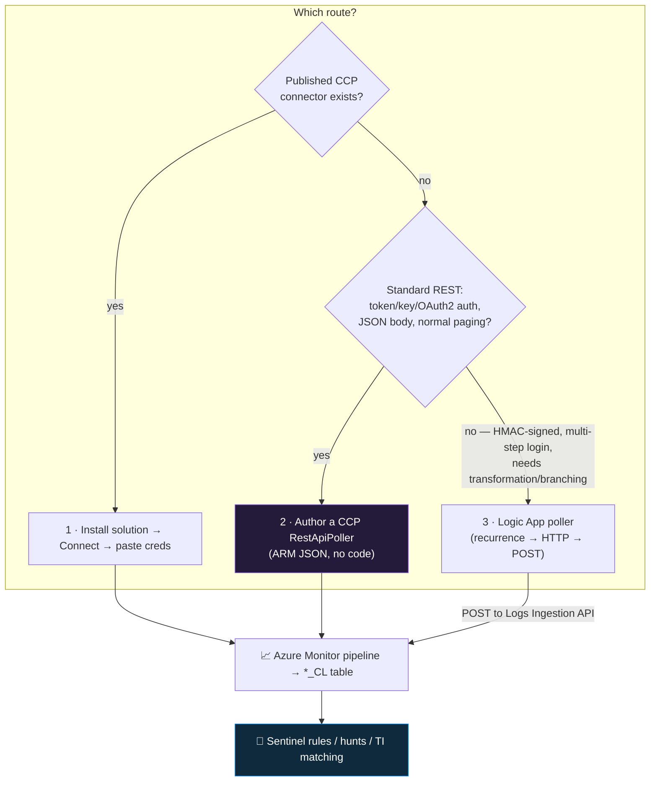

<div align="center">

# 📥 Step 14 · API & codeless connectors

### *Pull a third-party REST feed into Sentinel with no agent — and know when to reach for a Logic App instead*

[](../README.md)
[](#)
[ · Logic App path adds per-action-107C10?style=flat-square)](#)

</div>

---

## 🎯 Goal

A REST-API data source is polling into a custom `*_CL` table on a schedule — via the **Codeless
Connector Platform (CCP)** or a **Logic App poller** — you can prove the poll is *recurring* (not a
one-off), and you can articulate which of the three routes fits which situation.

## 🧠 Why this step

A large share of security telemetry lives behind a vendor REST API with no push option: identity
providers (Okta, Auth0), email security (Proofpoint, Mimecast), DNS/secure web gateways, CASBs, EDRs
without a syslog option, GitHub/GitLab audit logs, SaaS admin audit trails, and threat-intel feeds.
For all of these you **poll**: call the API on a timer, page through the results, keep a cursor so
you don't re-fetch, and write the events into your workspace.

There are three ways to do that in Sentinel, in preference order:

1. **A vendor-published CCP connector** in the Content hub — install the solution, click **Connect**,
   paste credentials. Nothing to build.
2. **A CCP connector you define yourself** — an ARM-deployed JSON spec (`RestApiPoller`) describing
   auth, request, pagination, and the target DCR. The platform runs the polling loop, refreshes
   tokens, handles paging, and keeps the cursor. **No code.**
3. **A Logic App poller** — a recurrence trigger → HTTP call → parse → POST to the Logs Ingestion
   API. Maximum flexibility (any auth scheme, branching, transformation), but you own the paging and
   cursor logic, and every action has a (tiny) cost that adds up at high frequency.

What teams get wrong: they build a Logic App or Azure Function for a source that has a perfectly
good published CCP connector; they forget **pagination** and silently ingest only the first page
every poll; they use **overlapping time windows** with no cursor and re-ingest the same records
(cost + duplicate detections); or they put the API key in a plaintext Logic App parameter where it
ends up in the ARM export.

## ✅ Prerequisites

- [Step 13](../13-custom-logs-and-dcr-transformations/README.md) — you understand DCR-based custom
  tables, DCEs, and the `Monitoring Metrics Publisher` role. CCP and the Logic App path both use
  that plumbing.
- **Contributor** on `rg-sentinel-lab`; for CCP, rights to deploy ARM to the workspace scope.
- An API to poll. Lab-friendly options: a static threat-feed JSON on GitHub raw, the
  **URLhaus** / **Feodo Tracker** open feeds, the **NVD CVE** feed, a **GitHub org audit log**
  (needs an org + a fine-grained PAT), or **AbuseIPDB** free tier (key required; blacklist endpoint
  is limited to roughly one call/day and ~10k IPs on the free plan — fine for a lab).

## 🧭 Concepts



**Walking the diagram:** always check the Content hub first — a vendor connector is zero build and
zero maintenance. If none exists but the API is "normal" (a bearer token or API key, JSON
responses, standard pagination), a **CCP `RestApiPoller`** is the right tool: you describe the API
declaratively and Microsoft's platform runs it. Only drop to a **Logic App** when the auth is
exotic (request signing, a login-then-call sequence), you need to reshape or branch on the data
mid-flight, or you need to fan out to multiple destinations. All three routes end at a `*_CL` table
via the ingestion pipeline.

### How it works under the hood

- **CCP** is two ARM resources on the workspace: a
  `Microsoft.SecurityInsights/dataConnectorDefinitions` (the connector's UI — the page, the
  instructions, the "connect" form) and a `Microsoft.SecurityInsights/dataConnectors` of kind
  **`RestApiPoller`** (the actual polling config). The poller spec has blocks for:
  - **`auth`** — `Basic`, `APIKey`, `OAuth2` (client-credentials or auth-code), `JwtToken`, `AWS`,
    `GCP`, `Session` (authenticate once, reuse a token/cookie). Token refresh is handled for you.
  - **`request`** — `apiEndpoint`, `httpMethod`, `queryParameters`, `headers`, `rateLimitQPS`,
    `retryCount`, `timeoutInSeconds`, and `queryWindowInMin` (how much time each poll covers).
  - **`paging`** — `pagingType`: `LinkHeader`, `NextPageToken`, `NextPageUrl`, `Offset`,
    `PageCount`, `PersistentToken`, etc. The platform follows pages automatically.
  - **`response`** — `eventsJsonPaths` (JSONPath to the array of events), `format`, `compression`.
  - **`dcrConfig`** — the DCE, DCR immutable ID, and stream name the events are posted to (so a
    `transformKql` on that DCR still applies — [step 13](../13-custom-logs-and-dcr-transformations/README.md)).
  - CCP keeps an internal **checkpoint** so successive polls don't overlap or gap.
- **The older `APIPolling` "codeless connector v1"** is superseded by CCP `RestApiPoller` — new work
  should use CCP.
- **Logic App poller** — a Consumption Logic App: **Recurrence** trigger → **HTTP** action (auth via
  a header from Key Vault) → **Parse JSON** → either a **For each** posting one event at a time
  (avoid — action-count heavy) or a single **HTTP POST** of the whole batch to
  `{DCE}/dataCollectionRules/{immutableId}/streams/{stream}?api-version=2023-01-01`. The Logic App's
  **managed identity** needs `Monitoring Metrics Publisher` on the DCR. You implement the cursor
  yourself (store `lastRun` in a variable/blob/table, or use a `since=` query param).
- **Cost.** CCP: ingestion only. Logic App: ingestion **plus** ~a few hundredths of a cent per
  action — negligible at hourly polling, real if you loop per-event at high volume.

### Vocabulary

| Term | Meaning |
|---|---|
| **CCP (Codeless Connector Platform)** | The declarative framework for building agentless polling and streaming connectors without code. |
| **`RestApiPoller`** | The CCP `dataConnectors` kind for scheduled REST polling. |
| **`dataConnectorDefinitions`** | The ARM resource that renders the connector's page and connect form. |
| **`queryWindowInMin`** | How much time each poll covers — must align with the poll interval to avoid gaps/overlap. |
| **Pagination type** | How the API exposes "more results" — link header, next-page token, offset, page count. |
| **Checkpoint / cursor** | The "where did I get to" marker so the next poll continues, not repeats. CCP manages it; Logic Apps you build it. |
| **Logs Ingestion API** | The HTTPS endpoint (via a DCE) you POST custom data to — the Logic App path's destination. |
| **`eventsJsonPaths`** | JSONPath expression(s) locating the array of events in the API response. |

### Where this fits

The last "get data in" step of the phase for **agentless third-party** sources. It shares the DCE /
DCR / custom-table plumbing with [step 13](../13-custom-logs-and-dcr-transformations/README.md), it's
a common way to ingest a **threat-intel feed** (though [step 58](../58-threat-intelligence/README.md)
covers the dedicated TI connectors), and the Logic App pattern here is the same one you use for
enrichment playbooks in [step 33](../33-enrich-an-incident/README.md).

### Design rationale

CCP exists because before it, every non-Microsoft polling connector was a bespoke Azure Function or
Logic App that each team had to build, secure, and maintain. Making the connector a *declarative
spec* means Microsoft's platform owns the hard parts — token refresh, retry/backoff, pagination,
checkpointing — and the vendor (or you) only describes the API surface.

## 🖱️ Do it — CCP `RestApiPoller` (the no-code route)

1. **Plumbing first** (from [step 13](../13-custom-logs-and-dcr-transformations/README.md)): a
   **DCE**, a **custom table** `ThreatFeed_CL` with your schema, and a **DCR** with a
   `streamDeclarations` matching the raw feed shape and an `outputStream` of `Custom-ThreatFeed_CL`.
2. **Author the connector JSON.** Two resources; the `RestApiPoller` core:

```json
{
  "type": "Microsoft.SecurityInsights/dataConnectors",
  "apiVersion": "2024-09-01",
  "name": "<guid>",
  "kind": "RestApiPoller",
  "properties": {
    "connectorDefinitionName": "LabThreatFeed",
    "dataType": "ThreatFeed_CL",
    "auth": {
      "type": "APIKey",
      "apiKey": "<provided-at-connect-time>",
      "apiKeyName": "Authorization",
      "apiKeyIdentifier": "Bearer"
    },
    "request": {
      "apiEndpoint": "https://api.example.com/v2/indicators",
      "httpMethod": "GET",
      "queryParameters": { "confidence_min": "80" },
      "headers": { "Accept": "application/json" },
      "queryWindowInMin": 60,
      "rateLimitQPS": 2,
      "retryCount": 3,
      "timeoutInSeconds": 60
    },
    "paging": { "pagingType": "NextPageToken", "nextPageTokenJsonPath": "$.next", "nextPageParaName": "page_token" },
    "response": { "eventsJsonPaths": [ "$.data" ], "format": "json" },
    "dcrConfig": {
      "dataCollectionEndpoint": "<DCE logsIngestion endpoint>",
      "dataCollectionRuleImmutableId": "<DCR immutable id>",
      "streamName": "Custom-ThreatFeed_raw"
    }
  }
}
```

   Plus a `dataConnectorDefinitions` resource giving it a title, logo, instruction steps, and the
   `connectivityCriteria` (a KQL freshness check on `ThreatFeed_CL`).
3. **Deploy** the template to the workspace resource group.
4. **Data connectors → LabThreatFeed → Open connector page → Connect**, paste the API key. The
   platform starts polling on the `queryWindowInMin` cadence.

**Lab vs production:**
- *Lab* — one feed, hourly window, an open feed or free-tier key.
- *Production* — package the connector into a **solution** for the Content hub; use **OAuth2
  client-credentials** not a static key where the vendor supports it; put the deploy under CI/CD
  ([step 55](../55-repositories-cicd/README.md)); size `queryWindowInMin` and `rateLimitQPS` to the
  vendor's documented limits.

## 💻 Do it — Logic App poller (the flexible route)

```
Trigger: Recurrence — every 1 hour
  → (optional) Get secret from Key Vault: "feed-api-key"        [connection: managed identity]
  → HTTP:
        Method  GET
        URI     https://api.example.com/v2/events
        Queries since=@{addHours(utcNow(),-1)}   until=@{utcNow()}
        Headers Authorization: Bearer @{body('Get_secret')?['value']}
  → Parse JSON  (schema from a sample response)
  → Compose  batch = @{body('Parse_JSON')?['data']}            [the whole array, once]
  → HTTP:
        Method  POST
        URI     @{parameters('DCE')}/dataCollectionRules/@{parameters('DCR_ID')}/streams/Custom-Feed_raw?api-version=2023-01-01
        Auth    Managed identity — audience https://monitor.azure.com
        Body    @{outputs('Compose')}
  → (handle paging: if body has a 'next' cursor, loop the HTTP GET with page_token until empty)
```

Grant the Logic App's system-assigned managed identity **Monitoring Metrics Publisher** on the DCR
([step 32](../32-playbook-managed-identity-and-permissions/README.md) does managed identity
properly). Implement the cursor with a `since`/`until` window (as above) or by persisting the last
token to a blob.

## 🧪 Validate

```kusto
// 1. rows arrived
ThreatFeed_CL
| where TimeGenerated > ago(1d)
| summarize rows = count(), latest = max(TimeGenerated),
            distinctValues = dcount(column_ifexists("IndicatorValue", column_ifexists("value_s","")))
```

```kusto
// 2. prove it is RECURRING, not a single manual run
ThreatFeed_CL
| where TimeGenerated > ago(2d)
| summarize Rows = count() by bin(TimeGenerated, 1h)
| render columnchart
```

```kusto
// 3. no duplicate re-ingestion (overlapping windows / missing cursor)
ThreatFeed_CL
| where TimeGenerated > ago(1d)
| summarize occurrences = count() by IndicatorValue = tostring(column_ifexists("IndicatorValue","value_s"))
| where occurrences > 1
| summarize DuplicatedKeys = count()
```

```kusto
// 4. cost
Usage
| where TimeGenerated > ago(1d) and IsBillable == true and DataType == "ThreatFeed_CL"
| summarize MB = round(sum(Quantity), 3)
```

Read it:

| Check | Healthy | Unhealthy |
|---|---|---|
| Query 2 | a bar in (nearly) every interval since you connected | one tall bar then nothing = the poll ran once and stopped (CCP: connector error; Logic App: recurrence off or failing) |
| Query 3 | `DuplicatedKeys == 0` (or a small number matching genuine feed updates) | large = overlapping windows or no cursor — re-ingesting the same records |
| Query 1 `distinctValues` | close to `rows` | far below `rows` = you're re-fetching the same page (pagination not followed) |

**You should see** rows landing on the polling cadence, minimal duplicates, and — for the Logic App
route — **Logic App → Runs history** showing repeated `Succeeded` runs. For CCP, the connector page
shows **Connected** and a "data received" graph.

## 🚩 Common mistakes

| 🚩 Mistake | Why it bites |
|---|---|
| Building a Logic App / Function for a source that has a published CCP connector | Maintenance you didn't need to own |
| No pagination handling | You silently ingest only page 1 every poll and think the feed is small |
| Overlapping poll windows, no cursor | Re-ingest the same records — cost and duplicate/false detections |
| `queryWindowInMin` ≠ the poll interval | Gaps (window < interval) or overlap (window > interval) |
| API key in a plaintext Logic App parameter | It's in the ARM export — use Key Vault + managed identity |
| Logic App looping a POST per event | Action count and cost balloon — POST the batch array once |
| Ignoring the vendor's rate limit | `429` responses; the feed silently falls behind — set `rateLimitQPS` / add backoff |
| Treating a TI feed as generic custom data | For indicators, [step 58](../58-threat-intelligence/README.md)'s TI connectors give you matching + expiry for free |

## 🩺 Troubleshooting

| Symptom | Likely cause | Fix |
|---|---|---|
| CCP connector page shows **Not connected** after connecting | Auth rejected, endpoint wrong, or no data in the first window | Check the connector's error surface; test the API call with `curl` and the same creds; widen `queryWindowInMin` once |
| Rows stop after the first poll (CCP) | Poller hit an unrecoverable error (auth expired, schema change, 4xx) | `SentinelHealth` where `SentinelResourceType == "Data collector"` for the error; fix the spec and re-deploy |
| Rows stop after the first run (Logic App) | Recurrence disabled, run failing, or the connection expired | Logic App → **Overview** (is it enabled?) → **Runs history** → open the failed run |
| `403` on the ingestion POST | Managed identity lacks `Monitoring Metrics Publisher` on the DCR, or wrong token audience | Grant on the **DCR** scope; audience `https://monitor.azure.com`; wait for propagation |
| `400 InvalidStream` | Stream name in the URL ≠ a `streamDeclarations` key | Use the exact `Custom-<name>` from the DCR |
| Only ~100 rows per poll regardless of feed size | Pagination not configured / wrong `pagingType` | Inspect the API's paging (link header? token? offset?) and set the matching `paging` block |
| Duplicate rows every poll | No cursor and a fixed lookback window | CCP: rely on its checkpoint (don't also pass a `since` param it doesn't expect); Logic App: use a moving `since`/`until` or persist the last token |
| `429 Too Many Requests` in the poller | Exceeding the vendor rate limit | Lower `rateLimitQPS`, raise `retryCount`, lengthen the interval |
| CCP deploy fails on `dataConnectorDefinitions` | api-version drift or a malformed `connectivityCriteria` | Pin the api-version; validate against the [CCP reference](https://learn.microsoft.com/en-us/azure/sentinel/data-connector-connection-rules-reference) |

## 🎓 Deepen your understanding

1. Pick your feed's API docs and identify its **pagination** mechanism. Which `pagingType` maps to it? What happens on poll #2 if you get this wrong?
2. Set `queryWindowInMin` to 30 while polling hourly, then to 120. Use query 3 to observe gaps vs duplicates. What's the correct relationship between window and interval, and why do you sometimes want a *small* overlap plus de-dupe?
3. Compare the CCP route and the Logic App route for the *same* API on: lines of config, where the secret lives, what happens when the token expires, and monthly cost at hourly polling. When is the Logic App's flexibility actually worth its overhead?
4. Your feed returns 50k indicators. Ingested as a `*_CL`, that's a table you query. Ingested via [step 58](../58-threat-intelligence/README.md)'s TI connector, it's `ThreatIntelligenceIndicator` with automatic expiry and rule matching. Which do you want, and why might you use both?
5. Add a `transformKql` on the DCR (step 13) that drops indicators with `confidence < 80` and adds `extend Source = "LabFeed"`. Why filter here rather than in every downstream query — and what does it save?

## 🗒️ Log your run

Copy [`_templates/STEP-LOG-TEMPLATE.md`](../_templates/STEP-LOG-TEMPLATE.md) into this folder as
`LOG.md`. Record: which route, the source API and its auth type, `queryWindowInMin` / recurrence
interval, the query-2 recurrence chart, the query-3 duplicate check, and the query-4 daily MB. Store
the connector JSON / Logic App export in `artifacts/` with **the API key removed**.

## 📚 Microsoft Learn

- [Create a codeless connector for Microsoft Sentinel](https://learn.microsoft.com/en-us/azure/sentinel/create-codeless-connector)
- [Codeless Connector Platform (CCP) reference](https://learn.microsoft.com/en-us/azure/sentinel/data-connector-connection-rules-reference)
- [RestApiPoller data connector schema](https://learn.microsoft.com/en-us/azure/templates/microsoft.securityinsights/dataconnectors)
- [Resources for creating Microsoft Sentinel custom connectors](https://learn.microsoft.com/en-us/azure/sentinel/create-custom-connector)
- [Use Azure Logic Apps to create a custom connector](https://learn.microsoft.com/en-us/azure/sentinel/create-custom-connector#connect-with-logic-apps)
- [Send data to Azure Monitor Logs with the Logs Ingestion API](https://learn.microsoft.com/en-us/azure/azure-monitor/logs/logs-ingestion-api-overview)

---

<div align="center">
<sub>

[⬅ Prev: 13 · Custom logs + DCR transformations](../13-custom-logs-and-dcr-transformations/README.md) &nbsp;·&nbsp; [🦅 All steps](../README.md) &nbsp;·&nbsp; [Next: 15 · Ingestion health & validation ➡](../15-ingestion-health-and-validation/README.md)

</sub>
</div>
