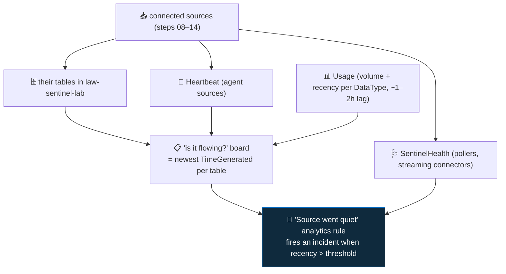

<div align="center">

# 📥 Step 15 · Ingestion health & validation

### *Prove the data is flowing — and get told the day it silently stops*

[](../README.md)
[](#)
[-107C10?style=flat-square)](#)

</div>

---

## 🎯 Goal

`SentinelHealth` is enabled, you have a saved "is it flowing?" board and the built-in health
workbooks, and you have **built and proven an analytics rule that raises an incident when an expected
source goes quiet** — by breaking a connector on purpose and watching it fire.

## 🧠 Why this step

A connector that has stopped is more dangerous than one you never had, because every dashboard still
looks green. The Data connectors page shows **Connected**, the Overview tiles show incidents from
last week, and nobody notices that `SigninLogs` has had no new rows for three days — until an
investigation into a suspected account compromise comes back empty and you realise you have been
blind the whole time.

The ways ingestion silently dies are mundane and numerous: an API key rotated by the vendor and not
updated; a diagnostic setting deleted (often as a side effect of a resource-group cleanup, or
deliberately by an attacker — MITRE T1562.008); an agent that fell off auto-upgrade or lost outbound
connectivity; a VM left deallocated; the workspace **daily cap** hit, stopping *all* ingestion until
the next UTC day; a schema change upstream that the poller can't parse. None of these throw an error
you would see.

So you **monitor the monitoring**. The signal you build a rule on is **recency** — "when did this
source last deliver data?" — not "is the connector configured?". A source that trickles a handful of
stale rows can still be broken. This step also matters because everything downstream —
[step 27](../27-rule-health-monitoring/README.md) (rule health),
[step 39](../39-monitoring-playbook-runs-and-cost/README.md) (playbook health) — is the same
discipline applied to a different layer, and they all read the same `SentinelHealth` table you
switch on here.

## ✅ Prerequisites

- **Steps 08–14** — you have several sources connected, so there is something to watch and something
  to break.
- [Step 07](../07-connectors-and-content-hub/README.md) — the **Microsoft Sentinel** / health &
  audit content installed (brings the health workbooks and templates).
- [Step 05](../05-rbac-and-roles/README.md) — Sentinel Contributor, to enable health monitoring and
  create the rule.

## 🧭 Concepts

Health signal lives in several places, each answering a different question:

| Question | Where the answer is |
|---|---|
| Is the agent alive? | **`Heartbeat`** — one row per minute per AMA / Azure Arc machine |
| Has a source delivered data recently? | The **newest `TimeGenerated`** in that source's table, or in **`Usage`** for that `DataType` |
| Did a connector's poller/collector fail? | **`SentinelHealth`** where `SentinelResourceType == "Data connector"` |
| Did an analytics or automation rule fail? | **`SentinelHealth`** where `SentinelResourceType` is `Analytics rule` / `Automation rule` / `Playbook` ([step 27](../27-rule-health-monitoring/README.md), [step 39](../39-monitoring-playbook-runs-and-cost/README.md)) |
| Was the daily cap hit? | **`Operation`** (`OperationCategory == "Data collection Status"`), or **Settings → Usage and estimated costs → Daily cap** |
| Who changed a connector / rule? | **`SentinelAudit`** (config-change audit) |
| Who ran which query? | **`LAQueryLogs`** — off by default; enable via the *workspace's own* diagnostic settings |



**Walking the diagram:** connected sources fill their tables; agent-based ones also emit
`Heartbeat`, and poller/streaming connectors emit `SentinelHealth` events. Your "is it flowing?"
board is just the max `TimeGenerated` per table (plus `Heartbeat` and `Usage`). The **rule** at the
bottom encodes your expectation — "these N sources should always have data within X hours" — and
raises an incident the moment one falls behind.

### How it works under the hood

- **`SentinelHealth` is opt-in.** Until you enable *health monitoring* in Settings, the table does
  not populate. Not every connector type reports to it: **polling and streaming connectors** (CCP,
  XDR, TI, Defender for Cloud) emit `Data connector` health events; **diagnostic-setting sources**
  (Azure Activity, Entra ID) and **agent/DCR sources** generally do **not** — for those, recency of
  the data itself (or `Heartbeat`) is your only signal. That's why the rule below is recency-based.
- **The daily cap**, if set, halts ingestion for the rest of the UTC day once hit — a cliff, not a
  slope. A source can look "quiet" simply because the workspace stopped accepting data at 14:00 UTC.
- **`Usage` lags** by roughly 1–2 hours, so a recency check against `Usage` needs a threshold of
  ~3–4h to avoid false alarms; a check against the source table directly can be tighter.
- **Built-in content**: the **Data collection health monitoring** and **Workspace usage report**
  workbooks, and (via solutions) analytics rule templates like *"Data connector health degradation"*
  that watch `SentinelHealth` for you. Use them **and** your own recency rule — they cover different
  connector types.

### Vocabulary

| Term | Meaning |
|---|---|
| **`SentinelHealth`** | The table recording connector / rule / automation / playbook run health. Opt-in. |
| **`SentinelAudit`** | The table recording *configuration changes* to Sentinel resources (who edited a rule, disabled a connector). |
| **`Heartbeat`** | One row/minute per agent-managed machine. Absence = the agent or the machine is down. |
| **Recency** | Time since a source last delivered data. The health signal that actually matters. |
| **Daily cap** | An optional hard limit on workspace ingestion per UTC day; hitting it stops all ingestion. |
| **`LAQueryLogs`** | Audit of queries run against the workspace. Enabled via the workspace's own diagnostic settings. |

### Where this fits

This closes the data-onboarding phase: [step 16](../16-retention-archive-and-data-lake/README.md)
tiers the data you've confirmed is flowing, and the SIEM-rules phase (17–28) assumes every rule's
source is present *and monitored*. The rule you build here is the template for
[step 27](../27-rule-health-monitoring/README.md) (rules that stop firing) and
[step 39](../39-monitoring-playbook-runs-and-cost/README.md) (playbooks that stop responding).

### Design rationale

Sentinel makes health monitoring opt-in because `SentinelHealth` is itself billable ingestion, small
but non-zero. Making it recency-first (rather than trusting connector state) reflects the reality
that the "Connected" badge is a lagging KQL check of *configuration*, and configuration can be
perfectly valid while data has stopped.

## 🖱️ Do it — portal

1. **Enable health monitoring.** Sentinel → **Configuration → Settings → Settings tab** → find
   **Auditing and health monitoring** → **Enable**. `SentinelHealth` and `SentinelAudit` start
   populating within ~15 minutes.
2. **Save the health workbooks.** **Threat management → Workbooks → Templates** → open **Data
   collection health monitoring** → **Save** (keep the name). Repeat for **Workspace usage report**
   and **Analytics efficiency**.
3. **(Optional) enable query auditing.** Workspace `law-sentinel-lab` → **Diagnostic settings → Add**
   → category **Audit** → destination this same workspace → Save. Now `LAQueryLogs` records who
   queried what.
4. **Check the daily cap.** **Settings → Usage and estimated costs → Daily cap** — for the lab,
   leave it **off** (a cap can hide a source; in production you set it deliberately with an alert).

## 💻 Do it — the "is it flowing?" board and the checks

```kusto
// board: last event + 24h row count per key source. Adjust the table list to what YOU connected.
union isfuzzy=true withsource=SourceTable
     Heartbeat, SigninLogs, AuditLogs, AzureActivity, SecurityEvent, Syslog,
     CommonSecurityLog, DeviceProcessEvents, SecurityIncident, SecurityAlert
| where TimeGenerated > ago(3d)
| summarize LastEvent = max(TimeGenerated), Rows24h = countif(TimeGenerated > ago(24h)) by SourceTable
| extend StaleHours = round((now() - LastEvent) / 1h, 1)
| sort by StaleHours desc
```

```kusto
// agent heartbeat gaps — a machine that stopped reporting
Heartbeat
| where TimeGenerated > ago(24h)
| summarize LastBeat = max(TimeGenerated) by Computer, OSType
| extend GapMinutes = round((now() - LastBeat) / 1m, 0)
| where GapMinutes > 15
```

```kusto
// connector-level failures (pollers / streaming connectors only)
SentinelHealth
| where TimeGenerated > ago(7d)
| where SentinelResourceType == "Data connector"
| where Status != "Success"
| project TimeGenerated, Connector = SentinelResourceName, Status,
          Reason = tostring(ExtendedProperties.Reason), Description
| sort by TimeGenerated desc
```

```kusto
// did the workspace hit its daily cap in the last 3 days?
Operation
| where TimeGenerated > ago(3d)
| where OperationCategory == "Data collection Status"
| where Detail has "cap" or Detail has "limit"
| project TimeGenerated, OperationCategory, Detail
```

## 🧪 Validate — build and prove the "source went quiet" rule

**Analytics → Create → Scheduled query rule.** Name `OPS · Data source went quiet`, severity Medium.
Query:

```kusto
let StaleAfter = 3h;                        // alert if no data for this long
let Expected = dynamic(["SigninLogs", "AzureActivity", "SecurityEvent"]);   // YOUR must-have sources
Usage
| where TimeGenerated > ago(24h)
| where DataType in (Expected)
| summarize LastData = max(TimeGenerated) by DataType
| join kind=rightouter (
    print DataType = Expected | mv-expand DataType to typeof(string)
  ) on DataType
| extend DataType = coalesce(DataType, DataType1)
| where isnull(LastData) or LastData < ago(StaleAfter)
| extend Reason = strcat(DataType, " — no data for ",
                         iff(isnull(LastData), "24h+", strcat(round((now() - LastData)/1h, 1), "h")))
| project DataType, LastData, Reason
```

Schedule: **run every 1 hour**, **lookback 24 hours** (the query has its own window). Threshold:
**results > 0**. Entity mapping: none needed (map `DataType` as a custom detail).

> `Usage` lags ~1–2h, so `StaleAfter = 3h` avoids false alarms. For a tighter check on a specific
> table, query that table's `max(TimeGenerated)` directly instead of `Usage`.

**Prove it works:**

1. Disable the **Entra ID** diagnostic setting ([step 09](../09-microsoft-entra-id/README.md)) — or
   for a faster test, add `"SecurityEvent"` to `Expected` and **stop the lab VM**
   ([step 11](../11-windows-vm-ama-dcr/README.md)).
2. Wait for `Usage` to reflect the gap (~2–3h) and the rule's next run.
3. Confirm an incident **`OPS · Data source went quiet`** appears, with the stale `DataType` in its
   details.
4. Re-enable the connector / start the VM, confirm data resumes, and close the incident.

**You should see** the incident fire on the deliberately-broken source **before** any dashboard
would show a problem, and the "is it flowing?" board's `StaleHours` climb for that source.

## 🚩 Common mistakes

| 🚩 Mistake | Why it bites |
|---|---|
| Trusting the Data connectors "Connected" badge | It's a lagging KQL check of *config*, not proof of recent data |
| No alert on silence | You discover the gap during an investigation that comes back empty |
| Monitoring only volume, not recency | A source trickling stale rows still counts as "has data" |
| Not enabling `SentinelHealth` | You lose the connector/rule/automation/playbook failure signal entirely |
| Recency threshold tighter than the source's natural lag | False "went quiet" alerts on `Usage` (1–2h lag) or slow cloud sources |
| Leaving a daily cap on in a lab | A hit cap looks identical to every source going quiet at once |
| Only using the built-in health workbook | It watches `SentinelHealth`, which diagnostic-setting sources don't report to — your recency rule covers the gap |
| Alerting into the same queue as security incidents | Ops noise buries real alerts — route health incidents elsewhere ([step 35](../35-automation-rules-triage/README.md)) |

## 🩺 Troubleshooting

| Symptom | Likely cause | Fix |
|---|---|---|
| `SentinelHealth` is empty 30 min after enabling | Propagation delay, or nothing has emitted a health event yet | Wait; trigger a poller error or wait for a scheduled rule to run; confirm the toggle in Settings |
| The "went quiet" rule never fires even after you break a source | `Usage` hasn't caught up yet, `Expected` names a `DataType` that doesn't exist, or `mv-expand` typo | Check `Usage | distinct DataType`; test the query in Logs; lengthen `StaleAfter` |
| The rule fires constantly for a source that *is* flowing | Threshold below the source's ingestion lag, or the source is genuinely intermittent (batch export) | Raise `StaleAfter`; for batch sources, check per known-cadence instead |
| `Heartbeat` gap for a VM that's running | AMA lost outbound connectivity to `*.handler.control.monitor.azure.com` / `*.ingest.monitor.azure.com` | Check NSG/firewall egress; `systemctl status azuremonitoragent` (Linux) / VM Extensions (Windows) |
| Board shows `StaleHours` negative or huge | Clock skew on an agent, or a single very old row in the table | Filter `TimeGenerated > ago(3d)` before `summarize` (already in the query); investigate the outlier host |
| Daily-cap query returns nothing but ingestion clearly stopped | No cap set (good) — the stop is a connector/diag-setting issue, not a cap | Work the "is it flowing?" board and `SentinelHealth` |
| Built-in "Data connector health degradation" rule and your rule both fire for the same source | Expected — they overlap for poller connectors; dedupe with incident grouping ([step 21](../21-alert-and-event-grouping/README.md)) | Group by the connector/DataType entity |

## 🎓 Deepen your understanding

1. For each source you connected (08–14), decide: does it report to `SentinelHealth`, or is recency
   the only signal? Build the `Expected` list for your "went quiet" rule accordingly.
2. What is each source's *natural* delivery cadence and lag? `AzureActivity` (~10–20 min),
   `SigninLogs` (~15–60 min), a 6-hourly poller. Your `StaleAfter` should be a bit more than the
   slowest. Write the number for each.
3. Break a source, let the incident fire, then attach a playbook ([step 30](../30-first-playbook-notify/README.md)) that posts the stale-source name to a channel. Now you have alerting *and* routing.
4. An attacker deletes the Entra diagnostic setting to go dark (T1562.008). Two things should catch
   it: your "went quiet" rule (delayed by `StaleAfter`), and an `AzureActivity` detection on
   `microsoft.aadiam/diagnosticSettings/delete` (near-instant). Which is better, and why do you want
   both?
5. `LAQueryLogs` (if you enabled it) shows who queried what. In an incident where a SOC account is
   suspected compromised, what would you look for there?

## 🗒️ Log your run

Copy [`_templates/STEP-LOG-TEMPLATE.md`](../_templates/STEP-LOG-TEMPLATE.md) into this folder as
`LOG.md`. Record: that health monitoring is enabled, your `Expected` source list with each source's
natural lag, the "is it flowing?" board output, the "went quiet" rule's KQL, and **evidence the rule
fired** on your deliberately-broken source (incident number, the stale `DataType`, time to detect).

## 📚 Microsoft Learn

- [Monitor the health of your Microsoft Sentinel data connectors](https://learn.microsoft.com/en-us/azure/sentinel/monitor-data-connector-health)
- [Auditing and health monitoring in Microsoft Sentinel](https://learn.microsoft.com/en-us/azure/sentinel/health-audit)
- [Turn on auditing and health monitoring](https://learn.microsoft.com/en-us/azure/sentinel/enable-monitoring)
- [SentinelHealth table reference](https://learn.microsoft.com/en-us/azure/azure-monitor/reference/tables/sentinelhealth)
- [SentinelAudit table reference](https://learn.microsoft.com/en-us/azure/azure-monitor/reference/tables/sentinelaudit)
- [Set a daily cap on a Log Analytics workspace](https://learn.microsoft.com/en-us/azure/azure-monitor/logs/daily-cap)

---

<div align="center">
<sub>

[⬅ Prev: 14 · API & codeless connectors](../14-api-and-codeless-connectors/README.md) &nbsp;·&nbsp; [🦅 All steps](../README.md) &nbsp;·&nbsp; [Next: 16 · Retention, archive & data lake ➡](../16-retention-archive-and-data-lake/README.md)

</sub>
</div>
