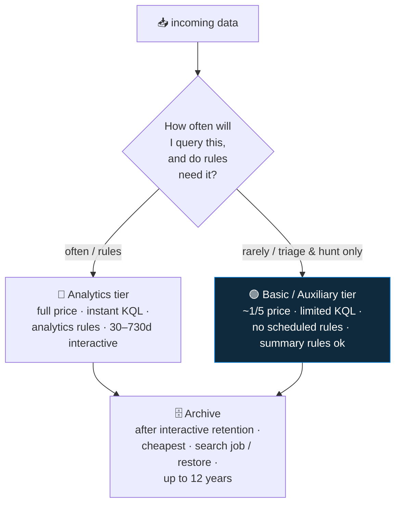

<div align="center">

# 📥 Step 16 · Retention, archive & the data lake

### *Choose analytics / basic / archive per table — on purpose*

[](../README.md)
[](#)
[-107C10?style=flat-square)](#)

</div>

---

## 🎯 Goal

At least one high-volume table is set to the **Basic/Auxiliary** plan, one table has **archive**
retention configured, and you've run a **search job** against archived data.

## 🧠 Why this step

Not all logs deserve the same tier. Analytics-tier data is queryable instantly and drives rules —
you pay full price. High-volume, rarely-queried data (raw network/firewall, verbose app logs) fits
the **Basic/Auxiliary** tier at roughly a fifth of the price, with limited query and no scheduled
rules. Anything older than your interactive retention goes to cheap **archive**, reachable via
**search jobs** or **restore**.

## ✅ Prerequisites

- Steps 08–15 — you have real tables with volume to tier
- [Step 06](../06-cost-model-and-budget/README.md) — you're tracking ingest cost

## 🧭 The three plans



The **Microsoft Sentinel data lake** (newer) extends this: a lake tier for very cheap long-term
storage with KQL and notebook access, decoupled from the analytics workspace. Same decision, more
options.

## 🖱️ Do it — portal

1. **Log Analytics workspace → Tables.** Sort by the table you know is biggest (`CommonSecurityLog`,
   `Syslog`, or a raw `Device*` table).
2. Open it → **Manage table**:
   - Set **Table plan** to **Basic** (or **Auxiliary** for the very high-volume raw logs).
   - Set **Total retention** to e.g. **365 days** while **Interactive retention** stays at 90 —
     the 275-day difference is archive.
3. Save. Repeat for one more table.

## 💻 Do it — CLI

```bash
# switch a table to the Basic plan
az monitor log-analytics workspace table update \
  -g rg-sentinel-lab --workspace-name law-sentinel-lab \
  -n CommonSecurityLog --plan Basic

# analytics table: 90d interactive + archive out to 365d total
az monitor log-analytics workspace table update \
  -g rg-sentinel-lab --workspace-name law-sentinel-lab \
  -n SecurityEvent --retention-time 90 --total-retention-time 365
```

## 🧪 Validate

```bash
az monitor log-analytics workspace table show -g rg-sentinel-lab --workspace-name law-sentinel-lab \
  -n CommonSecurityLog --query "{name:name, plan:plan, interactive:retentionInDays, total:totalRetentionInDays}" -o table
```

Basic-tier query (note: `search`/`where` only, and it's billed per GB scanned):

```kusto
CommonSecurityLog
| where TimeGenerated > ago(1d)
| where DeviceAction == "deny"
| take 100
```

Search job against archive (**Sentinel → Search**): pick `SecurityEvent`, a time range older than
90 days (once you have that history), run it, and query the resulting `*_SRCH` table.

**You should see** `plan: Basic` and the differing interactive/total retention. The Basic query
runs but a scheduled *analytics rule* on that table is now blocked — that's the trade-off you chose.

## 🚩 Common mistakes

| 🚩 Mistake | Why it bites |
|---|---|
| Basic-tiering a table your detections depend on | Scheduled rules on Basic tables don't run |
| Assuming archive is instantly queryable | It needs a search job or restore, which take time and cost per GB |
| Setting total retention below interactive | Invalid — total must be ≥ interactive |
| Basic tier for low-volume tables | The savings are trivial; you lose query power for nothing |

## 🗒️ Log your run

`LOG.md` — which tables you re-tiered, the projected monthly saving, and the search-job result (if
you have >90d history yet).

## 📚 Microsoft Learn

- [Log Analytics table plans (Analytics, Basic, Auxiliary)](https://learn.microsoft.com/en-us/azure/azure-monitor/logs/logs-table-plans)
- [Manage data retention and archive in a Log Analytics workspace](https://learn.microsoft.com/en-us/azure/azure-monitor/logs/data-retention-configure)
- [Run search jobs in Microsoft Sentinel](https://learn.microsoft.com/en-us/azure/sentinel/search-jobs)
- [Microsoft Sentinel data lake overview](https://learn.microsoft.com/en-us/azure/sentinel/datalake/sentinel-lake-overview)

---

<div align="center">
<sub>

[⬅ Prev: 15 · Ingestion health & validation](../15-ingestion-health-and-validation/README.md) &nbsp;·&nbsp; [🦅 All steps](../README.md) &nbsp;·&nbsp; [Next: 17 · Analytics rule types ➡](../17-analytics-rule-types/README.md)

</sub>
</div>
