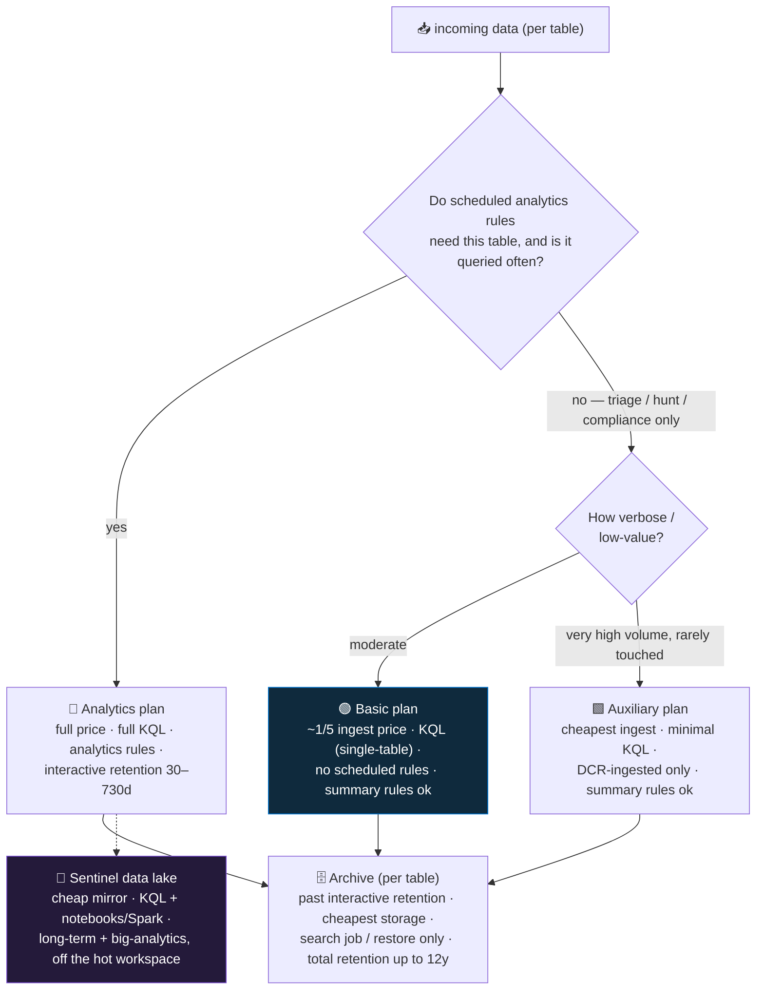

<div align="center">

# 📥 Step 16 · Retention, archive & the data lake

### *Put each table on the plan it deserves — analytics, basic, auxiliary, archive, lake*

[](../README.md)
[](#)
[](#)

</div>

---

## 🎯 Goal

At least one high-volume table is on the **Basic** or **Auxiliary** plan, one analytics-tier table
has **archive** retention configured (short interactive window + long total retention), you have run
a **search job** against older data, and you can explain when the **Sentinel data lake** changes the
picture.

## 🧠 Why this step

Every gigabyte in an analytics-tier table costs the same to ingest and store, whether it drives ten
detections or gets queried once a year during an audit. That is money left on the table. A mature
SOC deliberately **tiers** its data:

- **Analytics tier** for the sources detections and hunts run on constantly — full price, instant
  KQL, scheduled rules.
- **Basic / Auxiliary tier** for high-volume, low-signal-density logs (raw firewall *allow*
  traffic, verbose application logs, DNS, proxy) — roughly a fifth to a fifteenth of the ingestion
  price, in exchange for limited query and **no scheduled analytics rules**.
- **Archive** for anything past your interactive retention window — the cheapest storage, reachable
  only via a **search job** or a **restore**, kept for up to 12 years for compliance.
- **The data lake** — the newer tier that mirrors Sentinel data into cheap OneLake-backed storage
  with KQL *and* notebook/Spark access, decoupling long-term retention and large-scale analytics
  from the analytics workspace.

The reason this is a *data-onboarding* step, not a cost step, is that the decision is best made
**when the source is connected**, before months of data have accumulated on the wrong plan. Changing
a plan only affects new data; the existing data stays on its original plan until its retention
expires.

What teams get wrong: they Basic-tier a table a detection depends on and the rule silently stops
running; they assume archived data is instantly queryable; they set total retention *below*
interactive (invalid); or they Basic-tier a tiny table and save nothing while losing query power.

## ✅ Prerequisites

- **Steps 08–15** — you have real tables with real volume, and you know (from
  [step 06](../06-cost-model-and-budget/README.md) / [step 15](../15-ingestion-health-and-validation/README.md))
  which are the big ones.
- **Contributor** on the workspace — changing a table plan and retention is
  `Microsoft.OperationalInsights/workspaces/tables/write`.
- Awareness of which of your detections (once you build them in phase 🔍) will need which tables —
  don't Basic-tier a table a rule needs.

## 🧭 Concepts



**Walking the diagram:** the question at the top is the whole decision — *do rules need it, is it
queried often?* If yes, it stays on the **analytics** plan and you accept the price. If no, it goes
to **Basic** (moderate volume, still occasionally queried in triage) or **Auxiliary** (firehose
data you keep for the rare deep hunt or compliance). Regardless of plan, once data ages past its
**interactive retention** it rolls to **archive** — same table name, but now only reachable through
an async job. The **data lake** is the newer alternative to "keep everything in the hot workspace
forever": data is mirrored to cheap storage where you can still run KQL and, additionally, Python
notebooks and Spark for large-scale analysis.

### How it works under the hood

- **Table plan** is a per-table property (`plan`: `Analytics` / `Basic` / `Auxiliary`). Changing it
  affects **only data ingested after the change**; existing rows keep their original plan until
  their retention runs out. There is a **minimum 7-day wait** between plan changes on a table
  (you can't flip-flop to game per-day costs).
- **Which tables can change plan** has been expanding. Historically only custom (`*_CL`) and a
  handful of built-ins supported Basic; Microsoft has been adding built-in tables (e.g.
  `CommonSecurityLog`, `Syslog`, several `Device*`). Check **Tables → Manage table** — the plan
  dropdown is greyed out if the table doesn't support it.
- **Interactive retention** (`retentionInDays`): 30–730 days on Analytics; **first 90 days are free**
  with Sentinel enabled, then ~$0.10/GB/month. Basic/Auxiliary have a fixed short interactive window
  (historically 30 days; increasingly configurable — verify).
- **Total retention** (`totalRetentionInDays`): interactive + archive, up to **4383 days (12
  years)**. The difference between total and interactive is the **archive** period. Archive storage
  is ~$0.02/GB/month. Total must be **≥** interactive.
- **Search job**: an async query (**Sentinel → Search**, or the API) that scans interactive **and**
  archive data for a time range, using a limited operator set, and writes matches to a **new
  analytics-tier `*_SRCH` table** you then query normally. Billed **per GB scanned**. Good for
  "find all activity for this IP across the last year".
- **Restore**: hydrates a time range of a table's archived data back into a queryable **`*_RST`**
  table for **full** KQL, billed per GB restored per day (with minimums). Good for a deep
  investigation over a specific historical window.
- **Summary rules**: scheduled aggregations that roll high-volume Basic/Auxiliary data into a small
  **analytics-tier** summary table — so you keep the cheap raw data *and* have queryable,
  rule-able aggregates. This is how you get "alertable" signal off a Basic table.
- **Sentinel data lake**: a OneLake-backed tier that mirrors your Sentinel data at low cost, with
  KQL access and Python/Spark notebooks for large-scale or ML analysis, so the hot analytics
  workspace can be kept lean. Newer and still evolving — check current docs for GA status, pricing,
  and which regions/roles.

### Vocabulary

| Term | Meaning |
|---|---|
| **Table plan** | `Analytics` / `Basic` / `Auxiliary` — sets ingestion price, query power, and rule eligibility for that table. |
| **Interactive retention** | Days the data is instantly, fully KQL-queryable. |
| **Archive** | The cheap storage tier data rolls into past interactive retention; async access only. |
| **Total retention** | Interactive + archive combined. Up to 12 years. |
| **Search job** | Async scan of interactive + archive → results into a `*_SRCH` table. Per-GB-scanned billing. |
| **Restore** | Hydrate archived data for a window back into a `*_RST` table for full KQL. Per-GB-restored billing. |
| **Summary rule** | A scheduled aggregation that turns cheap high-volume data into small analytics-tier summaries you can alert on. |
| **Sentinel data lake** | The low-cost mirror tier with KQL + notebook/Spark access for long-term retention and big analytics. |

### Where this fits

This closes the data-onboarding phase. It works with
[step 13](../13-custom-logs-and-dcr-transformations/README.md) (a DCR transformation can **split** a
stream — security rows to an analytics `*_CL`, verbose rows to an Auxiliary `*_CL`) and feeds
[step 56](../56-cost-engineering/README.md) (the full cost-reduction playbook, commitment tiers,
ingest-time filtering). [Step 61](../61-ir-purge-and-audit/README.md) covers purge, which interacts
with retention.

### Design rationale

Tiering exists because "keep everything, query anything, instantly" is genuinely expensive at scale,
and most log data does not earn that. Making plan changes forward-only (and rate-limited) keeps the
billing model predictable. Summary rules and the data lake are Microsoft's answer to the tension
between "we can't afford to keep this hot" and "we still need to detect and hunt on it".

## 🖱️ Do it — portal

1. **Find the big tables.** Run the `Usage` query from [step 06](../06-cost-model-and-budget/README.md)
   / [step 15](../15-ingestion-health-and-validation/README.md) — `summarize sum(Quantity) by DataType`.
   Your top 1–3 by GB are the candidates.
2. **Re-plan one.** Workspace `law-sentinel-lab` → **Tables** → the big table (e.g.
   `CommonSecurityLog`) → **⋯ → Manage table**:
   - **Table plan** → **Basic** (or **Auxiliary** if it is a firehose you rarely touch). If the
     dropdown is greyed, the table doesn't support it — pick another.
   - Read the warning: **scheduled analytics rules on this table will stop running.** Confirm this
     table isn't one your planned detections need.
   - Save.
3. **Set archive on an analytics table.** On `SecurityEvent` (keep it Analytics) → **Manage table**:
   - **Interactive retention**: `90` days.
   - **Total retention**: `365` days. The 275-day gap is archive.
   - Save.
4. **Run a search job.** Sentinel → **Search** → source table `SecurityEvent` → a time range (for a
   real result you need > interactive-retention-old history; in a fresh lab, use any range and
   observe the mechanics) → **Search**. When it completes, a `SecurityEvent_SRCH` table appears —
   query it like any table.

**Lab vs production:**
- *Lab* — re-plan one table, set archive on one, run one search job to see the flow.
- *Production* — plan every source deliberately at onboarding; split verbose sources with a DCR
  transformation; use **summary rules** to keep alertable aggregates off Basic/Aux data; evaluate
  the **data lake** for multi-year retention instead of paying archive on the hot workspace.

## 💻 Do it — CLI / IaC

```bash
RG=rg-sentinel-lab; WS=law-sentinel-lab

# move a high-volume table to Basic (forward-only; 7-day min before the next plan change)
az monitor log-analytics workspace table update -g $RG --workspace-name $WS \
  -n CommonSecurityLog --plan Basic

# analytics table: 90d interactive + archive to 365d total
az monitor log-analytics workspace table update -g $RG --workspace-name $WS \
  -n SecurityEvent --retention-time 90 --total-retention-time 365

# start a search job (async) — results land in <table>_SRCH
az monitor log-analytics workspace table search-job create -g $RG --workspace-name $WS \
  -n SecurityEvent_SRCH \
  --search-query "SecurityEvent | where EventID == 4625" \
  --start-search-date "2026-06-01T00:00:00Z" --end-search-date "2026-09-01T00:00:00Z" \
  --limit 100000
```

<details><summary>Bicep — set a table's plan + retention</summary>

```bicep
resource ws 'Microsoft.OperationalInsights/workspaces@2023-09-01' existing = { name: 'law-sentinel-lab' }

resource csl 'Microsoft.OperationalInsights/workspaces/tables@2023-09-01' = {
  parent: ws
  name: 'CommonSecurityLog'
  properties: {
    plan: 'Basic'                 // or 'Analytics' / 'Auxiliary'
    // retentionInDays / totalRetentionInDays for Analytics tables:
    // retentionInDays: 90
    // totalRetentionInDays: 365
  }
}
```
</details>

## 🧪 Validate

```bash
az monitor log-analytics workspace table show -g rg-sentinel-lab --workspace-name law-sentinel-lab \
  -n CommonSecurityLog \
  --query "{name:name, plan:plan, interactive:retentionInDays, total:totalRetentionInDays, lastPlanChange:properties.lastPlanModifiedDate}" -o table
```

| Field | Expected after this step |
|---|---|
| `plan` | `Basic` (the re-planned table) |
| `interactive` | the Basic-tier fixed window (e.g. 30) for the Basic table; `90` for `SecurityEvent` |
| `total` | `365` for `SecurityEvent` |

```kusto
// Basic-tier query still works (single-table, filter/parse)
CommonSecurityLog
| where TimeGenerated > ago(1d) and DeviceAction == "deny"
| take 100
```

```kusto
// but a cross-table join on a Basic table is rejected / unsupported — try it and read the error
CommonSecurityLog | where TimeGenerated > ago(1h)
| join kind=inner (SecurityEvent | where TimeGenerated > ago(1h)) on $left.SourceIP == $right.IpAddress
```

```kusto
// search-job result table (after the job completes)
SecurityEvent_SRCH
| summarize count() by EventID
```

**You should see** `plan: Basic`, the Basic single-table query succeeding, the cross-table join
failing (that's the trade-off you accepted), the differing interactive/total retention on
`SecurityEvent`, and a populated `*_SRCH` table. Then confirm the cost lever landed: after a day,
`Usage` for `CommonSecurityLog` should show the same GB but you're now billed at the Basic rate —
check **Cost Management** grouped by meter.

## 🚩 Common mistakes

| 🚩 Mistake | Why it bites |
|---|---|
| Basic/Auxiliary-tiering a table a scheduled rule needs | The rule silently stops running — no error, no incidents |
| Assuming archived data is instantly queryable | It needs a search job or restore — minutes to hours, and per-GB billing |
| Setting total retention below interactive | Invalid — total must be ≥ interactive |
| Basic-tiering a small table | Trivial saving, real loss of query power — only tier the big ones |
| Flip-flopping table plans | 7-day minimum between plan changes; you can't optimise per-day |
| Forgetting summary rules exist | You can still get alertable signal off Basic/Aux data by aggregating it up |
| Paying archive on the hot workspace for 7 years | The data lake may be cheaper for long retention — evaluate it |
| Re-planning after months of data | The old data stays on the old (expensive) plan until retention expires — decide at onboarding |

## 🩺 Troubleshooting

| Symptom | Likely cause | Fix |
|---|---|---|
| Plan dropdown greyed out in **Manage table** | That table doesn't support Basic/Auxiliary | Check the table's docs; pick a different table, or split via a DCR transformation into a `*_CL` you control |
| `az ... table update --plan Basic` → error about a recent change | 7-day minimum between plan changes hasn't elapsed | Wait; the error states the earliest date |
| A scheduled rule shows *"Failure"* right after you re-planned its table | Analytics rules can't run against Basic/Auxiliary tables | Revert the table to Analytics, or rebuild the detection as a **summary rule** + an analytics rule on the summary |
| Search job stuck / very slow | Large time range × large table = lots of GB scanned | Narrow the time range and add a filter to the `--search-query`; check the job status in **Search → previous searches** |
| `*_SRCH` table not appearing | Job still running, or it returned zero matches | **Search** blade shows job status; a zero-match job still creates the (empty) table |
| Archived data "missing" for a date you expected | That data was ingested *before* you set the longer total retention, so it expired at the old retention | Retention changes are forward-looking; you cannot recover already-expired data |
| Cost didn't drop after moving a table to Basic | Only new data is on the new plan; the old analytics-tier data is still being billed for retention | Wait for the old data to age out; check Cost Management by meter over the following weeks |

## 🎓 Deepen your understanding

1. For each source you connected (08–14), write its plan decision and the one-sentence reason. Which one table would save the most money on Basic, and does any detection need it?
2. `CommonSecurityLog` on Basic: list three questions you can still answer with a single-table query, and two you can't (that need a `join` or `summarize` across tables). How would a **summary rule** give you one of the "can't" answers back?
3. Set `SecurityEvent` to 30d interactive / 2555d (7y) total. What does that cost in archive storage per GB/year? When would a compliance team ask for this, and what's the retrieval story when they do?
4. Run a search job for one IP across the widest range you have. Note the GB scanned and the cost. Now imagine doing that during a live incident under time pressure — what would you pre-stage (a saved query, a restore) to make it fast?
5. Read the current Sentinel data lake docs. For a 5-year retention requirement on 200 GB/day of firewall logs, compare: analytics + archive on the hot workspace, vs Auxiliary + archive, vs the data lake. Which wins, and what do you give up?

## 🗒️ Log your run

Copy [`_templates/STEP-LOG-TEMPLATE.md`](../_templates/STEP-LOG-TEMPLATE.md) into this folder as
`LOG.md`. Record: which table(s) you re-planned and to what, the interactive/total retention you set
on `SecurityEvent`, the `az ... table show` output, the search-job you ran (query, range, GB
scanned), and your **estimated monthly saving** with the trade-off stated.

## 📚 Microsoft Learn

- [Log Analytics table plans — Analytics, Basic, and Auxiliary](https://learn.microsoft.com/en-us/azure/azure-monitor/logs/logs-table-plans)
- [Manage data retention and archive in a Log Analytics workspace](https://learn.microsoft.com/en-us/azure/azure-monitor/logs/data-retention-configure)
- [Run search jobs in Microsoft Sentinel](https://learn.microsoft.com/en-us/azure/sentinel/search-jobs)
- [Restore archived logs from search](https://learn.microsoft.com/en-us/azure/azure-monitor/logs/restore)
- [Aggregate data in a Log Analytics workspace with summary rules](https://learn.microsoft.com/en-us/azure/azure-monitor/logs/summary-rules)
- [Microsoft Sentinel data lake overview](https://learn.microsoft.com/en-us/azure/sentinel/datalake/sentinel-lake-overview)

---

<div align="center">
<sub>

[⬅ Prev: 15 · Ingestion health & validation](../15-ingestion-health-and-validation/README.md) &nbsp;·&nbsp; [🦅 All steps](../README.md) &nbsp;·&nbsp; [Next: 17 · Analytics rule types ➡](../17-analytics-rule-types/README.md)

</sub>
</div>
