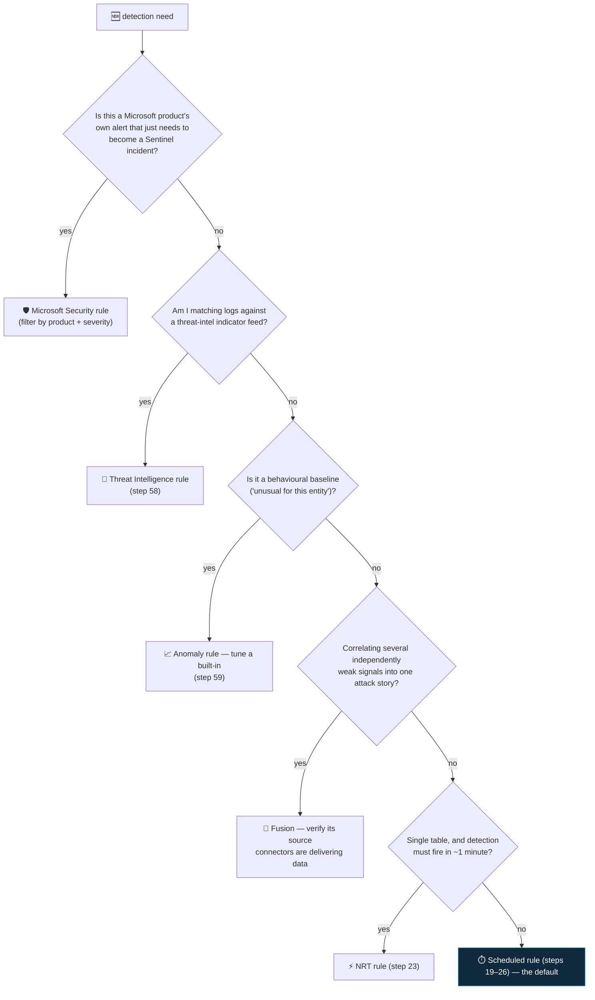

<div align="center">

# 🔍 Step 17 · Analytics rule types

### *Six kinds of rule — what each produces, which you can author, and how to choose*

[](../README.md)
[](#)
[](#)

</div>

---

## 🎯 Goal

You can name all six analytics rule types, say what each **produces** (an alert, an incident, or an
anomaly record), state which you can author yourself versus only enable/tune, and pick the right
type for a given detection need — without reflexively reaching for "scheduled".

## 🧠 Why this step

The next ten steps are almost entirely about **scheduled** rules, because that is the type you write
by hand and the one most detections are. But some detections should not be scheduled rules:
sub-minute-critical events want **NRT**; multi-signal attack chains are what **Fusion** does with ML
you cannot replicate; alerts from Defender for Cloud only become incidents through a **Microsoft
Security** rule; behavioural baselines are **anomaly** rules; and matching logs against indicator
feeds is a dedicated **Threat Intelligence** rule. Knowing the taxonomy stops you rebuilding a
Fusion scenario as a brittle scheduled query, or wondering why your Defender for Cloud alerts never
show up in the incident queue.

The other reason to learn this now: each type has different **limits and cost**. Scheduled rules
have a query-cost and a frequency floor. NRT rules are capped in number and forbid `join`. Fusion
needs its source connectors actually delivering data or it silently never fires. Getting the type
wrong is a class of bug that produces "rule enabled, zero results, forever" — indistinguishable from
a well-tuned quiet rule ([step 27](../27-rule-health-monitoring/README.md)).

## ✅ Prerequisites

- [Step 07](../07-connectors-and-content-hub/README.md) — Content hub solutions installed, so
  **Analytics → Rule templates** is populated with examples of each type.
- Data from at least [step 08](../08-azure-activity/README.md) and
  [step 09](../09-microsoft-entra-id/README.md), so rules have something to evaluate and Fusion has
  source signals.

## 🧭 Concepts

### The six types

| Type (API `kind`) | What it does | You author it? | Produces | Latency | Key limits |
|---|---|---|---|---|---|
| **Scheduled** (`Scheduled`) | Runs your KQL on an interval over a lookback window | ✅ full | Alert → (grouped) Incident | 5 min – 14 days | Query cost; frequency floor 5 min; lookback ≤ 14 days |
| **Near-real-time** (`NRT`) | Runs ~every minute on the most recent minute of one table | ✅ (constrained) | Alert → Incident | ~1–2 min | **No `join`/`union` across tables**; single table; ~50 NRT rules/workspace; limited functions |
| **Microsoft Security** (`MicrosoftSecurityIncidentCreation`) | Turns alerts from a connected Microsoft product into Sentinel incidents, filtered by product/severity/name | ⚙️ enable + filter only (no KQL) | Incident (from an existing alert) | product-dependent | Only for connected Microsoft products; XDR incident sync (step 10) can supersede it |
| **Fusion** (`Fusion`) | ML correlation of many low-fidelity alerts + anomalies into one high-confidence multistage-attack incident | ❌ enable / disable source signals + exclude patterns only | High-confidence Incident | hours | Needs its source connectors *live*; one main rule; cannot be authored |
| **Anomaly** (`MLBehaviorAnalytics` + UEBA anomalies) | Built-in ML baselines (anomalous RDP, anomalous sign-in, data exfil to unusual destination, …) | ⚙️ duplicate + tune thresholds | `Anomalies` table record; some also raise Alerts | continuous | Needs ~1–2 weeks to baseline; **Flagged** (record only) vs **Production** (may alert) |
| **Threat Intelligence** (`ThreatIntelligence`) | Matches incoming logs against `ThreatIntelligenceIndicator` (IP/domain/URL/hash) | ⚙️ enable (per log type) | Alert → Incident | scheduled (~hourly) | Needs indicators present (step 58); one template per indicator type |



**Walking the decision tree:** most custom detection work lands on **Scheduled** — that is the
bottom of the tree and the subject of the next ten steps. You branch off only for a specific reason:
a Microsoft product alert that needs promoting to an incident, an indicator-matching detection, a
per-entity behavioural baseline, a multi-signal attack chain, or a genuine sub-minute latency
requirement on a single table.

### Alert vs incident vs anomaly record

- An **alert** (`SecurityAlert` table) is a single rule firing on a match. Scheduled, NRT, TI, and
  most anomaly rules produce alerts.
- An **incident** (`SecurityIncident` table) is the unit an analyst works — one or more correlated
  alerts, grouped ([step 21](../21-alert-and-event-grouping/README.md)). Sentinel creates incidents
  from alerts automatically unless you turn that off.
- Microsoft Security rules produce incidents from **already-existing** product alerts (no new alert).
- Fusion produces **incidents directly** — high-confidence, multi-stage, no separate authorable
  alert.
- Anomaly rules in **Flagged** mode produce only `Anomalies` table records (no alert, no incident) —
  safe to observe. In **Production** mode some also raise alerts and feed Fusion.

### How it works under the hood

- **Scheduled and NRT** rules are stored as `Microsoft.SecurityInsights/alertRules` with your KQL
  in `properties.query`. The Sentinel backend runs them on the schedule (NRT is a special ~1-minute
  cadence with a constrained query engine — hence no cross-table `join`).
- **Fusion** ("Advanced Multistage Attack Detection", plus scenario-based and emerging-threat
  variants) is a Microsoft-operated ML model. You can enable/disable individual **source signals**
  (which detections and anomalies it may correlate) and exclude specific **detection patterns**, but
  you cannot see or change the model. If, say, the identity connector is live but the endpoint
  connector isn't, a Fusion scenario needing both **will never fire**, and the rule still shows
  "enabled" — no error.
- **Microsoft Security** rules are a filter, not a query: product = *Microsoft Defender for Cloud*,
  severity ≥ *Medium*, optionally include/exclude by alert display name. With the XDR connector's
  incident sync on ([step 10](../10-defender-xdr/README.md)), you generally do **not** also need a
  Microsoft Security rule for XDR products — that would duplicate.
- **Templates** (`alertRuleTemplates`) carry a `kind` matching the rule type, `requiredDataConnectors`,
  and MITRE tags. You create an active rule *from* a template ([step 18](../18-enable-a-rule-from-template/README.md)); the template stays as a versioned reference.

### Vocabulary

| Term | Meaning |
|---|---|
| **Scheduled rule** | A KQL query the backend runs on a timer. The workhorse; fully authorable. |
| **NRT rule** | Near-real-time — ~1-minute cadence, single table, no cross-table joins. |
| **Microsoft Security rule** | A filter that promotes a connected Microsoft product's alerts to Sentinel incidents. |
| **Fusion** | Microsoft's ML multi-stage-attack correlation. Enable/tune only. |
| **Anomaly rule** | A built-in ML baseline; **Flagged** = record only, **Production** = may alert. |
| **Threat Intelligence rule** | Matches logs to `ThreatIntelligenceIndicator` entries. |
| **Source signal** | A detection or anomaly that Fusion is allowed to use as an input. |
| **`SecurityAlert` / `SecurityIncident` / `Anomalies`** | The tables each rule type writes to. |

### Where this fits

This is the map for the whole SIEM-rules phase. [Step 18](../18-enable-a-rule-from-template/README.md)
enables scheduled + Microsoft Security rules from templates;
[step 19](../19-write-a-scheduled-rule/README.md) writes a scheduled rule;
[step 23](../23-nrt-rules/README.md) does NRT; [step 58](../58-threat-intelligence/README.md) does TI
rules; [step 59](../59-anomaly-and-ml-rules/README.md) tunes anomaly rules; Fusion you mostly just
verify is healthy. [Step 25](../25-mitre-attack-coverage/README.md) reads coverage across all types.

### Design rationale

Six types exist because "detection" is not one problem. Deterministic pattern-matching (scheduled /
NRT), promoting a partner's verdict (Microsoft Security), ML correlation across noisy inputs
(Fusion), per-entity behavioural modelling (anomaly), and indicator matching (TI) are genuinely
different engineering problems with different latency, cost, and authorability profiles. Forcing all
of them through "scheduled KQL" would make several of them impossible or terrible.

## 🖱️ Do it — inventory your workspace

1. **Analytics → Active rules** → group/filter by **Rule type**. Note the counts. Right now you
   likely have `0` scheduled/NRT, and some **Microsoft Security** rules ready to enable, and the
   auto-enabled **Fusion** rule.
2. **Analytics → Rule templates** → the **Rule type** column. Filter to each type in turn and count
   how many templates exist.
3. Open the **Fusion** rule (**Active rules** → *Advanced Multistage Attack Detection*) → **Edit** →
   read its **source signals** list. For each, check in **Data connectors** whether that source is
   actually delivering data. Write down which Fusion inputs you are missing.
4. **Analytics → Anomalies** tab → look at the built-in anomaly rules and whether each is **Flagged**
   or **Production**.
5. Open one **Microsoft Security** rule template → note it has **no query** — just product /
   severity / name filters.

## 💻 Do it — CLI / IaC

This step is inventory, not deployment — the CLI is for *reading* the current rule and template
state. Authoring rules as code starts in [step 28](../28-analytics-rules-as-code/README.md).

```bash
# how many templates of each kind ship / were installed
az sentinel alert-rule template list -g rg-sentinel-lab --workspace-name law-sentinel-lab \
  --query "[].kind" -o tsv | sort | uniq -c
# expect kinds like: Scheduled, NRT, Fusion, MicrosoftSecurityIncidentCreation, MLBehaviorAnalytics, ThreatIntelligence
```

```bash
# what's actually ENABLED right now, by kind
az sentinel alert-rule list -g rg-sentinel-lab --workspace-name law-sentinel-lab \
  --query "[?enabled].{name:displayName, kind:kind}" -o table
```

```bash
# one template's requiredDataConnectors — the prerequisite check the wizard does for you
az sentinel alert-rule template list -g rg-sentinel-lab --workspace-name law-sentinel-lab \
  --query "[?kind=='Scheduled'] | [0].{name:displayName, needs:requiredDataConnectors[].connectorId}"
```

In an ARM/Bicep template, the `kind` field on `Microsoft.SecurityInsights/alertRules` is what
selects the type (`Scheduled` / `NRT` / `MicrosoftSecurityIncidentCreation` / `Fusion` /
`MLBehaviorAnalytics` / `ThreatIntelligence`) and it changes which `properties` are valid — see the
[alertRules ARM reference](https://learn.microsoft.com/en-us/azure/templates/microsoft.securityinsights/alertrules).

## 🧪 Validate

```kusto
// what has actually produced alerts (little/nothing until step 18)
SecurityAlert
| where TimeGenerated > ago(30d)
| summarize Alerts = count() by ProductName, AlertType
| sort by Alerts desc
```

```kusto
// Fusion incidents specifically (if any)
SecurityIncident
| where TimeGenerated > ago(30d)
| where ProviderName == "Azure Sentinel" and AdditionalData has "Fusion" or Title has "multiple"
| project TimeGenerated, Title, Severity
```

**You should see** the template-kind histogram (proof all six types exist as concepts you could
use), exactly one enabled rule (the Fusion rule) or a few Microsoft Security rules, and an
essentially empty `SecurityAlert` — because you have not enabled any detection yet. That empty state
is the starting line for [step 18](../18-enable-a-rule-from-template/README.md).

## 🚩 Common mistakes

| 🚩 Mistake | Why it bites |
|---|---|
| Rebuilding a Fusion scenario as scheduled KQL | You lose the ML correlation and take on maintenance of a fragile query |
| Enabling Fusion with half its source connectors missing | It shows "enabled" and silently never fires the scenarios that need the missing data |
| Treating Microsoft Security rules as optional | Without one (or XDR incident sync), Defender for Cloud alerts never become incidents |
| Adding a Microsoft Security rule for XDR *and* running XDR incident sync | Duplicate incidents |
| Assuming anomaly rules raise incidents by default | Many stay in **Flagged** mode — records in `Anomalies`, no alert — until you promote them |
| Forcing a sub-minute detection into a scheduled rule | The 5-minute frequency floor means it's not "near real time" no matter how you set it |
| Putting a `join` in an NRT rule | Not supported — the wizard rejects it |
| Ignoring the query-cost of many scheduled rules | Each run scans data; hundreds of frequent rules add up ([step 56](../56-cost-engineering/README.md)) |

## 🩺 Troubleshooting

| Symptom | Likely cause | Fix |
|---|---|---|
| `az sentinel alert-rule template list` shows only a few kinds | Content hub solutions not installed, or the workspace is very fresh | Install the relevant solutions ([step 07](../07-connectors-and-content-hub/README.md)) |
| Fusion rule enabled, zero Fusion incidents ever | Its source connectors aren't delivering data, or the environment is genuinely quiet | Cross-check the source-signals list against **Data connectors**; generate multi-stage test activity later (capstone, [step 62](../62-capstone/README.md)) |
| Defender for Cloud alerts visible in the Defender portal but no Sentinel incident | No Microsoft Security rule for Defender for Cloud, and it's not covered by XDR sync | Create/enable a Microsoft Security rule for *Microsoft Defender for Cloud* |
| NRT rule won't save | Query uses `join`, `union`, a cross-workspace reference, or an unsupported function | Simplify to a single-table query; if you need correlation, use a scheduled rule ([step 23](../23-nrt-rules/README.md)) |
| Anomaly rule "on" but nothing in `Anomalies` | Still baselining (1–2 weeks), or the required source isn't connected | Wait; confirm the source; check the rule is not merely **Flagged** if you expected alerts |
| Two rules of different types fire for the same event | Overlapping coverage (e.g. a scheduled rule and an anomaly rule) | Expected — dedupe with incident grouping ([step 21](../21-alert-and-event-grouping/README.md)); or disable the weaker one |

## 🎓 Deepen your understanding

1. For each of these needs, name the rule type and why: (a) "alert within a minute if a global admin role is granted"; (b) "an attacker used a valid account then moved laterally then exfiltrated"; (c) "any log line contains an IP from our threat feed"; (d) "this user signed in from a country they never use"; (e) "Defender for Cloud found an exposed storage account".
2. Open the Fusion rule's source-signals list. If you disabled every signal from a connector you don't have, would Fusion get *better* or just *quieter*? What does that tell you about enabling connectors before relying on Fusion?
3. A Microsoft Security rule produces an incident from an *existing* alert; a scheduled rule produces a *new* alert. Why does that distinction matter for entity mapping and automation later ([steps 20](../20-entity-mapping-and-custom-details/README.md), [36](../36-alert-vs-incident-vs-entity-triggers/README.md))?
4. NRT rules are capped (~50/workspace) and forbid joins. Given that, which of *your* future detections genuinely earn an NRT slot? List no more than five.
5. Anomaly rules emit to `Anomalies`, not `SecurityAlert`. If you wanted to alert on an anomaly, what would you build — and why is combining an anomaly with a weak scheduled detection stronger than either alone ([step 59](../59-anomaly-and-ml-rules/README.md))?

## 🗒️ Log your run

Copy [`_templates/STEP-LOG-TEMPLATE.md`](../_templates/STEP-LOG-TEMPLATE.md) into this folder as
`LOG.md`. Record: the template-kind histogram, which rules are currently enabled, the Fusion
source-signals you are **missing** (and which connector would fix each), and your five-or-fewer
list of detections that genuinely need NRT.

## 📚 Microsoft Learn

- [Threat detection with analytics rules in Microsoft Sentinel](https://learn.microsoft.com/en-us/azure/sentinel/threat-detection)
- [Detect threats out-of-the-box](https://learn.microsoft.com/en-us/azure/sentinel/detect-threats-built-in)
- [Advanced multistage attack detection (Fusion)](https://learn.microsoft.com/en-us/azure/sentinel/fusion)
- [Configure the Fusion rule](https://learn.microsoft.com/en-us/azure/sentinel/configure-fusion-rules)
- [Near-real-time (NRT) analytics rules](https://learn.microsoft.com/en-us/azure/sentinel/near-real-time-rules)
- [Use customizable anomalies](https://learn.microsoft.com/en-us/azure/sentinel/soc-ml-anomalies)
- [Create Microsoft Security analytics rules](https://learn.microsoft.com/en-us/azure/sentinel/create-incidents-from-alerts)

---

<div align="center">
<sub>

[⬅ Prev: 16 · Retention, archive & data lake](../16-retention-archive-and-data-lake/README.md) &nbsp;·&nbsp; [🦅 All steps](../README.md) &nbsp;·&nbsp; [Next: 18 · Enable a rule from a template ➡](../18-enable-a-rule-from-template/README.md)

</sub>
</div>
