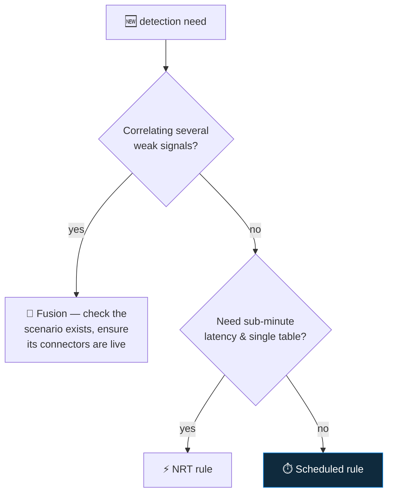

<div align="center">

# 🔍 Step 17 · Analytics rule types

### *Five kinds of rule, and which one fits which detection*

[](../README.md)
[](#)
[](#)

</div>

---

## 🎯 Goal

You can name all five analytics rule types, say what each is for, and list which ones you can and
cannot author yourself.

## 🧠 Why this step

Beginners build everything as a scheduled rule. Some detections need near-real-time; some are pure
correlation Microsoft does for you; some just import product alerts. Knowing the taxonomy stops you
reinventing a Fusion detection as a fragile scheduled query.

## ✅ Prerequisites

- [Step 07](../07-connectors-and-content-hub/README.md) — rule templates visible in Analytics
- Data from at least steps 08–09 so rules have something to evaluate

## 🧭 The five types

| Type | What it does | You author it? | Latency | Notes |
|---|---|---|---|---|
| **Scheduled** | Runs a KQL query on an interval over a lookback window | ✅ yes | 5 min – 14 days | The workhorse. Steps 19–26. |
| **Near-real-time (NRT)** | Runs (almost) every minute on the last minute of data | ✅ yes | ~1 min | One table, tight limits. Step 23. |
| **Microsoft Security** | Turns alerts from a connected Microsoft product (Defender for Cloud, XDR) into Sentinel incidents | ⚙️ enable/filter only | product-dependent | No KQL; just a filter on severity/product |
| **Fusion** | ML correlation of multiple low-fidelity signals into one high-confidence multi-stage-attack incident | ❌ no (tune scenarios only) | hours | Needs the relevant connectors live or it can't fire |
| **Anomaly** | Built-in ML baselines (e.g. anomalous RDP, data exfil) that emit anomaly records; some also raise alerts | ⚙️ customize thresholds | continuous | Step 59 |
| **Threat Intelligence** | Matches incoming logs against `ThreatIntelligenceIndicator` | ⚙️ enable | scheduled | Step 58 |



## 🖱️ Do it — inventory your workspace

1. **Analytics → Active rules** — filter by **Rule type**. Note how many of each you have (probably
   0 active, some Microsoft Security ready to enable).
2. **Analytics → Rule templates** — the **Rule type** column. Count Fusion (usually 1, "Advanced
   Multistage Attack Detection"), NRT, Scheduled.
3. Open the **Fusion** template → read its **source signals** list. Note which connectors each needs.
4. **Anomalies** tab → see the built-in anomaly rules and their `Flagged` vs `Production` mode.

## 🧪 Validate

```bash
az sentinel alert-rule template list -g rg-sentinel-lab --workspace-name law-sentinel-lab \
  --query "[].kind" -o tsv | sort | uniq -c
```

```kusto
// what rule types are actually enabled
SecurityAlert
| where TimeGenerated > ago(30d)
| summarize count() by ProductName, AlertType
```

**You should see** the template kinds counted (`Scheduled`, `NRT`, `Fusion`, `MicrosoftSecurityIncidentCreation`, `MLBehaviorAnalytics`), and — until you enable rules in step 18 — little or nothing in `SecurityAlert`.

## 🚩 Common mistakes

| 🚩 Mistake | Why it bites |
|---|---|
| Rebuilding a Fusion scenario as scheduled KQL | You lose the ML correlation and add maintenance |
| Enabling Fusion with half its connectors missing | It shows "enabled" and never fires |
| Treating Microsoft Security rules as optional | They're how Defender for Cloud/XDR alerts *become incidents* |
| Assuming anomaly rules raise incidents by default | Many only emit `Anomalies` records until you promote them |

## 🗒️ Log your run

`LOG.md` — your template-kind histogram and which Fusion connectors you're missing.

## 📚 Microsoft Learn

- [Threat detection with analytics rules](https://learn.microsoft.com/en-us/azure/sentinel/threat-detection)
- [Advanced multistage attack detection (Fusion)](https://learn.microsoft.com/en-us/azure/sentinel/fusion)
- [Use near-real-time (NRT) detection rules](https://learn.microsoft.com/en-us/azure/sentinel/near-real-time-rules)

---

<div align="center">
<sub>

[⬅ Prev: 16 · Retention, archive & data lake](../16-retention-archive-and-data-lake/README.md) &nbsp;·&nbsp; [🦅 All steps](../README.md) &nbsp;·&nbsp; [Next: 18 · Enable a rule from a template ➡](../18-enable-a-rule-from-template/README.md)

</sub>
</div>
