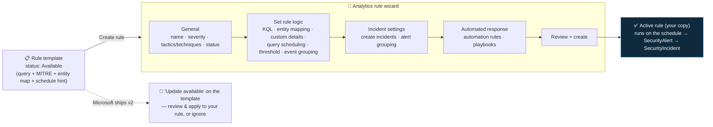

<div align="center">

# 🔍 Step 18 · Enable a rule from a template

### *Ship your first working detections — and learn the rule wizard before you author from scratch*

[](../README.md)
[](#)
[-107C10?style=flat-square)](#)

</div>

---

## 🎯 Goal

At least two scheduled analytics rules **created from templates** are active, each scheduled so its
lookback matches its run frequency, each with entity mapping confirmed, and at least one has produced
a `SecurityAlert` and a matching `SecurityIncident` from activity **you generated on purpose**.

## 🧠 Why this step

Templates are the fastest route to real coverage and the best way to learn the rule wizard. Each
template is a **maintained, MITRE-mapped, entity-mapped** detection written by Microsoft or the
community — a scheduled KQL query plus all the metadata (tactics, techniques, entity mappings,
suggested scheduling, required data connectors). Enabling a handful of good ones gives you a working
incident pipeline in minutes, and walking the wizard now means [step 19](../19-write-a-scheduled-rule/README.md)
(authoring from scratch) is filling in a form you already understand rather than meeting it cold.

The judgement this step teaches: **a template is a starting point, not a finished rule**. It ships
**disabled** on purpose. Enabling it is a decision — you check its required data is connected, you
set the scheduling to something sane for your environment, you look at the results-simulation graph
to sanity-check the threshold, and you accept that you will tune it later
([step 26](../26-tuning-a-noisy-rule/README.md)) once it has produced some real alerts.

What teams get wrong: they enable fifty templates in one sitting and drown the queue before anyone
can triage; they leave the lookback shorter than the run frequency and open a coverage gap
([step 22](../22-scheduling-lookback-and-coverage-gaps/README.md)); or they enable a rule whose
source table has no data and never notice it runs "Success, 0 results" forever.

## ✅ Prerequisites

- [Step 09](../09-microsoft-entra-id/README.md) — `SigninLogs` flowing (for the identity template).
- [Step 11](../11-windows-vm-ama-dcr/README.md) — `SecurityEvent` flowing (for the Windows template).
- [Step 07](../07-connectors-and-content-hub/README.md) — the matching solutions installed, so the
  templates exist.
- [Step 05](../05-rbac-and-roles/README.md) — **Microsoft Sentinel Contributor** (creating a rule is
  `alertRules/write`).

## 🧭 Concepts

Creating a rule from a template makes a **one-time copy** of the template's logic into an active
`alertRules` resource. The copy is **yours** — you can edit its query, scheduling, and settings
freely. The template stays as a versioned reference: when Microsoft ships a new version you get an
**"Update available"** badge on the template and can review the diff and apply it (or not). One
template can be used to create **several** rules — e.g. the same detection scoped to different
subscriptions or with different thresholds.



**Walking the wizard:** **General** sets identity and MITRE tags (pre-filled from the template).
**Set rule logic** is the heart — the KQL query, the **entity mapping** (which columns are the
account / IP / host — [step 20](../20-entity-mapping-and-custom-details/README.md)), and **query
scheduling** (run every *X*, look back *Y*). Below the query is a **results simulation** graph
showing how many results the query would have returned over recent days — use it to sanity-check the
threshold before you enable. **Incident settings** controls whether alerts become incidents and how
they group ([step 21](../21-alert-and-event-grouping/README.md)). **Automated response** attaches
automation later ([steps 30–37](../30-first-playbook-notify/README.md)). **Review + create** saves it.

### How it works under the hood

- The active rule is `Microsoft.SecurityInsights/alertRules` (`kind: Scheduled`), with
  `properties.alertRuleTemplateName` linking back to the template GUID for version tracking, and
  `properties.templateVersion` recording which version you created from.
- The Sentinel backend runs the rule on `queryFrequency`, evaluating `query` over the last
  `queryPeriod` of data. If the result count crosses `triggerThreshold` per `triggerOperator`, it
  emits alert(s) to `SecurityAlert`, extracts entities per the mapping, and (unless incident
  creation is off) creates/updates a `SecurityIncident`.
- Enabling a template flips its status to **In use**. Disabling/deleting your rule flips it back to
  **Available**.
- A template with unmet `requiredDataConnectors` shows **Not available** and the Create button is
  disabled until the connector is connected.

### Vocabulary

| Term | Meaning |
|---|---|
| **Rule template** | A read-only, versioned detection definition installed by a solution. Status *Available* / *In use* / *Not available*. |
| **Active rule** | Your editable copy, created from a template (or from scratch), that actually evaluates data. |
| **`alertRuleTemplateName` / `templateVersion`** | Fields on your rule that link it to its source template and the version you copied. |
| **Query scheduling** | `queryFrequency` (how often it runs) + `queryPeriod` (how far back it looks). |
| **Results simulation** | The wizard graph estimating past results at your current query + threshold. |
| **Alert threshold** | `triggerOperator` + `triggerThreshold` — how many results constitute a firing. |

### Where this fits

This is the first *detecting* step. [Step 19](../19-write-a-scheduled-rule/README.md) writes a rule
from scratch using the same wizard; [step 20](../20-entity-mapping-and-custom-details/README.md)–[26](../26-tuning-a-noisy-rule/README.md)
refine scheduling, grouping, coverage, and tuning; [step 28](../28-analytics-rules-as-code/README.md)
exports these rules as code. The MITRE tags the templates carry feed
[step 25](../25-mitre-attack-coverage/README.md).

### Design rationale

Templates ship disabled and as copies (not live references) so that Microsoft can improve detection
logic centrally without silently overwriting a rule you have tuned to your environment — and so a
new SOC is not buried under hundreds of untuned alerts the moment it installs a solution.

## 🖱️ Do it — portal

1. **Identity rule.** **Analytics → Rule templates** → filter **Data sources: Microsoft Entra ID**,
   **Rule type: Scheduled**. Pick one like *"Brute force attack against Azure Portal"* or
   *"Sign-ins from IPs that attempt sign-ins to disabled accounts"*. Open it → **Create rule**:
   - **General**: keep the name; severity **Medium**; tactics/techniques pre-filled (Credential
     Access / T1110). Status **Enabled**.
   - **Set rule logic**: read the KQL — know what it looks for. **Query scheduling**: **Run every
     1 hour**, **Lookback 1 hour** (or match the template's own comment — some want a longer
     window). Check the **results simulation** graph. **Entity mapping**: confirm Account and IP
     are mapped.
   - **Incident settings**: create incidents = on; leave grouping default for now.
   - **Automated response**: none yet.
   - **Review + create**.
2. **Windows rule.** Repeat with a `SecurityEvent` template — filter **Data sources: Windows
   Security Events**, pick one like *"Multiple authentication failures followed by a success"* or
   *"Excessive Windows logon failures"*.
3. **Analytics → Active rules** — both show **Enabled**, **Last run**: *pending* then a timestamp.
   The two source templates now show **In use**.

**Lab vs production:**
- *Lab* — enable ~2–5 templates whose data you have, generate test activity, watch them fire.
- *Production* — enable against a coverage plan ([step 25](../25-mitre-attack-coverage/README.md)),
  in waves, tuning each wave before the next; track which template version each rule came from so
  you can review Microsoft's updates.

## 💻 Do it — CLI / IaC

```bash
RG=rg-sentinel-lab; WS=law-sentinel-lab

# find a template GUID by title
az sentinel alert-rule template list -g $RG --workspace-name $WS \
  --query "[?contains(displayName,'Brute force')].{guid:name, title:displayName, kind:kind}" -o table

TPL="<template-guid>"

# create a scheduled rule FROM that template (keeps the template link for version tracking)
az sentinel alert-rule create -g $RG --workspace-name $WS --rule-id "$(uuidgen)" \
  --scheduled-alert-rule '{
     "enabled": true,
     "displayName": "Brute force attempt (from template)",
     "severity": "Medium",
     "queryFrequency": "PT1H",
     "queryPeriod": "PT1H",
     "triggerOperator": "GreaterThan",
     "triggerThreshold": 0,
     "alertRuleTemplateName": "'"$TPL"'",
     "tactics": ["CredentialAccess"]
  }'
```

> The `az sentinel` extension is preview and its parameter shapes shift between versions — if the
> inline JSON form fights you, create the rule in the portal and **export** it
> ([step 28](../28-analytics-rules-as-code/README.md)), or deploy the template's ARM directly.

## 🧪 Validate

Generate the activity the rule looks for:

- **Identity**: from a browser, attempt to sign in as a test user (e.g. `analyst1`) with the **wrong
  password 10+ times** in a few minutes. Lands in `SigninLogs` as `ResultType 50126`.
- **Windows**: RDP to `vm-win-lab` (or `runas`) with a wrong password 10+ times. Lands as
  `SecurityEvent` `EventID 4625`.

Confirm the raw activity arrived first:

```kusto
SigninLogs | where TimeGenerated > ago(1h) and ResultType == 50126
| summarize Failures = count() by UserPrincipalName, IPAddress
```

Then wait for the rule's next scheduled run and check:

```kusto
SecurityAlert
| where TimeGenerated > ago(4h)
| where AlertName has "Brute force" or AlertName has "logon failure" or AlertName has "authentication failure"
| project TimeGenerated, AlertName, AlertSeverity, ProductName, Entities
```

```kusto
SecurityIncident
| where TimeGenerated > ago(4h)
| project TimeGenerated, Title, Severity, Status, AlertsCount, IncidentNumber
```

Also open **Analytics → the rule → Health** tab: last run **Success**, **Results** count > 0.

| Check | Healthy | Unhealthy |
|---|---|---|
| Raw-activity query | your failures are there, in the last hour | not there = your test didn't register / wrong user — fix before blaming the rule |
| `SecurityAlert` | one row, `Entities` JSON contains the account and IP | 0 rows but Health says "Success, 0 results" = activity fell outside the lookback window — re-run the test inside it |
| `SecurityIncident` | one incident, `AlertsCount ≥ 1` | alert but no incident = incident creation was turned off on the rule |
| Rule Health tab | **Success**, Results > 0 | **Failure** = query error (rare for a template) or missing table ([step 27](../27-rule-health-monitoring/README.md)) |

**You should see** a `SecurityAlert` and a matching `SecurityIncident` with the account and source
IP as entities. That end-to-end path — activity → table → rule → alert → incident with entities — is
the deliverable.

## 🚩 Common mistakes

| 🚩 Mistake | Why it bites |
|---|---|
| Enabling 50 templates at once | Alert flood before anyone can triage — enable ~5, tune, then expand |
| Lookback shorter than run frequency | Every cycle has a blind spot ([step 22](../22-scheduling-lookback-and-coverage-gaps/README.md)) |
| Lookback *much* longer than frequency, no de-dupe | The same event re-alerts every run ([step 22](../22-scheduling-lookback-and-coverage-gaps/README.md)) |
| Not generating test activity | "Success, 0 results" is **not** proof it works — you haven't seen it fire |
| Ignoring the template's `requiredDataConnectors` | Rule enabled on a table with no data runs forever and finds nothing |
| Not looking at the results-simulation graph | You ship a threshold that would have fired 400 times last week |
| Editing the *template* instead of your *rule* to tune | Templates are read-only references; tune your active copy |
| Forgetting which template version you created from | You can't tell whether Microsoft's "update available" matters |

## 🩺 Troubleshooting

| Symptom | Likely cause | Fix |
|---|---|---|
| Template shows **Not available**, Create disabled | `requiredDataConnectors` not connected in this workspace | Connect the source (steps 08–14); the template flips to **Available** once its data type has rows |
| Rule Health: **Failure** — "Failed to resolve table or column" | Source table doesn't exist yet, or the template references a column your data lacks | Confirm the table has data; if a column is genuinely missing, edit the rule's query |
| Rule runs **Success** every time but 0 results, despite your test | Test activity landed outside the `queryPeriod` window, or the query's own `ago()` is tighter than the schedule | Re-run the test and wait for the *next* run; check the query's internal time filter |
| Alert fires but no incident | **Incident settings → Create incidents** is off on the rule | Edit the rule → Incident settings → turn it on |
| Alert fires but `Entities` is empty | Entity mapping columns aren't in the query's output, or mapping was cleared | Set rule logic → Entity mapping → map to columns the query actually `project`s ([step 20](../20-entity-mapping-and-custom-details/README.md)) |
| Duplicate incidents for one attack | Lookback ≫ frequency and no suppression | Align lookback to frequency; add suppression ([step 22](../22-scheduling-lookback-and-coverage-gaps/README.md)) |
| `az sentinel alert-rule create` errors on the JSON | Preview CLI parameter-shape drift | Author in the portal and export, or deploy the template's ARM |
| "Update available" on a template you're using | Microsoft shipped a new version | Open the template → review the changes → apply to your rule or dismiss deliberately |

## 🎓 Deepen your understanding

1. Create **two** rules from the *same* template with different thresholds (e.g. 5 vs 20 failures). Generate 10 failures. Which fires? What does this tell you about templates as starting points?
2. Read the identity template's KQL line by line. What is its lookback (the `ago()` inside the query) versus the schedule you set? What happens if they disagree?
3. Use the results-simulation graph: set the threshold to 0 and look at the count. Now set it to a number that would have produced ~1–3 results/day. That is roughly your starting threshold — why is "0 alerts last week" not necessarily the goal?
4. Disable one of your rules, then check the source template's status. Re-enable it. What's the lifecycle relationship between template status and rule existence?
5. Your Windows rule needs `SecurityEvent`. Stop `vm-win-lab` for a day. What does the rule's Health tab show — Failure, or Success/0? Which is worse, and why does [step 27](../27-rule-health-monitoring/README.md) exist?

## 🗒️ Log your run

Copy [`_templates/STEP-LOG-TEMPLATE.md`](../_templates/STEP-LOG-TEMPLATE.md) into this folder as
`LOG.md`. Record: the two templates you used (name **and version**), the scheduling you set, the
test activity you generated, the `SecurityAlert` / `SecurityIncident` it produced (entities
redacted), and the results-simulation count you saw before enabling.

## 📚 Microsoft Learn

- [Create scheduled analytics rules from templates](https://learn.microsoft.com/en-us/azure/sentinel/create-analytics-rule-from-template)
- [Manage analytics rule templates](https://learn.microsoft.com/en-us/azure/sentinel/manage-analytics-rule-templates)
- [Detect threats out-of-the-box](https://learn.microsoft.com/en-us/azure/sentinel/detect-threats-built-in)
- [Create custom analytics rules to detect threats (the wizard, in full)](https://learn.microsoft.com/en-us/azure/sentinel/detect-threats-custom)

---

<div align="center">
<sub>

[⬅ Prev: 17 · Analytics rule types](../17-analytics-rule-types/README.md) &nbsp;·&nbsp; [🦅 All steps](../README.md) &nbsp;·&nbsp; [Next: 19 · Write a scheduled rule ➡](../19-write-a-scheduled-rule/README.md)

</sub>
</div>
