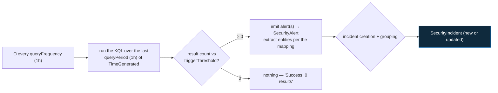

<div align="center">

# 🔍 Step 19 · Write a scheduled rule from scratch

### *Your first detection that is yours — turn a hypothesis into a rule that fires correctly*

[](../README.md)
[](#)
[-107C10?style=flat-square)](#)

</div>

---

## 🎯 Goal

A scheduled analytics rule **you designed and wrote** — hypothesis, KQL, threshold, entity mapping,
scheduling, grouping — that raises exactly one incident on attack activity you generate, stays
**silent on your normal-logon baseline**, and is written up as `DET-IDENTITY-001` with the KQL saved
to `artifacts/`.

## 🧠 Why this step

Templates run out. Your environment has apps, service accounts, naming conventions, and threats that
no Microsoft template knows about. Detection engineering — turning a threat hypothesis into a rule
that fires on the real thing and *not* on everything else — is the core competency of a SOC
engineer, and it has a method:

1. **Write the hypothesis** as one falsifiable sentence.
2. **Pick the data** and confirm it's connected.
3. **Write the KQL** and test it in Logs against real data.
4. **Set scheduling** so lookback matches frequency.
5. **Map entities** so the incident correlates and reads.
6. **Prove it fires** on generated attack activity **and stays quiet** on the baseline.
7. **Write it up** so the next engineer can tune it.

This step does all seven for one detection: *many failed logons then a success, same source, same
account, short window* — the signature of a credential-stuffing or brute-force attempt that
succeeded. You'll reuse this exact rule in [step 20](../20-entity-mapping-and-custom-details/README.md)
(better entities), [step 21](../21-alert-and-event-grouping/README.md) (grouping),
[step 26](../26-tuning-a-noisy-rule/README.md) (tuning), and the capstone
([step 62](../62-capstone/README.md)).

What people get wrong: they skip the baseline test and ship a rule that fires 200×/day; they leave
the query's internal `ago()` out of sync with the schedule and get gaps or duplicates; or they
forget entity mapping and end up with incidents that don't correlate and can't be automated.

## ✅ Prerequisites

- [Step 18](../18-enable-a-rule-from-template/README.md) — you've walked the rule wizard once.
- [Step 11](../11-windows-vm-ama-dcr/README.md) — `SecurityEvent` flowing (this rule's source), with
  a way to generate failed and successful logons on `vm-win-lab`. (An identity variant on
  `SigninLogs` is in the Deepen section.)
- [Step 04](../04-kql-survival-kit/README.md) — you can write `where` / `summarize` / `join` / `let`.
- [Step 05](../05-rbac-and-roles/README.md) — Microsoft Sentinel Contributor.

## 🧭 Concepts — design the detection before you write it

| Field | Decision | Why |
|---|---|---|
| **Hypothesis** | "If an attacker brute-forces a Windows account, I'd expect ≥ 10 failed logons (4625) then ≥ 1 success (4624) from the **same source IP** to the **same account** within an hour." | Falsifiable, specific, names the observable |
| **Data source** | `SecurityEvent` — `EventID 4625` (fail), `4624` (success), `LogonType` 2/3/10 | The table you connected in step 11 |
| **Run frequency** | every **1 hour** | Frequent enough for this threat; not so frequent it costs |
| **Lookback (`queryPeriod`)** | **1 hour** — equal to frequency | No gap, minimal overlap ([step 22](../22-scheduling-lookback-and-coverage-gaps/README.md)) |
| **Threshold** | results **> 0** (the KQL does the counting via `FailCount >= 10`) | Put the logic in KQL, not the threshold, so it's visible |
| **Entities** | Account = `TargetUserName`, IP = `IpAddress`, Host = `Computer` | Correlation, investigation graph, automation |
| **Severity** | Medium (High if the account is privileged — a later refinement) | |
| **MITRE** | Credential Access · **T1110** (Brute Force) | Feeds the coverage map ([step 25](../25-mitre-attack-coverage/README.md)) |

### How a scheduled rule runs



**Key mechanic:** Sentinel automatically scopes the query to the last `queryPeriod` of data — so an
`ago()` inside your query should **match** `queryPeriod`, not fight it. If your period is 1h and the
query says `ago(1h)`, they agree. If the period is 4h and the query says `ago(1h)`, you only ever
see 1h. Keep them equal.

### Vocabulary

| Term | Meaning |
|---|---|
| **`queryFrequency`** | How often the rule runs (`PT1H` = every hour). Floor is 5 minutes. |
| **`queryPeriod`** | How much history each run evaluates (`PT1H` = last hour). Max 14 days. |
| **`triggerOperator` / `triggerThreshold`** | The firing condition on the **result row count** (`GreaterThan 0`). |
| **Entity mapping** | Wizard tab binding query columns to strong identifiers (Account/IP/Host…) — [step 20](../20-entity-mapping-and-custom-details/README.md). |
| **`timestamp` column** | If your query emits a column literally named `timestamp`, Sentinel uses it as the alert's event time. Optional. |
| **Legacy `*CustomEntity` columns** | The old way to map entities (`AccountCustomEntity`, `IPCustomEntity`, …). **Deprecated** — use the Entity mapping tab. |
| **Event grouping** | "one alert per run" (default) vs "one alert per result row" ([step 21](../21-alert-and-event-grouping/README.md)). |

### Where this fits

First custom detection. [Step 20](../20-entity-mapping-and-custom-details/README.md) improves its
entities and adds custom details; [step 21](../21-alert-and-event-grouping/README.md) tunes how its
alerts become incidents; [step 22](../22-scheduling-lookback-and-coverage-gaps/README.md) drills the
scheduling; [step 26](../26-tuning-a-noisy-rule/README.md) tunes it against noise;
[step 28](../28-analytics-rules-as-code/README.md) exports it as code.

## 🖱️ Do it — portal

**The KQL** (test it in **Logs** first, then paste into the wizard):

```kusto
let lookback = 1h;
let failThreshold = 10;
let failures = SecurityEvent
    | where TimeGenerated > ago(lookback) and EventID == 4625
    | where IpAddress !in ("-", "", "::1", "127.0.0.1")          // drop local-logon noise
    | summarize FailCount = count(), FirstFail = min(TimeGenerated), LastFail = max(TimeGenerated)
        by TargetUserName, IpAddress = tostring(IpAddress), Computer;
let successes = SecurityEvent
    | where TimeGenerated > ago(lookback) and EventID == 4624 and LogonType in (2, 3, 10)
    | where IpAddress !in ("-", "", "::1", "127.0.0.1")
    | summarize SuccessCount = count(), FirstSuccess = min(TimeGenerated)
        by TargetUserName, IpAddress = tostring(IpAddress), Computer;
failures
| join kind=inner successes on TargetUserName, IpAddress, Computer
| where FailCount >= failThreshold and FirstSuccess > FirstFail
| project FirstFail, FirstSuccess, TargetUserName, IpAddress, Computer, FailCount, SuccessCount
| extend timestamp = FirstSuccess
```

**The wizard** — **Analytics → Create → Scheduled query rule**:

- **General**: name `DET-IDENTITY-001 · Brute force followed by success`. Description: your
  hypothesis sentence. Severity **Medium**. Tactics **Credential Access**, technique **T1110**.
  Status **Enabled**.
- **Set rule logic**:
  - Paste the query. Check the **results simulation** — should be flat/zero on a quiet lab.
  - **Entity mapping**: `Account` → identifier `Name` = `TargetUserName`; `IP` → `Address` =
    `IpAddress`; `Host` → `HostName` = `Computer`.
  - **Query scheduling**: run every **1 hour**, lookback **1 hour**.
  - **Alert threshold**: *Greater than* **0**.
  - **Event grouping**: "Group all events into a single alert" (default — fine here).
- **Incident settings**: **Create incidents** on. **Alert grouping**: enabled, group by
  **selected entities → IP** (or all entities), lookback **5 hours**.
- **Automated response**: none yet.
- **Review + create**.

## 💻 Do it — CLI / IaC

```bash
mkdir -p artifacts
# save the KQL exactly as tested
cat > artifacts/brute-force-then-success.kql <<'KQL'
let lookback = 1h;
let failThreshold = 10;
let failures = SecurityEvent
    | where TimeGenerated > ago(lookback) and EventID == 4625
    | where IpAddress !in ("-", "", "::1", "127.0.0.1")
    | summarize FailCount = count(), FirstFail = min(TimeGenerated), LastFail = max(TimeGenerated)
        by TargetUserName, IpAddress = tostring(IpAddress), Computer;
let successes = SecurityEvent
    | where TimeGenerated > ago(lookback) and EventID == 4624 and LogonType in (2, 3, 10)
    | where IpAddress !in ("-", "", "::1", "127.0.0.1")
    | summarize SuccessCount = count(), FirstSuccess = min(TimeGenerated)
        by TargetUserName, IpAddress = tostring(IpAddress), Computer;
failures
| join kind=inner successes on TargetUserName, IpAddress, Computer
| where FailCount >= failThreshold and FirstSuccess > FirstFail
| project FirstFail, FirstSuccess, TargetUserName, IpAddress, Computer, FailCount, SuccessCount
| extend timestamp = FirstSuccess
KQL

az sentinel alert-rule create -g rg-sentinel-lab --workspace-name law-sentinel-lab --rule-id "$(uuidgen)" \
  --scheduled-alert-rule '{
     "enabled": true,
     "displayName": "DET-IDENTITY-001 Brute force followed by success",
     "description": "≥10 failed Windows logons then ≥1 success, same IP + account + host, within 1h.",
     "severity": "Medium",
     "query": '"$(python -c 'import json,sys;print(json.dumps(open("artifacts/brute-force-then-success.kql").read()))')"',
     "queryFrequency": "PT1H",
     "queryPeriod": "PT1H",
     "triggerOperator": "GreaterThan",
     "triggerThreshold": 0,
     "suppressionEnabled": false,
     "suppressionDuration": "PT1H",
     "tactics": ["CredentialAccess"],
     "techniques": ["T1110"],
     "entityMappings": [
       {"entityType":"Account","fieldMappings":[{"identifier":"Name","columnName":"TargetUserName"}]},
       {"entityType":"IP","fieldMappings":[{"identifier":"Address","columnName":"IpAddress"}]},
       {"entityType":"Host","fieldMappings":[{"identifier":"HostName","columnName":"Computer"}]}
     ],
     "incidentConfiguration": {
       "createIncident": true,
       "groupingConfiguration": {"enabled": true, "reopenClosedIncident": false, "lookbackDuration": "PT5H", "matchingMethod": "Selected", "groupByEntities": ["IP"]}
     }
  }'
```

> Preview-CLI JSON shapes drift — if it fights you, build in the portal and **export**
> ([step 28](../28-analytics-rules-as-code/README.md)). The Bicep form is in step 28.

## 🧪 Validate — prove it fires **and** prove it doesn't

1. **Baseline (must be 0).** Run the KQL in **Logs** now. Expect **0 rows**. Also do a few *normal*
   logons to `vm-win-lab` (correct password) — re-run; still **0 rows**. A rule that fires on normal
   logons is not a detection.
2. **Generate the attack.** From one source, RDP or SMB to `vm-win-lab` as `testvictim` with the
   **wrong password 12 times**, then **one correct** logon.

```kusto
// confirm the raw events landed
SecurityEvent
| where TimeGenerated > ago(1h) and TargetUserName == "testvictim" and EventID in (4624, 4625)
| summarize Fails = countif(EventID == 4625), Successes = countif(EventID == 4624) by IpAddress = tostring(IpAddress)
```

3. **Run the rule** (wait for its hourly run, or **Analytics → the rule → ⋯ → Run** if your tenant
   offers on-demand run), then:

```kusto
SecurityAlert
| where TimeGenerated > ago(2h) and AlertName has "DET-IDENTITY-001"
| project TimeGenerated, AlertName, AlertSeverity, Entities
```

```kusto
SecurityIncident
| where TimeGenerated > ago(2h) and Title has "DET-IDENTITY-001"
| project TimeGenerated, Title, Severity, Status, AlertsCount, IncidentNumber
```

| Check | Healthy | Unhealthy |
|---|---|---|
| Baseline (before attack, incl. normal logons) | **0 rows** | fires on normal activity — tighten `LogonType`, raise `failThreshold`, or exclude the account/IP |
| Raw-events query | `Fails >= 12`, `Successes >= 1` from one IP | your test didn't register — check the VM's audit policy / the username |
| `SecurityAlert` | one row; `Entities` JSON has the account, IP, host | 0 rows but Health = Success → attack fell outside the 1h window; re-run |
| `SecurityIncident` | **exactly one** incident, `AlertsCount == 1` | many incidents → grouping misconfigured ([step 21](../21-alert-and-event-grouping/README.md)) |
| Incident **Entities** tab | Account / IP / Host all populated and clickable | empty → entity mapping columns aren't in the query's `project` |

**You should see** a clean baseline, then exactly one incident from the simulated attack, with all
three entities mapped.

## 🚩 Common mistakes

| 🚩 Mistake | Why it bites |
|---|---|
| Skipping the baseline / normal-logon test | You ship a rule that fires constantly and nobody trusts it |
| Query's `ago()` ≠ `queryPeriod` | Gap (query window smaller) or wasted scan (query window larger) |
| `join` without `kind=` | Default `innerunique` deduplicates the left side unexpectedly — always state `kind=inner` |
| Entity columns not in `project` | Entity mapping yields empty entities; no correlation, no automation |
| Threshold logic in `triggerThreshold` instead of KQL | The "why 10?" is invisible to the next engineer — put it in a `let` |
| Including local logons (`IpAddress == "-"`) | Every service/interactive local logon becomes noise |
| Testing only that it fires | Half the test is proving it *doesn't* on the baseline |
| No write-up | The rule is unmaintainable — fill in `DET-IDENTITY-001.md` |

## 🩺 Troubleshooting

| Symptom | Likely cause | Fix |
|---|---|---|
| Query errors in Logs: *"'SecurityEvent' could not be resolved"* | `vm-win-lab` not reporting, or DCR not associated ([step 11](../11-windows-vm-ama-dcr/README.md)) | Fix ingestion first; the rule can't detect what isn't there |
| Rule Health **Success**, 0 results, but the attack is in `SecurityEvent` | Attack spanned an hour boundary and neither the fails nor the success fully landed in one window | Widen `queryPeriod` to `PT2H` and set frequency to `PT1H` with `suppressionDuration PT2H`, or accept the edge case |
| Rule fires on your **normal** logons | `LogonType` too broad, or `failThreshold` too low for a fat-fingering user | Add `LogonType in (2,3,10)` (done), raise threshold, or exclude known service accounts |
| Fires but incident has no entities | Mapping references a column not emitted by `project` | Ensure `TargetUserName`, `IpAddress`, `Computer` are in the final `project` |
| Multiple incidents for one attack | Alert grouping disabled or grouping by too many entities | Incident settings → group by `IP` (or fewer entities), 5h window |
| `IpAddress` is `-` in the results | Local/console logons have no source IP | The `where IpAddress !in ("-", ...)` filter handles it — confirm it's in both `let` blocks |
| CLI create fails on the `query` field | JSON escaping of the multi-line KQL | Use the `python -c json.dumps` trick shown, or the portal + export path |

## 🎓 Deepen your understanding

1. Change `join kind=inner` to `join kind=leftouter` and re-run against the attack data. What extra rows appear, and why would that make the rule noisier?
2. The rule keys on `IpAddress`. A real credential-stuffing attack often rotates IPs. Rewrite the hypothesis and the KQL to key on **account + short time window** instead, ignoring IP. What false positive does that introduce, and how would you handle it?
3. Build the **identity variant** on `SigninLogs`: `ResultType 50126` failures then `ResultType 0` success, same `UserPrincipalName` + `IPAddress`, 1h. Save as `DET-IDENTITY-002`. Which is easier to generate test data for?
4. Set `queryPeriod` to `PT30M` while frequency stays `PT1H`. Generate an attack 40 minutes before the next run. Does it fire? This is the coverage gap [step 22](../22-scheduling-lookback-and-coverage-gaps/README.md) is about — feel it once.
5. Add `| join kind=leftouter (_GetWatchlist('VIPUsers')) on $left.TargetUserName == $right.UserPrincipalName | extend Severity = iff(isnotempty(Tier), "High", "Medium")` (once you have the watchlist from [step 24](../24-watchlists/README.md)). What did you just make the rule do?

## 🗒️ Log your run

Copy [`_templates/STEP-LOG-TEMPLATE.md`](../_templates/STEP-LOG-TEMPLATE.md) into this folder as
`LOG.md`, and copy [`_templates/DETECTION-TEMPLATE.md`](../_templates/DETECTION-TEMPLATE.md) into
`DET-IDENTITY-001.md`. Record: the hypothesis, the final KQL (also in
`artifacts/brute-force-then-success.kql`), the baseline result (**0**, including normal logons), the
test activity, and the single incident it produced (entities redacted). The **False positives**
section of the detection write-up should not be empty by the time you finish
[step 26](../26-tuning-a-noisy-rule/README.md).

## 📚 Microsoft Learn

- [Create custom analytics rules to detect threats](https://learn.microsoft.com/en-us/azure/sentinel/detect-threats-custom)
- [Map data fields to entities in Microsoft Sentinel](https://learn.microsoft.com/en-us/azure/sentinel/map-data-fields-to-entities)
- [Schedule and scope analytics rule queries](https://learn.microsoft.com/en-us/azure/sentinel/detect-threats-custom#query-scheduling-and-alert-threshold)
- [SecurityEvent table schema](https://learn.microsoft.com/en-us/azure/azure-monitor/reference/tables/securityevent)
- [Windows logon type reference (event 4624)](https://learn.microsoft.com/en-us/windows/security/threat-protection/auditing/event-4624)
- [KQL join operator](https://learn.microsoft.com/en-us/kusto/query/join-operator)

---

<div align="center">
<sub>

[⬅ Prev: 18 · Enable a rule from a template](../18-enable-a-rule-from-template/README.md) &nbsp;·&nbsp; [🦅 All steps](../README.md) &nbsp;·&nbsp; [Next: 20 · Entity mapping & custom details ➡](../20-entity-mapping-and-custom-details/README.md)

</sub>
</div>
