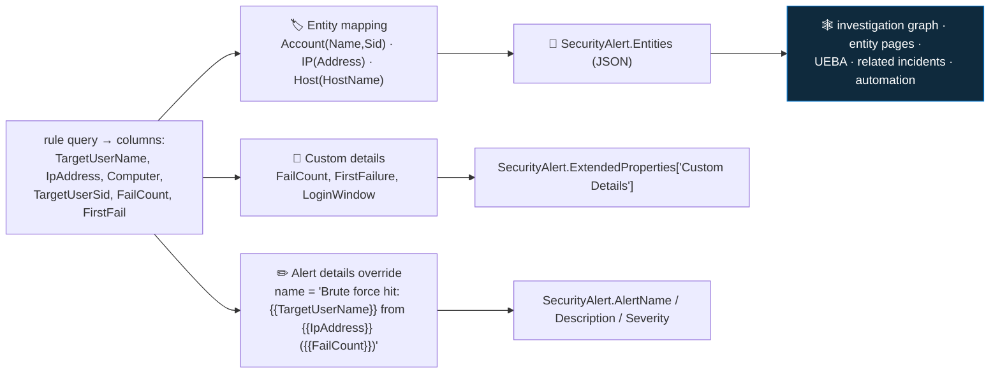

<div align="center">

# 🔍 Step 20 · Entity mapping & custom details

### *Make incidents correlate across rules — and readable without opening Logs*

[](../README.md)
[](#)
[](#)

</div>

---

## 🎯 Goal

Your `DET-IDENTITY-001` rule maps **Account, IP, and Host** with the strongest identifiers your data
carries, surfaces two or three **custom details**, and uses **alert details override** so the alert
title names the actual user and IP. You can see all of it on the incident, and you've proven two
incidents about the same account link together via entity insights.

## 🧠 Why this step

An incident with mapped entities is a first-class object in Sentinel's graph. It tells you "this
account appears in four other incidents this week", it powers the **investigation graph** and the
**entity pages**, it feeds **UEBA** ([step 51](../51-ueba-and-entity-behavior/README.md)), and it's
what a response playbook reads to know *which* user to disable ([step 34](../34-response-actions-with-approval/README.md)). An incident **without** mapped entities is a dead end — it can't correlate,
can't be automated cleanly, and forces the analyst to copy-paste identifiers into Logs by hand.

**Custom details** and **alert details override** solve a different problem: triage speed. A raw
alert card that just says "Brute force followed by success" makes the analyst open the query to find
out *who*, *from where*, and *how many*. An alert card that says **"Brute force hit: testvictim from
203.0.113.9 (34 fails)"** with `FailCount`, `FirstFailure`, and `SourceCountry` in the details lets
them make a first call in ten seconds.

What people get wrong: they map `Account` by **name only**, which correlates poorly and creates
duplicate entity pages for `jsmith` vs `jsmith@contoso.com`; they cram twenty high-cardinality
custom details onto every alert and bloat it; or they reference a column in the mapping that the
query doesn't `project`, so the entity comes back empty and nobody notices.

## ✅ Prerequisites

- [Step 19](../19-write-a-scheduled-rule/README.md) — you have `DET-IDENTITY-001` to improve.
- [Step 24](../24-watchlists/README.md) is referenced in an exercise but not required here.

## 🧭 Concepts

| Feature | What it does | Where |
|---|---|---|
| **Entity mapping** | Binds query columns to **strong identifiers** on an entity type | Set rule logic → Entity mapping |
| **Custom details** | Up to ~20 key→column pairs shown on the alert and available to automation and grouping | Set rule logic → Custom details |
| **Alert details override** | Sets the alert **Name / Description / Severity / Tactics** dynamically from column values | Set rule logic → Alert details |
| **Alert dynamic properties** | The newer, broader override — `RemediationSteps`, `ConfidenceLevel`, `Techniques`, `ProviderName`, extended links, and more | Alert details |

### Entity types and identifiers

Sentinel has ~20 entity types (Account, Host, IP, URL, FileHash, File, Process, CloudApplication,
DNS, AzureResource, RegistryKey/Value, Mailbox, MailMessage, IoTDevice, …). Each has **multiple
identifiers**, and strength matters:

| Entity | Strong identifiers (prefer) | Weak (last resort) |
|---|---|---|
| **Account** | `Sid`, `AadUserId`, `ObjectGuid`, `FullName` (UPN) | `Name` alone, `Name` + `NTDomain` |
| **Host** | `AzureID`, `HostName` + `DnsDomain` (FQDN), `NetBiosName` | `HostName` alone (NetBIOS) |
| **IP** | `Address` (there's only one) | — |
| **FileHash** | `Algorithm` + `Value` (SHA256 ≫ MD5) | MD5 |
| **URL** | `Url` (full) | domain only |

You may map up to **10 entities per rule**, each with up to **3 identifiers**. Map every strong
identifier your query can produce — `Account` with both `Name`+`NTDomain` **and** `Sid` correlates
across rules that only have one or the other.



**Walking the diagram:** the query's output columns feed three separate mechanisms. Entity mapping
becomes the `Entities` array on the alert, which is what every correlation, graph, and automation
feature reads. Custom details land in `ExtendedProperties` and show on the alert card (and are
available to alert grouping and to playbooks). Alert details override rewrites the alert's own
name/description/severity per row. All three are configured on the **Set rule logic** tab.

### How it works under the hood

- Entity mapping is `properties.entityMappings` on the rule — an array of
  `{entityType, fieldMappings:[{identifier, columnName}]}`. At run time Sentinel builds the `Entities`
  JSON from the matched rows.
- The `Entities` array is what **UEBA** reads to attribute behaviour to an account, what the
  **investigation graph** expands, and what **"related alerts / incidents / bookmarks"** on an
  entity page query against.
- Custom details are `properties.customDetails` — `{displayKey: columnName}`. They appear under
  `ExtendedProperties["Custom Details"]` on `SecurityAlert`, on the alert card, and as
  `alert.customDetails` in a playbook's alert/incident trigger. You can also **group incidents by a
  custom detail** ([step 21](../21-alert-and-event-grouping/README.md)).
- Alert details override is `properties.alertDetailsOverride` — `alertDisplayNameFormat`,
  `alertDescriptionFormat` (both use `{{ColumnName}}`), `alertSeverityColumnName`,
  `alertTacticsColumnName`, and `alertDynamicProperties` for the broader field set.

### Vocabulary

| Term | Meaning |
|---|---|
| **Entity** | A person, host, IP, file, etc. that Sentinel tracks across alerts and incidents. |
| **Identifier** | A specific attribute that identifies an entity (`Sid`, `AadUserId`, `Address`, `HostName`…). |
| **Strong vs weak identifier** | Strong = globally unique and stable (`Sid`, `AadUserId`); weak = ambiguous (`Name` alone). |
| **Custom detail** | A key/value from a query column shown on the alert and usable in grouping/automation. |
| **Alert details override** | Rule setting that makes the alert's name/description/severity/tactics dynamic per result row. |
| **`Entities` column** | The JSON array on `SecurityAlert` produced by entity mapping. |

### Where this fits

This makes the [step 19](../19-write-a-scheduled-rule/README.md) rule production-grade.
[Step 21](../21-alert-and-event-grouping/README.md) uses the entities and custom details for
grouping; [step 25](../25-mitre-attack-coverage/README.md) reads the tactics;
[step 34](../34-response-actions-with-approval/README.md) reads the Account entity to act;
[step 51](../51-ueba-and-entity-behavior/README.md) reads mapped accounts to build baselines. Every
rule you write from here on maps entities — it's not optional.

### Design rationale

Sentinel separates "the match" (the query) from "who/what it's about" (entity mapping) so that a
single correlation graph spans every rule, connector, and product — an XDR endpoint alert and your
custom identity rule about the same `Sid` land on the same entity page. Custom details and alert
overrides exist because the alert card is the analyst's first (often only) read, and a generic
title wastes the most expensive resource in the SOC: analyst attention.

## 🖱️ Do it — portal

1. **Add a strong Account identifier to the query.** Edit `DET-IDENTITY-001` → Set rule logic →
   add `TargetUserSid` to both `summarize ... by` lists and the final `project`:

```kusto
// ... in each let block:
| summarize FailCount = count(), FirstFail = min(TimeGenerated)
    by TargetUserName, TargetUserSid, IpAddress = tostring(IpAddress), Computer
// ... and in the join keys + final project add TargetUserSid
```

2. **Entity mapping:**
   - `Account` → `Name` = `TargetUserName`, **and** `Sid` = `TargetUserSid` (two identifiers, one
     mapping). Add `NTDomain` if your events carry `TargetDomainName`.
   - `IP` → `Address` = `IpAddress`.
   - `Host` → `HostName` = `Computer`.
3. **Custom details:** `FailCount` → `FailCount`; `FirstFailure` → `FirstFail`;
   `SuccessfulLogons` → `SuccessCount`.
4. **Alert details override:**
   - Alert Name format:
     `Brute force hit: {{TargetUserName}} from {{IpAddress}} ({{FailCount}} fails)`
   - Alert Description format:
     `{{FailCount}} failed logons then {{SuccessCount}} success on {{Computer}} between {{FirstFail}} and {{FirstSuccess}}.`
5. **Save.** Re-run the [step 19](../19-write-a-scheduled-rule/README.md) attack simulation.

## 💻 Do it — the rule's `properties`

```json
"entityMappings": [
  { "entityType": "Account", "fieldMappings": [
      { "identifier": "Name", "columnName": "TargetUserName" },
      { "identifier": "Sid",  "columnName": "TargetUserSid" } ] },
  { "entityType": "IP",   "fieldMappings": [ { "identifier": "Address",  "columnName": "IpAddress" } ] },
  { "entityType": "Host", "fieldMappings": [ { "identifier": "HostName", "columnName": "Computer" } ] }
],
"customDetails": {
  "FailCount": "FailCount",
  "FirstFailure": "FirstFail",
  "SuccessfulLogons": "SuccessCount"
},
"alertDetailsOverride": {
  "alertDisplayNameFormat": "Brute force hit: {{TargetUserName}} from {{IpAddress}} ({{FailCount}} fails)",
  "alertDescriptionFormat": "{{FailCount}} failed logons then {{SuccessCount}} success on {{Computer}}."
}
```

## 🧪 Validate

After the rule fires again:

```kusto
SecurityAlert
| where TimeGenerated > ago(2h) and AlertName has "Brute force hit"
| extend ext = parse_json(ExtendedProperties)
| project TimeGenerated, AlertName, Description,
          CustomDetails = ext["Custom Details"],
          Entities = parse_json(Entities)
```

```kusto
// prove the entities are strongly identified
SecurityAlert
| where TimeGenerated > ago(2h) and AlertName has "Brute force hit"
| mv-expand e = parse_json(Entities)
| project EntityType = tostring(e.Type),
          Account = strcat(tostring(e.Name), " sid=", tostring(e.Sid)),
          Address = tostring(e.Address), HostName = tostring(e.HostName)
```

| Check | Healthy | Unhealthy |
|---|---|---|
| `AlertName` | contains the real username and IP, not the static title | still the static name → alert details override not saved |
| `CustomDetails` | `FailCount`, `FirstFailure`, `SuccessfulLogons` present | missing → the key/column pair didn't save, or the column isn't in `project` |
| Entities `mv-expand` | Account row shows both `Name` and a non-empty `sid=` | `sid=` empty → `TargetUserSid` not in the query output |
| Incident **Entities** tab | Account / IP / Host all clickable | empty → mapping references a non-projected column |
| Entity page → **related incidents** | a second `DET-IDENTITY-001` incident for the same account is linked | not linked → the two incidents identified the account differently (name vs UPN) — strong identifiers fix this |

**You should see** the dynamic alert title, the custom details on the card, strongly-identified
entities, and two incidents about `testvictim` linked on the entity page.

## 🚩 Common mistakes

| 🚩 Mistake | Why it bites |
|---|---|
| Mapping `Account` by `Name` only | `jsmith` and `jsmith@contoso.com` become different entities; correlation breaks |
| Referencing a column not in the final `project` | Entity comes back empty and nobody notices until an investigation stalls |
| More than 10 entity mappings / 3 identifiers each | Sentinel caps it — prioritise the strong ones |
| 20 high-cardinality custom details on every alert | Bloated alert card; keep it to decision-relevant fields |
| Alert name format referencing a column that can be null | Renders `Brute force hit:  from  ()` — coalesce or guard the column |
| Using the deprecated `AccountCustomEntity` magic columns | Use the Entity mapping tab; the magic columns are legacy |
| Forgetting custom details are usable in grouping/automation | You re-derive `FailCount` in a playbook that could have just read it |

## 🩺 Troubleshooting

| Symptom | Likely cause | Fix |
|---|---|---|
| Entities tab empty after the change | Mapping column not in the query's `project`, or the query returns no rows | `project` the mapped columns; confirm the rule actually matched |
| `Sid` identifier blank | `TargetUserSid` not added to `summarize by` / `project` | Add it in both `let` blocks, the `join` keys, and the final `project` |
| Alert name still static | Override not saved, or a `{{Column}}` name typo (case-sensitive) | Re-open Set rule logic → Alert details; match column names exactly |
| Custom details show but are always empty | The key maps to a column that's null for these rows | Map to a column that's always populated, or add a fallback in KQL |
| Two incidents for the same user won't link | One rule identified by `Name`, another by `UPN` / `Sid` | Standardise: map both `Name` and a strong identifier on every account-bearing rule |
| `mv-expand parse_json(Entities)` errors | `Entities` already dynamic in some views | Drop the `parse_json` and `mv-expand Entities` directly, or `todynamic()` |
| Grouping by a custom detail does nothing | Custom detail key name doesn't match the grouping config exactly | Names are case-sensitive; copy them |

## 🎓 Deepen your understanding

1. Map `Account` by `Name` only on one test rule and by `Name`+`Sid` on another, both firing for `testvictim`. Open the entity page for the account from each. Do they land on the *same* entity page? What does that prove about weak identifiers?
2. Add `SourceCountry` (derive it: `extend SourceCountry = geo_info_from_ip_address(IpAddress).country`) as a custom detail and put it in the alert name. Now an analyst sees the country without a lookup. What other single field would speed triage most for *this* detection?
3. Set `alertSeverityColumnName` to a column you compute as `iff(FailCount > 100, "High", "Medium")`. Fire the rule twice with different fail counts. What changed on the two alerts?
4. In a playbook trigger (peek ahead to [step 31](../31-sentinel-connector-triggers-and-actions/README.md)), where do custom details appear in the payload? Why is putting `FailCount` in custom details better than having the playbook re-run the query?
5. You map `Host` by NetBIOS `HostName`. A `DeviceProcessEvents`-based rule maps `Host` by FQDN. Same machine, two entity pages. How do you make them converge? (Hint: `DnsDomain` / `AzureID`.)

## 🗒️ Log your run

Update `DET-IDENTITY-001.md` (from [step 19](../19-write-a-scheduled-rule/README.md)) with the final
entity mappings and custom details. In `LOG.md`: before/after screenshots of the incident (alert
card + Entities tab, **redacted**), and the entity-page screenshot showing two incidents linked.

## 📚 Microsoft Learn

- [Map data fields to entities in Microsoft Sentinel](https://learn.microsoft.com/en-us/azure/sentinel/map-data-fields-to-entities)
- [Microsoft Sentinel entity types reference](https://learn.microsoft.com/en-us/azure/sentinel/entities-reference)
- [Surface custom event details in alerts](https://learn.microsoft.com/en-us/azure/sentinel/surface-custom-details-in-alerts)
- [Customize alert details in Microsoft Sentinel](https://learn.microsoft.com/en-us/azure/sentinel/customize-alert-details)
- [Investigate incidents with the entity behavior and investigation graph](https://learn.microsoft.com/en-us/azure/sentinel/investigate-incidents)

---

<div align="center">
<sub>

[⬅ Prev: 19 · Write a scheduled rule](../19-write-a-scheduled-rule/README.md) &nbsp;·&nbsp; [🦅 All steps](../README.md) &nbsp;·&nbsp; [Next: 21 · Alert & event grouping ➡](../21-alert-and-event-grouping/README.md)

</sub>
</div>
