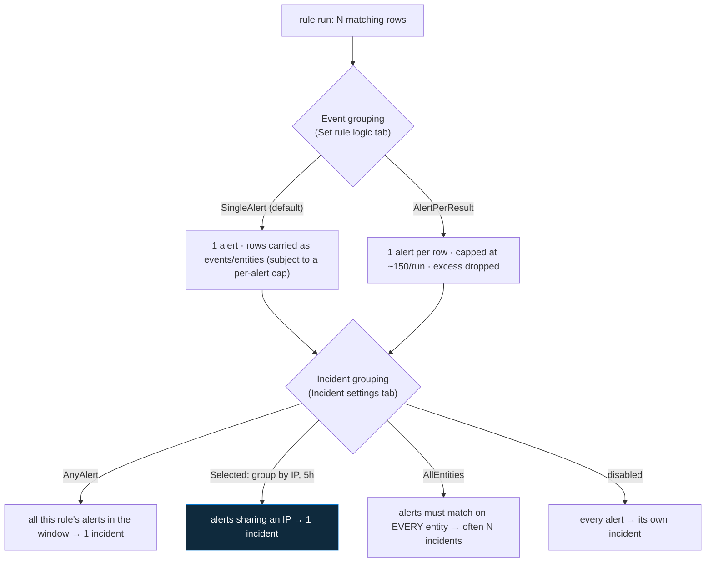

<div align="center">

# 🔍 Step 21 · Alert & event grouping

### *Decide how many alerts a run emits, and how many incidents an attack becomes*

[](../README.md)
[](#)
[](#)

</div>

---

## 🎯 Goal

On `DET-IDENTITY-001` you have deliberately chosen an **event grouping** mode (one alert per run vs
one alert per result row) and an **incident grouping** configuration (how this rule's alerts collapse
into incidents), and you have watched the same simulated attack produce different alert and incident
counts under each setting.

## 🧠 Why this step

Two settings, buried on tabs most people never open, decide whether a single attack shows up in the
queue as **one incident** or **fifty**. A brute-force campaign against five accounts from one IP,
with the wrong settings, becomes fifty alerts → fifty incidents → an analyst closing tickets for an
hour instead of investigating. With the right settings it is one incident with five alerts inside it,
triaged in minutes.

- **Event grouping** controls how many *alerts* one rule run produces from its matched rows.
- **Incident grouping** controls how *this rule's* alerts (across runs, within a time window)
  collapse into *incidents*.

These are per-rule decisions and they depend on the detection. A rule where every matched row is
independently actionable (one row = one compromised host) wants an alert per row. A rule where the
whole result set is one phenomenon (a spike, a campaign) wants a single alert. And almost every rule
wants *some* incident grouping so repeat firings don't flood the queue.

What people get wrong: **AlertPerResult** on a rule that can match hundreds of rows (it silently
caps and drops the rest); **no incident grouping** on a bursty rule (one attack, dozens of
incidents); grouping by **all entities** for a scanning source (every target host/account makes a
new incident); or `reopenClosedIncident: true` on a chronic-noise rule (analysts can never keep it
closed).

## ✅ Prerequisites

- [Step 20](../20-entity-mapping-and-custom-details/README.md) — the rule has entity mapping (grouping
  keys off entities) and custom details (you can also group by those).
- A way to re-run the [step 19](../19-write-a-scheduled-rule/README.md) attack simulation with
  variations (two victim accounts, one IP, etc.).

## 🧭 Concepts



### Event grouping (`eventGroupingSettings.aggregationKind`)

| Mode | Emits | Use when |
|---|---|---|
| **`SingleAlert`** (default) | One alert per run; matched rows attached as events, entities extracted up to a per-alert limit | The result set is one phenomenon (a spike, a campaign, an aggregate) |
| **`AlertPerResult`** | One alert per result row, **capped at ~150 per run** — rows beyond the cap are **not alerted** | Each row is independently actionable and you want per-row entities / per-row automation |

### Incident grouping (`incidentConfiguration.groupingConfiguration`)

| Setting | Meaning |
|---|---|
| `enabled` | Group at all, or one incident per alert |
| `matchingMethod` | `AnyAlert` (all of this rule's alerts) · `Selected` (by chosen entities / alert details / custom details) · `AllEntities` (alerts must share **every** entity) |
| `groupByEntities` / `groupByAlertDetails` / `groupByCustomDetails` | The keys, when `matchingMethod = Selected` |
| `lookbackDuration` | How far back to look for an open incident to attach to (up to 7 days) |
| `reopenClosedIncident` | If a matching alert arrives after the incident was closed, reopen it — or start a fresh one |

**Important scope:** incident grouping only groups **alerts from the same rule**. Correlating alerts
*across* different rules is Fusion's job ([step 17](../17-analytics-rule-types/README.md)), the newer
correlation features, or entity-based manual linking.

### How it works under the hood

- Both are `properties` on the `alertRules` resource. Event grouping is evaluated at run time;
  incident grouping is evaluated when each alert is created, looking back `lookbackDuration` for an
  incident from the same rule whose grouping key matches.
- With `SingleAlert`, a run matching 500 rows still makes **one** alert, but only the first slice of
  entities is extracted onto it — for a wide-fan-out match (one scanner hitting 500 accounts) you
  lose entity fidelity. The fix is to **tighten or summarize the query**, not to switch modes.
- With `AlertPerResult`, matching 500 rows makes 150 alerts and the other 350 rows produce nothing.
  Same fix.
- `AllEntities` is stricter than it sounds: two brute-force alerts for the *same IP* but *different
  accounts* do **not** share all entities, so they become two incidents.

### Vocabulary

| Term | Meaning |
|---|---|
| **Event grouping** | How many alerts one rule run emits (`SingleAlert` / `AlertPerResult`). |
| **Incident grouping** | How a rule's alerts collapse into incidents, within a lookback window. |
| **`matchingMethod`** | `AnyAlert` / `Selected` / `AllEntities` — the grouping strategy. |
| **`lookbackDuration`** | How far back grouping looks for an incident to attach a new alert to. |
| **`AlertsCount`** | Column on `SecurityIncident` — how many alerts the incident contains. |
| **`SystemAlertId`** | Unique ID per `SecurityAlert` row. |

### Where this fits

This tunes the [step 19](../19-write-a-scheduled-rule/README.md)/[20](../20-entity-mapping-and-custom-details/README.md)
rule into something an analyst can actually work. [Step 22](../22-scheduling-lookback-and-coverage-gaps/README.md)
handles the *time* dimension (which interacts — a long lookback + no grouping = duplicate incidents);
[step 26](../26-tuning-a-noisy-rule/README.md) uses grouping as one of the tuning levers;
[step 35](../35-automation-rules-triage/README.md) automates against the grouped incident.

### Design rationale

Sentinel separates event and incident grouping because they answer different questions ("how loud is
one run?" vs "how many runs are one story?"), and it defaults to `SingleAlert` + no incident
grouping because that is the safest starting point — you can always split, but a silently-capped
`AlertPerResult` loses data.

## 🖱️ Do it — three experiments

1. **Baseline.** Confirm `DET-IDENTITY-001` is `SingleAlert` + incident grouping enabled, group by
   `IP`, 5h (from [step 19](../19-write-a-scheduled-rule/README.md)). Re-run the attack for **one**
   victim → **1 alert, 1 incident**.
2. **AlertPerResult.** Edit → Set rule logic → Event grouping → **"Trigger an alert for each
   event"** → save. Re-run the attack for **two** victim accounts from the **same IP** → **2 alerts**
   (one per result row) **, 1 incident** (grouped by IP).
3. **AllEntities.** Incident settings → Alert grouping → **"Grouping alerts into a single incident
   if all the entities match"** → save. Re-run the same two-victim attack → **2 alerts, 2 incidents**
   (the accounts differ, so not *all* entities match).

Then set it back to the config you actually want for this rule: `SingleAlert` (the whole
fail-then-success result set is one story per run) + `Selected` / group by `IP` / 5h.

## 💻 Do it — rule `properties`

```json
"eventGroupingSettings": { "aggregationKind": "SingleAlert" },
"incidentConfiguration": {
  "createIncident": true,
  "groupingConfiguration": {
    "enabled": true,
    "reopenClosedIncident": false,
    "lookbackDuration": "PT5H",
    "matchingMethod": "Selected",
    "groupByEntities": ["IP"],
    "groupByAlertDetails": [],
    "groupByCustomDetails": []
  }
}
```

## 🧪 Validate

```kusto
// alerts this rule produced
SecurityAlert
| where TimeGenerated > ago(3h) and AlertName has "Brute force"
| summarize Alerts = count(), AlertIds = make_set(SystemAlertId)
```

```kusto
// incidents, and how many alerts each holds
SecurityIncident
| where TimeGenerated > ago(3h) and Title has "DET-IDENTITY-001"
| project IncidentNumber, Status, AlertsCount, AlertIds = array_length(todynamic(AlertIds)), CreatedTime, LastModifiedTime
```

| Config | Expected `Alerts` | Expected incidents | Expected `AlertsCount` |
|---|---|---|---|
| `SingleAlert` + group by IP (one victim) | 1 | 1 | 1 |
| `AlertPerResult` + group by IP (two victims, one IP) | 2 | 1 | 2 |
| `AllEntities` (two victims) | 2 | 2 | 1 each |

**You should see** the alert and incident counts change predictably across the three experiments,
and — critically — with `AlertPerResult` + group-by-IP, **multiple alerts but one incident** whose
`AlertsCount > 1`.

## 🚩 Common mistakes

| 🚩 Mistake | Why it bites |
|---|---|
| `AlertPerResult` on a rule that can match hundreds of rows | Caps at ~150/run — the rest are **silently not alerted** |
| Fixing a wide fan-out by switching event-grouping modes | Both modes lose data; **tighten or `summarize` the query** instead |
| No incident grouping on a bursty rule | One attack = dozens of incidents |
| `matchingMethod: AllEntities` for a scanning source | Every distinct target makes a new incident |
| `reopenClosedIncident: true` on a chronic-noise rule | Analysts can never keep it closed; fix the rule instead |
| Expecting grouping to correlate **across rules** | It only groups one rule's alerts — cross-rule is Fusion / correlation / manual |
| `lookbackDuration` too short for a slow attack | A resumed attack an hour later opens a second incident |
| Grouping by a custom detail whose key doesn't match exactly | Silently no grouping — keys are case-sensitive |

## 🩺 Troubleshooting

| Symptom | Likely cause | Fix |
|---|---|---|
| `AlertPerResult` set, but still one alert | The rule only matched one row; or the save didn't take | Re-run with multiple result rows; re-open Set rule logic to confirm |
| Two incidents where you expected one | `matchingMethod: AllEntities`, or the grouping key entity differs between alerts | Switch to `Selected` and group by the entity they share (IP) |
| One incident where you expected two | Grouping by too broad a key (`AnyAlert`) | Use `Selected` with a more specific key, or `AllEntities` |
| Alerts stop grouping after a while | New alert fell outside `lookbackDuration` of the open incident | Lengthen `lookbackDuration` (up to 7d) if the attack pattern is slow |
| Incident keeps reopening after close | `reopenClosedIncident: true` and the rule keeps matching | Set it to `false`; tune the rule ([step 26](../26-tuning-a-noisy-rule/README.md)) |
| Wide match: entities missing from a `SingleAlert` | Per-alert entity cap hit on a 500-row match | `summarize` the query to one row per real subject before it emits |
| `AlertsCount` on the incident doesn't match the alerts you see | Some alerts grouped into a *different* (older) incident within the lookback | Check `SecurityIncident | where AlertIds has "<id>"` for each alert |

## 🎓 Deepen your understanding

1. Write a hypothetical rule: "a host connected to 20+ distinct rare external IPs in an hour" — one row per host. Which event-grouping mode, and why? Now: "any single connection to a known-bad IP" — one row per connection. Which mode?
2. Your brute-force rule matches an attacker hitting 300 accounts from one IP. Walk through what `SingleAlert` does to the entities, and what `AlertPerResult` does to the row count. What's the actual fix?
3. Group `DET-IDENTITY-001` by a **custom detail** (`groupByCustomDetails: ["SourceCountry"]`) instead of by IP. When would grouping-by-country be better or worse than grouping-by-IP?
4. Set `lookbackDuration` to `P7D`. An attacker brute-forces on Monday (incident opens, analyst closes it Tuesday), resumes Friday. With `reopenClosedIncident: true` vs `false`, what does the analyst see Friday? Which do you want for this threat?
5. Two different rules — yours and a template — both fire on the same attack. They don't group together. What are your options to give the analyst *one* thing to work? (Fusion, automation-rule tagging, manual link — sketch each.)

## 🗒️ Log your run

Update `DET-IDENTITY-001.md` with the final event + incident grouping choice and the reasoning. In
`LOG.md`: the alert-count / incident-count / `AlertsCount` table for each of the three experiments.

## 📚 Microsoft Learn

- [Configure event and incident grouping in analytics rules](https://learn.microsoft.com/en-us/azure/sentinel/detect-threats-custom)
- [Manage and investigate incidents in Microsoft Sentinel](https://learn.microsoft.com/en-us/azure/sentinel/incident-investigation)
- [alertRules ARM reference (eventGroupingSettings, incidentConfiguration)](https://learn.microsoft.com/en-us/azure/templates/microsoft.securityinsights/alertrules)

---

<div align="center">
<sub>

[⬅ Prev: 20 · Entity mapping & custom details](../20-entity-mapping-and-custom-details/README.md) &nbsp;·&nbsp; [🦅 All steps](../README.md) &nbsp;·&nbsp; [Next: 22 · Scheduling, lookback & coverage gaps ➡](../22-scheduling-lookback-and-coverage-gaps/README.md)

</sub>
</div>
