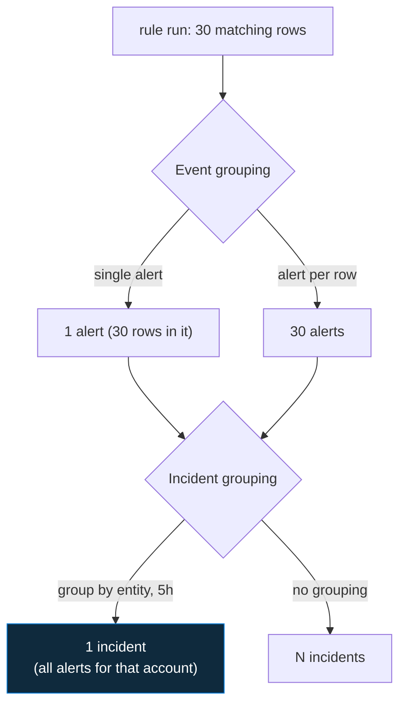

<div align="center">

# 🔍 Step 21 · Alert & event grouping

### *Control how raw matches become alerts, and alerts become incidents*

[](../README.md)
[](#)
[](#)

</div>

---

## 🎯 Goal

You've configured **event grouping** (one alert per row vs one alert per run) and **incident
grouping** (how alerts collapse into incidents) on your rule, and seen both behaviours.

## 🧠 Why this step

The same rule can produce 1 incident or 500 depending on two settings most people never touch.
Event grouping decides how many alerts a single run emits. Incident grouping decides whether 50
alerts about one attack are 50 incidents or 1. Get these right and the queue is workable.

## ✅ Prerequisites

- [Step 20](../20-entity-mapping-and-custom-details/README.md) — rule with entity mapping

## 🧭 Concepts in 60 seconds



**Event grouping**
- *Group all events into a single alert* (default) — good when a run's rows are one phenomenon.
- *Trigger an alert for each event* — needed when each row is independently actionable and you want
  per-row entities/automation. Capped (currently 150 alerts/run).

**Incident grouping** (Incident settings tab)
- Group alerts into an incident: by **all entities**, by **selected entities**, or **all alerts
  from this rule**.
- Lookback window (e.g. 5h / 7d).
- Re-open a closed incident if a matching alert arrives, or start fresh.

## 🖱️ Do it — portal

1. **Analytics → DET-IDENTITY-001 → Edit.**
2. **Set rule logic → Event grouping** → try **"Trigger an alert for each event"**, save, re-run
   the attack simulation with **two** different victim accounts from the same IP.
3. **Incident settings → Alert grouping** → **Enabled**, group by **selected entities: IP**, window
   **5 hours**. Save.
4. Re-run: two accounts, one IP → observe **2 alerts, 1 incident** (grouped by IP).
5. Change grouping to **"Grouping alerts into a single incident if all the entities match"** and
   re-run → **2 incidents** (accounts differ).

## 💻 Do it — rule JSON

```json
"eventGroupingSettings": { "aggregationKind": "AlertPerResult" },
"incidentConfiguration": {
  "createIncident": true,
  "groupingConfiguration": {
    "enabled": true,
    "reopenClosedIncident": false,
    "lookbackDuration": "PT5H",
    "matchingMethod": "Selected",
    "groupByEntities": ["IP"]
  }
}
```

## 🧪 Validate

```kusto
SecurityAlert
| where TimeGenerated > ago(2h) and AlertName has "Brute force"
| summarize Alerts = count() by SystemAlertId;
SecurityIncident
| where TimeGenerated > ago(2h) and Title has "DET-IDENTITY-001"
| project IncidentNumber, AlertIds, AlertsCount
```

**You should see**: with *AlertPerResult* + *group by IP*, multiple `SecurityAlert` rows but one
`SecurityIncident` whose `AlertsCount` > 1. With *group by all entities*, incident count rises
again.

## 🚩 Common mistakes

| 🚩 Mistake | Why it bites |
|---|---|
| AlertPerResult on a high-match rule | Hits the per-run alert cap; some rows silently dropped |
| No incident grouping on a bursty rule | One attack = dozens of incidents |
| Grouping by "all entities" for a scanning IP | Every target host/account makes a new incident |
| `reopenClosedIncident: true` on a chronic-noise rule | Analysts can never keep it closed |

## 🗒️ Log your run

`LOG.md` — the alert-count vs incident-count for each grouping config you tried.

## 📚 Microsoft Learn

- [Configure event and incident grouping in analytics rules](https://learn.microsoft.com/en-us/azure/sentinel/detect-threats-custom#alert-grouping)
- [Manage incidents — grouping and behaviour](https://learn.microsoft.com/en-us/azure/sentinel/incident-investigation)

---

<div align="center">
<sub>

[⬅ Prev: 20 · Entity mapping & custom details](../20-entity-mapping-and-custom-details/README.md) &nbsp;·&nbsp; [🦅 All steps](../README.md) &nbsp;·&nbsp; [Next: 22 · Scheduling, lookback & coverage gaps ➡](../22-scheduling-lookback-and-coverage-gaps/README.md)

</sub>
</div>
