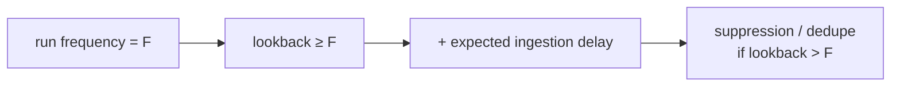

<div align="center">

# 🔍 Step 22 · Scheduling, lookback & coverage gaps

### *Why the query window and the run frequency must be chosen together*

[](../README.md)
[](#)
[](#)

</div>

---

## 🎯 Goal

You can pick frequency + lookback for any rule so there is **no gap** and **no unwanted duplication**,
and you account for **ingestion delay**.

## 🧠 Why this step

A rule that runs every 1h but looks back 30m misses everything in the 30-minute gap between runs.
A rule that runs every 5m but looks back 1h re-alerts the same event ~12 times. And data can arrive
minutes-to-hours late, so "the last hour" of `TimeGenerated` may not be complete yet.

## ✅ Prerequisites

- [Step 19](../19-write-a-scheduled-rule/README.md)

## 🧭 The rules of thumb



| Situation | Frequency | Lookback | Extra |
|---|---|---|---|
| Standard scheduled rule | F | **= F** | none needed |
| Source has known lag (e.g. some cloud logs 15–30 min) | F | **F + lag** | de-dupe on a stable key, or **suppression** after firing |
| Aggregation over a long window (e.g. "10 events in 24h") | 1h | 24h | must de-dupe: `summarize` to one row per entity/day |
| Point-in-time, low latency | NRT rule instead (step 23) | — | — |

**Suppression**: "Stop running query after alert is generated" for N hours — stops a slow-moving
condition re-alerting each run.

**Ingestion delay handling**: Sentinel's scheduler already shifts the window slightly, but for laggy
sources add an explicit buffer and, ideally, filter on `ingestion_time()` too.

## 🖱️ Do it — three experiments on a copy of your rule

1. **Gap demo.** Clone DET-IDENTITY-001 → set frequency `1h`, lookback `10m`. Generate the attack
   45 minutes before the next scheduled run. Observe: **no incident** (activity fell in the gap).
2. **Duplication demo.** Set frequency `5m`, lookback `1h`, no suppression. Generate one attack.
   Observe: the same incident's alert count climbs every 5 minutes.
3. **Correct.** Set frequency `1h`, lookback `1h 10m` (10-min buffer), suppression `1h`. Generate
   the attack. Observe: exactly one alert, once.

## 💻 Do it — the correct config

```json
"queryFrequency": "PT1H",
"queryPeriod": "PT1H10M",
"suppressionEnabled": true,
"suppressionDuration": "PT1H"
```

And a de-dupe pattern in KQL for long-window aggregations:

```kusto
SecurityEvent
| where TimeGenerated > ago(24h) and EventID == 4625
| summarize Fails = count() by TargetUserName, bin(TimeGenerated, 1d)   // one row per user per day
| where Fails > 50
```

## 🧪 Validate

```kusto
// count how many times each incident has been "re-alerted"
SecurityIncident
| where TimeGenerated > ago(6h) and Title has "DET-IDENTITY"
| project IncidentNumber, AlertsCount, FirstActivityTime, LastActivityTime, CreatedTime, LastModifiedTime
```

**You should see** the gap experiment produce **no** incident, the duplication experiment produce
one incident with a steadily rising `AlertsCount`, and the correct config produce one incident with
`AlertsCount == 1` that doesn't grow.

## 🚩 Common mistakes

| 🚩 Mistake | Why it bites |
|---|---|
| Copy-pasting `ago(1h)` into a rule that runs every 6h | 5-hour blind spot every cycle |
| Long lookback with no de-dupe | Alert storm on one event |
| Ignoring ingestion delay for cloud sources | The "complete" hour wasn't complete when the rule ran |
| Using suppression to hide a noisy rule | Fix the logic (step 26), don't muffle it |

## 🗒️ Log your run

`LOG.md` — the three experiment outcomes with `AlertsCount` evidence.

## 📚 Microsoft Learn

- [Schedule and scope analytics rule queries](https://learn.microsoft.com/en-us/azure/sentinel/detect-threats-custom#query-scheduling-and-alert-threshold)
- [Handle ingestion delay in scheduled analytics rules](https://learn.microsoft.com/en-us/azure/sentinel/ingestion-delay)

---

<div align="center">
<sub>

[⬅ Prev: 21 · Alert & event grouping](../21-alert-and-event-grouping/README.md) &nbsp;·&nbsp; [🦅 All steps](../README.md) &nbsp;·&nbsp; [Next: 23 · NRT rules ➡](../23-nrt-rules/README.md)

</sub>
</div>
