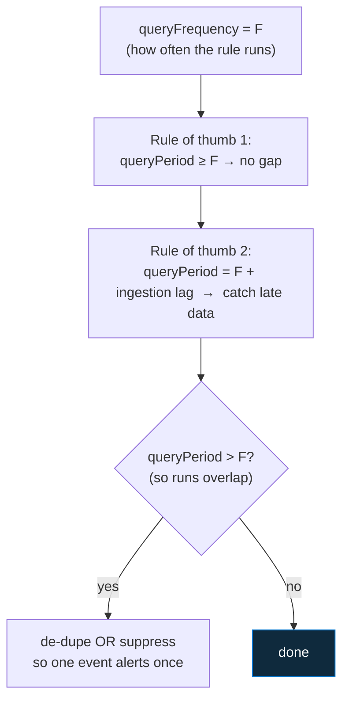

<div align="center">

# 🔍 Step 22 · Scheduling, lookback & coverage gaps

### *Choose run frequency and lookback together — or you get a blind spot or an alert storm*

[](../README.md)
[](#)
[](#)

</div>

---

## 🎯 Goal

For any rule you can pick `queryFrequency` + `queryPeriod` so there is **no coverage gap** and **no
duplicate alerting**, you handle **ingestion delay** deliberately (buffer + `ingestion_time()` or
suppression), and you have *felt* all three failure modes on a copy of `DET-IDENTITY-001`.

## 🧠 Why this step

Two knobs — how often the rule runs, and how far back each run looks — and getting the relationship
wrong produces one of two silent failures:

- **Lookback < frequency** → a **coverage gap**. A rule that runs every hour but looks back 30
  minutes never sees anything that happened in the other 30 minutes of each hour. An attacker who
  times it right (or gets lucky) is simply invisible.
- **Lookback ≫ frequency, no de-dupe** → an **alert storm**. A rule that runs every 5 minutes but
  looks back an hour re-evaluates the same event ~12 times, and (without suppression or a de-dupe
  key) re-alerts it every run.

On top of that: **data arrives late**. `SigninLogs` can lag 15–60 minutes; some cloud sources more.
So "the last hour of `TimeGenerated`" is *not* complete at the moment the rule runs — events with a
`TimeGenerated` inside the window may not have been ingested yet, and the rule misses them. This one
is the most insidious because the rule works perfectly in a test (where you wait for data to land)
and quietly drops real events in production.

## ✅ Prerequisites

- [Step 19](../19-write-a-scheduled-rule/README.md) — a custom rule to experiment on.
- [Step 21](../21-alert-and-event-grouping/README.md) — grouping matters here (a long lookback with
  no grouping is one of the storm modes).

## 🧭 Concepts



| Situation | Frequency | Lookback (`queryPeriod`) | Extra |
|---|---|---|---|
| Standard rule, prompt source | F | **= F** | none |
| Source has known lag (SigninLogs, cloud logs) | F | **F + lag** (e.g. 1h + 15m) | de-dupe on a stable key **or** suppression, since runs now overlap |
| Long-window aggregation ("50 fails in 24h") | 1h | **24h** | `summarize` to one row per entity per window so re-runs produce the *same* single row (grouping collapses it) |
| Late data is common and you can't buffer enough | F | F | filter `where ingestion_time() > ago(F)` — alert on what was *ingested* this interval, regardless of `TimeGenerated` |
| Genuinely needs sub-minute latency | — | — | use an **NRT rule** instead ([step 23](../23-nrt-rules/README.md)) |

### How it works under the hood

- Sentinel runs the rule every `queryFrequency`, scoping the query to the last `queryPeriod` of
  `TimeGenerated`. It applies a small built-in execution delay to allow for ingestion, but **not
  enough for a laggy source** — you add the rest as `queryPeriod` buffer.
- An `ago()` **inside** the query further narrows the window; if it's *smaller* than `queryPeriod`
  it wins and you may have re-created a gap. Keep the internal `ago()` equal to `queryPeriod`, or
  omit it and rely on the schedule.
- **`ingestion_time()`** returns when a record actually landed in the workspace (independent of
  `TimeGenerated`). `where ingestion_time() > ago(queryFrequency)` means "consider only rows
  ingested since the last run" — this catches a row whose `TimeGenerated` is two hours old but which
  only arrived now.
- **Suppression** (`suppressionEnabled` + `suppressionDuration`): after the rule fires, it **stops
  running** for the suppression duration. Use it for slow-moving conditions where re-alerting adds
  nothing (e.g. "this misconfiguration still exists").
- **De-dupe by design**: if your `summarize` produces the *same* single row on every overlapping
  run (one row per entity per fixed `bin`), incident grouping ([step 21](../21-alert-and-event-grouping/README.md))
  collapses the repeats into one incident with `AlertsCount` climbing — annoying but not a storm.
  Suppression stops even that.

### Vocabulary

| Term | Meaning |
|---|---|
| **`queryFrequency`** | How often the rule executes (`PT1H`). Floor 5 min. |
| **`queryPeriod`** | How far back each execution looks (`PT1H10M`). Max 14 days. |
| **Coverage gap** | Time between runs that no execution's lookback covers — events there are missed. |
| **Ingestion delay / lag** | Time between an event's `TimeGenerated` and it being queryable. |
| **`ingestion_time()`** | KQL function returning when a row was ingested. |
| **Suppression** | Pause the rule for N hours after it fires. |
| **De-dupe** | Query design that yields identical rows across overlapping runs, so grouping collapses them. |

### Where this fits

This is the time dimension of rule design, complementing
[step 21](../21-alert-and-event-grouping/README.md) (the grouping dimension) and
[step 19](../19-write-a-scheduled-rule/README.md) (the logic). [Step 23](../23-nrt-rules/README.md)
is the escape hatch when even F = 5 min isn't fast enough;
[step 27](../27-rule-health-monitoring/README.md) catches a rule whose scheduling broke it.

### Design rationale

Sentinel exposes both knobs (rather than deriving lookback from frequency) because the right
relationship depends on the source's lag and the detection's nature — a 24-hour aggregation run
hourly is legitimate and common, and forcing lookback = frequency would make it impossible.

## 🖱️ Do it — three experiments on a **clone** of your rule

Clone `DET-IDENTITY-001` (**Analytics → the rule → ⋯ → Duplicate**) so you don't disturb the real one.

1. **Gap.** Set `queryFrequency` **1h**, `queryPeriod` **10m** (and the internal `ago(1h)` → don't
   change it, or set it to `ago(10m)` to make the gap obvious). Generate the attack **~45 minutes
   before** the next scheduled run. Result: **no incident** — the activity aged out of the 10-minute
   window before the rule looked.
2. **Storm.** Set `queryFrequency` **5m**, `queryPeriod` **1h**, suppression **off**, and either
   disable grouping or note `AlertsCount`. Generate one attack. Result: the incident's `AlertsCount`
   (or the incident count) climbs every 5 minutes for the next hour.
3. **Correct.** Set `queryFrequency` **1h**, `queryPeriod` **1h10m** (10-min ingestion buffer),
   suppression **on**, `suppressionDuration` **1h**, and the internal `ago()` = `1h10m` (or remove
   it). Generate the attack. Result: **exactly one alert, once.**

Delete the clone when done.

## 💻 Do it — the correct config, plus two patterns

```json
"queryFrequency": "PT1H",
"queryPeriod": "PT1H10M",
"suppressionEnabled": true,
"suppressionDuration": "PT1H"
```

**Late-data pattern** — alert on what was *ingested* this interval, not what has a recent
`TimeGenerated`:

```kusto
SecurityEvent
| where ingestion_time() > ago(1h)            // ingested since the last run, whatever the event time
| where EventID == 4625
// ... rest of the detection
```

**Long-window de-dupe pattern** — one row per entity per fixed bin, so overlapping runs match
identically and grouping collapses them:

```kusto
SecurityEvent
| where TimeGenerated > ago(24h) and EventID == 4625
| summarize Fails = count(), FirstFail = min(TimeGenerated)
    by TargetUserName, Day = bin(TimeGenerated, 1d)
| where Fails > 50
```

## 🧪 Validate

```kusto
// how many times has each incident been "re-alerted"?
SecurityIncident
| where TimeGenerated > ago(8h) and Title has "DET-IDENTITY"
| project IncidentNumber, AlertsCount, FirstActivityTimeGenerated, LastActivityTimeGenerated,
          CreatedTime, LastModifiedTime,
          GrewOverTime = LastModifiedTime - CreatedTime
| sort by CreatedTime desc
```

```kusto
// the rule's own run history — did it run when you expected, and did it skip during suppression?
SentinelHealth
| where TimeGenerated > ago(8h)
| where SentinelResourceType == "Analytics rule" and SentinelResourceName has "DET-IDENTITY"
| project TimeGenerated, Status, Description
| sort by TimeGenerated desc
```

| Experiment | Expected outcome |
|---|---|
| Gap | **no incident** — `SecurityIncident` has nothing for the clone |
| Storm | one incident, `AlertsCount` (or incident count) climbing every 5 min; `LastModifiedTime` ≫ `CreatedTime` |
| Correct | one incident, `AlertsCount == 1`, `LastModifiedTime ≈ CreatedTime`; `SentinelHealth` shows the rule **not** running during the suppression hour |

**You should see** each failure mode reproduce, and the correct config produce a single, stable
incident.

## 🚩 Common mistakes

| 🚩 Mistake | Why it bites |
|---|---|
| Copy-pasting `ago(1h)` into a rule that runs every 6h | 5-hour blind spot every cycle |
| Lookback = frequency with a laggy source | Late-arriving events fall outside every window — silent misses |
| Long lookback, overlapping runs, no de-dupe or suppression | Alert storm on one event |
| Internal `ago()` smaller than `queryPeriod` | You re-created a gap inside a correctly-configured rule |
| Suppression used to muffle a noisy rule | It hides the noise *and* real repeats — fix the logic ([step 26](../26-tuning-a-noisy-rule/README.md)) |
| Testing by waiting for data to land, then declaring it works | Production data lands late; test with `ingestion_time()` in mind |
| 5-minute frequency on an expensive query "to be safe" | Every run scans data — cost adds up ([step 56](../56-cost-engineering/README.md)) |

## 🩺 Troubleshooting

| Symptom | Likely cause | Fix |
|---|---|---|
| Rule works in testing, misses real events | Ingestion lag — events land after the window closed | `queryPeriod` = frequency + lag, or `where ingestion_time() > ago(frequency)` |
| Incident `AlertsCount` climbs forever | Overlapping runs, no suppression, and the `summarize` produces a slightly different row each run | Fix the `summarize` to be bin-stable, add `suppressionDuration` = overlap |
| Rule seems to skip runs | Suppression is active (expected after it fired), or the rule is `Auto disabled` ([step 27](../27-rule-health-monitoring/README.md)) | Check `SentinelHealth`; suppression skipping is normal |
| Attack 40 min before the run isn't detected | `queryPeriod` < time since the attack, or internal `ago()` too tight | Set `queryPeriod` ≥ frequency; align the internal `ago()` |
| Long-window rule re-opens a closed incident each run | Grouping `reopenClosedIncident: true` + the rule keeps matching the same 24h window | Set `reopenClosedIncident: false`; add suppression = the window |
| `ingestion_time()` returns null | Rare table/edge case | Fall back to a generous `queryPeriod` buffer |

## 🎓 Deepen your understanding

1. Your rule runs every 6 hours. What's the *minimum* `queryPeriod` for no gap? If `SigninLogs` lags up to 30 min, what's the *correct* `queryPeriod`, and what must you add because runs now overlap?
2. Rewrite `DET-IDENTITY-001` to use `where ingestion_time() > ago(1h)` instead of a `TimeGenerated` window. Now stop the lab VM for 90 minutes, start it (backlogged events flush in), and see if the next run catches them. What did the `ingestion_time()` filter buy you?
3. A "50 failed logons in 24h" rule runs hourly. Without the bin-stable `summarize`, how many times does a burst of 60 failures at noon get alerted between 13:00 and 24:00? With it?
4. When is **suppression** the right tool and when is it a code smell? Give one example of each for a detection you might write.
5. You have a 5-minute-frequency rule scanning `DeviceNetworkEvents`. Estimate its monthly query cost vs the same rule at 1-hour frequency. When is the 5-minute version worth it — and when should it be an NRT rule instead ([step 23](../23-nrt-rules/README.md))?

## 🗒️ Log your run

Update `DET-IDENTITY-001.md` with the final `queryFrequency` / `queryPeriod` / suppression and the
reasoning (including the source's assumed lag). In `LOG.md`: the three experiment outcomes with the
`SecurityIncident` `AlertsCount` / timing evidence for each.

## 📚 Microsoft Learn

- [Schedule and scope analytics rule queries](https://learn.microsoft.com/en-us/azure/sentinel/detect-threats-custom)
- [Handle ingestion delay in scheduled analytics rules](https://learn.microsoft.com/en-us/azure/sentinel/ingestion-delay)
- [ingestion_time() function](https://learn.microsoft.com/en-us/kusto/query/ingestion-time-function)
- [Automatically disabled analytics rules](https://learn.microsoft.com/en-us/azure/sentinel/detect-threats-custom#issues-with-scheduled-rules)

---

<div align="center">
<sub>

[⬅ Prev: 21 · Alert & event grouping](../21-alert-and-event-grouping/README.md) &nbsp;·&nbsp; [🦅 All steps](../README.md) &nbsp;·&nbsp; [Next: 23 · NRT rules ➡](../23-nrt-rules/README.md)

</sub>
</div>
