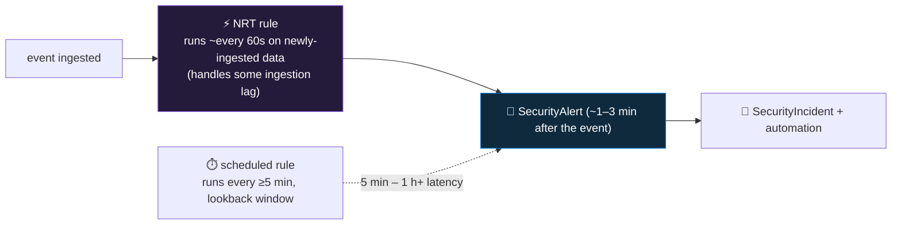

<div align="center">

# 🔍 Step 23 · Near-real-time (NRT) rules

### *~1-minute detection for the events that can't wait an hour — and the constraints that buys*

[](../README.md)
[](#)
[](#)

</div>

---

## 🎯 Goal

One working NRT rule that fires within ~1–3 minutes of the event, entity-mapped, and a clear,
tested understanding of what NRT **cannot** do — so you never try to force a correlation rule into
an NRT slot.

## 🧠 Why this step

A scheduled rule's best-case latency is its frequency floor — **5 minutes** — and most run hourly.
For a handful of events, that is too slow: a **Global Administrator** role grant, a **mass Key Vault
secret read**, **security tooling being disabled**, a **Conditional Access policy deleted**. For
these, the difference between detecting in 90 seconds and detecting in 45 minutes is the difference
between interrupting an attacker and reading about what they did.

NRT rules run **about once a minute** against the most recently ingested data. The price is a
**strict feature set** — single table, no `join`, limited operators, and a **cap of ~50 NRT rules
per workspace**. So NRT is a scarce resource you spend on genuinely rare, genuinely urgent,
**single-event** detections: *"this one thing happened and it is bad."* Anything that needs to
count over time, correlate two tables, or reference a large list stays a scheduled rule.

What people get wrong: they try to port a scheduled correlation rule to NRT and it won't validate;
they put a noisy event on an NRT rule and get ~1 alert/minute; or they burn all 50 NRT slots on
medium-severity detections and have none left for the ones that matter.

## ✅ Prerequisites

- [Step 22](../22-scheduling-lookback-and-coverage-gaps/README.md) — you understand scheduled-rule
  timing, so you can see what NRT trades away.
- [Step 09](../09-microsoft-entra-id/README.md) — `AuditLogs` flowing (the example detects a
  directory role assignment).
- A **throwaway test user** you can safely assign the Global Administrator role to and remove.

## 🧭 Concepts



### What NRT can and cannot do (verify current limits in the docs)

| ✅ Can | ❌ Cannot |
|---|---|
| Run ~every 60 seconds on freshly-ingested data (with some tolerance for lag) | Define a lookback window — it sees the recent slice only |
| Query a **single table** | `join` across tables |
| A limited `union` in some cases | Cross-workspace / `workspace()` references |
| `where`, `extend`, `project`, `parse`, scalar functions, a bounded `summarize` | Aggregations that need a wide time window; heavy `mv-expand` chains (verify) |
| Entity mapping, custom details, alert details override | — |
| Trigger automation rules and playbooks; incident grouping | — |
| Reference a watchlist (support has expanded over time — **verify** for your tenant) | Rely on it if unverified |
| ~**50 NRT rules per workspace** | Exceed that — plan your slots |

**Rule of thumb:** NRT = *"this single event, right now, is bad."* Counting, correlation, or
list-heavy logic → scheduled rule.

### How it works under the hood

- Kind `NRT` on the `alertRules` resource. There is **no `queryFrequency` / `queryPeriod`** — the
  platform runs it continuously against newly-ingested rows.
- Because it keys off ingestion, a row whose `TimeGenerated` is a few minutes old but which just
  landed is still evaluated — NRT tolerates *some* ingestion delay, but a source that lags 30
  minutes is a poor fit (the "near" in near-real-time assumes the data is near-real-time too).
- The constrained query engine is why `join` and cross-workspace fail validation in the wizard —
  it's not a policy choice you can override.
- NRT alerts flow into `SecurityAlert` / `SecurityIncident` exactly like scheduled-rule alerts, so
  everything downstream (grouping, automation, entities) is identical.

### Vocabulary

| Term | Meaning |
|---|---|
| **NRT rule** | Analytics rule (`kind: NRT`) that runs ~every minute on newly-ingested data, single table, no joins. |
| **Detection latency** | Time from the event happening to the alert existing. NRT: ~1–3 min; scheduled: 5 min – hours. |
| **NRT slot** | One of the ~50 NRT rules a workspace allows — a scarce resource. |
| **Single-event detection** | A detection where one row = one bad thing (no counting or correlation needed). |

### Where this fits

NRT is the escape hatch from [step 22](../22-scheduling-lookback-and-coverage-gaps/README.md) when
5-minute frequency isn't fast enough. It uses the entity mapping from
[step 20](../20-entity-mapping-and-custom-details/README.md) and feeds the response playbooks in
[step 34](../34-response-actions-with-approval/README.md) — a near-instant "global admin granted"
alert that auto-triggers an approval-gated containment is a high-value pattern.

### Design rationale

NRT trades query power for latency: a continuously-running, single-table, join-free engine can go
fast, a general correlation engine cannot. Microsoft caps the count because each NRT rule is
continuous compute, and forces you to be deliberate about which detections earn sub-minute speed.

## 🖱️ Do it — portal

1. **Analytics → Create → NRT query rule.**
2. **General**: name `NRT · Privileged directory role assigned`. Severity **High**. Tactics
   **Privilege Escalation**, technique **T1098** (Account Manipulation). Status **Enabled**.
3. **Set rule logic** — query (a single-table `AuditLogs` detection; exact `modifiedProperties`
   shape varies by tenant, so this is a starting point — compare with the built-in
   *"Privileged Role Assignment"* template):

```kusto
AuditLogs
| where LoggedByService =~ "Core Directory" and Category =~ "RoleManagement"
| where OperationName =~ "Add member to role"
| extend RoleName = tostring(TargetResources[0].modifiedProperties[1].newValue)
| where RoleName has_any ("Global Administrator", "Privileged Role Administrator",
                          "Security Administrator", "Application Administrator")
| extend Actor  = tostring(InitiatedBy.user.userPrincipalName)
| extend ActorIp = tostring(InitiatedBy.user.ipAddress)
| extend Target = tostring(TargetResources[0].userPrincipalName)
| project TimeGenerated, RoleName, Actor, ActorIp, Target, Result
```

4. **Entity mapping**: `Account` → `Name` = `Target`; a second `Account` mapping for the actor if
   you want it (`Name` = `Actor`); `IP` → `Address` = `ActorIp`.
5. **Custom details**: `RoleName`, `Actor`, `Result`.
6. **Alert details override**: name `Privileged role "{{RoleName}}" granted to {{Target}} by {{Actor}}`.
7. **Incident settings**: create incidents; group by `Account` (the target), 5h.
8. **Automated response**: none yet ([step 34](../34-response-actions-with-approval/README.md) will
   attach an approval playbook here).
9. **Review + create.** Save the query to `artifacts/nrt-privileged-role.kql`.

## 💻 Do it — CLI / IaC

```bash
az sentinel alert-rule create -g rg-sentinel-lab --workspace-name law-sentinel-lab --rule-id "$(uuidgen)" \
  --nrt-alert-rule '{
     "enabled": true,
     "displayName": "NRT Privileged directory role assigned",
     "severity": "High",
     "query": "'"$(python -c 'import json;print(json.dumps(open("artifacts/nrt-privileged-role.kql").read())[1:-1])')"'",
     "tactics": ["PrivilegeEscalation"],
     "techniques": ["T1098"],
     "entityMappings": [
       {"entityType":"Account","fieldMappings":[{"identifier":"Name","columnName":"Target"}]},
       {"entityType":"IP","fieldMappings":[{"identifier":"Address","columnName":"ActorIp"}]}
     ]
  }'
```

> NRT has no `queryFrequency` / `queryPeriod` fields — omit them. Preview-CLI JSON shapes drift;
> portal + export ([step 28](../28-analytics-rules-as-code/README.md)) is the reliable path.

## 🧪 Validate — measure the latency, and hit the constraint

1. **Fire it.** Assign the **Global Administrator** role to a throwaway user (`nrt-test@<tenant>`),
   then remove it.
2. Note the exact time of the assignment.

```kusto
// the source event
AuditLogs
| where TimeGenerated > ago(20m) and OperationName =~ "Add member to role"
| project EventTime = TimeGenerated, tostring(InitiatedBy.user.userPrincipalName), tostring(TargetResources[0].userPrincipalName)
```

```kusto
// the alert it produced — and how fast
SecurityAlert
| where TimeGenerated > ago(20m) and AlertName has "Privileged role"
| project AlertTime = TimeGenerated, AlertName, AlertSeverity, Entities
```

3. **Compute the latency:** `AlertTime − EventTime`. Expect **~1–3 minutes**. Run the same
   detection as a *scheduled* rule (hourly) alongside and compare — that one takes up to an hour.

4. **Hit the constraint:** in the NRT rule editor, add
   `| join kind=inner (SigninLogs) on $left.Actor == $right.UserPrincipalName` and try to save. The
   wizard **rejects it** — screenshot that. That's the trade you accepted.

| Check | Healthy | Unhealthy |
|---|---|---|
| Latency | 1–3 min (`AlertTime − EventTime`) | > 10 min → `AuditLogs` itself is lagging; NRT can't outrun its source |
| Entities | `Target` account + `ActorIp` populated | empty → columns not in `project` |
| `join` in the editor | rejected on save | if it *accepted*, you're not editing an NRT rule |

**You should see** the incident within a few minutes and a measured latency far below a scheduled
rule's.

## 🚩 Common mistakes

| 🚩 Mistake | Why it bites |
|---|---|
| Porting a scheduled correlation rule to NRT | `join` / wide-window aggregation won't validate |
| NRT on a noisy event | Potential ~1 alert/minute — reserve NRT for rare, urgent, single events |
| Expecting a lookback window | NRT sees the recent slice; a source that lags badly loses events |
| Burning NRT slots on medium-severity detections | ~50 total — save them for the top-severity, must-be-instant ones |
| Assuming watchlist support | It has expanded over time but **verify** before relying on `_GetWatchlist` in NRT |
| Not measuring the latency | The whole point of NRT is speed — prove you got it |
| Using NRT where the source data isn't near-real-time | E.g. a 6-hourly poller — NRT can't make slow data fast |

## 🩺 Troubleshooting

| Symptom | Likely cause | Fix |
|---|---|---|
| Rule won't save — validation error | Query uses `join`, cross-workspace, or an unsupported operator | Reduce to a single-table query; if you need correlation, use a scheduled rule |
| No alert after the role assignment | `modifiedProperties` index/shape differs in your tenant, so `RoleName` is empty | Inspect a real `AuditLogs` "Add member to role" row; adjust the parse; compare to the built-in template |
| Alert fires but 8+ minutes late | `AuditLogs` ingestion lag in your tenant | NRT can't beat its source's lag; if it's chronic, NRT isn't the right tool here |
| Alert fires for role *removals* too | `OperationName` also matches "Remove member from role" in some filters | Pin `OperationName =~ "Add member to role"` exactly |
| Duplicate alerts within a minute | The same event evaluated in two adjacent runs (edge case) | Add incident grouping; usually self-resolves |
| Hit the NRT rule limit on create | ~50 NRT rules already exist | Audit them — demote the least time-critical to scheduled |
| Entity mapping empty | `Target` / `ActorIp` not in the final `project` | Add them |

## 🎓 Deepen your understanding

1. List every detection you'd *want* to be NRT. Now cut it to five (the slot budget forces this). What made the cut, and what's the cost of the ones that didn't?
2. Run this detection as **both** an NRT rule and an hourly scheduled rule. Assign the role, and record both alert times. What's the exact latency difference, and what could an attacker do in that window?
3. Why can't NRT do a `join`? Think about what "runs continuously on newly-ingested single-table data" implies about holding a second table in memory.
4. Your Key Vault sends `AzureDiagnostics` with ~15-minute lag. Is an NRT rule for "mass secret read" actually near-real-time? What would you do instead to get faster detection?
5. Attach an approval-gated containment playbook ([step 34](../34-response-actions-with-approval/README.md)) to this NRT rule. Sketch the end-to-end timeline: role granted → NRT alert → automation → approval prompt → account disabled. Where's the slowest link?

## 🗒️ Log your run

Copy [`_templates/STEP-LOG-TEMPLATE.md`](../_templates/STEP-LOG-TEMPLATE.md) into this folder as
`LOG.md` and [`_templates/DETECTION-TEMPLATE.md`](../_templates/DETECTION-TEMPLATE.md) into
`DET-IDENTITY-003.md`. Record: the **measured detection latency** (alert time − event time), the
rejected-`join` screenshot, and your five-or-fewer NRT-slot budget with reasoning.

## 📚 Microsoft Learn

- [Detect threats quickly with near-real-time (NRT) analytics rules](https://learn.microsoft.com/en-us/azure/sentinel/near-real-time-rules)
- [Create NRT detection rules](https://learn.microsoft.com/en-us/azure/sentinel/create-nrt-rules)
- [AuditLogs table schema](https://learn.microsoft.com/en-us/azure/azure-monitor/reference/tables/auditlogs)
- [Detect threats out-of-the-box (find the built-in privileged-role templates)](https://learn.microsoft.com/en-us/azure/sentinel/detect-threats-built-in)

---

<div align="center">
<sub>

[⬅ Prev: 22 · Scheduling, lookback & coverage gaps](../22-scheduling-lookback-and-coverage-gaps/README.md) &nbsp;·&nbsp; [🦅 All steps](../README.md) &nbsp;·&nbsp; [Next: 24 · Watchlists ➡](../24-watchlists/README.md)

</sub>
</div>
