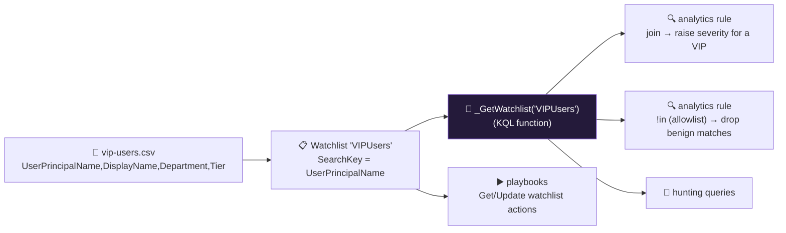

<div align="center">

# 🔍 Step 24 · Watchlists

### *Reference data — VIPs, crown-jewel assets, partner IPs — joined into your detections*

[](../README.md)
[](#)
[](#)

</div>

---

## 🎯 Goal

Two watchlists exist (`VIPUsers` and `KnownBadIPs` or `HighValueAssets`), you can call
`_GetWatchlist()` in Logs, and one analytics rule uses a watchlist to **raise severity for a VIP**
and one uses a watchlist to **allowlist a benign source** — both proven with a High-vs-Medium
incident split.

## 🧠 Why this step

Logs tell you *what happened*. They do not tell you that `cfo@contoso-lab.com` is an executive whose
compromised account is a board-level incident, that `10.20.0.0/16` is your PCI cardholder-data
segment, or that `198.51.100.7` is a partner's known egress IP that trips your firewall rules every
day for no reason. That **context** lives outside the logs, and a **watchlist** is how you bring it
in.

Two patterns dominate:

- **Enrichment / prioritisation** — `join` the watchlist into a rule and raise severity, add a tag,
  or route differently when the entity is on it. "Failed logons for a VIP" is a High; the same for a
  contractor is a Medium.
- **Allowlisting / noise reduction** — filter out matches whose source is on a "known benign" list.
  A vulnerability scanner, a partner's IP range, a monitoring bot — all generate detection matches
  that are not incidents.

What people get wrong: they put **large or fast-changing** data in a watchlist (a 200k-row asset
inventory that updates hourly — that's a custom table's job); they hit **case mismatches** on the
join key (`CEO@contoso` vs `ceo@contoso`); they pick the **wrong SearchKey** so every lookup scans
the whole list; or they use a watchlist as the *only* allowlist mechanism when automation-rule
suppression ([step 35](../35-automation-rules-triage/README.md)) would be cleaner for some cases.

## ✅ Prerequisites

- [Step 19](../19-write-a-scheduled-rule/README.md) / [step 18](../18-enable-a-rule-from-template/README.md)
  — a rule to enrich or allowlist.
- [Step 05](../05-rbac-and-roles/README.md) — Sentinel Contributor (creating a watchlist writes to
  the workspace).
- A small synthetic CSV (build it here — never use real executive names / real partner IPs).

## 🧭 Concepts

A watchlist is a **named CSV stored in the workspace**, surfaced two ways:

- as a **KQL function** — `_GetWatchlist('VIPUsers')` returns the rows as a table, with your original
  column names (no `_s` suffixes);
- in the **Watchlists** blade for viewing/editing individual items.

You pick one **SearchKey** column — the one you'll `join` or `lookup` on — which Sentinel optimises.



### How it works under the hood

- **Storage & size.** Standard watchlists live in the workspace and are meant to be **small and
  slow-changing** — Microsoft's guidance is on the order of **< 10 MB / a few thousand rows**.
  `_GetWatchlist()` is re-evaluated on every query that uses it, so a huge list makes every rule
  slower.
- **Large watchlists** (GA) back onto an **Azure Storage blob** and support much bigger sets (up to
  hundreds of MB). Use these for big reference data that still isn't dynamic enough for a custom
  table.
- **When to use a custom table instead:** high row count, frequent updates, or you need history of
  changes. A watchlist is a lookup, not a log.
- **Items** each get a `WatchlistItemId` GUID; you can add/edit/delete individual items in the
  portal or via `az sentinel watchlist-item` / the API / a playbook's **Update watchlist** action —
  so a playbook can *add* an IOC to `KnownBadIPs` during an incident.
- **Built-in templates**: the Watchlists blade offers schemas for *VIP Users*, *Terminated
  Employees*, *High Value Assets*, *Service Accounts*, *Network Mapping*, *Identity Correlation* —
  use these column shapes so community content that expects them works.
- **In NRT rules**: watchlist support has expanded over time — **verify** before relying on
  `_GetWatchlist` inside an NRT rule ([step 23](../23-nrt-rules/README.md)).

### Vocabulary

| Term | Meaning |
|---|---|
| **Watchlist** | A named CSV of reference data stored in the workspace. |
| **Alias** | The short name you call it by: `_GetWatchlist('<alias>')`. |
| **SearchKey** | The one column optimised for lookups / joins. |
| **`_GetWatchlist()`** | The KQL function that returns a watchlist as a table. |
| **Large watchlist** | A watchlist backed by Azure Storage for bigger data sets. |
| **`WatchlistItemId`** | The GUID of a single row, for targeted edits. |

### Where this fits

Watchlists feed the tuning in [step 26](../26-tuning-a-noisy-rule/README.md) (allowlists), the
severity logic across the SIEM-rules phase, the hunts in phase 🏹 (e.g. VIP-focused identity hunts),
and playbooks in phase 🔄 (a containment playbook can add the attacker IP to `KnownBadIPs`).
Automation-rule suppression ([step 35](../35-automation-rules-triage/README.md)) is the *other*
allowlisting tool — watchlists are better when the logic lives in the detection query.

### Design rationale

Watchlists exist so context data is a first-class, editable, joinable object rather than a hardcoded
list buried in twenty rule queries. Keeping them small and function-based (rather than a table)
makes them cheap to maintain and safe to reference everywhere.

## 🖱️ Do it — portal

1. **`vip-users.csv`** (synthetic — no real names):

```csv
UserPrincipalName,DisplayName,Department,Tier
ceo@contoso-lab.com,Test CEO,Executive,0
cfo@contoso-lab.com,Test CFO,Executive,0
it-admin@contoso-lab.com,Test Admin,IT,1
```

2. **Sentinel → Configuration → Watchlists → + New**:
   - Name / Alias `VIPUsers`, description, source `vip-users.csv`.
   - **SearchKey**: `UserPrincipalName`.
   - Create. It takes a minute or two to be queryable.
3. **`known-bad-ips.csv`**:

```csv
IPAddress,Source,AddedOn,Note
198.51.100.7,partner-allow,2026-09-01,Partner ACME egress — benign firewall denies
203.0.113.9,threat-intel,2026-09-02,Observed brute-force source
```

   → new watchlist alias `KnownBadIPs`, SearchKey `IPAddress`.

## 💻 Do it — CLI / IaC

```bash
RG=rg-sentinel-lab; WS=law-sentinel-lab

# create from an uploaded file's raw content (or use --number-of-lines-to-skip / --raw-content)
az sentinel watchlist create -g $RG --workspace-name $WS \
  --watchlist-alias VIPUsers --display-name "VIP Users" --provider "lab" \
  --source "vip-users.csv" --items-search-key UserPrincipalName \
  --raw-content "$(cat artifacts/vip-users.csv)" --content-type "text/csv"

# add / update a single item later (e.g. from a playbook during an incident)
az sentinel watchlist-item create -g $RG --workspace-name $WS \
  --watchlist-alias KnownBadIPs --watchlist-item-id "$(uuidgen)" \
  --properties '{"IPAddress":"203.0.113.44","Source":"incident-2026-09-02","AddedOn":"2026-09-02","Note":"attacker IP from INC-1234"}'
```

<details><summary>Bicep</summary>

```bicep
resource ws 'Microsoft.OperationalInsights/workspaces@2023-09-01' existing = { name: 'law-sentinel-lab' }

resource vip 'Microsoft.SecurityInsights/watchlists@2024-09-01' = {
  scope: ws
  name: 'VIPUsers'
  properties: {
    displayName: 'VIP Users'
    provider: 'lab'
    source: 'vip-users.csv'
    itemsSearchKey: 'UserPrincipalName'
    contentType: 'text/csv'
    rawContent: loadTextContent('artifacts/vip-users.csv')
  }
}
```
</details>

### Use a watchlist in a rule — severity escalation

```kusto
let vips = _GetWatchlist('VIPUsers')
    | project vipUpn = tolower(UserPrincipalName), Tier;
SigninLogs
| where TimeGenerated > ago(1h) and ResultType != 0
| summarize Failures = count(), IPs = make_set(IPAddress) by upn = tolower(UserPrincipalName)
| where Failures >= 5
| join kind=leftouter vips on $left.upn == $right.vipUpn
| extend Severity = case(Tier == "0", "High", isnotempty(Tier), "Medium", "Low")
| project TimeGenerated = now(), UserPrincipalName = upn, Failures, IPs, Tier, Severity
```

In the rule wizard: **Set rule logic → Alert details → Severity column** = `Severity`. Map
`Account` → `Name` = `UserPrincipalName`. Now a VIP's failures raise a **High**, a normal user's a
**Medium**.

### Use a watchlist in a rule — allowlist

```kusto
let allow = _GetWatchlist('KnownBadIPs')
    | where Source == "partner-allow"
    | project allowedIp = IPAddress;
CommonSecurityLog
| where TimeGenerated > ago(1h) and DeviceAction == "deny"
| where SourceIP !in ((allow | project allowedIp))
| summarize Denies = count() by SourceIP, DestinationPort
| where Denies > 20
```

## 🧪 Validate

```kusto
_GetWatchlist('VIPUsers') | count                                  // = 3
_GetWatchlist('VIPUsers') | where UserPrincipalName has "ceo"       // returns the CEO row
_GetWatchlist('KnownBadIPs') | summarize count() by Source          // partner-allow / threat-intel
```

```kusto
// the audit table for watchlist operations
Watchlist
| where TimeGenerated > ago(1d)
| project TimeGenerated, WatchlistAlias = tostring(parse_json(Properties).watchlistAlias), _ItemId
```

Then fail sign-in **5×** for `ceo@contoso-lab.com` and **5×** for `analyst1` (non-VIP). Wait for
the rule:

| Check | Healthy | Unhealthy |
|---|---|---|
| `_GetWatchlist('VIPUsers') \| count` | `3` | `0` / error → watchlist not created or still provisioning |
| VIP incident | **Severity High** | Medium → severity column not wired, or `join`/case mismatch |
| Non-VIP incident | **Severity Medium** | High → the `leftouter` join is matching everyone (check `Tier` emptiness) |
| Allowlist rule | denies from `198.51.100.7` **excluded**; other denies still alert | partner IP still alerting → `Source` filter or `!in` subquery shape |

**You should see** the watchlist function returning your rows and the two incidents split
High/Medium purely because one account is on the list.

## 🚩 Common mistakes

| 🚩 Mistake | Why it bites |
|---|---|
| Large or fast-changing data in a watchlist | Slow `_GetWatchlist()` on every rule run; painful updates — use a custom table |
| Case mismatch on the join key | `CEO@…` ≠ `ceo@…` — `tolower()` / `=~` both sides |
| Wrong SearchKey | Every lookup scans the whole list |
| `join kind=inner` when you want enrichment | Drops every non-VIP row — use `leftouter` and test for emptiness |
| Watchlist as the only allowlist | Some allowlisting is cleaner as automation-rule suppression ([step 35](../35-automation-rules-triage/README.md)) |
| Committing a real CSV | Real exec names / partner IPs in a public repo — use synthetic data |
| Forgetting a playbook can edit it | You manually add attacker IPs when a containment playbook could |

## 🩺 Troubleshooting

| Symptom | Likely cause | Fix |
|---|---|---|
| `_GetWatchlist('X')` → *"function 'X' not found"* | Wrong alias, or still provisioning (1–2 min after create) | Check the exact alias in the Watchlists blade; wait and retry |
| Watchlist created but 0 rows | CSV header row misparsed, or wrong delimiter, or `--number-of-lines-to-skip` off | Re-upload; confirm the first row is the header and it's comma-delimited |
| Join matches everyone / no one | Case mismatch, or `on` clause keys named differently | `tolower()` both sides; use explicit `$left.x == $right.y` |
| Severity column ignored | Alert details → Severity column not set, or the column name doesn't match exactly | Set it in the wizard; column names are case-sensitive |
| Allowlist `!in` does nothing | `!in` given a table not a scalar list, or the subquery returns a different column name | `where X !in ((subquery | project col))` — note the double parens and single projected column |
| Rule slow after adding `_GetWatchlist` | The watchlist is large, or joined before filtering | Filter the log table first, then `join`; consider a custom table |
| Can't edit an item in the portal | The watchlist is a **large** (blob-backed) watchlist | Edit the source file and re-upload |

## 🎓 Deepen your understanding

1. Build a `ServiceAccounts` watchlist and rewrite `DET-IDENTITY-001` to *exclude* service accounts from the "success after failures" logic (they legitimately fail then succeed on retry). What false positive did you just remove?
2. `_GetWatchlist()` is re-run every rule execution. For a rule that runs every 5 minutes against a 5,000-row watchlist, is that a problem? At 200,000 rows? Where's the line, and what's the fix past it?
3. A containment playbook adds the attacker's IP to `KnownBadIPs` with `Source = "incident"`. Write the analytics-rule filter that *then* alerts on any future traffic from `Source == "incident"` IPs. You've built a feedback loop — what could go wrong?
4. Compare allowlisting a scanner IP three ways: in the rule query via a watchlist, via automation-rule suppression, and via a DCR transformation dropping its rows. Which is reversible, which is auditable, which saves money?
5. The built-in *VIP Users* template has a specific column schema. Why does matching it matter if you ever install community detection content?

## 🗒️ Log your run

Copy [`_templates/STEP-LOG-TEMPLATE.md`](../_templates/STEP-LOG-TEMPLATE.md) into this folder as
`LOG.md`. Record: the two watchlists (alias + SearchKey), the rule change (severity escalation and
allowlist), and the High-vs-Medium incident evidence. Commit the **synthetic** CSVs to `artifacts/`.

## 📚 Microsoft Learn

- [Use watchlists in Microsoft Sentinel](https://learn.microsoft.com/en-us/azure/sentinel/watchlists)
- [Create watchlists](https://learn.microsoft.com/en-us/azure/sentinel/watchlists-create)
- [Build queries and detection rules with watchlists](https://learn.microsoft.com/en-us/azure/sentinel/watchlists-queries)
- [Create a large watchlist from a file in Azure Storage](https://learn.microsoft.com/en-us/azure/sentinel/watchlists-create#create-a-large-watchlist-from-file-in-azure-storage)
- [watchlists ARM reference](https://learn.microsoft.com/en-us/azure/templates/microsoft.securityinsights/watchlists)

---

<div align="center">
<sub>

[⬅ Prev: 23 · NRT rules](../23-nrt-rules/README.md) &nbsp;·&nbsp; [🦅 All steps](../README.md) &nbsp;·&nbsp; [Next: 25 · MITRE ATT&CK coverage ➡](../25-mitre-attack-coverage/README.md)

</sub>
</div>
