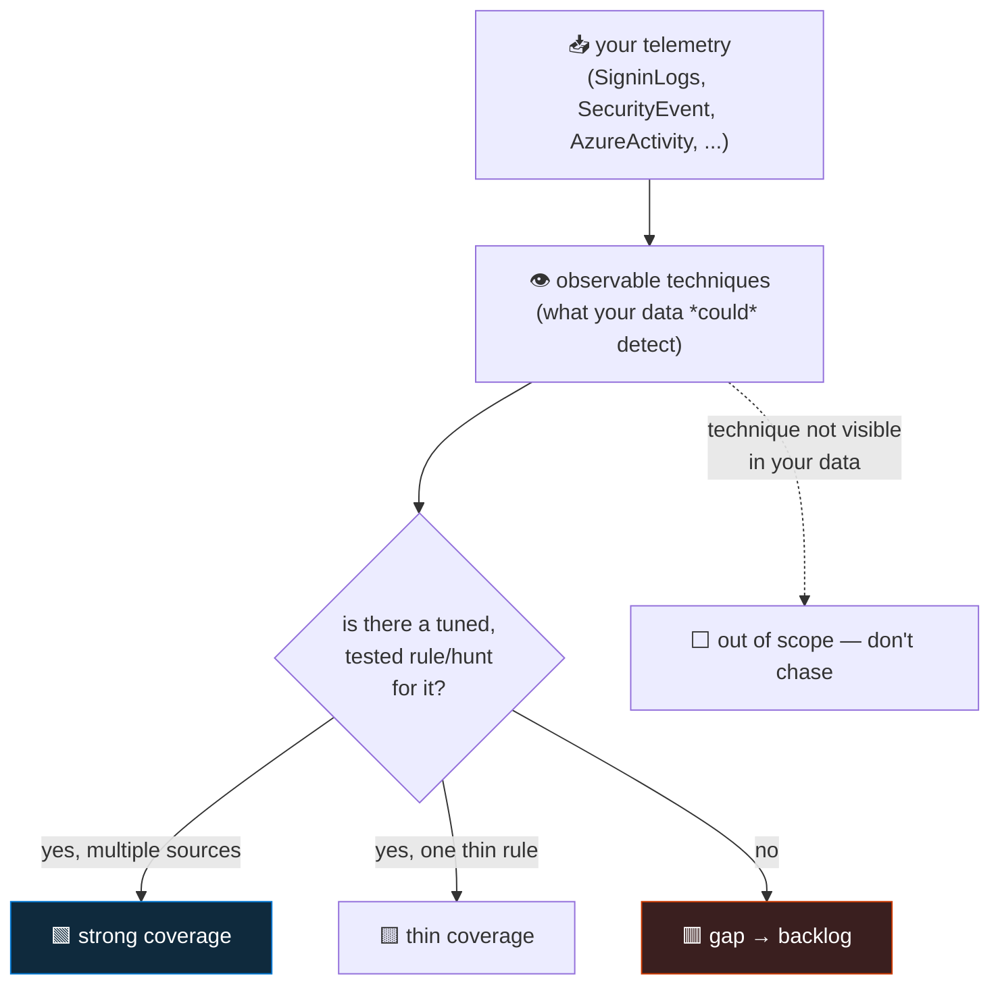

<div align="center">

# 🔍 Step 25 · MITRE ATT&CK coverage

### *Turn a pile of rules into a coverage picture — and a prioritised build backlog*

[](../README.md)
[](#)
[](#)

</div>

---

## 🎯 Goal

Every custom rule you've built carries **accurate** tactic + technique tags, you've read the
Sentinel **MITRE ATT&CK** coverage blade and understand its four overlays, and you've written a
`coverage-gaps.md` naming three technique gaps that are **relevant to your data** and are your build
backlog for the hunting phase.

## 🧠 Why this step

"How good is our detection coverage?" is a question a manager, an auditor, or a board will ask, and
"we have 40 rules" is not an answer. The **MITRE ATT&CK framework** is the shared vocabulary for
answering it: a matrix of **tactics** (the adversary's goals — Initial Access, Persistence,
Exfiltration…) and **techniques** (how they achieve them — T1110 Brute Force, T1078 Valid
Accounts…). Mapping your rules and hunts onto that matrix produces a picture: which tactics are
solidly covered, which have one flaky rule, which are blank.

That picture does three jobs: it **communicates** posture to non-analysts; it **prioritises** what
to build next (a blank Exfiltration column relevant to your environment is a louder gap than a
15th Credential Access rule); and it **catches drift** — a technique that was covered by a rule that
got disabled goes dark, and the matrix shows it.

Two honest caveats this step insists on. **Coverage ≠ effectiveness**: a technique lit up by one
untuned, never-tested rule is not "covered". And **100% is the wrong target**: some techniques are
not observable with the telemetry you have, and chasing them wastes effort — you cover the
techniques that matter to *your* threat model and are visible in *your* data.

## ✅ Prerequisites

- [Step 18](../18-enable-a-rule-from-template/README.md), [19](../19-write-a-scheduled-rule/README.md),
  [23](../23-nrt-rules/README.md) — several rules exist to map.
- Familiarity with your connected data sources (phase 📥) — coverage is bounded by what you ingest.

## 🧭 Concepts



**Reading it:** coverage starts from **data**. A technique is only *observable* if some source you
ingest would show it (T1110 Brute Force needs authentication logs; T1055 Process Injection needs
EDR-grade endpoint telemetry). Of the observable techniques, each is either strongly covered
(multiple tuned rules/sources), thinly covered (one rule), or a gap. Techniques your data can't see
are **out of scope** — name them so nobody thinks they're covered, but don't build blindly for them.

### The Sentinel MITRE ATT&CK blade

- Renders the **ATT&CK Enterprise matrix**, with a **sub-technique** toggle.
- Four overlays, each shaded by count (1 / 2 / 3+): **Active analytics rules**, **Hunting queries**,
  **Anomaly rules**, **NRT rules** (and Fusion where applicable).
- Colour comes from rule/hunt **metadata** — the `tactics` and `techniques` you set on each. An
  untagged rule contributes **nothing** to the matrix even if it's a great detection.
- Clicking a technique lists the rules and hunts mapped to it.

### Tactics, techniques, sub-techniques

| Level | Example | In Sentinel |
|---|---|---|
| **Tactic** | Credential Access | `tactics: ["CredentialAccess"]` on the rule |
| **Technique** | T1110 Brute Force | `techniques: ["T1110"]` |
| **Sub-technique** | T1110.003 Password Spraying | `subTechniques: ["T1110.003"]` (supported — set it when you know it) |

### How it works under the hood

- `tactics` / `techniques` / `subTechniques` are arrays on `Microsoft.SecurityInsights/alertRules`
  and on hunting-query metadata. Templates pre-fill them; custom rules do not — **you** set them.
- The blade aggregates these across all enabled rules and saved hunts and paints the matrix. It is a
  **presence** count, not a quality score.
- `SecurityAlert` / `SecurityIncident` also carry `Tactics` / `Techniques` — but only populated on
  alerts that actually fired, so querying the **rules** is the truer coverage picture.
- [SOC optimization](../57-soc-optimization-and-coverage/README.md) uses the same mapping to
  *recommend* content for gaps where you have the data but no rule.

### Vocabulary

| Term | Meaning |
|---|---|
| **Tactic** | An adversary objective (a matrix column). |
| **Technique / sub-technique** | A specific method (a matrix cell / a nested cell). |
| **Observable** | A technique your ingested telemetry could, in principle, detect. |
| **Coverage overlay** | One of the blade's four counts: analytics / hunting / anomaly / NRT. |
| **ATT&CK Navigator** | The MITRE tool for building and sharing coverage "layers" (JSON). |
| **Detection depth** | How many independent, tuned detections cover a technique. |

### Where this fits

This reads the output of the SIEM-rules phase and produces the **input** to the hunting phase: the
`coverage-gaps.md` you write here is the backlog for [steps 44–48](../44-hunt-identity/README.md)
(hunts by tactic) and [step 49](../49-hunt-to-detection/README.md) (hunt → detection). It's revisited
in [step 57](../57-soc-optimization-and-coverage/README.md) with Microsoft's recommendations layered
on.

### Design rationale

Sentinel builds the matrix from rule metadata (not from analysing queries) because a query's intent
isn't reliably inferable, and because forcing engineers to tag their rules makes them *think* about
what they're detecting. It's a presence count, not a score, because "how good" is a judgement the
blade can't make for you.

## 🖱️ Do it — portal

1. **Sentinel → Threat management → MITRE ATT&CK.** Turn on all four overlays. Note the darkest
   cells (best covered) and the entirely blank **tactics** (whole columns with nothing).
2. **Tag your custom rules accurately.** For each: **Analytics → the rule → Edit → General → MITRE
   ATT&CK** → set tactic(s), technique(s), and sub-technique(s) where you know them:
   - `DET-IDENTITY-001` (brute force then success) → **Credential Access / T1110** (sub-technique
     **T1110.001** password guessing or **T1110.004** credential stuffing — pick the one your
     hypothesis matches).
   - `NRT · Privileged directory role assigned` ([step 23](../23-nrt-rules/README.md)) →
     **Privilege Escalation / T1098** (Account Manipulation), sub-technique **T1098.003**
     (Additional Cloud Roles).
   - `OPS · Data source went quiet` ([step 15](../15-ingestion-health-and-validation/README.md)) —
     if you framed it as detecting **an attacker disabling logging**, tag **Defense Evasion /
     T1562.008** (Disable or Modify Cloud Logs). If it's purely an ops-health rule, leave it
     untagged and route it away from the security queue.
3. **Refresh the matrix.** Credential Access and Privilege Escalation now show "1+ active rule".
4. **Pick three gaps.** Choose three blank (or thin) **techniques** that are (a) relevant to a
   plausible threat to your lab, and (b) **observable** with data you already ingest. Candidates:
   Persistence / T1547.001 (Run keys), Lateral Movement / T1021 (Remote Services), Exfiltration /
   T1048 (Exfil over alternative protocol), Defense Evasion / T1070 (Indicator removal).

## 💻 Do it — query your coverage

```bash
# every enabled rule's MITRE tags — the truer coverage picture than SecurityAlert
az sentinel alert-rule list -g rg-sentinel-lab --workspace-name law-sentinel-lab \
  --query "[?enabled].{name:displayName, kind:kind, tactics:tactics, techniques:techniques}" -o json
```

```kusto
// coverage from rules that have actually fired (partial — misses rules that haven't triggered)
SecurityAlert
| where TimeGenerated > ago(90d)
| mv-expand Tactic = todynamic(Tactics) to typeof(string)
| summarize Rules = dcount(AlertName), Alerts = count() by Tactic
| join kind=rightouter (
    print Tactic = dynamic(["InitialAccess","Execution","Persistence","PrivilegeEscalation",
      "DefenseEvasion","CredentialAccess","Discovery","LateralMovement","Collection",
      "CommandAndControl","Exfiltration","Impact"])
    | mv-expand Tactic to typeof(string)
  ) on Tactic
| extend Tactic = coalesce(Tactic, Tactic1), Rules = coalesce(Rules, 0), Alerts = coalesce(Alerts, 0)
| project Tactic, Rules, Alerts
| extend Status = case(Rules == 0, "🟥 gap", Rules == 1, "🟨 thin", "🟩 covered")
| sort by Rules asc
```

## 🧪 Validate

**You should see** the portal matrix with at least **Credential Access** and **Privilege
Escalation** lit for active analytics rules, the KQL above showing your tactics with rule counts and
the rest as gaps, and `az sentinel alert-rule list` confirming every enabled custom rule now has
non-empty `tactics` and `techniques`.

Produce `artifacts/coverage-gaps.md`:

```markdown
# Coverage gaps — build backlog

| Tactic | Technique | Observable with | Why it matters here | Planned |
|---|---|---|---|---|
| Persistence | T1547.001 Run keys | DeviceRegistryEvents / SecurityEvent | attacker foothold on the lab VM | step 45 → 49 |
| Lateral Movement | T1021.002 SMB/admin shares | SecurityEvent 5140/4624(3) | movement between the two lab VMs | step 46 → 49 |
| Exfiltration | T1048 alt-protocol / DNS | DnsEvents / DeviceNetworkEvents | data theft path | step 47 → 49 |
```

| Check | Healthy |
|---|---|
| Every enabled custom rule | has accurate `tactics` + `techniques` |
| Matrix | reflects your real coverage, not an inflated or deflated one |
| `coverage-gaps.md` | three techniques, each **observable** with data you have, each with a plan |

## 🚩 Common mistakes

| 🚩 Mistake | Why it bites |
|---|---|
| Leaving `tactics`/`techniques` unset on custom rules | The matrix shows a gap you don't actually have — and coverage reports are wrong |
| Tagging a rule with a technique it doesn't really detect | The matrix shows coverage you don't actually have — worse than a visible gap |
| Treating "1 rule = covered" | Depth matters: one untuned, untested rule is thin coverage |
| Chasing 100% matrix coverage | You'll build detections for techniques your data can't see |
| Ignoring the hunting overlay | Hunts provide visibility toward a technique even without an alert |
| Not re-checking after disabling a rule | A technique silently goes dark |
| Mapping only to tactics, never techniques | Too coarse to drive a build backlog |

## 🩺 Troubleshooting

| Symptom | Likely cause | Fix |
|---|---|---|
| Matrix shows a tactic blank that you know you cover | The covering rule has no `tactics`/`techniques` set, or it's disabled | Edit the rule → MITRE ATT&CK tab; check it's Enabled |
| A technique shows "3+" but you only have one rule | Multiple templates you enabled all tag it, or hunting + anomaly overlays stack | Click the cell — it lists what's mapped; judge the real depth |
| `mv-expand Tactics` errors | `Tactics` is a string not dynamic on some alerts | `todynamic(Tactics)` first, or `split(Tactics, ",")` |
| Your KQL coverage query disagrees with the portal matrix | The KQL only sees rules that *fired*; the matrix sees all enabled rules | Trust the matrix (or `az sentinel alert-rule list`) for coverage; the KQL for "what's actually alerting" |
| Sub-technique field not available on a rule | Older rule schema, or the technique has no sub-techniques | Update the rule; set `techniques` at minimum |
| Can't decide if a technique is "observable" | Unsure which ATT&CK data source your telemetry maps to | Check the technique's "Data Sources" on attack.mitre.org against your connected tables |

## 🎓 Deepen your understanding

1. For three techniques your matrix shows as gaps, decide: observable with current data, observable only if you connect X, or not observable at all. Which category is each of your three `coverage-gaps.md` entries in?
2. Take one "covered" technique and grade its **depth** honestly: how many independent rules, how many data sources, tested against real activity? Is it actually strong, or one thin rule?
3. Export your coverage as an **ATT&CK Navigator layer** (build the JSON by hand from `az sentinel alert-rule list`). Why is a Navigator layer more useful to share with a manager than a screenshot of the Sentinel blade?
4. Your threat model says ransomware is the top risk. Which ATT&CK tactics/techniques would you prioritise, and does your current coverage reflect that priority or just "whatever templates were easy to enable"?
5. A pentest report says the team achieved domain admin via T1558.003 (Kerberoasting). Your matrix showed that technique as covered. What went wrong — the rule, the data, the tuning, or the tag?

## 🗒️ Log your run

Copy [`_templates/STEP-LOG-TEMPLATE.md`](../_templates/STEP-LOG-TEMPLATE.md) into this folder as
`LOG.md`. Record: the MITRE tags you set on each custom rule, a screenshot of the matrix before and
after, and `artifacts/coverage-gaps.md` with your three prioritised, data-backed gaps.

## 📚 Microsoft Learn

- [Understand security coverage by the MITRE ATT&CK framework](https://learn.microsoft.com/en-us/azure/sentinel/mitre-coverage)
- [Map threats to your environment with the MITRE ATT&CK matrix](https://learn.microsoft.com/en-us/azure/sentinel/mitre-coverage#use-the-mitre-attck-blade)
- [MITRE ATT&CK — Enterprise matrix](https://attack.mitre.org/matrices/enterprise/)
- [MITRE ATT&CK Navigator](https://mitre-attack.github.io/attack-navigator/)

---

<div align="center">
<sub>

[⬅ Prev: 24 · Watchlists](../24-watchlists/README.md) &nbsp;·&nbsp; [🦅 All steps](../README.md) &nbsp;·&nbsp; [Next: 26 · Tuning a noisy rule ➡](../26-tuning-a-noisy-rule/README.md)

</sub>
</div>
