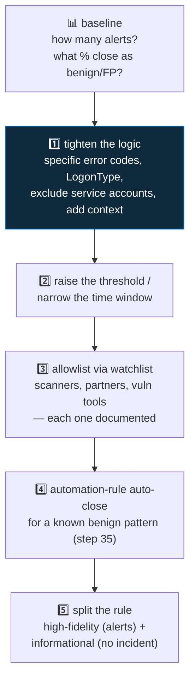

<div align="center">

# 🔍 Step 26 · Tuning a noisy rule

### *Cut a rule from hundreds of alerts a day to a handful — without losing a true positive*

[](../README.md)
[](#)
[](#)

</div>

---

## 🎯 Goal

You take a deliberately over-broad rule, **measure** its false-positive rate from real incident
classifications, cut the noise with a **documented, ordered, reversible** set of changes, and prove
your `DET-IDENTITY-001` brute-force simulation **still fires** at the end. The rule's detection
write-up now has a non-empty **False positives** section.

## 🧠 Why this step

Alert fatigue is the single biggest reason SOCs miss real incidents. When a rule produces 200 alerts
a day and 197 are benign, analysts stop reading it carefully, and the three that mattered get closed
in the same reflexive click as the rest. **Tuning is not a one-time chore — it is a permanent part
of running a detection**, and it has a method that keeps you from over-correcting into blindness:

1. **Baseline** — measure how many alerts, and classify what they actually are.
2. **Categorise the noise** — group the false positives by cause.
3. **Apply the least aggressive fix first** — tighten the logic before you allowlist, allowlist
   before you suppress.
4. **Re-measure after each change** — one change at a time, so you know what helped.
5. **Verify true positives survive** — re-run a known-attack simulation.
6. **Document every exclusion** — *why*, so the next engineer doesn't undo it.

The discipline that matters: **never disable a rule to "tune" it** (that's a coverage gap nobody
remembers to close), **never make one giant change** (you can't tell what worked), and **never
allowlist something that's "probably fine"** (that's the path the real breach walks in on).

## ✅ Prerequisites

- [Step 19](../19-write-a-scheduled-rule/README.md) — `DET-IDENTITY-001` to protect as your
  true-positive canary.
- [Step 24](../24-watchlists/README.md) — watchlists, for the allowlist rung of the ladder.
- [Step 09](../09-microsoft-entra-id/README.md) — `SigninLogs` with a few days of real failures to
  tune against.

## 🧭 Concepts

### The tuning ladder — least aggressive first



Each rung is more aggressive and less transparent than the one above it. Rung 1 changes *what the
rule detects* and is visible in the query. Rung 4 hides alerts that still fire. **Never start
below rung 1** — muffling a rule you don't understand hides real hits.

### Measuring — precision, not just count

The number that matters is **precision**: of the alerts this rule produced, what fraction were worth
an analyst's time? You get it from **incident classifications** — when an analyst closes an incident
they set `Classification` to `TruePositive` / `BenignPositive` / `FalsePositive` / `Undetermined`.
A rule where >50% of closed incidents are `BenignPositive` or `FalsePositive` needs tuning.

### How it works under the hood

- `SecurityIncident` carries `Classification`, `ClassificationReason`, and `ClassificationComment`,
  set when an incident is closed. This is the raw material for FP-rate measurement, and the
  **Analytics efficiency** workbook visualises it.
- **Tighten the logic**: edit the rule's `query`. Fully transparent, fully reversible.
- **Allowlist via watchlist**: `where X !in (_GetWatchlist('Allowlist'))`. Reversible by editing the
  list; auditable via the `Watchlist` table.
- **Automation-rule auto-close** ([step 35](../35-automation-rules-triage/README.md)): the alert
  still fires and lands in `SecurityAlert`, but an automation rule immediately closes the incident
  as `BenignPositive`. Use for a *precisely characterised* benign pattern you still want a record
  of.
- **Split the rule**: one rule with a strict query creates incidents; a second, broader rule
  creates alerts with **incident creation off** — informational signal you can still hunt over
  without queue noise.

### Vocabulary

| Term | Meaning |
|---|---|
| **Precision** | TP / (TP + FP) — the fraction of alerts worth acting on. |
| **False positive** | The rule fired but the activity was not a threat. |
| **Benign positive** | The rule correctly matched the pattern, but the activity was authorised (a pentest, an admin task). |
| **Alert fatigue** | Degraded analyst attention from too many low-value alerts. |
| **`Classification` / `ClassificationReason`** | Fields set when an incident is closed — your tuning data. |
| **Tuning ladder** | The ordered list of noise-reduction techniques, least aggressive first. |

### Where this fits

Tuning consumes the [step 21](../21-alert-and-event-grouping/README.md) grouping,
[step 22](../22-scheduling-lookback-and-coverage-gaps/README.md) scheduling, and
[step 24](../24-watchlists/README.md) watchlists as levers. It hands the auto-close rung to
[step 35](../35-automation-rules-triage/README.md). At scale,
[step 57](../57-soc-optimization-and-coverage/README.md) surfaces which rules need tuning.

### Design rationale

The ladder is ordered by transparency: an engineer reading the rule query should be able to see most
of the tuning. Suppression and auto-close are lower because they hide behaviour — necessary
sometimes, but a place where real detections quietly die if used carelessly.

## 🖱️ Do it — make a noisy rule, then walk the ladder

1. **Create the noisy rule.** `NOISY · Any failed sign-in` — query `SigninLogs | where ResultType
   != 0`, threshold > 0, every 1h, event grouping SingleAlert. Let it run for a day (or use the
   `SigninLogs` history you already have).
2. **Baseline the volume and the FP rate:**

```kusto
// how many alerts
SecurityAlert
| where TimeGenerated > ago(1d) and AlertName has "NOISY"
| summarize Alerts = count()
```

```kusto
// FP rate from any rule's closed incidents (once analysts have classified some)
SecurityIncident
| where TimeGenerated > ago(30d) and Status == "Closed"
| summarize Total = count(), Benign = countif(Classification in ("FalsePositive", "BenignPositive")) by Title
| extend BenignPct = round(100.0 * Benign / Total, 1)
| sort by BenignPct desc
```

3. **Categorise the noise:**

```kusto
SigninLogs
| where TimeGenerated > ago(7d) and ResultType != 0
| summarize Count = count(), Users = dcount(UserPrincipalName), IPs = dcount(IPAddress)
    by ResultType, ResultDescription, AppDisplayName
| sort by Count desc
```

Typical culprits: `50126` (bad password — could be real), `50053` (smart lockout), `50055`
(expired password), `50057` (disabled account), `50058` (session interrupted — usually benign),
`50072`/`50074`/`50076`/`50079` (MFA prompts — benign), `65001`/`90094` (consent flows — benign),
plus one service principal or one app hammering.

4. **Walk the ladder, one change at a time, re-measuring after each:**

```kusto
// Rung 1 + 2 + 3 combined (apply them one at a time in practice)
let benignResults = dynamic([50055, 50057, 50058, 50072, 50074, 50076, 50079, 65001, 90094]);
let allowApps = dynamic(["<a known noisy internal app>"]);
let serviceAccts = _GetWatchlist('ServiceAccounts') | project svc = tolower(UserPrincipalName);
SigninLogs
| where TimeGenerated > ago(1h) and ResultType != 0
| where ResultType !in (benignResults)                       // rung 1: benign error codes
| where AppDisplayName !in (allowApps)                       // rung 1: known-noisy app
| where UserType != "Guest"                                  // rung 1: guests fail differently
| extend upn = tolower(UserPrincipalName)
| where upn !in ((serviceAccts | project svc))               // rung 3: allowlist service accounts
| summarize Failures = count(), Apps = make_set(AppDisplayName), IPs = make_set(IPAddress) by upn, IPAddress
| where Failures >= 8                                        // rung 2: threshold
```

## 🧪 Validate

Keep a tuning table in `LOG.md`:

| # | Change | Alerts/day | TP canary still fires? |
|---|---|--:|:--:|
| 0 | Baseline (any failure) | 214 | n/a |
| 1 | Exclude benign `ResultType`s + noisy app + guests | 96 | ✅ |
| 2 | Threshold ≥ 8 failures in 1h | 17 | ✅ |
| 3 | Allowlist service accounts (watchlist) | 4 | ✅ |
| — | Re-ran `DET-IDENTITY-001` brute-force sim | — | ✅ **incident created** |

**You should see** the alert count drop ~95–98% while the brute-force simulation from
[step 19](../19-write-a-scheduled-rule/README.md) **still produces an incident**. If a change drops
that canary, **back it out** and find a narrower fix. Then update `DET-IDENTITY-001.md` **False
positives** section with each exclusion and its reason.

## 🚩 Common mistakes

| 🚩 Mistake | Why it bites |
|---|---|
| Disabling the rule "temporarily" to stop the noise | Coverage gap nobody remembers to close |
| One giant change | You can't tell which part helped or which broke a true positive |
| Starting at rung 4 (suppression) | You've hidden a rule you never understood — real hits vanish with the noise |
| Allowlisting an IP because it's "probably fine" | The real intrusion often comes from "probably fine" infrastructure |
| No comment on each exclusion | The next engineer removes it and the noise returns |
| Not re-testing the true positive | You tuned the rule into silence and didn't notice |
| Tuning by alert count alone, ignoring classifications | Count can drop while precision stays terrible |
| Excluding a whole `AppDisplayName` when one *account* is the problem | Over-broad — you blind the rule to that app entirely |

## 🩺 Troubleshooting

| Symptom | Likely cause | Fix |
|---|---|---|
| FP-rate query returns nothing | Analysts haven't *classified* closed incidents (just closed them) | Make classification part of the close workflow ([step 35](../35-automation-rules-triage/README.md) can add a task) |
| Alert count dropped but analysts still complain | Precision still low — you cut volume, not noise ratio | Re-categorise the *remaining* alerts; tune those causes |
| A tuning change dropped the TP canary | The exclusion was too broad (e.g. excluded the victim's app, or the attack IP's `ResultType`) | Narrow it — exclude the specific benign combination, not a whole dimension |
| `_GetWatchlist('ServiceAccounts')` errors | Watchlist doesn't exist | Create it ([step 24](../24-watchlists/README.md)) or inline a `dynamic([...])` list temporarily |
| Rule still noisy after excluding `50126` | `50126` (bad password) *is* the signal for password spray — you excluded the threat | Keep `50126`; the fix is the threshold + per-IP-per-account grouping, not exclusion |
| Auto-close rule (rung 4) also closes real incidents | The "benign pattern" condition is too loose | Tighten the automation rule's condition; it must be a *precise* match |
| Split-rule informational alerts flood a workbook | Expected — they have no incident; query them, don't watch them | Point the workbook at `SecurityAlert` filtered to the informational rule |

## 🎓 Deepen your understanding

1. `50126` is "invalid password". It's noise from fat-fingering users **and** the core signal of password spray. How do you keep the detection while removing the noise? (Hint: it's not exclusion — it's aggregation shape.)
2. Compute your `NOISY` rule's precision before and after tuning using real classifications. Did precision improve, or did you just move the same ratio to a lower volume?
3. You allowlist a vuln scanner's IP. Two weeks later that IP is reassigned to a new host by the cloud provider. What's your exposure, and how would you make the allowlist safer (expiry, tighter key)?
4. Rung 5 (split the rule) gives you an "informational" stream with no incidents. When is that better than just deleting the noisy matches? What do you gain?
5. Take one Microsoft **template** rule you enabled in [step 18](../18-enable-a-rule-from-template/README.md). Walk the ladder on it. How much of the tuning is "edit the query" vs "add an automation rule"?

## 🗒️ Log your run

`LOG.md` with the full tuning table (change → alerts/day → TP-canary), the final KQL in
`artifacts/`, and the FP-rate before/after. Update `DET-IDENTITY-001.md` (and the `NOISY` rule's
write-up) **False positives** section — one line per exclusion with its reason.

## 📚 Microsoft Learn

- [Handle false positives in Microsoft Sentinel](https://learn.microsoft.com/en-us/azure/sentinel/false-positives)
- [Manage and fine-tune analytics rules](https://learn.microsoft.com/en-us/azure/sentinel/detect-threats-custom)
- [Classify and analyze incidents (classifications)](https://learn.microsoft.com/en-us/azure/sentinel/incident-investigation)
- [Microsoft Entra authentication and sign-in error codes](https://learn.microsoft.com/en-us/entra/identity-platform/reference-error-codes)
- [Use the Analytics efficiency workbook](https://learn.microsoft.com/en-us/azure/sentinel/detect-threats-built-in)

---

<div align="center">
<sub>

[⬅ Prev: 25 · MITRE ATT&CK coverage](../25-mitre-attack-coverage/README.md) &nbsp;·&nbsp; [🦅 All steps](../README.md) &nbsp;·&nbsp; [Next: 27 · Rule health monitoring ➡](../27-rule-health-monitoring/README.md)

</sub>
</div>
