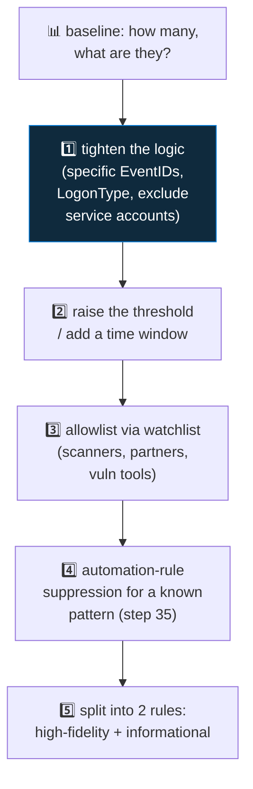

<div align="center">

# 🔍 Step 26 · Tuning a noisy rule

### *Take a rule from 200 alerts a day to 3 — without going blind*

[](../README.md)
[](#)
[](#)

</div>

---

## 🎯 Goal

You take a deliberately over-broad rule, measure its false-positive rate, and cut the noise with a
documented, reversible set of changes — keeping true positives.

## 🧠 Why this step

Alert fatigue is the number-one reason SOCs miss real incidents. Tuning is a permanent part of
detection engineering, and it has a method: baseline, categorise the noise, apply the least
aggressive fix, re-measure.

## ✅ Prerequisites

- [Step 19](../19-write-a-scheduled-rule/README.md), [24](../24-watchlists/README.md)

## 🧭 The tuning ladder — least aggressive first



Never start at step 4. Muffling a rule you didn't understand hides real hits.

## 🖱️ Do it — create the noisy rule, then fix it

1. **Create** `NOISY · Any failed sign-in` — query: `SigninLogs | where ResultType != 0`, threshold
   > 0, every 1h. Let it run a day (or replay history).
2. **Baseline:**

```kusto
SecurityAlert
| where TimeGenerated > ago(1d) and AlertName == "NOISY Any failed sign-in"
| count
```

3. **Categorise the noise:**

```kusto
SigninLogs
| where TimeGenerated > ago(7d) and ResultType != 0
| summarize Count = count() by ResultType, ResultDescription, AppDisplayName
| sort by Count desc
```

You'll see things like `50126` (bad password — real-ish), `50053` (locked), `50058` (interrupted —
often benign), `65001`/`50076` (MFA/consent flows — usually benign), plus a service principal
hammering an app.

4. **Apply fixes, one at a time, re-measuring after each:**

```kusto
let benignResults = dynamic([50058, 50072, 50074, 65001, 50076, 50079, 50144]);
let vips = _GetWatchlist('VIPUsers') | project UserPrincipalName = tolower(UserPrincipalName);
SigninLogs
| where TimeGenerated > ago(1h) and ResultType != 0
| where ResultType !in (benignResults)
| where UserType != "Guest"
| where AppDisplayName !in ("My known noisy app")
| summarize Failures = count(), Apps = make_set(AppDisplayName) by UserPrincipalName = tolower(UserPrincipalName), IPAddress
| where Failures >= 8
| join kind=leftouter vips on UserPrincipalName
| extend Severity = iff(isnotempty(UserPrincipalName1), "High", "Medium")
```

## 🧪 Validate

Track the numbers in a small table in `LOG.md`:

| Change | Alerts/day | True positives kept? |
|---|---|---|
| Baseline (any failure) | e.g. 214 | n/a |
| Exclude benign ResultTypes | e.g. 96 | yes |
| Threshold ≥ 8 in 1h | e.g. 11 | yes |
| Exclude one noisy app + guests | e.g. 3 | yes (re-ran step-19 attack → still fires) |

**You should see** the count fall by ~98% while your step-19 brute-force simulation *still*
produces an incident. If a change drops a true positive, back it out.

## 🚩 Common mistakes

| 🚩 Mistake | Why it bites |
|---|---|
| Disabling the rule "temporarily" | Coverage gap nobody remembers to close |
| One giant change | You can't tell which part helped or broke a TP |
| Allowlisting an IP that's "probably fine" | That's how the real breach walks in |
| No record of *why* each exclusion exists | The next engineer re-adds the noise |

## 🗒️ Log your run

`LOG.md` with the tuning table + the final KQL in `artifacts/`. Update the rule's
`DET-*` file's **False positives** section — it should no longer be empty.

## 📚 Microsoft Learn

- [Handle false positives in Microsoft Sentinel](https://learn.microsoft.com/en-us/azure/sentinel/false-positives)
- [Manage and fine-tune analytics rules](https://learn.microsoft.com/en-us/azure/sentinel/detect-threats-custom)
- [Entra sign-in error codes reference](https://learn.microsoft.com/en-us/entra/identity-platform/reference-error-codes)

---

<div align="center">
<sub>

[⬅ Prev: 25 · MITRE ATT&CK coverage](../25-mitre-attack-coverage/README.md) &nbsp;·&nbsp; [🦅 All steps](../README.md) &nbsp;·&nbsp; [Next: 27 · Rule health monitoring ➡](../27-rule-health-monitoring/README.md)

</sub>
</div>
