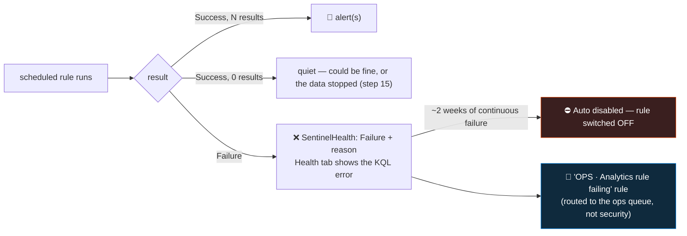

<div align="center">

# 🔍 Step 27 · Rule health monitoring

### *Catch the detection that silently stopped — before the quiet queue fools you*

[](../README.md)
[](#)
[-107C10?style=flat-square)](#)

</div>

---

## 🎯 Goal

You can see any rule's run history and last-run status, you've **broken a rule on purpose and
detected the failure** via `SentinelHealth`, you have an `OPS · Analytics rule failing` alert routed
**away** from the security queue, and you've watched the full loop: break → detected → fixed →
healthy.

## 🧠 Why this step

A scheduled rule can **fail every single run** and nothing visible happens. A column got renamed
upstream; the rule's table was moved to the Basic plan and scheduled rules can't query it
([step 16](../16-retention-archive-and-data-lake/README.md)); a watchlist the query `_GetWatchlist`s
was deleted; the query started timing out; a KQL function the rule depends on changed. In every
case the rule executes, errors, produces no alert, and the incident queue simply goes quiet.

A quiet queue is **ambiguous**. It could mean a genuinely calm week — or it could mean your
brute-force detection has been throwing "column not found" for nine days and an actual
brute-force attack sailed straight through. You cannot tell the two apart by looking at the queue,
which is exactly why you need to **monitor the rules themselves**.

There's a second failure mode: **auto-disable**. Sentinel automatically turns off a scheduled rule
that has failed continuously for about **two weeks**. So the worst case isn't "the rule is erroring"
— it's "Sentinel silently switched your detection off and you never got a notification".

This is the same discipline as [step 15](../15-ingestion-health-and-validation/README.md) (data
stopped) applied one layer up (the rule stopped) — and both are needed: step 15 tells you the *data*
didn't arrive, this step tells you the *rule* didn't run.

## ✅ Prerequisites

- [Step 15](../15-ingestion-health-and-validation/README.md) — **`SentinelHealth` enabled**
  (Settings → Auditing and health monitoring). Without it there is no rule-failure signal at all.
- Several active rules ([steps 18](../18-enable-a-rule-from-template/README.md),
  [19](../19-write-a-scheduled-rule/README.md), [23](../23-nrt-rules/README.md)).
- [Step 05](../05-rbac-and-roles/README.md) — Sentinel Contributor (to build the ops rule).

## 🧭 Concepts



### Where rule health lives

| Signal | Where |
|---|---|
| One rule's last run + history | **Analytics → the rule → Health** tab; the **Health** column in Active rules |
| All rules, all runs | `SentinelHealth` where `SentinelResourceType` contains `Analytics` |
| The actual failure reason (KQL error) | `SentinelHealth` `Description` / `ExtendedProperties.Reason` |
| Auto-disabled rules | **Active rules** — an "Auto disabled" indicator on the rule |
| *Who* changed the rule (to correlate with "it started failing") | `SentinelAudit` |

### How it works under the hood

- Every scheduled/NRT rule execution emits a `SentinelHealth` record with `OperationName`
  (e.g. *"Scheduled analytics rule run"*), `Status` (`Success` / `Failure` / `Partial`),
  `Description`, and `ExtendedProperties` carrying the `Reason` — for a bad query, the literal Kusto
  error string.
- **Auto-disable**: after ~14 days of continuous failure, Sentinel disables the rule. The trigger
  and exact window can change — treat it as "keep failing long enough and it turns off". Re-enabling
  is one click *after* you fix the cause.
- Common failure causes: a **renamed / removed column** (schema drift upstream); the rule's **table
  moved to Basic/Auxiliary** (scheduled rules can't run there); a **deleted watchlist** the query
  references; a **changed KQL function**; the query **exceeding resource/time limits** on every run;
  a **cross-workspace** target that went away.
- A rule can also fail **`Partial`** — some data was queried but the run hit a limit. Treat partial
  as a warning: the rule may be missing results.

### Vocabulary

| Term | Meaning |
|---|---|
| **Rule health** | Whether the rule *executed successfully* — distinct from whether it *found anything*. |
| **`SentinelHealth`** | The table recording rule / connector / automation / playbook run outcomes. Opt-in. |
| **Auto-disable** | Sentinel switching off a rule that has failed continuously for ~2 weeks. |
| **Partial run** | A run that hit a limit and may have incomplete results. |
| **Schema drift** | An upstream change (renamed column, new table version) that breaks a query built on the old shape. |
| **`SentinelAudit`** | The audit of *configuration changes* — who edited a rule and when. |

### Where this fits

Completes the SIEM-rules phase's operational side, alongside
[step 15](../15-ingestion-health-and-validation/README.md) (data health) and
[step 26](../26-tuning-a-noisy-rule/README.md) (precision). The same pattern extends to
[step 39](../39-monitoring-playbook-runs-and-cost/README.md) (playbook health). At scale,
[step 57](../57-soc-optimization-and-coverage/README.md) surfaces unhealthy rules.

### Design rationale

`SentinelHealth` is opt-in because it is itself billable ingestion. Auto-disable exists so a
permanently-broken rule doesn't burn query cost forever — but the lack of a loud notification on
auto-disable is exactly why you build your own alert here.

## 🖱️ Do it — break one, then find it

1. **Break `DET-IDENTITY-001`.** Analytics → the rule → Edit → Set rule logic → change
   `TargetUserName` to `TargetUserNameXYZ` (a column that doesn't exist) in the `project`. Save.
2. Wait for **two run cycles** (~2 hours at hourly frequency).
3. **Analytics → Active rules** — the **Health** column shows **Failure** for that rule.
4. Open the rule → **Health** tab → read the error:
   `"'TargetUserNameXYZ' could not be resolved to a column or scalar expression"`.
5. Fix the column name back. Confirm the **next** run shows **Success**.

## 💻 Do it — query and build the ops alert

```kusto
// every analytics-rule failure in the last 7 days, with the actual reason
SentinelHealth
| where TimeGenerated > ago(7d)
| where SentinelResourceType has "Analytics"
| where Status != "Success"
| project TimeGenerated, RuleName = SentinelResourceName, Status,
          Reason = coalesce(tostring(ExtendedProperties.Reason), Description)
| sort by TimeGenerated desc
```

```kusto
// rules that have not had a SUCCESSFUL run recently (catches "failing" and "not running at all")
SentinelHealth
| where TimeGenerated > ago(2d) and SentinelResourceType has "Analytics"
| summarize LastSuccess = maxif(TimeGenerated, Status == "Success"),
            LastRun = max(TimeGenerated),
            RecentFailures = countif(Status == "Failure")
    by RuleName = SentinelResourceName
| where isnull(LastSuccess) or LastSuccess < ago(6h)
| extend Reason = strcat(RuleName, ": last success ",
                         iff(isnull(LastSuccess), "never (in window)", tostring(LastSuccess)))
```

```kusto
// correlate a failure start with a config change
SentinelAudit
| where TimeGenerated > ago(7d)
| where SentinelResourceType has "Analytics"
| project TimeGenerated, Who = tostring(ExtendedProperties.CallerName),
          What = OperationName, RuleName = SentinelResourceName
| sort by TimeGenerated desc
```

**Build `OPS · Analytics rule failing`:** a **scheduled** rule on the first query — every **1 hour**,
lookback **4 hours**, threshold **> 0**, severity **Medium**. Map a custom detail `RuleName`. In
**Automated response** attach (or plan) an automation rule that tags it `ops-health` and assigns it
to an **ops** group — **not** the security analyst queue ([step 35](../35-automation-rules-triage/README.md)).

## 🧪 Validate

Re-break `DET-IDENTITY-001`, and confirm the loop:

| Stage | Expected |
|---|---|
| Break it | **Health** column → **Failure** within ~2 cycles |
| `SentinelHealth` query | returns the failure with the readable Kusto error as `Reason` |
| `OPS · Analytics rule failing` | raises an incident, `RuleName` custom detail = `DET-IDENTITY-001` |
| Routing | the ops incident is tagged `ops-health` / assigned to ops, **not** in the security queue |
| Fix it | next run **Success**; the ops incident can be closed and **does not reopen** |

**You should see** the full loop: break → detected by *your* rule (not by luck) → fixed → healthy.
That closed loop is the deliverable.

Also confirm you can spot **auto-disable**: in the ops rule's KQL, `isnull(LastSuccess)` for a
rule that's been failing for weeks catches a rule Sentinel already switched off.

## 🚩 Common mistakes

| 🚩 Mistake | Why it bites |
|---|---|
| "No incidents = all good" | A quiet queue can mean every rule is failing |
| `SentinelHealth` not enabled | Zero failure signal — you find out during an investigation |
| Ops-health incidents in the security queue | Analysts triage noise instead of threats |
| Ignoring the "Auto disabled" indicator | Sentinel turned your detection off with no loud alert |
| Alerting only on `Failure`, not on "no success recently" | Misses a rule that stopped *running* entirely |
| Not correlating with `SentinelAudit` | You spend an hour on a failure someone caused by editing the rule 10 minutes earlier |
| Treating `Partial` runs as fine | The rule may be silently missing results under a limit |

## 🩺 Troubleshooting

| Symptom | Likely cause | Fix |
|---|---|---|
| `SentinelHealth` empty | Health monitoring not enabled, or too soon after enabling | Settings → Auditing and health monitoring → Enable; wait ~15 min |
| `SentinelResourceType == "Analytics Rule"` returns nothing but `has "Analytics"` does | Exact string casing differs by version | Use `has "Analytics"` (done in the queries above) |
| Health tab shows Failure but no reason | Some errors land only in `ExtendedProperties`, not `Description` | `coalesce(tostring(ExtendedProperties.Reason), Description)` |
| Rule shows **Auto disabled** | ~2 weeks of continuous failure | Fix the query error first, *then* re-enable — re-enabling a still-broken rule just fails again |
| Ops rule fires for a rule that's actually fine | The rule genuinely didn't run in the window (frequency > lookback of the ops rule) | Widen the ops rule's lookback, or exclude rules whose frequency exceeds it |
| Failure started with no config change in `SentinelAudit` | Schema drift (upstream column rename), watchlist deleted, table re-tiered | Check the table's current schema; check the watchlist exists; check the table plan ([step 16](../16-retention-archive-and-data-lake/README.md)) |
| NRT rule failures don't show | `SentinelResourceType` / operation names differ for NRT | Broaden the filter to `SentinelResourceType has "rule"` and inspect |

## 🎓 Deepen your understanding

1. Break `DET-IDENTITY-001` three ways — bad column, delete the `VIPUsers` watchlist it joins, move `SigninLogs` to Basic tier (don't actually — reason it through). What does each failure's `Reason` string look like, and which is hardest to diagnose?
2. Your ops rule alerts on failures. Should it *also* alert on **`Partial`** runs? What's the risk of a partial run you don't know about?
3. Auto-disable fires after ~14 days. Design a *tighter* early-warning: alert after N consecutive failures, or after M hours with no success. What N / M would you pick for a High-severity detection vs a Low one?
4. A rule failed for 3 days, then someone fixed it. During those 3 days, was Sentinel evaluating that rule's window retroactively when it recovered? (It wasn't.) What does that mean for the coverage gap, and would you run a manual [search job](../16-retention-archive-and-data-lake/README.md) over the gap?
5. Should the `OPS · Analytics rule failing` incident go to a human, or straight to a playbook that re-runs the rule / pings the on-call engineer? Sketch the automation.

## 🗒️ Log your run

Copy [`_templates/STEP-LOG-TEMPLATE.md`](../_templates/STEP-LOG-TEMPLATE.md) into this folder as
`LOG.md`. Record: the failure `Reason` text you got, evidence the `OPS · Analytics rule failing`
rule fired (incident number, `RuleName`), the routing (tag / assignment away from the security
queue), and the recovered **Success** run.

## 📚 Microsoft Learn

- [Monitor the health of your analytics rules](https://learn.microsoft.com/en-us/azure/sentinel/monitor-analytics-rule-integrity)
- [Auditing and health monitoring in Microsoft Sentinel](https://learn.microsoft.com/en-us/azure/sentinel/health-audit)
- [Issues with scheduled rules and auto-disable](https://learn.microsoft.com/en-us/azure/sentinel/detect-threats-custom)
- [SentinelHealth table reference](https://learn.microsoft.com/en-us/azure/azure-monitor/reference/tables/sentinelhealth)
- [SentinelAudit table reference](https://learn.microsoft.com/en-us/azure/azure-monitor/reference/tables/sentinelaudit)

---

<div align="center">
<sub>

[⬅ Prev: 26 · Tuning a noisy rule](../26-tuning-a-noisy-rule/README.md) &nbsp;·&nbsp; [🦅 All steps](../README.md) &nbsp;·&nbsp; [Next: 28 · Analytics rules as code ➡](../28-analytics-rules-as-code/README.md)

</sub>
</div>
