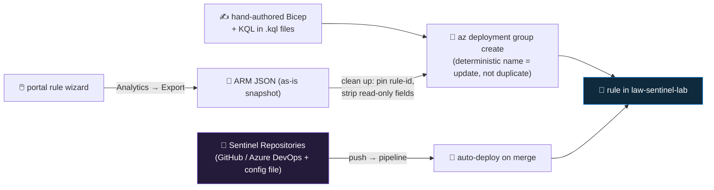

<div align="center">

# 🔍 Step 28 · Analytics rules as code

### *Export, version, review and redeploy detections — a rule that lives only in the portal is fragile*

[](../README.md)
[](#)
[](#)

</div>

---

## 🎯 Goal

Your custom rules (`DET-IDENTITY-001`, the NRT privileged-role rule, the ops-health rules) are
**exported as ARM/Bicep in `artifacts/rules/`**, you have **deleted one and redeployed it
identically from code**, and you understand the two supported paths — hand-authored ARM/Bicep, and
the Sentinel **Repositories** feature (full CI/CD is [step 55](../55-repositories-cicd/README.md)).

## 🧠 Why this step

A detection that exists only as portal clicks has four problems:

- **Not reviewable** — nobody can PR-review "I changed the threshold from 8 to 12" before it goes
  live.
- **Not recoverable** — if someone deletes the rule (or a whole workspace), the logic is gone.
  [Step 27](../27-rule-health-monitoring/README.md)'s auto-disable, a fat-fingered "delete all",
  a tenant migration — any of these and your tuned detections evaporate.
- **Not replicable** — you can't stamp the same 40 detections onto a second workspace, or a
  customer's workspace ([step 54](../54-multi-tenant-and-lighthouse/README.md)).
- **No history** — "why is this rule the way it is?" has no answer beyond tribal memory.

Analytics rules are just `Microsoft.SecurityInsights/alertRules` ARM resources. Treating them like
code — a `.bicep` or `.json` file per rule, the KQL in its own `.kql` file, in Git, deployed by a
pipeline — fixes all four. This step is the single-rule version; [step 55](../55-repositories-cicd/README.md)
does the whole content set (rules + hunts + automation + playbooks + workbooks) through the
Repositories feature.

What people get wrong: they export the portal ARM and commit it **with the `newGuid()` default on
the rule-id parameter**, so every deploy creates a *new* rule instead of updating the existing one;
they inline the KQL with a wall of escaped quotes; or they edit rules in the portal *and* in code
and the two drift.

## ✅ Prerequisites

- [Steps 19–27](../19-write-a-scheduled-rule/README.md) — you have custom, tuned rules worth
  preserving.
- `git`, the Azure CLI, and (optional but recommended) the **Bicep CLI** (`az bicep install`).
- **Contributor** on `rg-sentinel-lab` (deployments write to the workspace).

## 🧭 Concepts



| Path | Best for | Notes |
|---|---|---|
| **Export from portal** → ARM JSON | Snapshotting what already exists | **Analytics → Export** (one rule or all). Pin the rule-id parameter afterwards. |
| **Hand-authored ARM / Bicep** | New rules, clean diffs, PR review | `kind` selects the type; `properties` mirror the wizard; `loadTextContent()` the KQL |
| **`az sentinel alert-rule create/update`** | Quick scripting, loops | Fine for automation; ARM/Bicep captures more fields more reliably |
| **Sentinel Repositories** | Team CI/CD, whole content set | Connect a repo, add `sentinel-deployment.config`, push → pipeline deploys ([step 55](../55-repositories-cicd/README.md)) |

### How it works under the hood

- A rule is `Microsoft.SecurityInsights/alertRules@<api-version>`, a child resource of the
  workspace. Its `name` is a **GUID**. Deploying with the **same GUID** does an in-place update
  (idempotent); a **different GUID** creates a second rule.
- In Bicep, `name: guid('DET-IDENTITY-001')` makes the GUID deterministic from the string — so the
  file is the source of truth and redeploys always target the same rule.
- The portal's exported ARM template has a parameter like `analyticsRuleId` **defaulted to
  `[newGuid()]`** — you must **override it with a fixed value** or set the default, or every deploy
  spawns a duplicate.
- **Read-only fields** in an export (`lastModifiedUtc`, `id`, `etag`) should be removed before
  redeploy — the API rejects or ignores them.
- `az deployment group what-if` previews the change before you apply it — use it.
- Hunting queries deploy as `savedSearches` (category *Hunting Queries*), automation rules as
  `automationRules`, playbooks as `Microsoft.Logic/workflows` — same idea, different resource type
  ([step 38](../38-playbooks-as-code/README.md), [step 55](../55-repositories-cicd/README.md)).

### Vocabulary

| Term | Meaning |
|---|---|
| **Rule as code** | A rule defined in a version-controlled `.bicep` / `.json` file, deployed by tooling. |
| **Deterministic name** | A GUID derived from a stable string (`guid('...')`) so redeploy = update. |
| **`loadTextContent()`** | Bicep function that embeds a file's contents (the `.kql`) at compile time. |
| **`what-if`** | An ARM deployment mode that shows the diff without applying it. |
| **Sentinel Repositories** | The built-in feature that connects a Git repo and auto-deploys Sentinel content. |
| **Drift** | Divergence between the deployed rule and its code because someone edited the portal. |

### Where this fits

This makes the SIEM-rules phase's output durable and reviewable. [Step 38](../38-playbooks-as-code/README.md)
does the same for playbooks; [step 55](../55-repositories-cicd/README.md) wires the whole
content set into a Git-driven pipeline; [step 54](../54-multi-tenant-and-lighthouse/README.md)
stamps the same rules across tenants.

### Design rationale

Everything in Sentinel is ARM, deliberately — so the same deployment, RBAC, and policy tooling that
manages the rest of Azure manages your detections. The portal is a convenient editor; it is not
meant to be the system of record for a mature SOC.

## 🖱️ Do it — export

1. **Analytics → Active rules** → tick your custom rules → **Export** (bottom bar) → save the ARM
   JSON. Or use **Export** at the top to grab **all** rules at once.
2. Put them in `artifacts/rules/`. Open one: find the `analyticsRuleId` parameter and note its
   `newGuid()` default — you'll pin that.

## 💻 Do it — a clean Bicep per rule

`artifacts/rules/det-identity-001.bicep`:

```bicep
targetScope = 'resourceGroup'
param workspaceName string
// deterministic GUID from the rule's stable name → redeploy updates, never duplicates
param ruleGuid string = guid('DET-IDENTITY-001')

resource ws 'Microsoft.OperationalInsights/workspaces@2023-09-01' existing = { name: workspaceName }

resource rule 'Microsoft.SecurityInsights/alertRules@2024-09-01' = {
  scope: ws
  name: ruleGuid
  kind: 'Scheduled'
  properties: {
    displayName: 'DET-IDENTITY-001 Brute force followed by success'
    description: '>=10 failed Windows logons then >=1 success, same IP + account + host, within 1h.'
    enabled: true
    severity: 'Medium'
    query: loadTextContent('../brute-force-then-success.kql')   // KQL in its own file
    queryFrequency: 'PT1H'
    queryPeriod: 'PT1H10M'
    triggerOperator: 'GreaterThan'
    triggerThreshold: 0
    suppressionEnabled: true
    suppressionDuration: 'PT1H'
    tactics: [ 'CredentialAccess' ]
    techniques: [ 'T1110' ]
    eventGroupingSettings: { aggregationKind: 'SingleAlert' }
    entityMappings: [
      { entityType: 'Account', fieldMappings: [ { identifier: 'Name', columnName: 'TargetUserName' }, { identifier: 'Sid', columnName: 'TargetUserSid' } ] }
      { entityType: 'IP',   fieldMappings: [ { identifier: 'Address',  columnName: 'IpAddress' } ] }
      { entityType: 'Host', fieldMappings: [ { identifier: 'HostName', columnName: 'Computer' } ] }
    ]
    customDetails: { FailCount: 'FailCount', FirstFailure: 'FirstFail' }
    incidentConfiguration: {
      createIncident: true
      groupingConfiguration: { enabled: true, reopenClosedIncident: false, lookbackDuration: 'PT5H', matchingMethod: 'Selected', groupByEntities: [ 'IP' ] }
    }
  }
}
```

Preview, then deploy:

```bash
az deployment group what-if -g rg-sentinel-lab \
  --template-file artifacts/rules/det-identity-001.bicep \
  --parameters workspaceName=law-sentinel-lab

az deployment group create -g rg-sentinel-lab \
  --template-file artifacts/rules/det-identity-001.bicep \
  --parameters workspaceName=law-sentinel-lab
```

<details><summary>Deploy a whole folder of rules with a Bicep loop</summary>

```bicep
param workspaceName string
var ruleFiles = [ 'det-identity-001', 'nrt-privileged-role', 'ops-source-quiet' ]

module rules 'single-rule.bicep' = [for f in ruleFiles: {
  name: 'deploy-${f}'
  params: { workspaceName: workspaceName, ruleName: f }
}]
```
</details>

## 🧪 Validate — delete it, bring it back from code

```bash
RULE_ID=$(az sentinel alert-rule list -g rg-sentinel-lab --workspace-name law-sentinel-lab \
  --query "[?contains(displayName,'DET-IDENTITY-001')].name" -o tsv)

# 1. record the current shape
az sentinel alert-rule show -g rg-sentinel-lab --workspace-name law-sentinel-lab --rule-id "$RULE_ID" \
  --query "{name:displayName, freq:queryFrequency, period:queryPeriod, sev:severity, tactics:tactics, entities:length(entityMappings)}" -o json | tee /tmp/before.json

# 2. delete it in the portal (Analytics → the rule → Delete), then redeploy from Bicep (above)

# 3. confirm it's identical
az sentinel alert-rule show -g rg-sentinel-lab --workspace-name law-sentinel-lab \
  --rule-id "$(az sentinel alert-rule list -g rg-sentinel-lab --workspace-name law-sentinel-lab --query "[?contains(displayName,'DET-IDENTITY-001')].name" -o tsv)" \
  --query "{name:displayName, freq:queryFrequency, period:queryPeriod, sev:severity, tactics:tactics, entities:length(entityMappings)}" -o json
```

| Check | Healthy | Unhealthy |
|---|---|---|
| Redeployed rule vs `/tmp/before.json` | identical `freq`, `period`, `sev`, `tactics`, entity count | differs → a `properties` field is missing from the Bicep |
| Rule count for "DET-IDENTITY-001" | **1** | 2 → the GUID wasn't deterministic (a `newGuid()` slipped in) |
| `what-if` before deploy | shows "Modify" (or "Create" first time), not a surprise delete | "Delete" of something → wrong scope/name |

**You should see** the rule vanish and come back byte-for-byte from the file. Commit
`artifacts/rules/` and the `.kql` files — `git log` is now your detection change history.

## 🚩 Common mistakes

| 🚩 Mistake | Why it bites |
|---|---|
| Committing the portal export with `newGuid()` still the default | Every deploy creates a duplicate rule |
| Inlining the KQL with escaped quotes | Unreadable diffs, easy to break — `loadTextContent()` a `.kql` file |
| Leaving `lastModifiedUtc` / `id` / `etag` in the template | API rejects or ignores; noisy diffs |
| Editing rules in the portal **and** in code | Drift — the deployed rule no longer matches the file |
| No `what-if` before deploy | A wrong scope can delete rules you didn't mean to touch |
| Pinning an old `api-version` forever | Newer rule features (dynamic properties, sub-techniques) won't serialise |
| One giant template for all rules | A syntax error blocks the whole deploy — one file per rule + a loop |

## 🩺 Troubleshooting

| Symptom | Likely cause | Fix |
|---|---|---|
| Deploy creates a second rule instead of updating | Rule `name` (GUID) not deterministic | `name: guid('<stable string>')`; pin the export's `analyticsRuleId` param |
| Deploy fails: *"InvalidAnalyticsRule"* / property error | A required field missing for that `kind`, or a stale api-version | Compare to the [alertRules ARM reference](https://learn.microsoft.com/en-us/azure/templates/microsoft.securityinsights/alertrules) for the `kind`; bump api-version |
| `loadTextContent` fails at build | Path wrong, or file has a BOM / bad encoding | Relative to the `.bicep` file; save the `.kql` as UTF-8 no BOM |
| Redeployed rule missing entity mappings | `entityMappings` omitted or malformed in the Bicep | Copy the shape from `az sentinel alert-rule show` of the working rule |
| `what-if` shows changes you didn't make | Portal drift — someone edited the live rule | Reconcile: update the file to match, or redeploy to overwrite the drift |
| NRT rule Bicep fails on `queryFrequency` | NRT has no `queryFrequency`/`queryPeriod` | Remove those fields for `kind: 'NRT'` |
| Deployment "succeeds" but the rule didn't change | Same content, so it's a no-op — or you deployed to the wrong workspace | Check `--parameters workspaceName=`; check the deployment's target RG |

## 🎓 Deepen your understanding

1. Export a rule, then hand-author the same rule as Bicep. Diff the two. What did the portal export include that you'd never write by hand? What did you write more cleanly?
2. Change the threshold in the `.kql` file, commit, redeploy. Now change it in the portal. Run `what-if`. What does drift look like, and how would a CI pipeline catch it?
3. You have 40 rules. Sketch the folder structure and the deploy loop. Where does the KQL live? Where do per-environment differences (dev threshold vs prod threshold) go?
4. `guid('DET-IDENTITY-001')` is deterministic *per string*. What happens if you rename the rule's stable string? How do you rename a rule without orphaning the old one?
5. Sentinel **Repositories** vs your own `az deployment` pipeline — what does Repositories give you for free, and when would you outgrow it? (Full comparison in [step 55](../55-repositories-cicd/README.md).)

## 🗒️ Log your run

Copy [`_templates/STEP-LOG-TEMPLATE.md`](../_templates/STEP-LOG-TEMPLATE.md) into this folder as
`LOG.md`. Record: the delete-and-redeploy proof (`before.json` vs after), the rule count staying at
1, and the `what-if` output. Commit `artifacts/rules/*.bicep` and the `.kql` files.

## 📚 Microsoft Learn

- [Export and import analytics rules in Microsoft Sentinel](https://learn.microsoft.com/en-us/azure/sentinel/import-export-analytics-rules)
- [Microsoft.SecurityInsights/alertRules ARM template reference](https://learn.microsoft.com/en-us/azure/templates/microsoft.securityinsights/alertrules)
- [Deploy custom content from your repository (CI/CD)](https://learn.microsoft.com/en-us/azure/sentinel/ci-cd)
- [Bicep loadTextContent function](https://learn.microsoft.com/en-us/azure/azure-resource-manager/bicep/bicep-functions-files)
- [ARM deployment what-if](https://learn.microsoft.com/en-us/azure/azure-resource-manager/templates/deploy-what-if)

---

<div align="center">
<sub>

[⬅ Prev: 27 · Rule health monitoring](../27-rule-health-monitoring/README.md) &nbsp;·&nbsp; [🦅 All steps](../README.md) &nbsp;·&nbsp; [Next: 29 · Automation rules vs playbooks ➡](../29-automation-rules-vs-playbooks/README.md)

</sub>
</div>
