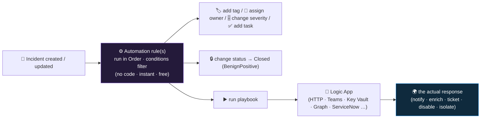

<div align="center">

# 🔄 Step 29 · Automation rules vs playbooks

### *The two halves of Sentinel SOAR — the router and the worker — and how they fit*

[](../README.md)
[](#)
[](#)

</div>

---

## 🎯 Goal

You can state precisely what an **automation rule** does, what a **playbook** does, how they chain,
and — given any automation need — pick the right tool without building the wrong thing first. You've
walked both blades and written the decision quiz answers with reasoning.

## 🧠 Why this step

"Automation" in Sentinel is two distinct things that people constantly conflate, and building the
wrong one wastes hours:

- An **automation rule** is a **no-code rules engine inside Sentinel**. Trigger (incident
  created/updated, or alert created) → conditions (any incident/entity property) → actions (assign,
  re-severity, tag, close, add a task, **run a playbook**). It runs in the Sentinel service —
  **instant and free**. It is the **router / triage layer**.
- A **playbook** is an **Azure Logic App** with a Sentinel trigger. It does the actual *work* —
  call an API, post to Teams, open a ServiceNow ticket, look up IP reputation, disable a user,
  isolate a device. It runs as a Logic App — **seconds of latency, a fraction of a cent per
  action**. It is the **action layer**.

The relationship: an automation rule **decides which playbook runs on which incident, and in what
order**; the playbook **performs the response**. You'll rarely build one without the other.

What people get wrong: they build a **playbook** to change an incident's severity or assign it (an
automation rule does that free, instantly); they **attach one playbook directly to 20 analytics
rules** (unmanageable — do it once via an automation rule with conditions); they ignore automation
rule **Order** and a broad "auto-close benign" rule ordered first swallows real incidents; or they
forget an automation rule also fires on incident **updates** and build an infinite loop (a playbook
updates the incident → the rule re-triggers → …).

## ✅ Prerequisites

- [Step 18](../18-enable-a-rule-from-template/README.md) / [19](../19-write-a-scheduled-rule/README.md)
  — you have incidents for automation to act on.
- [Step 05](../05-rbac-and-roles/README.md) — the **Playbook permissions** grant (Sentinel service
  principal → Automation Contributor on the playbook RG). Automation rules can't run playbooks
  without it.

## 🧭 Concepts



### Side by side

| | Automation rule | Playbook (Logic App) |
|---|---|---|
| **What it is** | Rules engine in the Sentinel service | An Azure Logic App with a Sentinel trigger |
| **Built with** | Portal form: trigger → conditions → actions | Logic App designer / ARM / Bicep |
| **Can do** | Assign owner, change severity / status / classification, add tags, add task, **run playbook(s)** | Anything an API can reach: messaging, ticketing, enrichment, IP block, disable user, isolate device |
| **Triggers on** | Incident **created**, incident **updated**, alert **created** | Incident, alert, or **entity** (manual) |
| **Latency** | Instant | Seconds |
| **Cost** | Free | Per Logic App trigger + action (Consumption); or a fixed plan (Standard) — [step 39](../39-monitoring-playbook-runs-and-cost/README.md) |
| **Ordering** | Numeric **Order**; runs ascending; a rule can stop further automation rules | Invoked by an automation rule, or attached to an analytics rule's Automated response |
| **As code** | `automationRules` resource | `Microsoft.Logic/workflows` ([step 38](../38-playbooks-as-code/README.md)) |

### How it works under the hood

- **Automation rules** are `Microsoft.SecurityInsights/automationRules`. On the trigger, Sentinel
  evaluates every enabled rule in **Order**; each rule whose conditions match runs its actions.
  Conditions can test incident properties, **entity** properties (IP, account, host), tags, and
  **custom details** ([step 20](../20-entity-mapping-and-custom-details/README.md)).
- **A playbook run** is invoked either by an automation rule's *"run playbook"* action, or directly
  by an analytics/NRT rule's **Automated response** tab (which has separate **incident** and
  **alert** automation sections). Running one requires the Sentinel SP to hold **Automation
  Contributor** on the playbook's resource group ([step 05](../05-rbac-and-roles/README.md)).
- **Incident-update trigger + a playbook that updates incidents = a loop.** Guard with a condition
  (`Tag does not contain 'auto-handled'`) and have the playbook set that tag.
- **Health**: both emit to `SentinelHealth` (`SentinelResourceType` = *Automation rule* / *Playbook*)
  — [step 39](../39-monitoring-playbook-runs-and-cost/README.md).

### Vocabulary

| Term | Meaning |
|---|---|
| **Automation rule** | No-code Sentinel rules engine: trigger → conditions → actions, ordered. |
| **Playbook** | A Logic App with a Sentinel trigger that performs a response action. |
| **SOAR** | Security Orchestration, Automation and Response — the combination of the two. |
| **Order** | The numeric priority that decides which automation rule runs first. |
| **Automated response tab** | The place on an analytics/NRT rule to attach a playbook or automation directly. |
| **Trigger type** | Incident / alert / entity — determines the payload shape a playbook receives ([step 36](../36-alert-vs-incident-vs-entity-triggers/README.md)). |

### Where this fits

This is the map for the whole automation phase. [Step 30](../30-first-playbook-notify/README.md)
builds the first playbook; [step 31](../31-sentinel-connector-triggers-and-actions/README.md) is the
connector reference; [step 32](../32-playbook-managed-identity-and-permissions/README.md) does
least-privilege; [step 34](../34-response-actions-with-approval/README.md) is gated response;
[step 35](../35-automation-rules-triage/README.md) is automation rules for triage;
[step 37](../37-guardrails-and-conditions/README.md) is guardrails;
[step 38](../38-playbooks-as-code/README.md) is playbooks as code.

### Design rationale

Splitting the router (automation rules) from the worker (playbooks) means the cheap, instant,
no-code decisions (assign, tag, close-benign) don't pay the Logic App tax, and the expensive,
flexible work (call an API) is isolated in a testable, version-controllable unit. It also lets one
playbook serve many detections via one automation rule.

## 🖱️ Do it — a walk, no build yet

1. **Automation → Automation rules → + Create → Automation rule.** Inspect the form: **Trigger**
   (incident created / incident updated / alert created), **Conditions** (add one — see the property
   list: incident + entity + custom details), **Actions** (the full menu), **Order**, **Rule
   expiration**. **Cancel** without saving.
2. **Automation → Active playbooks** and **Playbook templates** tabs. Skim the templates —
   *Post message Teams*, *IP enrichment (Virustotal / AbuseIPDB)*, *Block AAD user*,
   *Isolate endpoint*. Note each is a Logic App. Don't deploy.
3. **Analytics → `DET-IDENTITY-001` → Edit → Automated response.** See the two sections:
   **Automation rules** (create/link) and **Alert automation (playbooks)** for per-alert playbooks.
4. **Automation → the (empty) list** — note there is *already* one system automation rule if XDR
   sync is on. Read its conditions.

## 💻 Do it — CLI / IaC

This step is orientation — the CLI here is for *reading* what exists. Building automation rules and
playbooks as code is [step 35](../35-automation-rules-triage/README.md) and
[step 38](../38-playbooks-as-code/README.md).

```bash
RG=rg-sentinel-lab; WS=law-sentinel-lab

# automation rules present (incl. any system rule from XDR sync)
az sentinel automation-rule list -g $RG --workspace-name $WS \
  --query "[].{name:displayName, order:order, trigger:triggeringLogic.triggersWhen, enabled:triggeringLogic.isEnabled}" -o table

# playbooks are Logic Apps in the resource group
az resource list -g $RG --resource-type Microsoft.Logic/workflows \
  --query "[].{name:name, state:properties.state}" -o table

# is the Sentinel SP allowed to run playbooks in this RG?
az role assignment list -g $RG --query "[?roleDefinitionName=='Microsoft Sentinel Automation Contributor']" -o table
```

The resource types you'll deploy later: `Microsoft.SecurityInsights/automationRules` (the router)
and `Microsoft.Logic/workflows` (the worker).

## 🧪 Validate — the decision quiz

Answer in `LOG.md` **with reasoning** (understanding is this step's deliverable):

| Need | Tool | Why |
|---|---|---|
| Assign every High incident to a queue and tag it | **Automation rule** | assign + tag are native actions; free; instant |
| Post incident details to a Teams channel | **Playbook** (run via an automation rule or the Automated response tab) | needs an external connector |
| Auto-close incidents from a known-benign scanner IP | **Automation rule** | condition on the IP entity → change status Closed / classification BenignPositive |
| Disable a compromised user **after an analyst approves** | **Playbook** with an approval action ([step 34](../34-response-actions-with-approval/README.md)) | needs Graph + a wait-for-approval step |
| Run playbook B only if playbook A didn't already handle it | **Automation rule Order** + a tag condition | order the rules; playbook A sets `auto-handled`; rule for B checks the tag |
| Add IP reputation as an incident comment | **Playbook** | external API + comment-back action |
| Suppress a whole rule's incidents during a maintenance window | **Automation rule** with an **expiration** date | time-boxed; auto-removes itself |

```kusto
// where automation/playbook health lands, once you have some
SentinelHealth
| where TimeGenerated > ago(7d)
| where SentinelResourceType in ("Automation rule", "Playbook")
| summarize Runs = count(), Failures = countif(Status != "Success") by SentinelResourceType, SentinelResourceName
```

**You should see** the right tool for all seven, and you should be able to explain the two ways to
do #5.

## 🚩 Common mistakes

| 🚩 Mistake | Why it bites |
|---|---|
| Building a playbook just to assign / re-severity / tag | An automation rule does it free and instantly |
| Attaching one playbook directly to 20 analytics rules | Unmanageable — do it once via an automation rule with conditions |
| Ignoring automation rule **Order** | A broad "auto-close benign" rule ordered first can close real incidents |
| Forgetting the incident-**updated** trigger | A playbook that updates the incident re-triggers the rule — a loop |
| No **expiration** on a temporary automation rule | It runs forever; nobody remembers to delete it |
| Skipping the **Playbook permissions** grant | Automation rules that call playbooks fail with an opaque auth error |
| Assuming automation rules can call external APIs | They can't — that's a playbook's job |

## 🩺 Troubleshooting

| Symptom | Likely cause | Fix |
|---|---|---|
| Automation rule's "run playbook" action is greyed / errors | Sentinel SP lacks Automation Contributor on the playbook RG | **Settings → Playbook permissions → Configure permissions** ([step 05](../05-rbac-and-roles/README.md)) |
| Automation rule doesn't fire | Trigger wrong (created vs updated), condition too strict, or Order-blocked by an earlier rule | Check the trigger; loosen one condition; check whether an earlier rule stops processing |
| Automation rule fires repeatedly on one incident | Incident-updated trigger + a playbook that modifies the incident | Add a tag condition; have the playbook set the tag |
| Two automation rules both act, conflicting | Both match, neither stops the other | Set the earlier rule to stop further automation rules, or make conditions mutually exclusive |
| Playbook runs but does nothing visible | It's an alert-triggered playbook expecting incident context, or a connection isn't authorised | [Step 36](../36-alert-vs-incident-vs-entity-triggers/README.md) trigger types; check the Logic App's API connections |
| `SentinelHealth` shows no automation records | Health monitoring not enabled ([step 15](../15-ingestion-health-and-validation/README.md)) | Enable it |

## 🎓 Deepen your understanding

1. For each action an **automation rule** can take, decide whether a playbook could also do it and whether it *should*. Where's the line — what belongs to the router, what belongs to the worker?
2. You have 15 detections that should all post to Teams on a High incident. Design it: how many automation rules, how many playbooks, and where do the conditions live?
3. Sketch the loop: an automation rule on "incident updated" runs a playbook that adds a comment. Walk through what happens. Now add the guard that breaks the loop.
4. An automation rule closes incidents from `scanner-ip`. It's Order 1. Two weeks later a real attack comes from a *different* IP but the same subnet, and someone widened the condition to the /24. What went wrong, and how should the condition have been scoped / expired?
5. Cost: an automation rule that runs a 12-action playbook on every one of 500 incidents/day. Estimate the monthly Logic App cost. Which of those 12 actions could move to the (free) automation rule instead?

## 🗒️ Log your run

Copy [`_templates/STEP-LOG-TEMPLATE.md`](../_templates/STEP-LOG-TEMPLATE.md) into this folder as
`LOG.md`. Record: the seven decision-quiz answers **with reasoning**, and a note of any system
automation rule already present in your workspace and what it does.

## 📚 Microsoft Learn

- [Automation in Microsoft Sentinel: overview](https://learn.microsoft.com/en-us/azure/sentinel/automation/automation)
- [Automate incident handling with automation rules](https://learn.microsoft.com/en-us/azure/sentinel/automate-incident-handling-with-automation-rules)
- [Automate threat response with playbooks](https://learn.microsoft.com/en-us/azure/sentinel/automation/automate-responses-with-playbooks)
- [Create and manage automation rules](https://learn.microsoft.com/en-us/azure/sentinel/create-manage-use-automation-rules)

---

<div align="center">
<sub>

[⬅ Prev: 28 · Analytics rules as code](../28-analytics-rules-as-code/README.md) &nbsp;·&nbsp; [🦅 All steps](../README.md) &nbsp;·&nbsp; [Next: 30 · Your first playbook (notify) ➡](../30-first-playbook-notify/README.md)

</sub>
</div>
