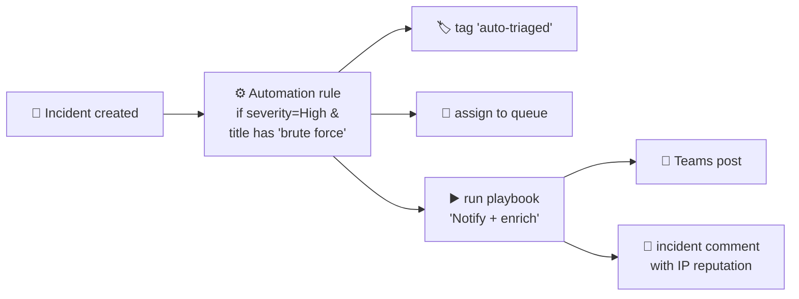

<div align="center">

# 🔄 Step 29 · Automation rules vs playbooks

### *Two different things people call "SOAR" — know which does what*

[](../README.md)
[](#)
[](#)

</div>

---

## 🎯 Goal

You can state exactly what an **automation rule** does, what a **playbook** does, and how they work
together — before you build either.

## 🧠 Why this step

The two are constantly confused. Automation rules are lightweight, code-free incident logic that
lives in Sentinel. Playbooks are Logic Apps that do the actual work (call APIs, post messages,
disable users). An automation rule often *triggers* a playbook.

## ✅ Prerequisites

- [Step 18](../18-enable-a-rule-from-template/README.md) — you have incidents to automate against

## 🧭 Side by side

| | Automation rule | Playbook (Logic App) |
|---|---|---|
| **What it is** | Rules engine inside Sentinel | An Azure Logic App with the Sentinel trigger |
| **Built with** | Portal form: conditions → actions | Logic App designer / ARM |
| **Can do** | Assign owner, change severity/status, add tags, run playbook(s), suppress (close), add task | Anything an API can: Teams/email, Jira/ServiceNow, block IP, disable user, isolate device, enrich |
| **Runs on** | Incident created/updated, or alert created | Incident, alert, or entity trigger |
| **Cost** | Free | Per Logic App action (fractions of a cent; adds up at scale) |
| **Order** | Runs by numeric **Order**; first match can stop others | Called by an automation rule or attached directly to an analytics rule |
| **Latency** | Immediate on trigger | Seconds |



## 🖱️ Do it — a walk, no build yet

1. **Automation → Automation rules → Create → Automation rule.** Look at the form: **Trigger**
   (When incident is created / updated), **Conditions** (any incident property), **Actions**
   (the list above), **Order**, **Expiration**. Cancel without saving.
2. **Automation → Active playbooks** tab and **Playbook templates** tab. Note there are templates
   for Teams notification, IP enrichment, user response. Don't deploy yet.
3. **Analytics → any rule → Automated response tab** — see you can attach a playbook or an
   automation rule directly here too.

## 🧪 Validate

Answer these in `LOG.md` (this step's deliverable is understanding):

1. You want every High incident assigned to a queue and tagged. Automation rule or playbook? → **automation rule**
2. You want to post incident details to a Teams channel. → **playbook** (triggered by an automation rule or attached to the rule)
3. You want to auto-close incidents from a specific known-benign scanner IP. → **automation rule** (condition on entity/IP or title, action: change status to Closed / classification Benign)
4. You want to disable a compromised user after an analyst approves. → **playbook** with an approval action (step 34)
5. You want playbook B to run only if playbook A hasn't already handled it. → order the **automation rules**, or use conditions/tags

```kusto
// once you have automation, its runs land here
SentinelHealth
| where SentinelResourceType in ("Automation Rule","Playbook")
| take 20
```

**You should see** correct answers to all five, and you should be able to explain #5's two options.

## 🚩 Common mistakes

| 🚩 Mistake | Why it bites |
|---|---|
| Building a playbook to just change severity/assign | An automation rule does it free, instantly |
| Attaching a playbook directly to 20 rules | Manage it centrally via one automation rule with conditions |
| Ignoring automation rule **Order** | A broad "close benign" rule ordered first can swallow real incidents |
| No expiration on a temp automation rule | It runs forever |

## 🗒️ Log your run

`LOG.md` — the five answers with reasoning.

## 📚 Microsoft Learn

- [Automation in Microsoft Sentinel: overview](https://learn.microsoft.com/en-us/azure/sentinel/automation/automation)
- [Automation rules](https://learn.microsoft.com/en-us/azure/sentinel/automate-incident-handling-with-automation-rules)
- [Playbooks in Microsoft Sentinel](https://learn.microsoft.com/en-us/azure/sentinel/automation/automate-responses-with-playbooks)

---

<div align="center">
<sub>

[⬅ Prev: 28 · Analytics rules as code](../28-analytics-rules-as-code/README.md) &nbsp;·&nbsp; [🦅 All steps](../README.md) &nbsp;·&nbsp; [Next: 30 · Your first playbook (notify) ➡](../30-first-playbook-notify/README.md)

</sub>
</div>
