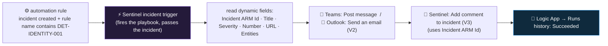

<div align="center">

# 🔄 Step 30 · Your first playbook — notify

### *Post an incident to Teams / email and comment back — the skeleton every later playbook reuses*

[](../README.md)
[](#)
[](#)

</div>

---

## 🎯 Goal

A playbook (`PB-Notify-Incident`, a Consumption Logic App) with the **Sentinel incident trigger**
that posts a formatted message to Teams (or email) and writes a comment back on the incident,
wired to fire on your `DET-IDENTITY-001` incidents via an automation rule, with a **Succeeded** run
in history and the ARM exported to `artifacts/`.

## 🧠 Why this step

Notification is the "hello world" of Sentinel playbooks, and the skeleton you build here is the same
one under every playbook in this phase:

```
Sentinel incident trigger  →  read incident fields  →  do something (notify / enrich / act)  →  comment back on the incident
```

Once you can wire that — the trigger's dynamic fields, an external connector action, the
comment-back — enrichment ([step 33](../33-enrich-an-incident/README.md)) and gated response
([step 34](../34-response-actions-with-approval/README.md)) are the same shape with different middle
steps.

What people get wrong: they build the playbook but **never attach it** (a playbook with no
automation rule and no analytics-rule link never runs); they pick the **wrong trigger type** so the
`triggerBody()` shape doesn't match their expressions ([step 36](../36-alert-vs-incident-vs-entity-triggers/README.md)); they **skip the "grant permissions" prompt** and every run fails with an auth
error; or they leave the connections authenticated as **their personal account**, so the playbook
breaks the day they're offboarded ([step 32](../32-playbook-managed-identity-and-permissions/README.md)).

## ✅ Prerequisites

- [Step 05](../05-rbac-and-roles/README.md) — **Playbook permissions** granted (Sentinel SP →
  Automation Contributor on `rg-sentinel-lab`).
- [Step 29](../29-automation-rules-vs-playbooks/README.md) — you know the router/worker split.
- A **Teams channel** you can post to, or an email address you'll receive at.
- An incident source: `DET-IDENTITY-001` from [step 19](../19-write-a-scheduled-rule/README.md) and a
  way to re-run its simulation.

## 🧭 Concepts



### How it works under the hood

- A playbook is an **Azure Logic App**. The lab uses the **Consumption** plan (pay per
  trigger + action, no fixed cost). The **Standard** plan (fixed monthly, VNet, stateful) is for
  high-volume production and [step 39](../39-monitoring-playbook-runs-and-cost/README.md) touches on
  the choice.
- The **"When a Microsoft Sentinel incident creation rule is triggered"** trigger receives the
  incident object. The designer surfaces its fields as **dynamic content** — *Incident ARM Id*,
  *Incident Title*, *Severity*, *Incident number*, *Incident URL*, *Entities* — so you rarely
  hand-write expressions. The raw form is `triggerBody()?['object']?['properties']?['title']` and
  `triggerBody()?['object']?['id']` for the ARM ID.
- **Connections** are separate `Microsoft.Web/connections` resources. By default they authenticate
  as the **user who created them** (OAuth). [Step 32](../32-playbook-managed-identity-and-permissions/README.md)
  switches the *Sentinel* connection to the Logic App's **managed identity**; Teams/Outlook can't
  use MI, so production uses a dedicated service mailbox.
- **Add comment to incident (V3)** needs the **Incident ARM Id** — always take it from the trigger's
  dynamic content, never hard-code it.
- **Attaching**: an automation rule's *"run playbook"* action (central, recommended) or the
  analytics rule's **Automated response** tab (per-rule). Either way, the Sentinel SP needs the
  Automation Contributor grant.

### Vocabulary

| Term | Meaning |
|---|---|
| **Playbook** | A Logic App with a Sentinel trigger that performs a response. |
| **Consumption vs Standard** | Logic App plans — pay-per-action vs fixed monthly + VNet/stateful. |
| **Sentinel incident trigger** | The trigger that fires a playbook when an incident is created (via an automation rule). |
| **Dynamic content** | Designer-surfaced fields from a previous step's output — click, don't type expressions. |
| **API connection** | A `Microsoft.Web/connections` resource holding auth for one connector (Sentinel, Teams…). |
| **Runs history** | The Logic App's log of every execution, drillable per action. |
| **Add comment to incident (V3)** | The Sentinel action that writes a markdown comment on an incident. |

### Where this fits

The skeleton for the whole phase. [Step 31](../31-sentinel-connector-triggers-and-actions/README.md)
is the full connector reference; [step 32](../32-playbook-managed-identity-and-permissions/README.md)
hardens the auth; [step 33](../33-enrich-an-incident/README.md) swaps the middle for enrichment;
[step 34](../34-response-actions-with-approval/README.md) swaps it for gated response;
[step 38](../38-playbooks-as-code/README.md) exports it cleanly.

### Design rationale

Playbooks are Logic Apps (not a Sentinel-specific engine) so the SOC gets 1,000+ prebuilt
connectors, a visual designer, run history, and ARM deployability for free — the same platform the
rest of the org automates on.

## 🖱️ Do it — portal

1. **Create the playbook.** Sentinel → **Configuration → Automation → Create → Playbook with
   incident trigger**:
   - **Basics**: name `PB-Notify-Incident`, resource group `rg-sentinel-lab`, region = your
     workspace region. Plan **Consumption**.
   - **Connections**: it lists **Microsoft Sentinel** — leave it (you'll swap to MI in step 32).
   - **Review + create** → **Create**. It opens the Logic App designer with the trigger in place.
2. **Add the notification step.** **+ New step**:
   - **Microsoft Teams → Post message in a chat or channel** → sign in / authorise → pick Team +
     Channel → **Message** (use dynamic content, shown here as expressions for reference):

```
🚨 Sentinel incident @{triggerBody()?['object']?['properties']?['incidentNumber']} — @{triggerBody()?['object']?['properties']?['title']}
Severity: @{triggerBody()?['object']?['properties']?['severity']}   Status: @{triggerBody()?['object']?['properties']?['status']}
Open: @{triggerBody()?['object']?['properties']?['incidentUrl']}
```

   *(Or **Office 365 Outlook → Send an email (V2)** — To = your address, Subject/Body from dynamic
   content.)*
3. **Comment back.** **+ New step → Microsoft Sentinel → Add comment to incident (V3)**:
   - **Incident ARM Id**: dynamic content → *Incident ARM Id* (`triggerBody()?['object']?['id']`).
   - **Comment**: `Notified the SOC channel at @{utcNow()}. (PB-Notify-Incident)`
4. **Save.**

## 💻 Do it — wire it, and inspect via CLI

**Automation → Automation rules → + Create → Automation rule:**
- Trigger: **When incident is created**
- Condition: **Analytics rule name** *contains* `DET-IDENTITY-001`
- Action: **Run playbook** → `PB-Notify-Incident` (if the picker is greyed, click **Manage playbook
  permissions** and grant `rg-sentinel-lab`)
- **Order** 10. **Save.**

```bash
RG=rg-sentinel-lab
# the playbook exists as a Logic App
az resource show -g $RG -n PB-Notify-Incident --resource-type Microsoft.Logic/workflows \
  --query "{name:name, state:properties.state}" -o table

# its API connections
az resource list -g $RG --resource-type Microsoft.Web/connections --query "[].name" -o table

# recent runs
az rest --method get --url "https://management.azure.com$(az resource show -g $RG -n PB-Notify-Incident --resource-type Microsoft.Logic/workflows --query id -o tsv)/runs?api-version=2016-06-01&\$top=5" \
  --query "value[].{status:properties.status, start:properties.startTime}" -o table
```

## 🧪 Validate

Re-run the [step 19](../19-write-a-scheduled-rule/README.md) brute-force simulation. Within a minute
or two of the incident appearing:

```kusto
SecurityIncident
| where TimeGenerated > ago(1h) and Title has "DET-IDENTITY-001"
| project TimeGenerated, IncidentNumber, Status, Comments
```

| Check | Healthy | Unhealthy |
|---|---|---|
| Teams / email | message arrives with the **real** number, title, severity | placeholder text / blank fields → wrong dynamic-content field or wrong trigger type |
| Incident **Comments** | ≥ 1, containing "Notified the SOC channel…" | 0 → the comment action failed (bad Incident ARM Id) or the run didn't start |
| **Logic App → Runs history** | one **Succeeded** run; each action green | **Failed** → open the run, read which action failed (usually a connection needs authorising) |
| Automation rule | shows a recent run in its own history | never ran → condition doesn't match, or Order-blocked |

**You should see** the notification, the comment, and a green run. Export the playbook
(**Automation → the playbook → Export**) into `artifacts/` — [step 38](../38-playbooks-as-code/README.md)
cleans it up.

## 🚩 Common mistakes

| 🚩 Mistake | Why it bites |
|---|---|
| Playbook built but never attached | No automation rule and no analytics-rule link → it never runs |
| Wrong trigger type (alert vs incident) | `triggerBody()` shape differs; every expression returns null |
| Skipping the "grant permissions" prompt | Every run fails with `AuthorizationFailed` on the trigger |
| Hard-coding the incident ID in "Add comment" | Comments land on the wrong incident (or none) |
| Personal OAuth connection left in place | Breaks the day you leave; use MI for Sentinel ([step 32](../32-playbook-managed-identity-and-permissions/README.md)) |
| Committing the raw ARM export | Contains connection IDs / callback URL — scrub it ([step 38](../38-playbooks-as-code/README.md)) |
| A `For each` over entities posting one Teams message per entity | Message spam; compose one message |

## 🩺 Troubleshooting

| Symptom | Likely cause | Fix |
|---|---|---|
| Automation rule's playbook picker is greyed out | Sentinel SP lacks Automation Contributor on the RG | **Manage playbook permissions** → grant `rg-sentinel-lab` |
| Run history: trigger fails `AuthorizationFailed` | Same permissions gap, or the Sentinel connection isn't authorised | Grant permissions; open the Sentinel connection → authorise |
| Run succeeds but no Teams message | Teams connection points at a team/channel you can't post to, or the message action is inside a skipped condition | Re-pick Team + Channel; check the run's action tree |
| `Add comment` fails: *"Incident not found"* | Incident ARM Id hard-coded or built wrong | Use the trigger's *Incident ARM Id* dynamic field verbatim |
| Playbook fires twice per incident | Attached via an automation rule **and** the analytics rule's Automated response tab | Pick one attachment point |
| Message fields are blank | Wrong dynamic-content path, or the trigger is the *alert* trigger not *incident* | Re-add fields from dynamic content; recreate as "Playbook with incident trigger" |
| Run never starts | Automation rule condition doesn't match (rule name, severity), or an earlier automation rule stopped processing | Check the automation rule's run history and conditions |

## 🎓 Deepen your understanding

1. Open a Succeeded run and expand the trigger's **Outputs**. Find `object.id`, `object.properties.title`, `object.properties.relatedEntities`. This is the payload every incident-triggered playbook receives — what's *not* in it that you might expect (hint: full alert details)?
2. Change the automation rule condition from "rule name contains DET-IDENTITY-001" to "Severity equals High". What does the playbook now fire on? When is broad vs narrow the right call?
3. Add a **Condition**: only post to Teams if severity is High or Medium; otherwise just comment. Why route by severity in the playbook vs in the automation rule?
4. The Teams connection is authenticated as you. Sign out of Teams everywhere / rotate your session. Does the playbook still run? What's the production fix?
5. Estimate the cost: this 3-action playbook (trigger + Teams + comment) on 200 incidents/day. Now add 9 more actions and 500 incidents/day. When does playbook cost become a line item worth watching ([step 39](../39-monitoring-playbook-runs-and-cost/README.md))?

## 🗒️ Log your run

Copy [`_templates/STEP-LOG-TEMPLATE.md`](../_templates/STEP-LOG-TEMPLATE.md) into this folder as
`LOG.md`. Record: the playbook name, the attachment (automation rule name + condition + Order), a
run-history screenshot (**redact any callback URL**), and the incident comment it wrote. Export the
playbook ARM to `artifacts/` (unscrubbed is fine locally; [step 38](../38-playbooks-as-code/README.md)
scrubs it before commit).

## 📚 Microsoft Learn

- [Tutorial: Use playbooks with automation rules in Microsoft Sentinel](https://learn.microsoft.com/en-us/azure/sentinel/tutorial-respond-threats-playbook)
- [Create and manage Microsoft Sentinel playbooks](https://learn.microsoft.com/en-us/azure/sentinel/automation/create-playbooks)
- [Microsoft Sentinel connector for Azure Logic Apps](https://learn.microsoft.com/en-us/connectors/azuresentinel/)
- [Azure Logic Apps — Consumption vs Standard](https://learn.microsoft.com/en-us/azure/logic-apps/logic-apps-overview)

---

<div align="center">
<sub>

[⬅ Prev: 29 · Automation rules vs playbooks](../29-automation-rules-vs-playbooks/README.md) &nbsp;·&nbsp; [🦅 All steps](../README.md) &nbsp;·&nbsp; [Next: 31 · The Sentinel connector ➡](../31-sentinel-connector-triggers-and-actions/README.md)

</sub>
</div>
