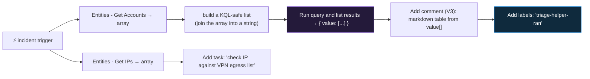

<div align="center">

# 🔄 Step 31 · The Microsoft Sentinel connector

### *Every trigger and action the playbook connector gives you — the reference you build by using it*

[](../README.md)
[](#)
[-107C10?style=flat-square)](#)

</div>

---

## 🎯 Goal

You've built `PB-Triage-Helper` — an incident-triggered playbook that uses the connector's **Get
Accounts / Get IPs**, **Run query and list results**, **Add comment (V3)**, **Add task**, and
**Add labels** actions — and you can describe the output shape of each from having inspected a real
run.

## 🧠 Why this step

Every non-trivial Sentinel playbook is built from the same small set of connector actions:

```
trigger  →  Get <entity type>  →  enrich (query / external API)  →  Update incident / Add comment / Add task
```

If you know what each action **needs as input** and **returns as output**, you can build any
playbook in the phase. If you don't, you spend an hour fighting "the account list is a string, not
an array" and "the query result is nested under `value`". This step makes you build one playbook
that touches most of the surface, so the shapes are in your hands, not a doc.

## ✅ Prerequisites

- [Step 30](../30-first-playbook-notify/README.md) — you can create a playbook and read the trigger.
- [Step 24](../24-watchlists/README.md) — a watchlist exists (some exercises reference watchlist
  actions).
- `DET-IDENTITY-001` incidents to run against.

## 🧭 The connector surface

### Triggers

| Trigger | Fires on | Payload |
|---|---|---|
| **When a Microsoft Sentinel incident creation rule is triggered** | Incident created/updated, via an automation rule | The full incident: properties, `relatedEntities`, `alerts`, labels, comments, `additionalData` |
| **When a response to a Microsoft Sentinel alert is triggered** | An alert, via an analytics/NRT rule's *alert automation* | A single alert + its entities — **no incident wrapper** |
| **Microsoft Sentinel entity** | Manual, from an entity page or the investigation graph | One entity object (account / IP / host / URL / filehash) |

Trigger type dictates the `triggerBody()` shape — [step 36](../36-alert-vs-incident-vs-entity-triggers/README.md) covers picking the right one.

### Actions — the ones you'll use constantly

| Action | Input | Output |
|---|---|---|
| **Get incident** | Incident ARM Id | Latest incident state (statuses can change between trigger and run) |
| **Update incident** | Incident ARM Id + fields | — (sets status, severity, owner, classification) — **re-triggers "incident updated"** |
| **Add comment to incident (V3)** | Incident ARM Id + markdown | — (comment on the incident; there's a size limit — summarise) |
| **Add labels to incident** | Incident ARM Id + labels array | — (tags) |
| **Add task to incident** | Incident ARM Id + title (+ description) | — (a checklist item in the Tasks pane) |
| **Entities - Get Accounts** | The incident's Entities (or the trigger's `object`) | **array** of account entities (`Name`, `NTDomain`, `UPNSuffix`, `AadUserId`, `Sid`) |
| **Entities - Get IPs / Hosts / URLs / FileHashes / DNS / Azure Resources / Mailboxes …** | same | **array** of that entity type |
| **Alerts - Get** | Incident ARM Id | array of the incident's alerts |
| **Alert - Get incident** | (from an alert trigger) | the incident the alert rolled up into |
| **Run query and list results** | KQL + timespan | `{ value: [ {row}, {row} ] }` — costs a bit more than a plain action |
| **Run query and visualize results** | KQL | a rendered chart image (for the comment/email) |
| **Watchlists - Get / Add a new watchlist item / Delete a watchlist item** | alias + item | the item, or — (add an IOC during an incident) — verify action names for your connector version |



### How it works under the hood

- The connector's actions are REST calls to the Sentinel management API, authenticated by the API
  connection (user OAuth or — [step 32](../32-playbook-managed-identity-and-permissions/README.md)
  — managed identity).
- **Get Accounts / Get IPs** don't hit the network for each entity — they filter the incident's
  already-attached `Entities` array by `Type` and hand you the subset. If entity mapping
  ([step 20](../20-entity-mapping-and-custom-details/README.md)) was weak, these arrays are thin.
- **Run query and list results** runs your KQL against the workspace and returns
  `{ "value": [ ...rows... ] }`. To use an entity array *in* the KQL you must turn it into a
  string first — e.g. a **Compose** action:
  `@{join(body('Entities_-_Get_Accounts')?['Accounts'], ',')}` is *not* quite right (you need the
  names) — build it with `select`:
  `@{join(select(body('Entities_-_Get_Accounts')?['Accounts'], concat('"', item()?['Name'], '"')), ',')}`
  then inject into `where UserPrincipalName in (<that>)`.
- **Update incident** and **Add comment/labels/task** all fire the **"incident updated"** trigger —
  if an automation rule runs a playbook on update, guard against a loop with a tag condition.
- Comments render **markdown**; keep them short (there is a size cap) — summarise the query result,
  don't dump it.

### Vocabulary

| Term | Meaning |
|---|---|
| **Entities - Get \<type\>** | Connector actions that split an incident's entities into typed arrays. |
| **Run query and list results** | The action that executes KQL from a playbook; returns `{ value: [...] }`. |
| **Incident ARM Id** | The identifier every incident action needs — always from the trigger. |
| **Add labels / Add task** | Connector actions that tag an incident or add a checklist item. |
| **Compose** | A Logic App action to build/transform a value (e.g. an array → a KQL string). |
| **`value` array** | The result envelope from the query action. |

### Where this fits

This is the toolbox for [step 33](../33-enrich-an-incident/README.md) (enrichment),
[step 34](../34-response-actions-with-approval/README.md) (response), and
[step 35](../35-automation-rules-triage/README.md). The **entity trigger** here is used again in
[step 36](../36-alert-vs-incident-vs-entity-triggers/README.md).

### Design rationale

The connector exposes incident/entity operations as discrete, composable actions (not one
mega-action) so a playbook reads like a runbook and each step is independently testable in the run
history.

## 🖱️ Do it — build `PB-Triage-Helper`

Incident trigger. Steps:

1. **Entities - Get Accounts** — input: the trigger's **Entities** (dynamic content). Output:
   `Accounts` array.
2. **Entities - Get IPs** — same input. Output: `IPs` array.
3. **Compose** `accountList` = `@{join(select(body('Entities_-_Get_Accounts')?['Accounts'], concat('"', coalesce(item()?['Name'], item()?['Sid'], ''), '"')), ',')}`
4. **Microsoft Sentinel - Run query and list results** (timespan: last 7 days):

```kusto
let names = dynamic([@{outputs('Compose_accountList')}]);
SigninLogs
| where TimeGenerated > ago(7d)
| where tolower(UserPrincipalName) in (names)
| summarize SignIns = count(), Countries = make_set(tostring(LocationDetails.countryOrRegion)),
            Apps = make_set(AppDisplayName), Failures = countif(ResultType != 0)
    by UserPrincipalName
```

5. **Compose** a markdown table from `body('Run_query_and_list_results')?['value']` (loop or a
   `select`/`join`).
6. **Add comment to incident (V3)** — Incident ARM Id from the trigger; comment = the markdown
   table + "7-day sign-in context (PB-Triage-Helper)".
7. **Add task to incident** — title `Confirm each source IP is not a known VPN/partner egress`,
   description listing `body('Entities_-_Get_IPs')?['IPs']`.
8. **Add labels to incident** — `triage-helper-ran`.

Save. Attach via an automation rule (condition: rule name contains `DET-IDENTITY-001`), **and**
guard: condition `Incident label does not contain 'triage-helper-ran'` so an update doesn't re-run
it.

## 💻 Do it — inspect the shapes via CLI

```bash
RG=rg-sentinel-lab
WF=$(az resource show -g $RG -n PB-Triage-Helper --resource-type Microsoft.Logic/workflows --query id -o tsv)

# latest run
RUN=$(az rest --method get --url "https://management.azure.com$WF/runs?api-version=2016-06-01&\$top=1" --query "value[0].name" -o tsv)

# per-action inputs/outputs — see the actual JSON the connector returned
az rest --method get --url "https://management.azure.com$WF/runs/$RUN/actions?api-version=2016-06-01" \
  --query "value[].{action:name, status:properties.status}" -o table
```

## 🧪 Validate

Run `PB-Triage-Helper` on a `DET-IDENTITY-001` incident (manually, or via the automation rule).

```kusto
SecurityIncident
| where TimeGenerated > ago(2h) and Title has "DET-IDENTITY-001"
| project IncidentNumber, Labels, CommentCount = array_length(todynamic(Comments)),
          TaskCount = array_length(todynamic(Tasks))
```

| Check | Healthy | Unhealthy |
|---|---|---|
| Incident **Comments** | contains the 7-day sign-in table with real data | empty / "no results" → the `accountList` compose produced a bad KQL list |
| Incident **Tasks** pane | one task listing the IPs | 0 → Add task action failed or was skipped |
| Incident **Labels** | `triage-helper-ran` | missing → Add labels failed |
| Run history → "Run query and list results" → **Outputs** | a `value` array of account rows | `value: []` → the `in (names)` list is malformed or the accounts array was empty |
| Re-trigger on update | playbook does **not** run again | it re-runs → the label guard condition is missing |

**You should see** all three incident artifacts and, in the run history, the `{ value: [...] }`
shape from the query action — the thing you'll parse in every enrichment playbook.

## 🚩 Common mistakes

| 🚩 Mistake | Why it bites |
|---|---|
| Treating "Get Accounts" output as a string | It's an array of objects — `select`/`join` it, or `mv-expand` in KQL |
| Injecting an entity array straight into KQL | KQL needs a string list — build it with a Compose step |
| Dumping the full query result into a comment | Size cap + unreadable — summarise to a table |
| Personal connection on the query action | Rate-limited, breaks on offboarding — MI ([step 32](../32-playbook-managed-identity-and-permissions/README.md)) |
| "Update incident" in an update-triggered playbook, no guard | Infinite loop |
| Assuming entities are rich | If entity mapping was weak ([step 20](../20-entity-mapping-and-custom-details/README.md)), the arrays are thin |
| Hard-coding the workspace in "Run query" | Use the connection's workspace; parameterise for reuse |

## 🩺 Troubleshooting

| Symptom | Likely cause | Fix |
|---|---|---|
| "Get Accounts" returns `[]` | The incident has no Account entity, or entity mapping is weak | Improve the rule's entity mapping; check the trigger's `relatedEntities` |
| "Run query" fails: syntax error | The injected `accountList` isn't valid KQL (unquoted, trailing comma) | Test the composed string; `dynamic([...])` needs quoted strings, comma-separated, no trailing comma |
| "Run query" returns 0 rows but there is data | Case mismatch (`UserPrincipalName` vs the entity `Name`), or timespan too short | `tolower()` both sides; widen the timespan input |
| Comment action fails | Incident ARM Id wrong, or comment exceeds the size limit | Use the trigger's dynamic *Incident ARM Id*; truncate the comment |
| Playbook re-runs every time it updates the incident | No loop guard | Automation rule condition: label does not contain the playbook's marker tag |
| Entity trigger playbook errors on `triggerBody().object` | Entity trigger payload is a single entity, not an incident | Use `triggerBody()` directly; it's `{ Type, Name/Address, ... }` |
| Query action much slower / costlier than other actions | It executes KQL — it's a heavier operation | Keep the query tight; don't call it in a loop |

## 🎓 Deepen your understanding

1. Inspect a run's "Get Accounts" output. What fields does each account object have? Which would you use as the KQL key — `Name`, `Sid`, or `AadUserId` — and why does it depend on [step 20](../20-entity-mapping-and-custom-details/README.md)?
2. The query action returns `{ value: [...] }`. Write the Logic App expression to get the count of rows, and the expression to build a markdown table from them.
3. "Update incident" re-triggers "incident updated" automation rules. Design a 2-playbook chain (enrich, then notify) that runs in order **without** looping. Where do the guard tags go?
4. Compare "Run query and list results" against calling an external API (step 33) for the same enrichment. When is a KQL lookup against your own data better than an external call?
5. The **entity trigger** lets an analyst run a playbook on one IP from the investigation graph. Sketch a "tell me everything about this IP" playbook — which connector actions, and what does it comment where (there's no incident)?

## 🗒️ Log your run

Copy [`_templates/STEP-LOG-TEMPLATE.md`](../_templates/STEP-LOG-TEMPLATE.md) into this folder as
`LOG.md`. Record: the **output shape** of each connector action you used (paste the redacted JSON
from run history), the incident artifacts produced, and the loop-guard condition. Export
`PB-Triage-Helper` to `artifacts/`.

## 📚 Microsoft Learn

- [Microsoft Sentinel connector for Azure Logic Apps (full action reference)](https://learn.microsoft.com/en-us/connectors/azuresentinel/)
- [Use triggers and actions in Microsoft Sentinel playbooks](https://learn.microsoft.com/en-us/azure/sentinel/playbook-triggers-actions)
- [Manage incidents with tasks](https://learn.microsoft.com/en-us/azure/sentinel/incident-tasks)
- [Workflow definition language reference (expressions like join/select)](https://learn.microsoft.com/en-us/azure/logic-apps/workflow-definition-language-functions-reference)

---

<div align="center">
<sub>

[⬅ Prev: 30 · Your first playbook (notify)](../30-first-playbook-notify/README.md) &nbsp;·&nbsp; [🦅 All steps](../README.md) &nbsp;·&nbsp; [Next: 32 · Playbook managed identity & permissions ➡](../32-playbook-managed-identity-and-permissions/README.md)

</sub>
</div>
