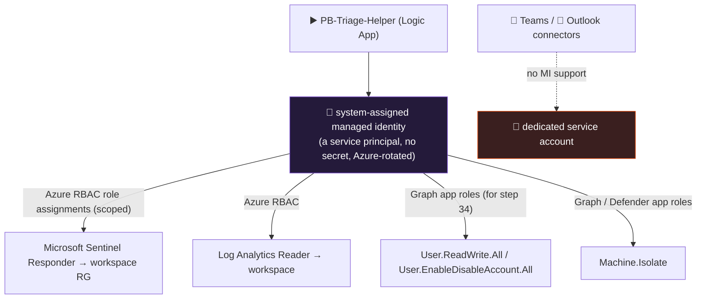

<div align="center">

# 🔄 Step 32 · Playbook managed identity & permissions

### *Stop authenticating playbooks as a person — least-privilege identity that never expires*

[](../README.md)
[](#)
[](#)

</div>

---

## 🎯 Goal

`PB-Triage-Helper` authenticates its **Microsoft Sentinel** and **Run query** connections with the
Logic App's **system-assigned managed identity**, that identity holds **only** the roles it needs
(scoped to the RG / workspace, not the subscription), the old user-based connection is deleted, and
you've proven the MI is the identity by watching an action **403** when you remove a role.

## 🧠 Why this step

When you create a playbook, its connections authenticate as **you** — an OAuth token tied to your
account. That is fine for a five-minute demo and a liability for anything real:

- **It expires.** OAuth refresh tokens have a lifetime; conditional access can revoke them; and the
  moment you're **offboarded**, every playbook that used your connection stops working — silently.
- **It's over-scoped.** Your account probably has far more than "add a comment to an incident".
- **It's not auditable as a service.** "Which identity disabled this user?" should answer with the
  playbook's name, not yours.

A **managed identity** fixes all three: no password, no expiry, Azure rotates it, and it gets
**RBAC role assignments you scope and audit** like any other principal. For actions that reach
outside Azure RBAC — disabling an Entra user, isolating a device — you assign the MI **Microsoft
Graph application permissions (app roles)** instead.

What people get wrong: they assign the MI **Owner** or roles at **subscription** scope ("to make it
work"); they leave the **old user connection** in place as a confusing fallback; or they expect
**Teams/Outlook** to use MI (those connectors don't — they need a dedicated service account).

## ✅ Prerequisites

- [Step 31](../31-sentinel-connector-triggers-and-actions/README.md) — `PB-Triage-Helper` exists and
  does Sentinel + query actions.
- **Owner** or **User Access Administrator** on `rg-sentinel-lab` — to create role assignments.
- For the Graph app-role part: rights to grant application permissions (Privileged Role
  Administrator / Global Administrator, or Cloud Application Administrator for some).

## 🧭 Concepts



### What each action needs

| Playbook does | Identity needs | Scope |
|---|---|---|
| Add comment / update incident / add task / add labels | **Microsoft Sentinel Responder** | workspace RG |
| Run a Log Analytics query | **Log Analytics Reader** (or Sentinel Reader) | the workspace |
| Update / add watchlist items | **Microsoft Sentinel Contributor** | workspace RG |
| Post to Teams / send mail | *(connector has no MI)* — a **service account** that is a Teams member / has a licensed mailbox | — |
| Disable an Entra user ([step 34](../34-response-actions-with-approval/README.md)) | Graph app role **`User.ReadWrite.All`** (broad) or **`User.EnableDisableAccount.All`** (narrower, newer) | tenant |
| Revoke sign-in sessions | Graph app role **`User.RevokeSessions.All`** (or covered by `User.ReadWrite.All`) | tenant |
| Isolate a device via Defender | App role **`Machine.Isolate`** on the WindowsDefenderATP / Graph Security resource | tenant |
| Add an NSG deny rule | **Network Contributor** | the specific NSG |

### How it works under the hood

- **System-assigned MI** is created with the Logic App and deleted with it — its lifecycle is the
  playbook's. It shows up in Entra as a service principal whose object ID is the Logic App's
  `identity.principalId`. (Standard Logic Apps also support **user-assigned** MI — a shareable
  identity — but Consumption uses system-assigned.)
- **The Sentinel and Azure Monitor Logs connectors** support "Connect with managed identity" — the
  connection then uses the MI's token instead of a user OAuth token. **Teams and Outlook connectors
  do not** — they stay OAuth, so production points them at a **dedicated service account**.
- **Azure RBAC** covers anything with an ARM resource (incidents, workspace, NSGs). **Graph
  application permissions** cover directory actions (disable a user). You grant an app role by
  creating an `appRoleAssignment` on the MI's service principal, targeting the Microsoft Graph SP
  (appId `00000003-0000-0000-c000-000000000000`).
- **Propagation**: new role assignments take seconds to ~30 minutes; app-role grants similar. A
  fresh MI failing 403 immediately after you grant is usually just propagation.

### Vocabulary

| Term | Meaning |
|---|---|
| **Managed identity (MI)** | An Azure-managed service principal with no credentials you handle. System- or user-assigned. |
| **API connection** | `Microsoft.Web/connections` — auth for one connector; can be user-OAuth or MI. |
| **App role / application permission** | A Graph (or other API) permission granted to a service principal for app-only (no user) access. |
| **`appRoleAssignment`** | The object that grants an app role to a principal. |
| **Least privilege** | The MI holds only the roles its playbook actions require, at the narrowest scope. |
| **Service account** | A dedicated user account (licensed mailbox / Teams member) for connectors that can't use MI. |

### Where this fits

Every playbook from here — [step 33](../33-enrich-an-incident/README.md) (Key Vault + query),
[step 34](../34-response-actions-with-approval/README.md) (Graph disable-user, Defender isolate),
[step 38](../38-playbooks-as-code/README.md) (as code) — assumes MI auth. This is where you set the
pattern.

### Design rationale

Microsoft made MI a first-class auth option for the security connectors precisely because a SOC's
automation should not depend on any individual's credentials, and because "the playbook did it" is
the answer an incident review needs.

## 🖱️ Do it — portal

1. **Turn on the MI.** `PB-Triage-Helper` Logic App → **Settings → Identity → System assigned →
   Status: On → Save**. Note the **Object (principal) ID**.
2. **Grant scoped roles.** `rg-sentinel-lab` → **Access control (IAM) → Add role assignment**:
   - **Microsoft Sentinel Responder** → *Managed identity* → `PB-Triage-Helper`.
   - Repeat on the **workspace** (`law-sentinel-lab` → IAM) for **Log Analytics Reader**.
3. **Repoint the connections.** In the Logic App designer, open the **Microsoft Sentinel** action →
   **Change connection → Add new → Connect with managed identity** → name `sentinel-mi` → Create.
   Do the same for **Run query and list results** (Azure Monitor Logs → *Connect with managed
   identity*). Update every Sentinel/query action to use the new connection.
4. **Delete the old connection.** `rg-sentinel-lab` → the old `azuresentinel` /
   `azuremonitorlogs` **API connection** resource → Delete (after confirming no action still
   references it).
5. **Teams/Outlook**: leave as-is in the lab. Note in `LOG.md` that production needs a service
   account.

## 💻 Do it — CLI

```bash
RG=rg-sentinel-lab
LA=$(az resource show -g $RG -n PB-Triage-Helper --resource-type Microsoft.Logic/workflows --query identity.principalId -o tsv)
RGID=$(az group show -n $RG --query id -o tsv)
WSID=$(az monitor log-analytics workspace show -g $RG -n law-sentinel-lab --query id -o tsv)

# scoped Azure RBAC — idempotent
az role assignment create --assignee-object-id "$LA" --assignee-principal-type ServicePrincipal \
  --role "Microsoft Sentinel Responder" --scope "$RGID"
az role assignment create --assignee-object-id "$LA" --assignee-principal-type ServicePrincipal \
  --role "Log Analytics Reader" --scope "$WSID"

# Graph app role (needed in step 34) — grant User.ReadWrite.All (or the narrower User.EnableDisableAccount.All)
GRAPH=$(az ad sp show --id 00000003-0000-0000-c000-000000000000 --query id -o tsv)
ROLE=$(az ad sp show --id 00000003-0000-0000-c000-000000000000 \
  --query "appRoles[?value=='User.ReadWrite.All'].id | [0]" -o tsv)
az rest --method POST \
  --url "https://graph.microsoft.com/v1.0/servicePrincipals/$LA/appRoleAssignments" \
  --body "{\"principalId\":\"$LA\",\"resourceId\":\"$GRAPH\",\"appRoleId\":\"$ROLE\"}"
```

## 🧪 Validate

```bash
# Azure RBAC the MI holds (scopes should be the RG / workspace, NOT the subscription)
az role assignment list --assignee "$LA" --all \
  --query "[].{role:roleDefinitionName, scope:scope}" -o table

# Graph app roles granted to the MI
az rest --method get --url "https://graph.microsoft.com/v1.0/servicePrincipals/$LA/appRoleAssignments" \
  --query "value[].{resource:resourceDisplayName, appRoleId:appRoleId}" -o table
```

Run `PB-Triage-Helper` on an incident:

| Check | Healthy | Unhealthy |
|---|---|---|
| Run history | **Succeeded**; comment/task/labels still applied — via `sentinel-mi` | 403 on a Sentinel action → role not assigned or not propagated (wait) |
| API connections in the RG | no personal `azuresentinel` connection left | old connection still there → an action still references it |
| Role scopes | end in `/resourceGroups/rg-sentinel-lab` or the workspace | `/subscriptions/<id>` with nothing after → over-scoped, fix it |
| **Under-permission test** | remove **Microsoft Sentinel Responder**, re-run → "Add comment" fails **403**; re-add → works | if it still works with the role removed, an old user connection is still in play |

**You should see** the playbook fully functional on the MI + two scoped roles, and a clean 403 the
moment you under-permission it — that 403 is the proof the MI (not your account) is the identity.

## 🚩 Common mistakes

| 🚩 Mistake | Why it bites |
|---|---|
| Roles at **subscription** scope | An over-privileged MI; a playbook bug can reach anything in the sub |
| Granting **Owner** "to make it work" | A playbook bug can now delete resources |
| Leaving the old user-based connection | Confusing fallback; hides that the MI isn't actually wired |
| Expecting Teams/Outlook to use MI | They don't — use a dedicated service account |
| Granting `Directory.ReadWrite.All` for disable-user | Vastly more than needed — `User.ReadWrite.All` or `User.EnableDisableAccount.All` |
| Not testing the 403 | You never confirmed the MI is the identity vs an old token still working |
| Forgetting propagation delay | Declaring it broken 30 seconds after granting a role |

## 🩺 Troubleshooting

| Symptom | Likely cause | Fix |
|---|---|---|
| Sentinel action 403 after repointing to MI | Role not assigned, wrong scope, or still propagating | `az role assignment list --assignee $LA`; wait up to ~30 min; check scope |
| "Connect with managed identity" not offered | The Logic App has no system-assigned identity yet | Identity → System assigned → On |
| Query action 403 | MI has Sentinel Responder but not **Log Analytics Reader** on the workspace | Add `Log Analytics Reader` at the workspace scope |
| Graph call (step 34) 403 `Authorization_RequestDenied` | App role not granted, or granted to the wrong resource SP | Grant on the **Microsoft Graph** SP (`00000003-...`); verify with the appRoleAssignments GET |
| Deleting the old connection breaks the playbook | An action still references it | Open the designer → every action → confirm it uses `sentinel-mi` before deleting |
| Teams action fails after "hardening" | You tried to move Teams to MI | Revert Teams to OAuth / a service account |
| MI works, then stops after the Logic App is redeployed from ARM | ARM deploy recreated the identity / connection and the role assignment now points at a dead principal | Re-assign roles to the new `principalId`; in IaC, assign roles *after* the Logic App in the same deployment |

## 🎓 Deepen your understanding

1. List every action across your playbooks so far and the exact permission each needs. Is any playbook doing two things that need very different privilege levels — and should it be split?
2. `User.ReadWrite.All` vs `User.EnableDisableAccount.All` for disabling a user: what can the broad one do that the narrow one can't? Why does that matter if the playbook is ever compromised?
3. Teams can't use MI. A dedicated service account has a password. How do you protect *that* — where does its credential live, what's its MFA/CA story, and who can sign in as it?
4. You have 12 playbooks. System-assigned means 12 identities and 12× the role assignments. When would a single **user-assigned** MI (Standard plan) be better, and what do you lose?
5. In an ARM/Bicep deployment ([step 38](../38-playbooks-as-code/README.md)), the role assignment references `reference(logicApp.id, ...).identity.principalId`. Why must the role-assignment resource `dependsOn` the Logic App, and what breaks if it doesn't?

## 🗒️ Log your run

Copy [`_templates/STEP-LOG-TEMPLATE.md`](../_templates/STEP-LOG-TEMPLATE.md) into this folder as
`LOG.md`. Record: the MI's role assignments (`az role assignment list`, **scopes shown**, object
IDs redacted), the Graph app roles granted, the deleted old connection, and the **403
under-permission test** result.

## 📚 Microsoft Learn

- [Authenticate playbooks to Microsoft Sentinel](https://learn.microsoft.com/en-us/azure/sentinel/authenticate-playbooks-to-sentinel)
- [Managed identity for Azure Logic Apps](https://learn.microsoft.com/en-us/azure/logic-apps/authenticate-with-managed-identity)
- [Assign a Microsoft Graph app role to a managed identity](https://learn.microsoft.com/en-us/entra/identity/managed-identities-azure-resources/how-to-assign-app-role-managed-identity)
- [Microsoft Graph permissions reference (User.*)](https://learn.microsoft.com/en-us/graph/permissions-reference)
- [Microsoft Defender for Endpoint API — machine actions](https://learn.microsoft.com/en-us/defender-endpoint/api/isolate-machine)

---

<div align="center">
<sub>

[⬅ Prev: 31 · The Sentinel connector](../31-sentinel-connector-triggers-and-actions/README.md) &nbsp;·&nbsp; [🦅 All steps](../README.md) &nbsp;·&nbsp; [Next: 33 · Enrich an incident ➡](../33-enrich-an-incident/README.md)

</sub>
</div>
