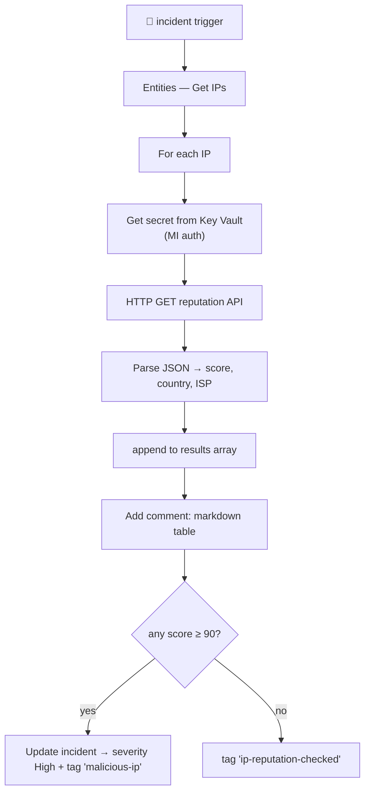

<div align="center">

# 🔄 Step 33 · Enrich an incident

### *Auto-attach IP reputation, geo, and a verdict comment*

[](../README.md)
[](#)
[](#)

</div>

---

## 🎯 Goal

A playbook that, on every DET-IDENTITY-001 incident, looks up each IP entity against a reputation
source, posts a summary comment, and raises severity if any IP is malicious.

## 🧠 Why this step

Enrichment is the highest-value automation: it does the boring lookups an analyst would do first, so
triage starts from an informed position. It's also a safe automation — it only *adds context*, it
doesn't act.

## ✅ Prerequisites

- [Step 32](../32-playbook-managed-identity-and-permissions/README.md) — MI + roles
- A reputation API. Free options: **AbuseIPDB** (free key), **VirusTotal** (free key, low rate),
  Microsoft Threat Intelligence connector, or your `KnownBadIPs` watchlist (step 24)
- Store the API key in **Key Vault**, not the playbook

## 🧭 Flow



## 🖱️ Do it — portal

1. **Key Vault** `kv-sentinel-lab` → **Secrets** → add `abuseipdb-key`. Grant the playbook MI
   **Key Vault Secrets User** on the vault.
2. **Automation → Create playbook with incident trigger** → `PB-Enrich-IP-Reputation`. Turn on MI.
3. Actions:
   - **Microsoft Sentinel — Entities - Get IPs.**
   - **Initialize variable** `results` (Array).
   - **For each** IP:
     - **Key Vault — Get secret** `abuseipdb-key` (connection: managed identity).
     - **HTTP** GET `https://api.abuseipdb.com/api/v2/check?ipAddress=@{items('For_each')?['Address']}&maxAgeInDays=90`
       header `Key: @{body('Get_secret')?['value']}`, `Accept: application/json`.
     - **Parse JSON** the response.
     - **Append to array** `results`: `{ ip, abuseScore, country, isp }`.
   - **Compose** a markdown table from `results`.
   - **Add comment to incident (V3)** with the table.
   - **Condition**: `max(results.abuseScore) >= 90` →
     - true: **Update incident** severity `High`, add label `malicious-ip`.
     - false: **Update incident** add label `ip-reputation-checked`.

## 💻 Do it — the comment body (Compose expression)

```
| IP | Abuse score | Country | ISP |
|----|------------|---------|-----|
@{join(select(variables('results'), concat('| ', item()['ip'], ' | ', string(item()['abuseScore']), ' | ', item()['country'], ' | ', item()['isp'], ' |')), decodeUriComponent('%0A'))}
```

## 🧪 Validate

1. Add a **known-bad test IP** to your attack simulation source, or seed one into `KnownBadIPs` and
   point the lookup there.
2. Re-run the step-19 brute-force sim.
3. On the incident:

```kusto
SecurityIncident
| where TimeGenerated > ago(1h) and Title has "DET-IDENTITY-001"
| project IncidentNumber, Severity, Labels, Comments
```

**You should see** a comment with the reputation table, and — if a lookup scored ≥ 90 — the
incident severity bumped to High with the `malicious-ip` tag. A benign IP gets the
`ip-reputation-checked` tag and no severity change.

## 🚩 Common mistakes

| 🚩 Mistake | Why it bites |
|---|---|
| API key in a Logic App parameter | It's readable in the ARM export — Key Vault + MI |
| No rate-limit / error handling on the HTTP action | Free-tier APIs 429; the run fails and the incident gets no context |
| Enrichment that also *blocks* | Keep enrichment read-only; blocking is step 34 with approval |
| Looking up private/RFC1918 IPs against a public API | Filter those out first |

## 🗒️ Log your run

`LOG.md` — the enriched incident comment (redact real IPs), and a Succeeded run. Export the playbook.

## 📚 Microsoft Learn

- [Enrich incidents with entity information using playbooks](https://learn.microsoft.com/en-us/azure/sentinel/playbook-triggers-actions)
- [Get secrets from Key Vault in Logic Apps](https://learn.microsoft.com/en-us/azure/logic-apps/logic-apps-securing-a-logic-app#access-key-vault)
- [Threat intelligence in Microsoft Sentinel](https://learn.microsoft.com/en-us/azure/sentinel/understand-threat-intelligence)

---

<div align="center">
<sub>

[⬅ Prev: 32 · Playbook managed identity & permissions](../32-playbook-managed-identity-and-permissions/README.md) &nbsp;·&nbsp; [🦅 All steps](../README.md) &nbsp;·&nbsp; [Next: 34 · Response actions with approval ➡](../34-response-actions-with-approval/README.md)

</sub>
</div>
