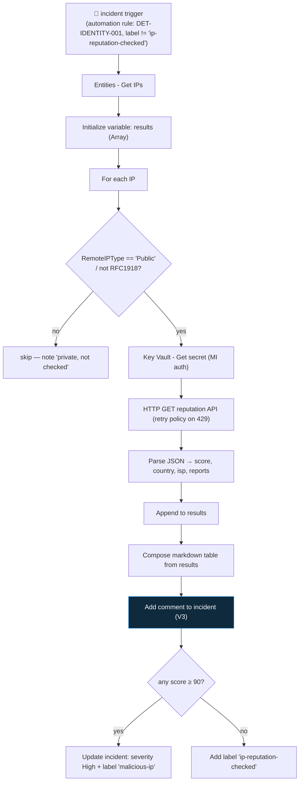

<div align="center">

# 🔄 Step 33 · Enrich an incident

### *Do the analyst's first ten lookups automatically — read-only, so it's safe to trust*

[](../README.md)
[](#)
[](#)

</div>

---

## 🎯 Goal

`PB-Enrich-IP-Reputation` — a playbook that, on every `DET-IDENTITY-001` incident, looks up each
**public** IP entity against a reputation source (external API via Key Vault, or your own
`KnownBadIPs` / TI data), posts a **summary comment**, and **raises severity + tags** the incident
if any IP is malicious. Proven with a known-bad test IP.

## 🧠 Why this step

Enrichment is the highest-return automation a SOC can build, for two reasons.

**It buys the most time.** When an analyst opens an incident their first moves are mechanical: is
this IP known-bad? where is it? whose ISP? has this account been anywhere weird lately? A playbook
does all of that in the seconds between the incident being created and the analyst clicking it, so
triage **starts from an informed position** instead of ten minutes of tab-switching.

**It's safe to trust.** Enrichment is **read-only** — it adds context, it never disables an account
or blocks an IP. A false positive costs a wasted comment, not a locked-out executive. That makes it
the right place to build automation confidence before you get to gated response
([step 34](../34-response-actions-with-approval/README.md)).

What people get wrong: they put the **API key in a Logic App parameter** (it's in the ARM export —
use Key Vault); they don't handle **rate limits** so a free-tier `429` fails the whole run and the
incident gets no context; they look up **private/RFC1918 IPs** against a public API (which errors);
or they let enrichment **also act** (raise severity is fine; disabling users is not — that's
step 34).

## ✅ Prerequisites

- [Step 32](../32-playbook-managed-identity-and-permissions/README.md) — the playbook MI with
  Sentinel Responder + Log Analytics Reader.
- A reputation source. Pick one: **AbuseIPDB** (free key), **VirusTotal** (free key, low rate), the
  Microsoft **Threat Intelligence** table ([step 58](../58-threat-intelligence/README.md)), or your
  `KnownBadIPs` watchlist ([step 24](../24-watchlists/README.md)). The KQL / watchlist routes need
  **no external key**.
- A **Key Vault** (`kv-sentinel-lab`) if you use an external API — the key goes there, never in the
  playbook.

## 🧭 Concepts



### What a playbook can and can't add to an incident

| Can | Can't |
|---|---|
| **Add a comment** (markdown) | Add a **custom detail** (those are set on the alert at rule time — [step 20](../20-entity-mapping-and-custom-details/README.md)) |
| **Add labels/tags** | Add a new **entity** to the incident |
| **Add a task** | Change the alert's own fields |
| **Change severity / status / owner / classification** | |

So a playbook's enrichment output goes into a **comment** (the detail), a **tag** (the machine-
readable verdict), and optionally **severity** (the prioritisation).

### How it works under the hood

- **Key Vault + MI**: the MI holds **Key Vault Secrets User** on `kv-sentinel-lab` (RBAC vault
  permission model). The Key Vault connector's *Get secret* action, on the MI connection, returns
  `body('Get_secret')?['value']`. The key never appears in the playbook definition or its ARM.
- **The `For each` loop** iterates the `IPs` array from *Entities - Get IPs*. Put a **retry
  policy** on the HTTP action (exponential, 3 tries) so a transient `429` doesn't kill the run; or a
  small **Delay** between iterations for strict free tiers.
- **Aggregate then comment once** — appending to a `results` array and composing one table beats
  posting one comment per IP.
- **Raising severity re-fires "incident updated"** automation rules. Guard the automation rule that
  runs this playbook with a condition like *label does not contain `ip-reputation-checked`*, and
  have the playbook always add that label.
- **No-key alternative**: swap the Key Vault + HTTP steps for a single *Run query and list results*
  against `ThreatIntelligenceIndicator` / `_GetWatchlist('KnownBadIPs')` / `geo_info_from_ip_address()`
  — cheaper, no quota, but only as good as your own data.

### Vocabulary

| Term | Meaning |
|---|---|
| **Enrichment** | Read-only automation that adds context to an incident (reputation, geo, history). |
| **Reputation score** | A vendor's 0–100 confidence that an IP/domain is malicious. |
| **Retry policy** | A Logic App per-action setting: re-attempt on failure (used for `429`/`5xx`). |
| **`RemoteIPType`** | A field distinguishing Public vs Private IPs — filter before a public lookup. |
| **Key Vault Secrets User** | The RBAC role letting a principal read secret *values* (not manage the vault). |
| **`decodeUriComponent('%0A')`** | The Logic App idiom for a newline inside a composed string. |

### Where this fits

Enrichment is the confidence-builder before [step 34](../34-response-actions-with-approval/README.md)
(gated response, which often *reads* this playbook's `malicious-ip` tag as its confidence gate). It
reuses the [step 31](../31-sentinel-connector-triggers-and-actions/README.md) connector actions and
the [step 32](../32-playbook-managed-identity-and-permissions/README.md) MI. [Step 37](../37-guardrails-and-conditions/README.md) formalises the tag-based confidence gating.

### Design rationale

Enrichment is separated from response so a SOC can run it on *everything* (low risk, high value)
while gating the risky actions. The `malicious-ip` tag it produces is the machine-readable bridge:
enrichment decides "is this bad?", response decides "what do we do about it?".

## 🖱️ Do it — portal

1. **Key Vault.** `kv-sentinel-lab` → **Secrets → + Generate/Import** → name `abuseipdb-key`, value
   = your key. **IAM → Add role assignment → Key Vault Secrets User → Managed identity →
   `PB-Enrich-IP-Reputation`** (after step 2 creates it).
2. **Create the playbook.** Automation → **Create playbook with incident trigger** →
   `PB-Enrich-IP-Reputation`. Enable system-assigned MI ([step 32](../32-playbook-managed-identity-and-permissions/README.md)); grant it Sentinel Responder.
3. **Actions:**
   - **Microsoft Sentinel — Entities - Get IPs.**
   - **Initialize variable** `results` (Array), empty.
   - **For each** → `body('Entities_-_Get_IPs')?['IPs']`:
     - **Condition**: `@equals(items('For_each')?['RemoteIPType'], 'Public')` (or check it's not in
       `10.`, `192.168.`, `172.16–31.`, `127.`, `::1`, `fe80:`). If not public → skip.
     - **Azure Key Vault — Get secret** `abuseipdb-key` (MI connection).
     - **HTTP** GET
       `https://api.abuseipdb.com/api/v2/check?ipAddress=@{items('For_each')?['Address']}&maxAgeInDays=90`
       headers `Key: @{body('Get_secret')?['value']}`, `Accept: application/json`. **Settings →
       Retry policy → exponential, count 3.**
     - **Parse JSON** on the response (`data.abuseConfidenceScore`, `data.countryCode`, `data.isp`,
       `data.totalReports`, `data.isWhitelisted`).
     - **Append to array variable** `results`:
       `{ "ip": "@{items('For_each')?['Address']}", "score": @{body('Parse_JSON')?['data']?['abuseConfidenceScore']}, "country": "@{body('Parse_JSON')?['data']?['countryCode']}", "isp": "@{body('Parse_JSON')?['data']?['isp']}", "reports": @{body('Parse_JSON')?['data']?['totalReports']} }`
   - **Compose** `table` — the markdown table (below).
   - **Add comment to incident (V3)** — Incident ARM Id from the trigger; comment = `outputs('Compose_table')` + "IP reputation (PB-Enrich-IP-Reputation)".
   - **Condition**: `@greaterOrEquals(max(...scores...), 90)` — build the max from `results`:
     - true: **Update incident** → severity `High`; **Add labels** `malicious-ip`, `ip-reputation-checked`.
     - false: **Add labels** `ip-reputation-checked`.

**Comment table (Compose expression):**

```
| IP | Abuse score | Country | ISP | Reports |
|----|-------------|---------|-----|---------|
@{join(select(variables('results'), concat('| ', item()['ip'], ' | ', string(item()['score']), ' | ', item()['country'], ' | ', item()['isp'], ' | ', string(item()['reports']), ' |')), decodeUriComponent('%0A'))}
```

## 💻 Do it — CLI (grant, and the no-key variant)

```bash
RG=rg-sentinel-lab
LA=$(az resource show -g $RG -n PB-Enrich-IP-Reputation --resource-type Microsoft.Logic/workflows --query identity.principalId -o tsv)
KV=$(az keyvault show -g $RG -n kv-sentinel-lab --query id -o tsv)

az role assignment create --assignee-object-id "$LA" --assignee-principal-type ServicePrincipal \
  --role "Key Vault Secrets User" --scope "$KV"
```

No-key enrichment — a single **Run query and list results** action instead of Key Vault + HTTP:

```kusto
let ips = dynamic([@{outputs('Compose_ipList')}]);   // built from Entities - Get IPs
ThreatIntelligenceIndicator
| where Active == true and NetworkIP in (ips)
| project NetworkIP, ConfidenceScore, Description, ThreatType = tostring(parse_json(Tags))
| union (
    print ip = ips | mv-expand ip to typeof(string)
    | extend geo = geo_info_from_ip_address(ip)
    | project NetworkIP = ip, Country = tostring(geo.country), City = tostring(geo.city)
  )
```

## 🧪 Validate

1. Seed a **known-bad IP** — either use an actual reported IP in your simulation source, or add one
   to `KnownBadIPs` and use the no-key variant.
2. Re-run the [step 19](../19-write-a-scheduled-rule/README.md) brute-force sim from that IP.

```kusto
SecurityIncident
| where TimeGenerated > ago(1h) and Title has "DET-IDENTITY-001"
| project IncidentNumber, Severity, Labels, CommentCount = array_length(todynamic(Comments))
```

| Check | Healthy | Unhealthy |
|---|---|---|
| Incident **comment** | a markdown table with score / country / ISP per public IP | no comment → the loop errored (check the run) |
| Private IPs | noted as skipped, not looked up | HTTP error rows for `10.x` / `192.168.x` → the public-IP filter is missing |
| Malicious IP path | severity → **High**, labels `malicious-ip` + `ip-reputation-checked` | severity unchanged → the `>= 90` condition / max calc is wrong |
| Benign IP path | label `ip-reputation-checked`, severity unchanged | |
| Re-trigger on the severity change | playbook does **not** run again | it re-runs → the automation-rule label guard is missing |
| Run history → HTTP action | Succeeded; retry policy visible | repeated `429` with no retry → add the retry policy |

**You should see** an enriched incident where an analyst can make a first call from the comment
alone, and a clean malicious-vs-benign branch.

## 🚩 Common mistakes

| 🚩 Mistake | Why it bites |
|---|---|
| API key in a Logic App parameter | It's in the ARM export — Key Vault + MI |
| No retry policy on the HTTP action | A transient `429`/`5xx` fails the whole run; the incident gets nothing |
| Looking up private/RFC1918 IPs | The public API errors; wastes quota; leaks internal ranges |
| One comment per IP | Comment spam — aggregate and post one table |
| Enrichment that also disables/blocks | Keep it read-only; acting is [step 34](../34-response-actions-with-approval/README.md) with approval |
| Raising severity with no loop guard | "incident updated" re-triggers the playbook |
| Trusting one vendor's score blindly | Cross-check (multiple sources, `isWhitelisted`, report count) before it drives severity |

## 🩺 Troubleshooting

| Symptom | Likely cause | Fix |
|---|---|---|
| Key Vault "Get secret" 403 | MI lacks **Key Vault Secrets User**, or the vault uses access policies not RBAC | Grant the role on the vault; or add an access policy for the MI |
| HTTP action `422` / error on a valid IP | You sent a private IP, or the IP field is wrong | Filter to public IPs; use `items('For_each')?['Address']` |
| `429 Too Many Requests` | Free-tier quota / rate | Retry policy (exponential); a Delay in the loop; cache results in a watchlist |
| Comment shows literal `\n` instead of line breaks | Wrong newline idiom | Use `decodeUriComponent('%0A')`, not `'\n'` |
| Severity didn't change on a bad IP | The `max` over `results` scores isn't computing (string vs int) | `string()`/`int()` consistently; test the condition expression |
| Playbook loops | Severity update re-triggers the automation rule | Automation rule condition: label does not contain `ip-reputation-checked` |
| No IPs to enrich | Incident has no IP entity (weak entity mapping) | Improve the rule's entity mapping ([step 20](../20-entity-mapping-and-custom-details/README.md)) |

## 🎓 Deepen your understanding

1. Build both the external-API version and the no-key (`ThreatIntelligenceIndicator` + `geo_info_from_ip_address`) version. Compare: cost, latency, freshness, coverage. When is each right?
2. One vendor says score 95; `isWhitelisted` is true and there's 1 report from 2 years ago. Do you raise severity? Write the logic that avoids a false "malicious" verdict.
3. Extend the playbook to also enrich the **Account** entity: last 7 days of sign-in countries and MFA failures via a KQL query. What does the analyst now see without touching Logs?
4. Enrichment adds a comment and a tag. Response (step 34) reads the `malicious-ip` tag. Why is passing the verdict via a **tag** better than the response playbook re-doing the reputation lookup?
5. Your reputation API is down for an hour. What should the playbook do — fail, skip enrichment silently, or comment "enrichment unavailable"? Design the failure path.

## 🗒️ Log your run

Copy [`_templates/STEP-LOG-TEMPLATE.md`](../_templates/STEP-LOG-TEMPLATE.md) into this folder as
`LOG.md`. Record: the reputation source used, the enriched incident comment (**redact real IPs**),
the malicious vs benign branch outcomes, the retry policy, and a Succeeded run. Export the playbook
to `artifacts/` (scrub the connection IDs — [step 38](../38-playbooks-as-code/README.md)).

## 📚 Microsoft Learn

- [Automate threat response with playbooks — enrichment](https://learn.microsoft.com/en-us/azure/sentinel/tutorial-respond-threats-playbook)
- [Use triggers and actions in Microsoft Sentinel playbooks](https://learn.microsoft.com/en-us/azure/sentinel/playbook-triggers-actions)
- [Get secrets from Azure Key Vault in a Logic App workflow](https://learn.microsoft.com/en-us/azure/logic-apps/logic-apps-securing-a-logic-app)
- [Handle errors and exceptions in Azure Logic Apps (retry policies)](https://learn.microsoft.com/en-us/azure/logic-apps/error-exception-handling)
- [geo_info_from_ip_address() KQL function](https://learn.microsoft.com/en-us/kusto/query/geo-info-from-ip-address-function)

---

<div align="center">
<sub>

[⬅ Prev: 32 · Playbook managed identity & permissions](../32-playbook-managed-identity-and-permissions/README.md) &nbsp;·&nbsp; [🦅 All steps](../README.md) &nbsp;·&nbsp; [Next: 34 · Response actions with approval ➡](../34-response-actions-with-approval/README.md)

</sub>
</div>
