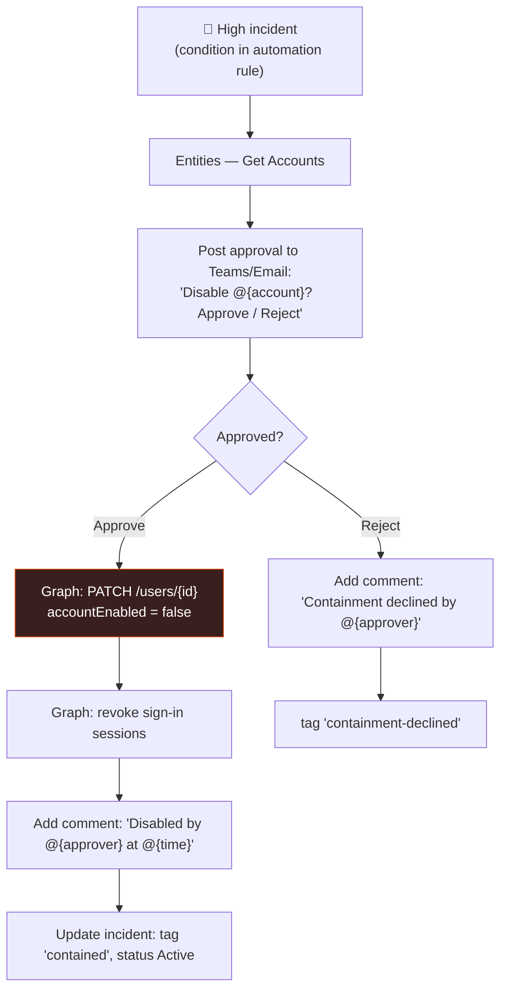

<div align="center">

# 🔄 Step 34 · Response actions with approval

### *Disable a user / isolate a device — but only after a human says yes*

[](../README.md)
[](#)
[](#)

</div>

---

## 🎯 Goal

A playbook that, on a high-severity incident, posts an **approval** to Teams/email; on approval it
disables the Entra account (and/or isolates the device via Defender) and comments the outcome; on
rejection it just tags the incident.

## 🧠 Why this step

This is the first automation that *changes the world*. In a lab you build it end to end; in
production the approval gate is what makes it deployable. You'll also see how much RBAC a real
response action needs.

## ✅ Prerequisites

- [Step 32](../32-playbook-managed-identity-and-permissions/README.md) — MI with the Graph app role
  `User.ReadWrite.All` (or `User.EnableDisableAccount`), and `Machine.Isolate` if isolating devices
- A **throwaway** test user you're willing to disable (`resp-test@<tenant>`)
- ⚠️ Lab only — never point this at real accounts

## 🧭 Flow



## 🖱️ Do it — portal

1. **Automation → Create playbook with incident trigger** → `PB-Contain-User-Approval`. MI on.
2. **Microsoft Sentinel — Entities - Get Accounts.**
3. **For each** account → **Approvals — Start and wait for an approval** (or Teams "Post an
   adaptive card and wait for a response"):
   - Title: `Disable @{items('For_each')?['Name']} — incident @{...incidentNumber}?`
   - Options: `Approve`, `Reject`.
4. **Condition** on the response:
   - **Approve** branch:
     - **HTTP** PATCH `https://graph.microsoft.com/v1.0/users/@{...aadUserId or userPrincipalName}`
       body `{ "accountEnabled": false }`, auth **Managed identity**, audience `https://graph.microsoft.com`.
     - **HTTP** POST `https://graph.microsoft.com/v1.0/users/{id}/revokeSignInSessions`.
     - *(optional device isolation)* **HTTP** POST to the Defender/Graph Security
       `machineActions` isolate endpoint for the Host entity.
     - **Add comment**: who approved, what was done, timestamp.
     - **Update incident**: label `contained`.
   - **Reject** branch: **Add comment** + label `containment-declined`.

## 💻 Do it — the disable call

```
PATCH https://graph.microsoft.com/v1.0/users/@{items('For_each')?['Name']}
Authentication: Managed identity  ·  Audience: https://graph.microsoft.com
Body: { "accountEnabled": false }
```

Attach via an **automation rule**: trigger *incident created*, condition *Severity = High* **AND**
*tag contains `malicious-ip`* (so only the enriched-and-confirmed-bad ones), action *Run playbook
`PB-Contain-User-Approval`*.

## 🧪 Validate

1. Confirm `resp-test@<tenant>` is **enabled**.
2. Simulate a High incident naming that account (fail its sign-ins from a "bad" IP so step-33
   tags it `malicious-ip`).
3. Approval arrives in Teams/email. Click **Approve**.
4. Check:

```bash
az ad user show --id resp-test@YOURTENANT --query "{upn:userPrincipalName, enabled:accountEnabled}" -o table
```

```kusto
AuditLogs
| where TimeGenerated > ago(15m) and OperationName in ("Disable account","Update user")
| project TimeGenerated, tostring(InitiatedBy.app.displayName), tostring(TargetResources[0].userPrincipalName)
```

**You should see** `enabled: false`, an `AuditLogs` entry showing the **playbook's identity** as
initiator, and an incident comment recording the approver. Run it again and click **Reject** →
account stays enabled, incident tagged `containment-declined`. Re-enable the test user afterwards.

## 🚩 Common mistakes

| 🚩 Mistake | Why it bites |
|---|---|
| No approval gate | One false positive locks out a real user / quarantines a prod server |
| MI over-permissioned (`Directory.ReadWrite.All`) | Way more than disable needs — use the narrowest role |
| No timeout on the approval | Playbook run hangs for days |
| Not revoking sessions | Account disabled but existing tokens still valid for up to an hour |
| Testing on a real account | Do not. Throwaway users only. |

## 🗒️ Log your run

`LOG.md` — both the approve and reject paths, the `accountEnabled` proof, and the `AuditLogs`
initiator. This is a milestone: **first automated response.**

## 📚 Microsoft Learn

- [Automate threat response with playbooks — response actions](https://learn.microsoft.com/en-us/azure/sentinel/tutorial-respond-threats-playbook)
- [Block an Entra user with a Sentinel playbook](https://learn.microsoft.com/en-us/azure/sentinel/sentinel-soar-use-cases)
- [Microsoft Graph: update user](https://learn.microsoft.com/en-us/graph/api/user-update)
- [Isolate a device with Microsoft Defender for Endpoint API](https://learn.microsoft.com/en-us/defender-endpoint/api/isolate-machine)

---

<div align="center">
<sub>

[⬅ Prev: 33 · Enrich an incident](../33-enrich-an-incident/README.md) &nbsp;·&nbsp; [🦅 All steps](../README.md) &nbsp;·&nbsp; [Next: 35 · Automation rules for triage ➡](../35-automation-rules-triage/README.md)

</sub>
</div>
